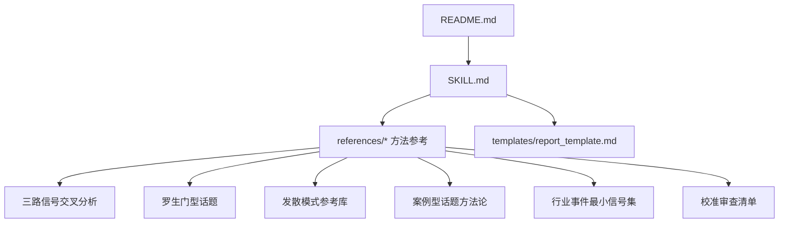
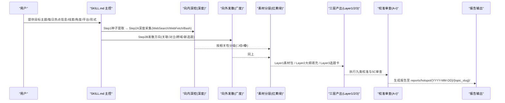
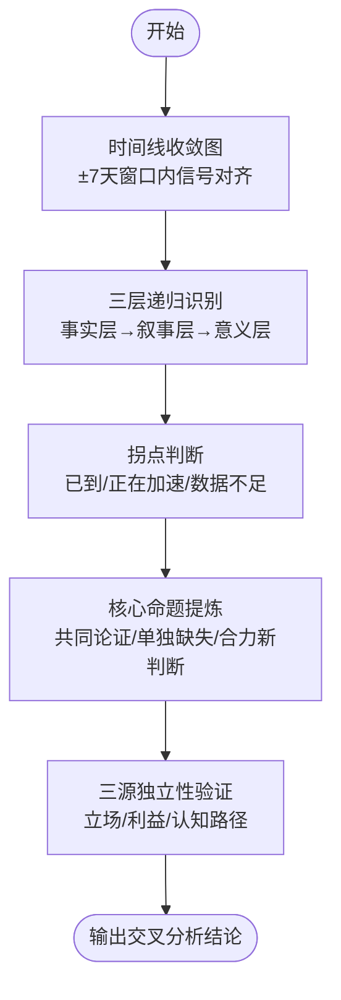
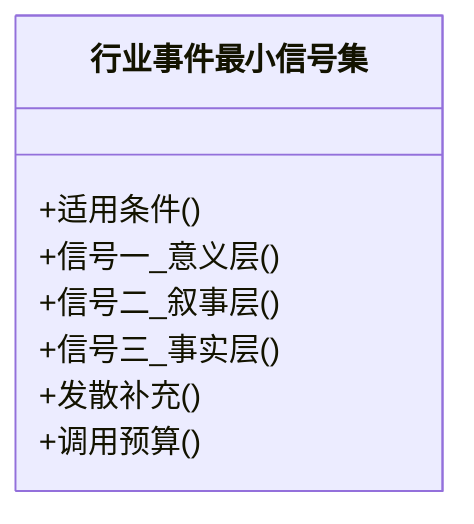
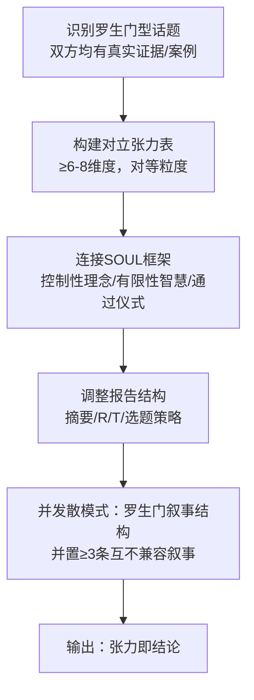
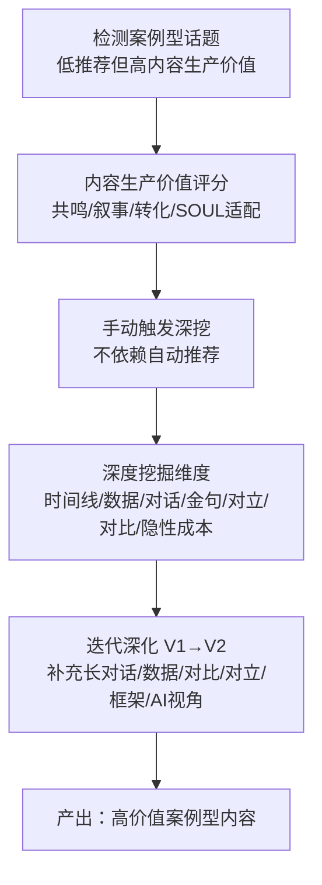
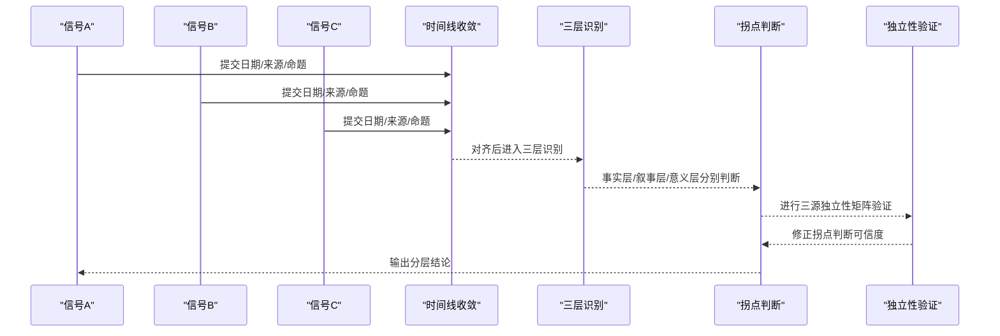
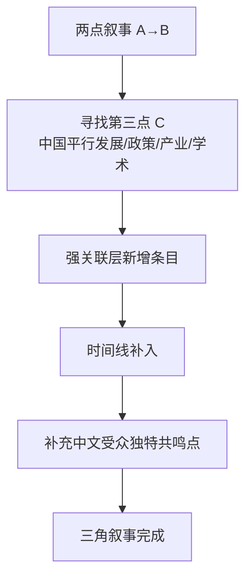
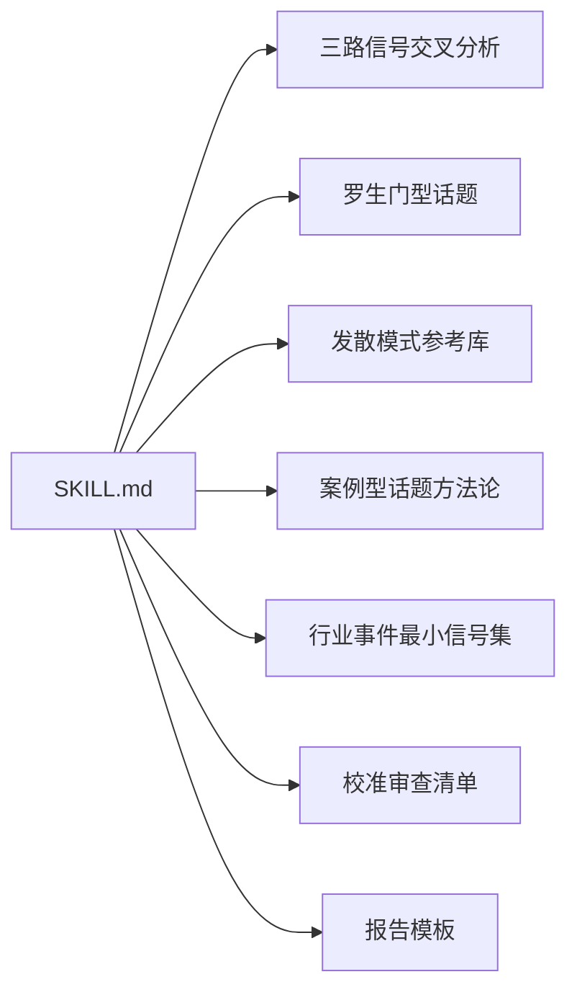

# 分析方法论

<cite>
**本文引用的文件**   
- [README.md](file://hotspot-topic-excavator/README.md)
- [SKILL.md](file://hotspot-topic-excavator/skills/hotspot-topic-excavator/SKILL.md)
- [三路信号交叉分析模式（cross_signal_synthesis.md）](file://hotspot-topic-excavator/skills/hotspot-topic-excavator/references/cross_signal_synthesis.md)
- [行业事件最小信号集（industry-event-minimal-signal-pattern.md）](file://hotspot-topic-excavator/skills/hotspot-topic-excavator/references/industry-event-minimal-signal-pattern.md)
- [罗生门型话题·对立张力分析模式（rashomon_topic_pattern.md）](file://hotspot-topic-excavator/skills/hotspot-topic-excavator/references/rashomon_topic_pattern.md)
- [发散模式参考库（divergence_patterns.md）](file://hotspot-topic-excavator/skills/hotspot-topic-excavator/references/divergence_patterns.md)
- [案例型话题深度挖掘方法论（case_type_topic_excavation.md）](file://hotspot-topic-excavator/skills/hotspot-topic-excavator/references/case_type_topic_excavation.md)
- [校准审查清单（calibration_checklist.md）](file://hotspot-topic-excavator/skills/hotspot-topic-excavator/references/calibration_checklist.md)
- [报告模板（report_template.md）](file://hotspot-topic-excavator/skills/hotspot-topic-excavator/templates/report_template.md)
</cite>

## 目录
1. [引言](#引言)
2. [项目结构](#项目结构)
3. [核心组件](#核心组件)
4. [架构总览](#架构总览)
5. [详细组件分析](#详细组件分析)
6. [依赖关系分析](#依赖关系分析)
7. [性能与效率考量](#性能与效率考量)
8. [故障排查指南](#故障排查指南)
9. [结论](#结论)
10. [附录：完整分析流程与工具使用](#附录完整分析流程与工具使用)

## 引言
本文件系统化梳理热点主题深挖与分析的方法论，聚焦以下关键能力：
- 三路信号交叉分析：时间线收敛、三层递归识别、拐点判断、独立性矩阵验证
- 案例型话题挖掘：从“事件型偏好”的算法偏差中识别高价值案例，构建内容生产价值评估
- 行业事件最小信号集：以最少调用覆盖事实层、叙事层、意义层
- 罗生门叙事结构与三角叙事补洞：并置多源矛盾叙事，用第三点补齐两点叙事的线段
- 时间线收敛分析与拐点判断：分层回答“是否已到拐点”，避免模糊结论
- 完整分析流程与工具使用方法：双轴采集、素材分层、多层产出、九类校准与审查补充优化

## 项目结构
该仓库围绕“热点主题素材深挖采集器”展开，包含主技能说明、方法参考、输出模板等。核心路径如下：
- 顶层 README：功能概述、适配说明、文件结构、使用方法
- SKILL.md：角色使命、输入规范、双轴采集、素材分层、多层产出、平台适配、校准审查、连续性生产
- references：方法参考（三路交叉、罗生门、发散模式、案例型话题、行业事件最小信号集、校准清单等）
- templates：报告模板（Layer 1/2/3、校准记录表、参考资料清单）

图表来源
- [README.md:1-130](file://hotspot-topic-excavator/README.md#L1-L130)
- [SKILL.md:1-420](file://hotspot-topic-excavator/skills/hotspot-topic-excavator/SKILL.md#L1-L420)

章节来源
- [README.md:1-130](file://hotspot-topic-excavator/README.md#L1-L130)
- [SKILL.md:1-420](file://hotspot-topic-excavator/skills/hotspot-topic-excavator/SKILL.md#L1-L420)

## 核心组件
- 双轴采集模型：向内深挖（Depth Axis）+ 向外发散（Breadth Axis），种子提取→联网抓取→素材组织
- 六类内容素材 + 三类图片素材方案：热点资讯流、硬核事实、权威引述、案例故事、对立张力、可视化依据；配图、图源、AI绘图提示概要
- 三层产出组装：Layer 1 素材包、Layer 2 大纲填充、Layer 3 再创作选题建议（≤5个）
- 九类校准审查：A-I（事实校准、事实补充、表述校准、框架补充、对立视角、理论偏向、叙事引力、受众工具链翻译、三角叙事补洞）
- 审查补充优化循环（5C）：四类常见遗漏、叙事引力陷阱、受众工具链翻译、三角叙事升级

章节来源
- [SKILL.md:72-204](file://hotspot-topic-excavator/skills/hotspot-topic-excavator/SKILL.md#L72-L204)
- [SKILL.md:207-237](file://hotspot-topic-excavator/skills/hotspot-topic-excavator/SKILL.md#L207-L237)
- [SKILL.md:251-317](file://hotspot-topic-excavator/skills/hotspot-topic-excavator/SKILL.md#L251-L317)
- [SKILL.md:319-374](file://hotspot-topic-excavator/skills/hotspot-topic-excavator/SKILL.md#L319-L374)

## 架构总览
整体工作流由“输入→双轴采集→素材分层→三层产出→校准审查→连续生产”构成，工具链以 WebSearch/WebFetch/Bash 为主，支持降级路径与并行化。

图表来源
- [SKILL.md:72-204](file://hotspot-topic-excavator/skills/hotspot-topic-excavator/SKILL.md#L72-L204)
- [SKILL.md:230-237](file://hotspot-topic-excavator/skills/hotspot-topic-excavator/SKILL.md#L230-L237)
- [SKILL.md:251-317](file://hotspot-topic-excavator/skills/hotspot-topic-excavator/SKILL.md#L251-L317)
- [SKILL.md:319-374](file://hotspot-topic-excavator/skills/hotspot-topic-excavator/SKILL.md#L319-L374)

## 详细组件分析

### 三路信号交叉分析（Cross-Signal Synthesis）
- 适用条件：种子信号≥2且存在时间线收敛（±7天内出现）
- 步骤：
  - 时间线收敛图：列出各信号日期、来源、一句话命题，判定是否同一场对话
  - 三层递归识别：事实层（数据/指标）、叙事层（概念命名/话语转向）、意义层（哲学/经济学追问）
  - 拐点判断：分三层诚实回答（已到/正在加速/数据不足），禁止模糊整体判断
  - 核心命题提炼：共同论证、单独缺失、合力新判断
  - 三源独立性验证：独立度矩阵（立场/利益结构/认知路径），区分“单一深度”和“独立汇聚”

图表来源
- [三路信号交叉分析模式（cross_signal_synthesis.md）:1-136](file://hotspot-topic-excavator/skills/hotspot-topic-excavator/references/cross_signal_synthesis.md#L1-L136)

章节来源
- [三路信号交叉分析模式（cross_signal_synthesis.md）:1-136](file://hotspot-topic-excavator/skills/hotspot-topic-excavator/references/cross_signal_synthesis.md#L1-L136)

### 行业事件最小信号集（Minimal Signal Set for Industry Events）
- 适用条件：行业集中表达（大会/峰会）、单一权威媒体深度报道、年度热词/趋势报告
- 三路映射：
  - 信号一（意义层）：现场深度报道（Keynote/专题讨论）
  - 信号二（叙事层）：行业语言体系整理（热词/趋势报告）
  - 信号三（事实层）：宏观数据矩阵（权威机构数据）
- 预算控制：首轮3次并行搜索 + 2-3组发散，总计7-9次调用，较五信号模式节省25-33%

图表来源
- [行业事件最小信号集（industry-event-minimal-signal-pattern.md）:1-46](file://hotspot-topic-excavator/skills/hotspot-topic-excavator/references/industry-event-minimal-signal-pattern.md#L1-L46)

章节来源
- [行业事件最小信号集（industry-event-minimal-signal-pattern.md）:1-46](file://hotspot-topic-excavator/skills/hotspot-topic-excavator/references/industry-event-minimal-signal-pattern.md#L1-L46)

### 罗生门叙事结构与对立张力分析
- 识别特征：双方都有真实证据与案例，无明确“正确答案”，受众处于两难
- 对立张力表：每个维度同时呈现正方与反方的对等证据，至少6-8个维度
- SOUL连接：控制性理念、correlate vs understand、有限性智慧、通过仪式
- 报告结构调整：执行摘要强调“双方同时为真”；Rupture打破“必须选一边”；Transform给出“在矛盾中找到自己位置”的行动建议
- 并发散模式中的“罗生门叙事结构”：并置≥3条互不兼容叙事，分别来自企业行为/媒体调查/政府数据，揭示不同层面的真相

图表来源
- [罗生门型话题·对立张力分析模式（rashomon_topic_pattern.md）:1-114](file://hotspot-topic-excavator/skills/hotspot-topic-excavator/references/rashomon_topic_pattern.md#L1-L114)
- [发散模式参考库（divergence_patterns.md）:238-323](file://hotspot-topic-excavator/skills/hotspot-topic-excavator/references/divergence_patterns.md#L238-L323)

章节来源
- [罗生门型话题·对立张力分析模式（rashomon_topic_pattern.md）:1-114](file://hotspot-topic-excavator/skills/hotspot-topic-excavator/references/rashomon_topic_pattern.md#L1-L114)
- [发散模式参考库（divergence_patterns.md）:238-323](file://hotspot-topic-excavator/skills/hotspot-topic-excavator/references/divergence_patterns.md#L238-L323)

### 案例型话题挖掘方法论
- 问题诊断：自动推荐算法偏向事件型，压制案例型/人物型
- 差异对比：信源数量、线索连接、信息完整度、现有推荐得分与实际内容生产价值
- 内容生产价值评分：受众共鸣强度、叙事完整度、行动转化率、SOUL框架适配
- 判断启发式：赛道关联度极高但未进TOP3、信源≤2、线索≤2、用户明确要求时手动触发
- 挖掘重点：完整时间线、收入/数据拆解、长深度对话、金句提取、对立视角、同类对比、隐性成本
- 迭代深化：V1→V2标准补充清单（长对话、最新数据、对比更新、对立视角、多维框架、AI时代视角）

图表来源
- [案例型话题深度挖掘方法论（case_type_topic_excavation.md）:1-181](file://hotspot-topic-excavator/skills/hotspot-topic-excavator/references/case_type_topic_excavation.md#L1-L181)

章节来源
- [案例型话题深度挖掘方法论（case_type_topic_excavation.md）:1-181](file://hotspot-topic-excavator/skills/hotspot-topic-excavator/references/case_type_topic_excavation.md#L1-L181)

### 时间线收敛分析与拐点判断
- 时间线收敛：将多条信号在±7天窗口内对齐，判定是否同一场对话
- 三层递归识别：事实层（量化指标）、叙事层（概念命名/话语转向）、意义层（哲学/经济学追问）
- 拐点判断：分三层诚实回答（已到/正在加速/数据不足），避免模糊整体结论
- 三源独立性验证：独立度矩阵（立场/利益结构/认知路径），确认“独立汇聚”而非“重复引用”

图表来源
- [三路信号交叉分析模式（cross_signal_synthesis.md）:1-136](file://hotspot-topic-excavator/skills/hotspot-topic-excavator/references/cross_signal_synthesis.md#L1-L136)

章节来源
- [三路信号交叉分析模式（cross_signal_synthesis.md）:1-136](file://hotspot-topic-excavator/skills/hotspot-topic-excavator/references/cross_signal_synthesis.md#L1-L136)

### 三角叙事补洞的分析方法
- 定义：多数话题是两点叙事（A→B），审查阶段寻找第三个点C，使叙事从线段变成三角形
- 操作：检查同期是否存在“中国平行发展”（政策/产业/学术），作为第三点
- 落地：强关联层新增条目、时间线补入、补充“中文受众的独特共鸣点”
- 实证：从“预言→兑现”的两点升级为“预言→对标→兑现”的三角，提升参与感与共鸣

图表来源
- [SKILL.md:308-317](file://hotspot-topic-excavator/skills/hotspot-topic-excavator/SKILL.md#L308-L317)
- [校准审查清单（calibration_checklist.md）:96-105](file://hotspot-topic-excavator/skills/hotspot-topic-excavator/references/calibration_checklist.md#L96-L105)

章节来源
- [SKILL.md:308-317](file://hotspot-topic-excavator/skills/hotspot-topic-excavator/SKILL.md#L308-L317)
- [校准审查清单（calibration_checklist.md）:96-105](file://hotspot-topic-excavator/skills/hotspot-topic-excavator/references/calibration_checklist.md#L96-L105)

## 依赖关系分析
- 主技能文件依赖方法参考与模板：SKILL.md 引用 cross_signal_synthesis、rashomon_topic_pattern、divergence_patterns、case_type_topic_excavation、industry-event-minimal-signal-pattern、calibration_checklist、report_template
- 方法参考之间相互支撑：三路交叉与罗生门互补（前者强调三层递进与拐点，后者强调并置多源矛盾叙事）；发散模式提供具体搜索策略与模板；案例型话题方法论弥补算法偏差；行业事件最小信号集提供高效采集范式；校准清单贯穿质量保障

图表来源
- [SKILL.md:377-415](file://hotspot-topic-excavator/skills/hotspot-topic-excavator/SKILL.md#L377-L415)

章节来源
- [SKILL.md:377-415](file://hotspot-topic-excavator/skills/hotspot-topic-excavator/SKILL.md#L377-L415)

## 性能与效率考量
- 并行化：WebSearch 与 WebFetch 并行调用，互为备份；多组搜索同时发起，提升效率
- 降级路径：单点故障→另一者补充→Python直连→仅P0热点标注[ BLOCKED ]；WebSearch不可用时启用中文搜索主源模式
- 调用预算：行业事件最小信号集控制在7-9次调用，较五信号模式节省25-33%
- 环境路径：Python版本解析问题需显式调用绝对路径或python3.x，避免urllib3类型错误

章节来源
- [SKILL.md:84-147](file://hotspot-topic-excavator/skills/hotspot-topic-excavator/SKILL.md#L84-L147)
- [SKILL.md:149-168](file://hotspot-topic-excavator/skills/hotspot-topic-excavator/SKILL.md#L149-L168)
- [行业事件最小信号集（industry-event-minimal-signal-pattern.md）:28-37](file://hotspot-topic-excavator/skills/hotspot-topic-excavator/references/industry-event-minimal-signal-pattern.md#L28-L37)

## 故障排查指南
- 搜索工具不可用：启用全WebSearch降级模式，采用多角度搜索覆盖所有种子信号，达到85-93%完整度
- Cloudflare WAF绕过：使用Python requests + 浏览器UA + 正则提取正文块，保留旧方法
- Python环境路径：遇到urllib3类型错误，先验证python3版本，必要时用venv绝对路径或python3.x显式调用
- 播客transcript双路径：YouTube Transcript API与Apple Podcasts show notes并行，任一成功即可进入素材组织

章节来源
- [SKILL.md:114-147](file://hotspot-topic-excavator/skills/hotspot-topic-excavator/SKILL.md#L114-L147)
- [SKILL.md:149-168](file://hotspot-topic-excavator/skills/hotspot-topic-excavator/SKILL.md#L149-L168)
- [SKILL.md:98-112](file://hotspot-topic-excavator/skills/hotspot-topic-excavator/SKILL.md#L98-L112)

## 结论
本方法论以“双轴采集 + 三层产出 + 九类校准”为核心，结合三路信号交叉分析、罗生门叙事结构、三角叙事补洞、时间线收敛与拐点判断等技术，形成一套可复用、可扩展、可落地的热点深挖与分析体系。通过并行化工具链与多级降级策略，在保证质量的同时提升效率，适用于AI/科技/超级个体等多领域的内容生产流水线。

## 附录：完整分析流程与工具使用
- 启动配置：复述当前配置（深挖/发散配比、选题卡粒度、发散上限），确认后执行
- 输入规范：目标主题必填，每日热点信息必填，来源线索/选题角度/目标平台/内容形式选填
- 双轴采集：Step1种子提取 → Step2A深度采集（WebSearch/WebFetch/Bash） → Step2B发散方向
- 素材分层：按相关性分级（🔴核心层/🟡强关联层/🟢可延展层），每条素材必须可溯源
- 三层产出：Layer1素材包（6类+3类图片）、Layer2大纲填充（RIVET结构）、Layer3选题建议（≤5个完整选题卡）
- 校准审查：A-I逐项过清单，嵌入校准记录表于报告末尾
- 输出路径：reports/hotspot/{YYYY-MM-DD}/{topic_slug}/

章节来源
- [SKILL.md:27-69](file://hotspot-topic-excavator/skills/hotspot-topic-excavator/SKILL.md#L27-L69)
- [SKILL.md:72-204](file://hotspot-topic-excavator/skills/hotspot-topic-excavator/SKILL.md#L72-L204)
- [SKILL.md:230-237](file://hotspot-topic-excavator/skills/hotspot-topic-excavator/SKILL.md#L230-L237)
- [SKILL.md:251-317](file://hotspot-topic-excavator/skills/hotspot-topic-excavator/SKILL.md#L251-L317)
- [报告模板（report_template.md）:1-132](file://hotspot-topic-excavator/skills/hotspot-topic-excavator/templates/report_template.md#L1-L132)