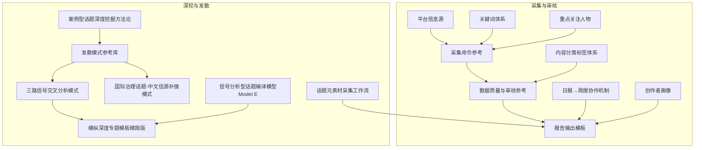
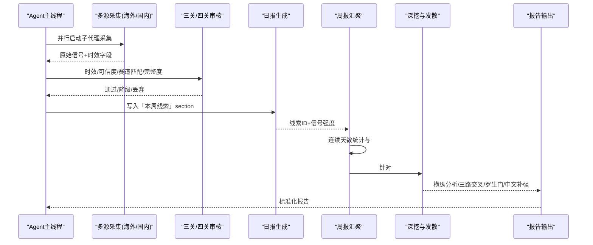
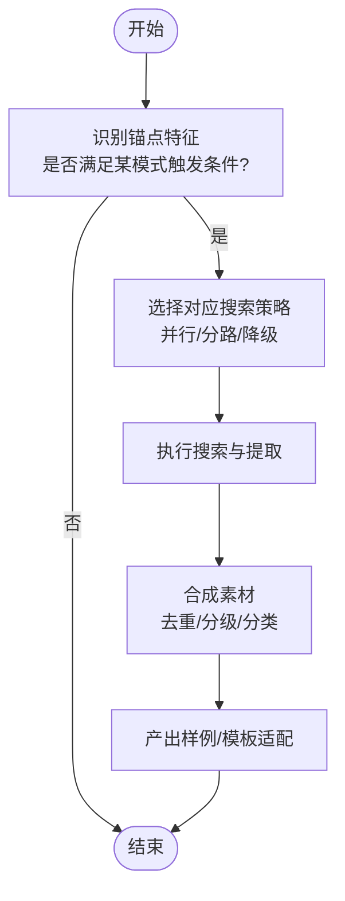
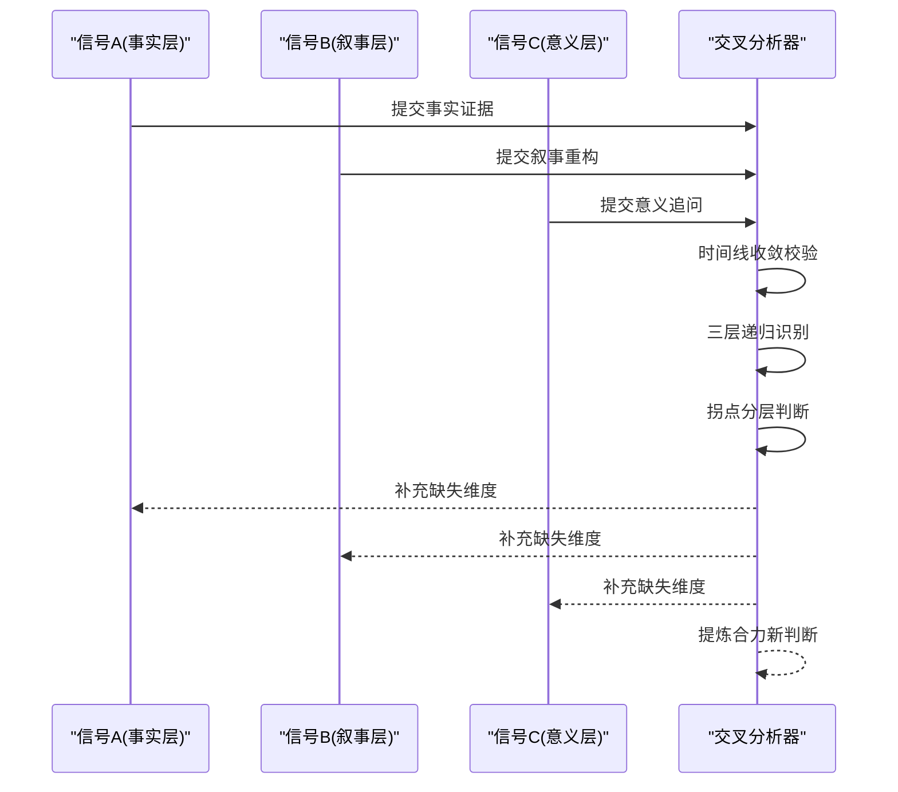
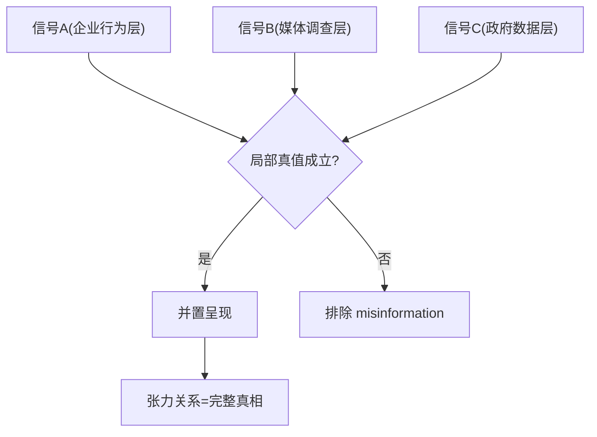
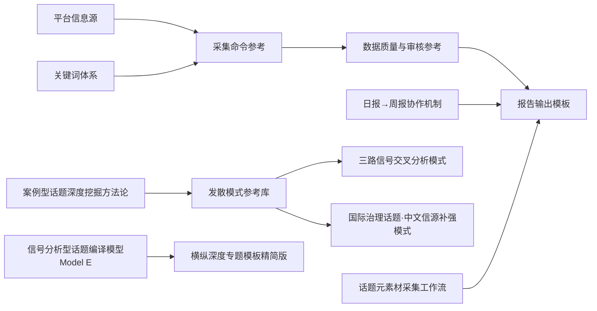

# 参考方法论库

<cite>
**本文引用的文件**   
- [采集命令参考](file://.skills/hotspot-research/references/collection_commands.md)
- [创作者画像](file://.skills/hotspot-research/references/creator_profile.md)
- [日报→周报协作机制](file://.skills/hotspot-research/references/daily_weekly_cooperation.md)
- [数据质量与审核参考](file://.skills/hotspot-research/references/data_quality.md)
- [横纵深度专题模板（精简版）](file://.skills/hotspot-research/references/deep_dive_pattern.md)
- [重点关注人物](file://.skills/hotspot-research/references/key_persons.md)
- [关键词体系](file://.skills/hotspot-research/references/keywords.md)
- [平台信息源](file://.skills/hotspot-research/references/platforms.md)
- [报告输出模板](file://.skills/hotspot-research/references/report_template.md)
- [信号分析型话题编译模型（Model E）](file://.skills/hotspot-research/references/signal_analysis_model.md)
- [内容分类标签体系](file://.skills/hotspot-research/references/tags.md)
- [话题元素材采集工作流](file://.skills/hotspot-research/references/topic_materials_compilation.md)
- [案例型话题深度挖掘方法论](file://hotspot-topic-excavator/skills/hotspot-topic-excavator/references/case_type_topic_excavation.md)
- [发散模式参考库](file://hotspot-topic-excavator/skills/hotspot-topic-excavator/references/divergence_patterns.md)
- [三路信号交叉分析模式](file://hotspot-topic-excavator/skills/hotspot-topic-excavator/references/cross_signal_synthesis.md)
- [国际治理话题·中文信源补强模式](file://hotspot-topic-excavator/skills/hotspot-topic-excavator/references/international_topic_chinese_supplement.md)
</cite>

## 目录
1. [引言](#引言)
2. [项目结构](#项目结构)
3. [核心组件](#核心组件)
4. [架构总览](#架构总览)
5. [详细组件分析](#详细组件分析)
6. [依赖分析](#依赖分析)
7. [性能考量](#性能考量)
8. [故障排查指南](#故障排查指南)
9. [结论](#结论)
10. [附录](#附录)

## 引言
本方法论库围绕“AI×超级个体”热点研究，系统化沉淀了从采集、审核、汇聚到深度分析的完整流程。重点覆盖：
- 双轴采集模型的理论基础与执行要点
- 8种发散模式的触发条件、搜索策略与产出样例
- 三路信号交叉分析与罗生门叙事结构的实现方法
- 案例型话题挖掘、行业事件分析、国际话题中文补强的专业分析方法
每种方法均提供理论背景、操作步骤、适用场景与实际案例路径，便于快速上手与复用。

## 项目结构
仓库包含两套方法论能力：
- hotspot-research：日常采集、审核、报告模板与协作机制
- hotspot-topic-excavator：深挖与发散的方法论与模式库

图表来源
- [采集命令参考:1-259](file://.skills/hotspot-research/references/collection_commands.md#L1-L259)
- [数据质量与审核参考:1-209](file://.skills/hotspot-research/references/data_quality.md#L1-L209)
- [报告输出模板:1-203](file://.skills/hotspot-research/references/report_template.md#L1-L203)
- [日报→周报协作机制:1-112](file://.skills/hotspot-research/references/daily_weekly_cooperation.md#L1-L112)
- [平台信息源:1-121](file://.skills/hotspot-research/references/platforms.md#L1-L121)
- [关键词体系:1-22](file://.skills/hotspot-research/references/keywords.md#L1-L22)
- [内容分类标签体系:1-19](file://.skills/hotspot-research/references/tags.md#L1-L19)
- [重点关注人物:1-35](file://.skills/hotspot-research/references/key_persons.md#L1-L35)
- [创作者画像:1-24](file://.skills/hotspot-research/references/creator_profile.md#L1-L24)
- [案例型话题深度挖掘方法论:1-181](file://hotspot-topic-excavator/skills/hotspot-topic-excavator/references/case_type_topic_excavation.md#L1-L181)
- [发散模式参考库:1-323](file://hotspot-topic-excavator/skills/hotspot-topic-excavator/references/divergence_patterns.md#L1-L323)
- [三路信号交叉分析模式:1-136](file://hotspot-topic-excavator/skills/hotspot-topic-excavator/references/cross_signal_synthesis.md#L1-L136)
- [国际治理话题·中文信源补强模式:1-133](file://hotspot-topic-excavator/skills/hotspot-topic-excavator/references/international_topic_chinese_supplement.md#L1-L133)
- [横纵深度专题模板（精简版）:1-80](file://.skills/hotspot-research/references/deep_dive_pattern.md#L1-L80)
- [信号分析型话题编译模型（Model E）:1-120](file://.skills/hotspot-research/references/signal_analysis_model.md#L1-L120)
- [话题元素材采集工作流:1-153](file://.skills/hotspot-research/references/topic_materials_compilation.md#L1-L153)

章节来源
- [采集命令参考:1-259](file://.skills/hotspot-research/references/collection_commands.md#L1-L259)
- [数据质量与审核参考:1-209](file://.skills/hotspot-research/references/data_quality.md#L1-L209)
- [报告输出模板:1-203](file://.skills/hotspot-research/references/report_template.md#L1-L203)
- [日报→周报协作机制:1-112](file://.skills/hotspot-research/references/daily_weekly_cooperation.md#L1-L112)
- [平台信息源:1-121](file://.skills/hotspot-research/references/platforms.md#L1-L121)
- [关键词体系:1-22](file://.skills/hotspot-research/references/keywords.md#L1-L22)
- [内容分类标签体系:1-19](file://.skills/hotspot-research/references/tags.md#L1-L19)
- [重点关注人物:1-35](file://.skills/hotspot-research/references/key_persons.md#L1-L35)
- [创作者画像:1-24](file://.skills/hotspot-research/references/creator_profile.md#L1-L24)
- [案例型话题深度挖掘方法论:1-181](file://hotspot-topic-excavator/skills/hotspot-topic-excavator/references/case_type_topic_excavation.md#L1-L181)
- [发散模式参考库:1-323](file://hotspot-topic-excavator/skills/hotspot-topic-excavator/references/divergence_patterns.md#L1-L323)
- [三路信号交叉分析模式:1-136](file://hotspot-topic-excavator/skills/hotspot-topic-excavator/references/cross_signal_synthesis.md#L1-L136)
- [国际治理话题·中文信源补强模式:1-133](file://hotspot-topic-excavator/skills/hotspot-topic-excavator/references/international_topic_chinese_supplement.md#L1-L133)
- [横纵深度专题模板（精简版）:1-80](file://.skills/hotspot-research/references/deep_dive_pattern.md#L1-L80)
- [信号分析型话题编译模型（Model E）:1-120](file://.skills/hotspot-research/references/signal_analysis_model.md#L1-L120)
- [话题元素材采集工作流:1-153](file://.skills/hotspot-research/references/topic_materials_compilation.md#L1-L153)

## 核心组件
- 采集层：多源并行采集（Jina Reader、WebSearch、API直连）、降级与重试策略、日期提取技巧
- 审核层：三关/四关审核（时效、可信度、赛道匹配、信息完整度）、各源审计指南、网络诊断
- 协作层：日报→周报线索汇聚、线索ID持久化、AI HOT交叉验证
- 输出层：标准化报告模板（标题翻译、摘要四要素、概览四字段、发布日期强制规范）
- 深挖层：案例型话题挖掘、信号分析型编译（Model E）、横纵深度专题、三路信号交叉、罗生门叙事、国际中文补强

章节来源
- [采集命令参考:1-259](file://.skills/hotspot-research/references/collection_commands.md#L1-L259)
- [数据质量与审核参考:1-209](file://.skills/hotspot-research/references/data_quality.md#L1-L209)
- [日报→周报协作机制:1-112](file://.skills/hotspot-research/references/daily_weekly_cooperation.md#L1-L112)
- [报告输出模板:1-203](file://.skills/hotspot-research/references/report_template.md#L1-L203)
- [案例型话题深度挖掘方法论:1-181](file://hotspot-topic-excavator/skills/hotspot-topic-excavator/references/case_type_topic_excavation.md#L1-L181)
- [信号分析型话题编译模型（Model E）:1-120](file://.skills/hotspot-research/references/signal_analysis_model.md#L1-L120)
- [横纵深度专题模板（精简版）:1-80](file://.skills/hotspot-research/references/deep_dive_pattern.md#L1-L80)
- [三路信号交叉分析模式:1-136](file://hotspot-topic-excavator/skills/hotspot-topic-excavator/references/cross_signal_synthesis.md#L1-L136)
- [发散模式参考库:1-323](file://hotspot-topic-excavator/skills/hotspot-topic-excavator/references/divergence_patterns.md#L1-L323)
- [国际治理话题·中文信源补强模式:1-133](file://hotspot-topic-excavator/skills/hotspot-topic-excavator/references/international_topic_chinese_supplement.md#L1-L133)

## 架构总览
整体采用“采集—审核—协作—输出—深挖”的流水线式架构，强调并行采集、严格审核、跨日线索汇聚与结构化输出，并在深挖阶段引入多种高阶分析方法。

图表来源
- [采集命令参考:1-259](file://.skills/hotspot-research/references/collection_commands.md#L1-L259)
- [数据质量与审核参考:1-209](file://.skills/hotspot-research/references/data_quality.md#L1-L209)
- [日报→周报协作机制:1-112](file://.skills/hotspot-research/references/daily_weekly_cooperation.md#L1-L112)
- [报告输出模板:1-203](file://.skills/hotspot-research/references/report_template.md#L1-L203)
- [横纵深度专题模板（精简版）:1-80](file://.skills/hotspot-research/references/deep_dive_pattern.md#L1-L80)
- [三路信号交叉分析模式:1-136](file://hotspot-topic-excavator/skills/hotspot-topic-excavator/references/cross_signal_synthesis.md#L1-L136)
- [发散模式参考库:1-323](file://hotspot-topic-excavator/skills/hotspot-topic-excavator/references/divergence_patterns.md#L1-L323)
- [国际治理话题·中文信源补强模式:1-133](file://hotspot-topic-excavator/skills/hotspot-topic-excavator/references/international_topic_chinese_supplement.md#L1-L133)

## 详细组件分析

### 双轴采集模型（理论与操作）
- 理论基础：以“时间轴（纵轴）+ 空间轴（横轴）”组织采集与分析。纵轴追踪事件演进与关键节点；横轴进行同类对比与格局定位，最终在交汇洞察中形成趋势判断。
- 操作步骤：
  - 纵轴：收集起源、里程碑、阶段划分与核心矛盾
  - 横轴：竞品/事件对比矩阵、格局位置、用户/行业反应
  - 交汇洞察：历史如何塑造当前位置、优势劣势根源、未来三剧本
- 适用场景：周报Step 8对#1事件执行横纵分析；也可手动触发用于重大事件复盘
- 实际案例：参见横纵深度专题模板的执行流程与SOUL四视角注入点

章节来源
- [横纵深度专题模板（精简版）:1-80](file://.skills/hotspot-research/references/deep_dive_pattern.md#L1-L80)

### 8种发散模式（触发条件、搜索策略与产出）
- 模式1 GPS类比链：将陌生概念迁移至熟悉现象，构建科学背书与教育视角的类比链路
- 模式2 LLM Context优先原文提取：在Substack/Medium等平台获取高完整度段落，配合web_search交叉
- 模式3 反方观点系统性纳入：识别反方人物并获取原文，建立正-反-综合三层结构
- 模式4 多平台大纲差异化：按抖音/小红书/B站/公众号定制结构与金句密度
- 模式5 V1+V2对比报告自动生成：增量维度展示联网深挖价值
- 模式6 多信号并行搜索：单轮并行6-7组搜索，二次补采缺口
- 模式7 全WebSearch降级模式：Brave+WebFetch不可用时的替代策略，两轮覆盖可达85-93%完整度
- 模式8 罗生门叙事结构：≥3路互不兼容叙事的并置揭示完整真相

图表来源
- [发散模式参考库:1-323](file://hotspot-topic-excavator/skills/hotspot-topic-excavator/references/divergence_patterns.md#L1-L323)

章节来源
- [发散模式参考库:1-323](file://hotspot-topic-excavator/skills/hotspot-topic-excavator/references/divergence_patterns.md#L1-L323)

### 三路信号交叉分析（实现方法与独立性检验）
- 适用条件：种子信号≥2且时间线收敛（±7天内出现），禁止独立罗列，必须交叉分析
- 步骤：
  - 时间线收敛图：列出三条信号的核心命题与来源
  - 三层递归识别：事实层→叙事层→意义层
  - 拐点判断：分三层诚实回答（已到/正在加速/数据不足）
  - 核心命题提炼：合力后新判断超出任一单路信号
- 三源独立性验证：检查立场、利益结构、认知路径的独立性，避免伪多源
- 实际案例：Chatbot→Agent范式官宣日（厂商数据+学术实践+学术反方同日汇聚）

图表来源
- [三路信号交叉分析模式:1-136](file://hotspot-topic-excavator/skills/hotspot-topic-excavator/references/cross_signal_synthesis.md#L1-L136)

章节来源
- [三路信号交叉分析模式:1-136](file://hotspot-topic-excavator/skills/hotspot-topic-excavator/references/cross_signal_synthesis.md#L1-L136)

### 罗生门叙事结构（矛盾叙事并置）
- 触发条件：同一时间窗口内≥3个互不兼容叙事，来自不同信源类型（企业行为/媒体调查/政府数据）
- 三步构建：
  - 识别三路矛盾信号
  - 验证每条叙事的局部真值
  - 并置揭示完整真相（张力关系即结论）
- 受众共鸣机制：认知震惊→智识满足→行动清晰
- 适用话题：多源数据对同一现象给出矛盾结论、天然多面性话题

图表来源
- [发散模式参考库:238-323](file://hotspot-topic-excavator/skills/hotspot-topic-excavator/references/divergence_patterns.md#L238-L323)

章节来源
- [发散模式参考库:238-323](file://hotspot-topic-excavator/skills/hotspot-topic-excavator/references/divergence_patterns.md#L238-L323)

### 案例型话题挖掘（方法论与算法优化建议）
- 差异对比：案例型/人物型话题信源单一但内容生产价值极高，现有推荐算法易压制
- 补充维度：显式加入“内容生产价值”评分（受众共鸣强度、叙事完整度、行动转化率、SOUL框架适配）
- 判断启发式：当P0极高关联但未进TOP 3、信源≤2、线索≤2时，应主动手动触发
- 挖掘重点：完整时间线、收入/数据拆解、长深度对话、金句提取、对立视角、同类对比、隐性成本
- 迭代深化：v1→v2标准补充清单（长对话、最新数据、对立视角、五维对比、AI时代视角）
- 算法优化建议：在素材深挖提示前增加CPV筛选逻辑，强制高价值案例入候选

章节来源
- [案例型话题深度挖掘方法论:1-181](file://hotspot-topic-excavator/skills/hotspot-topic-excavator/references/case_type_topic_excavation.md#L1-L181)

### 行业事件分析（信号分析型编译 Model E）
- 触发条件：具体事件承载结构性信号，受众第一反应为“这意味着什么趋势转变”
- 五层递进：事件层→技术层→商业层→行业层→信号层
- SOUL四视角注入：叙事学、心理学、人类学、产品策略
- 七段式适配：引子、四个不是澄清、推力+机制、结构归因、反刍时刻、ZPD行动、尾声
- 实战案例：微软MAI消费降级信号（Model Tax、跨行业证据矩阵、反直觉翻转）

章节来源
- [信号分析型话题编译模型（Model E）:1-120](file://.skills/hotspot-research/references/signal_analysis_model.md#L1-L120)

### 国际话题中文补强（治理类话题的中文信源增强）
- 问题诊断：英文搜索对中文治理信源存在系统性盲区（索引/语言/政策延迟）
- 触发条件：联合国/国际组织报告、跨国治理框架、全球峰会、跨境监管、全球统计数据
- 搜索模板：中文关键词搜索（政策/报告 + 本土案例/中国影响）
- 处理原则：官方发文与权威媒体提升为P1/P2，自然嵌入主线而非单独成章
- 可信度校验：官方原文链接、作者署名、交叉验证、时间戳标注

章节来源
- [国际治理话题·中文信源补强模式:1-133](file://hotspot-topic-excavator/skills/hotspot-topic-excavator/references/international_topic_chinese_supplement.md#L1-L133)

### 数据采集与审核（双轴模型的支撑）
- 采集命令：Jina Reader为主方案，WebSearch与API直连为辅，含降级路径与重试策略
- 日期提取：按来源差异化处理，相对时间转绝对日期，保守推定
- 三关/四关审核：时效、可信度、赛道匹配、信息完整度；各源审计指南与已知行为
- 网络诊断：快速区分网络中断、IP信誉阻止、临时故障
- 报告模板：标题翻译、摘要四要素、概览四字段、发布日期强制规范

章节来源
- [采集命令参考:1-259](file://.skills/hotspot-research/references/collection_commands.md#L1-L259)
- [数据质量与审核参考:1-209](file://.skills/hotspot-research/references/data_quality.md#L1-L209)
- [报告输出模板:1-203](file://.skills/hotspot-research/references/report_template.md#L1-L203)

### 协作与汇聚（日报→周报）
- 线索格式：固定section，线索ID规则（W-{周数}-{序号}），信号强度定义
- 汇聚逻辑：连续≥3天→强信号必入Top 5；累计≥2天→中信号讨论；仅1天→弱信号
- 容缺策略：缺失1-2天仍可汇聚；≥3天退回旧模式
- AI HOT交叉验证：双源验证提升置信度

章节来源
- [日报→周报协作机制:1-112](file://.skills/hotspot-research/references/daily_weekly_cooperation.md#L1-L112)

## 依赖分析
- 采集层依赖平台信息源与关键词体系，驱动多源并行采集
- 审核层依赖数据质量标准与各源审计指南，确保时效与可信度
- 协作层依赖日报线索与AI HOT数据，驱动周报汇聚与#1主题识别
- 深挖层依赖发散模式库、三路交叉与罗生门结构，产出高质量专题
- 输出层依赖报告模板，保证一致性与可复用性

图表来源
- [平台信息源:1-121](file://.skills/hotspot-research/references/platforms.md#L1-L121)
- [关键词体系:1-22](file://.skills/hotspot-research/references/keywords.md#L1-L22)
- [采集命令参考:1-259](file://.skills/hotspot-research/references/collection_commands.md#L1-L259)
- [数据质量与审核参考:1-209](file://.skills/hotspot-research/references/data_quality.md#L1-L209)
- [报告输出模板:1-203](file://.skills/hotspot-research/references/report_template.md#L1-L203)
- [日报→周报协作机制:1-112](file://.skills/hotspot-research/references/daily_weekly_cooperation.md#L1-L112)
- [发散模式参考库:1-323](file://hotspot-topic-excavator/skills/hotspot-topic-excavator/references/divergence_patterns.md#L1-L323)
- [三路信号交叉分析模式:1-136](file://hotspot-topic-excavator/skills/hotspot-topic-excavator/references/cross_signal_synthesis.md#L1-L136)
- [国际治理话题·中文信源补强模式:1-133](file://hotspot-topic-excavator/skills/hotspot-topic-excavator/references/international_topic_chinese_supplement.md#L1-L133)
- [信号分析型话题编译模型（Model E）:1-120](file://.skills/hotspot-research/references/signal_analysis_model.md#L1-L120)
- [横纵深度专题模板（精简版）:1-80](file://.skills/hotspot-research/references/deep_dive_pattern.md#L1-L80)
- [案例型话题深度挖掘方法论:1-181](file://hotspot-topic-excavator/skills/hotspot-topic-excavator/references/case_type_topic_excavation.md#L1-L181)
- [话题元素材采集工作流:1-153](file://.skills/hotspot-research/references/topic_materials_compilation.md#L1-L153)

## 性能考量
- 并行采集：使用子代理并行不同信息源组，缩短端到端耗时
- 降级与重试：Jina失败→WebFetch→WebSearch；超时与阻断有明确降级路径
- 去重与指纹：普通源seen_count≥3排除，高质量源≥4排除，降低重复计算
- 文本提取效率：LLM Context优先于逐个URL抓取，提高完整度与速度
- 报告生成：模板化输出减少人工校对成本，支持可选验证脚本

[本节为通用指导，无需特定文件引用]

## 故障排查指南
- 网络诊断：先区分Google/Jina连通性，再定位具体URL变化或IP信誉阻止
- Jina行为：DDoS防护站点直接阻断，接受搜索摘要作为主要来源，不要重试
- 中文搜索限制：Grep对中文字符+正则组合不稳定，窄模式更可靠；批量搜索注意截断
- 报告质量检查：8个必须section、条目数量、发布日期、中英混排空格、上期反馈等

章节来源
- [数据质量与审核参考:171-209](file://.skills/hotspot-research/references/data_quality.md#L171-L209)
- [话题元素材采集工作流:43-46](file://.skills/hotspot-research/references/topic_materials_compilation.md#L43-L46)
- [报告输出模板:1-203](file://.skills/hotspot-research/references/report_template.md#L1-L203)

## 结论
本方法论库以“双轴采集模型”为基础，结合8种发散模式、三路信号交叉分析与罗生门叙事结构，构建了从采集到深挖的完整闭环。通过严格的审核与标准化的报告模板，确保信息时效、可信度与内容生产价值最大化。建议在系统层面显式加入“内容生产价值”评分，以提升案例型话题的可见度与可用性。

[本节为总结性内容，无需特定文件引用]

## 附录
- 创作者画像与目标受众：帮助定位内容与选题方向
- 关键词体系与平台信息源：指导采集范围与优先级
- 重点关注人物：提供一手信源与替代获取渠道
- 内容分类标签体系：统一标签与优先级规则

章节来源
- [创作者画像:1-24](file://.skills/hotspot-research/references/creator_profile.md#L1-L24)
- [关键词体系:1-22](file://.skills/hotspot-research/references/keywords.md#L1-L22)
- [平台信息源:1-121](file://.skills/hotspot-research/references/platforms.md#L1-L121)
- [重点关注人物:1-35](file://.skills/hotspot-research/references/key_persons.md#L1-L35)
- [内容分类标签体系:1-19](file://.skills/hotspot-research/references/tags.md#L1-L19)