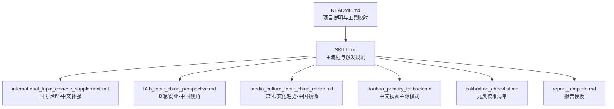
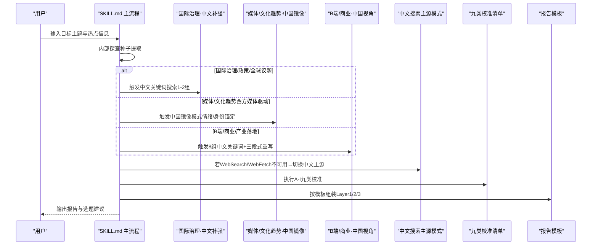
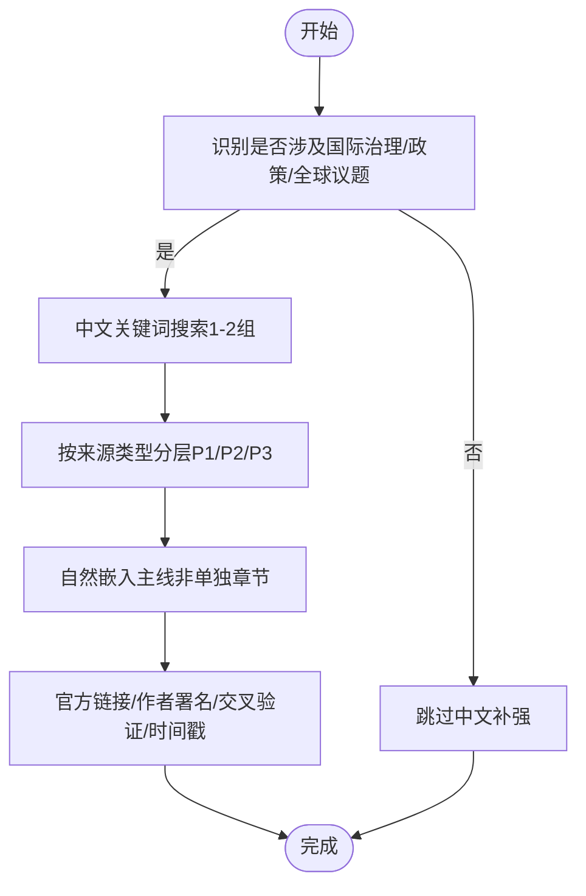
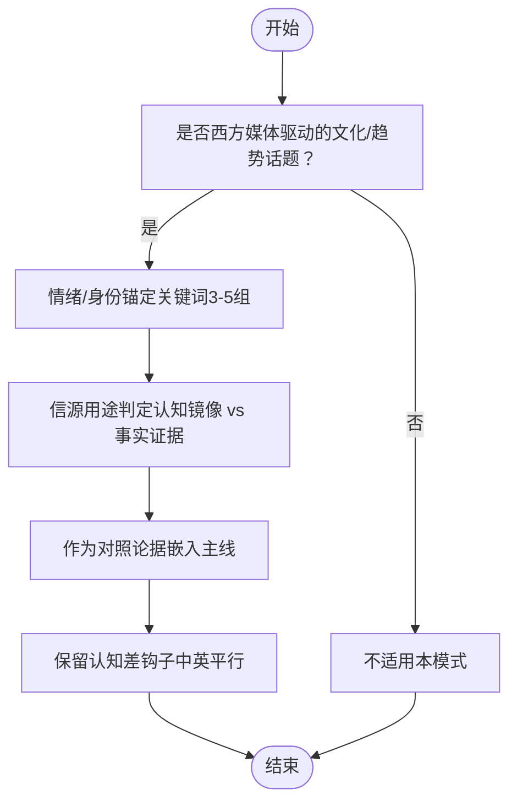
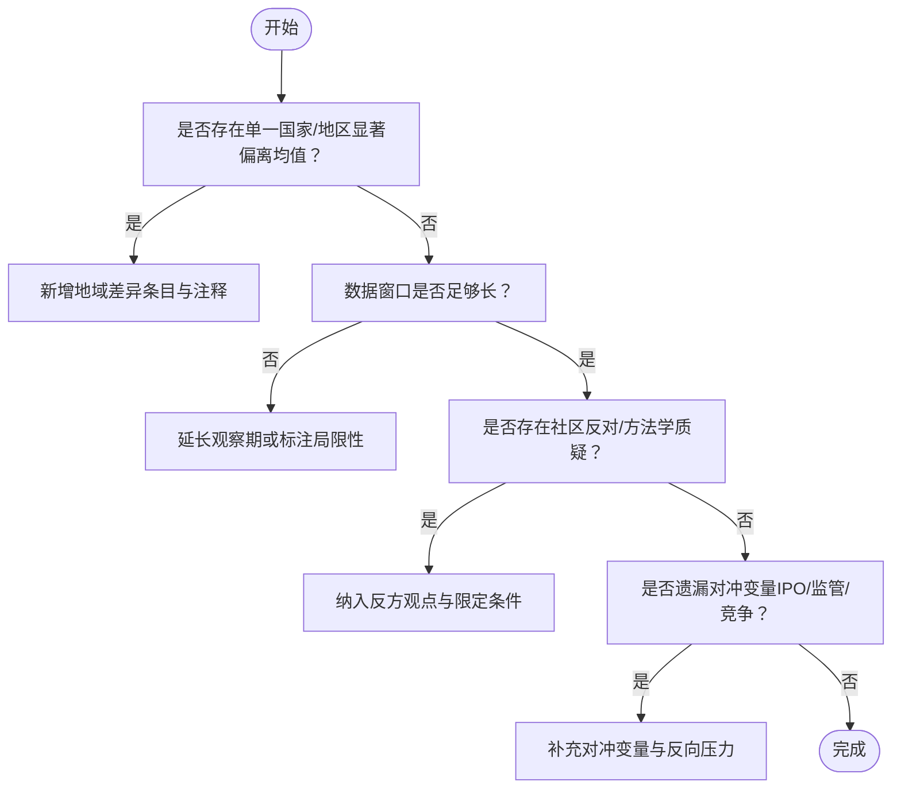
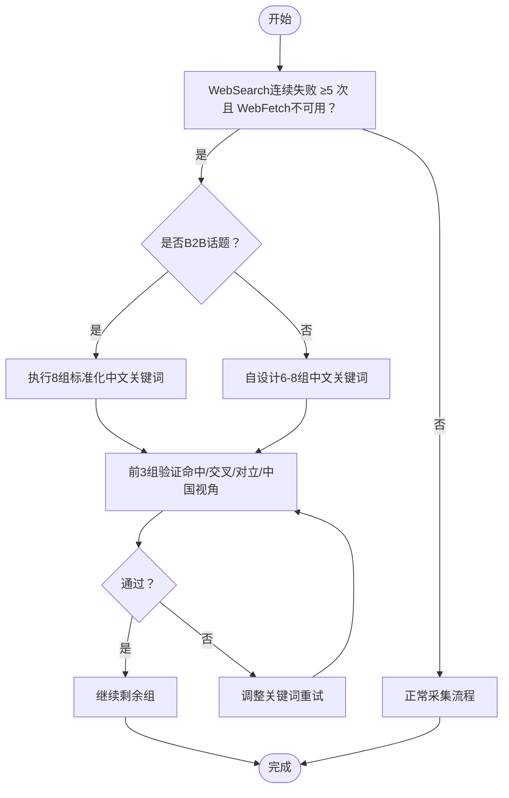
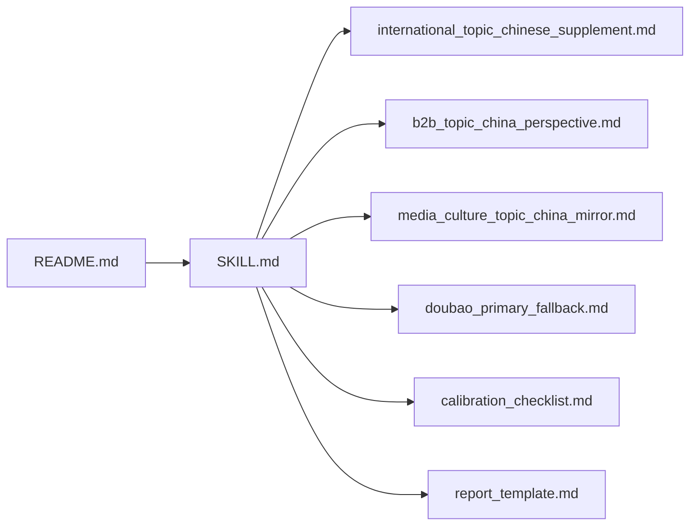

# 国际化与本地化适配

<cite>
**本文引用的文件**   
- [SKILL.md](file://hotspot-topic-excavator/skills/hotspot-topic-excavator/SKILL.md)
- [README.md](file://hotspot-topic-excavator/README.md)
- [international_topic_chinese_supplement.md](file://hotspot-topic-excavator/skills/hotspot-topic-excavator/references/international_topic_chinese_supplement.md)
- [media_culture_topic_china_mirror.md](file://hotspot-topic-excavator/skills/hotspot-topic-excavator/references/media_culture_topic_china_mirror.md)
- [b2b_topic_china_perspective.md](file://hotspot-topic-excavator/skills/hotspot-topic-excavator/references/b2b_topic_china_perspective.md)
- [doubao_primary_fallback.md](file://hotspot-topic-excavator/skills/hotspot-topic-excavator/references/doubao_primary_fallback.md)
- [calibration_checklist.md](file://hotspot-topic-excavator/skills/hotspot-topic-excavator/references/calibration_checklist.md)
- [report_template.md](file://hotspot-topic-excavator/skills/hotspot-topic-excavator/templates/report_template.md)
</cite>

## 目录
1. [引言](#引言)
2. [项目结构](#项目结构)
3. [核心组件](#核心组件)
4. [架构总览](#架构总览)
5. [详细组件分析](#详细组件分析)
6. [依赖关系分析](#依赖关系分析)
7. [性能与效率考量](#性能与效率考量)
8. [故障排查指南](#故障排查指南)
9. [结论](#结论)
10. [附录](#附录)

## 引言
本文件面向“国际化与本地化适配”的专业实践，聚焦以下目标：
- 国际治理话题的中文补强策略
- 文化趋势镜像分析方法
- 地域差异处理技巧
- 跨文化内容生产的注意事项
- 本土信源采集方法
- 文化语境适配原则
- 翻译策略、文化背景补充方法与受众适配建议

上述能力由热点主题素材深挖采集器（Qoder 插件）中的多份参考文档与主流程规范共同支撑，覆盖从采集、校验到产出的全链路。

## 项目结构
围绕国际化与本地化的关键文件分布如下：
- 主流程与触发规则：SKILL.md
- 报告模板与输出规范：report_template.md
- 三类本地化模式：
  - 国际治理·中文补强：international_topic_chinese_supplement.md
  - B端/商业·中国视角：b2b_topic_china_perspective.md
  - 媒体/文化趋势·中国镜像：media_culture_topic_china_mirror.md
- 降级与主源切换：doubao_primary_fallback.md
- 质量校准与地域差异检查：calibration_checklist.md
- 项目说明与工具映射：README.md

图表来源
- [SKILL.md:1-420](file://hotspot-topic-excavator/skills/hotspot-topic-excavator/SKILL.md#L1-L420)
- [international_topic_chinese_supplement.md:1-133](file://hotspot-topic-excavator/skills/hotspot-topic-excavator/references/international_topic_chinese_supplement.md#L1-L133)
- [b2b_topic_china_perspective.md:1-243](file://hotspot-topic-excavator/skills/hotspot-topic-excavator/references/b2b_topic_china_perspective.md#L1-L243)
- [media_culture_topic_china_mirror.md:1-102](file://hotspot-topic-excavator/skills/hotspot-topic-excavator/references/media_culture_topic_china_mirror.md#L1-L102)
- [doubao_primary_fallback.md:1-119](file://hotspot-topic-excavator/skills/hotspot-topic-excavator/references/doubao_primary_fallback.md#L1-L119)
- [calibration_checklist.md:1-158](file://hotspot-topic-excavator/skills/hotspot-topic-excavator/references/calibration_checklist.md#L1-L158)
- [report_template.md:1-132](file://hotspot-topic-excavator/skills/hotspot-topic-excavator/templates/report_template.md#L1-L132)
- [README.md:1-130](file://hotspot-topic-excavator/README.md#L1-L130)

章节来源
- [SKILL.md:1-420](file://hotspot-topic-excavator/skills/hotspot-topic-excavator/SKILL.md#L1-L420)
- [README.md:1-130](file://hotspot-topic-excavator/README.md#L1-L130)

## 核心组件
- 双轴采集模型：向内深挖 + 向外发散，驱动中英文并行采集与交叉验证
- 三类本地化模式：
  - 国际治理·中文补强：针对联合国/多边机构/全球峰会等议题，强制中文关键词搜索以补齐政策与学术视角
  - B端/商业·中国视角：对跨国厂商/产业落地类话题，采用8组中文关键词广覆盖，并重构为“全球-美国-中国”三段式
  - 媒体/文化趋势·中国镜像：对西方媒体驱动的文化趋势，用情绪/身份锚定关键词，呈现认知镜像而非数据补充
- 降级与主源切换：当英文搜索不可用时，中文搜索可升级为全信号主采集源
- 九类校准审查：包含事实、表述、框架、对立视角、叙事引力、受众工具链翻译、三角叙事补洞等
- 报告模板：统一输出结构，确保素材分层、溯源完整与平台适配

章节来源
- [SKILL.md:72-176](file://hotspot-topic-excavator/skills/hotspot-topic-excavator/SKILL.md#L72-L176)
- [international_topic_chinese_supplement.md:1-133](file://hotspot-topic-excavator/skills/hotspot-topic-excavator/references/international_topic_chinese_supplement.md#L1-L133)
- [b2b_topic_china_perspective.md:1-243](file://hotspot-topic-excavator/skills/hotspot-topic-excavator/references/b2b_topic_china_perspective.md#L1-L243)
- [media_culture_topic_china_mirror.md:1-102](file://hotspot-topic-excavator/skills/hotspot-topic-excavator/references/media_culture_topic_china_mirror.md#L1-L102)
- [doubao_primary_fallback.md:1-119](file://hotspot-topic-excavator/skills/hotspot-topic-excavator/references/doubao_primary_fallback.md#L1-L119)
- [calibration_checklist.md:1-158](file://hotspot-topic-excavator/skills/hotspot-topic-excavator/references/calibration_checklist.md#L1-L158)
- [report_template.md:1-132](file://hotspot-topic-excavator/skills/hotspot-topic-excavator/templates/report_template.md#L1-L132)

## 架构总览
下图展示国际化与本地化适配在采集—校验—产出全流程中的位置与交互。

图表来源
- [SKILL.md:72-176](file://hotspot-topic-excavator/skills/hotspot-topic-excavator/SKILL.md#L72-L176)
- [international_topic_chinese_supplement.md:1-133](file://hotspot-topic-excavator/skills/hotspot-topic-excavator/references/international_topic_chinese_supplement.md#L1-L133)
- [media_culture_topic_china_mirror.md:1-102](file://hotspot-topic-excavator/skills/hotspot-topic-excavator/references/media_culture_topic_china_mirror.md#L1-L102)
- [b2b_topic_china_perspective.md:1-243](file://hotspot-topic-excavator/skills/hotspot-topic-excavator/references/b2b_topic_china_perspective.md#L1-L243)
- [doubao_primary_fallback.md:1-119](file://hotspot-topic-excavator/skills/hotspot-topic-excavator/references/doubao_primary_fallback.md#L1-L119)
- [calibration_checklist.md:1-158](file://hotspot-topic-excavator/skills/hotspot-topic-excavator/references/calibration_checklist.md#L1-L158)
- [report_template.md:1-132](file://hotspot-topic-excavator/skills/hotspot-topic-excavator/templates/report_template.md#L1-L132)

## 详细组件分析

### 国际治理话题·中文补强策略
- 触发条件：联合国/国际组织报告、跨国治理框架、全球行业事件、跨境监管动作、全球统计数据
- 搜索策略：使用中文关键词进行1-2组搜索，覆盖政策/报告与本土案例/影响
- 素材分层：官方发文与权威媒体优先（P1），国际会议中文报道与深度评论（P2），UGC仅作共鸣参考（P3）
- 呈现方式：不单独成章，将中文独有视角作为论据嵌入主线；标注发布时间戳避免同日共振假象
- 可信度校验：官方原文链接、作者署名、≥2个中文源交叉验证、时间戳区分

图表来源
- [international_topic_chinese_supplement.md:1-133](file://hotspot-topic-excavator/skills/hotspot-topic-excavator/references/international_topic_chinese_supplement.md#L1-L133)
- [SKILL.md:169-176](file://hotspot-topic-excavator/skills/hotspot-topic-excavator/SKILL.md#L169-L176)

章节来源
- [international_topic_chinese_supplement.md:1-133](file://hotspot-topic-excavator/skills/hotspot-topic-excavator/references/international_topic_chinese_supplement.md#L1-L133)
- [SKILL.md:169-176](file://hotspot-topic-excavator/skills/hotspot-topic-excavator/SKILL.md#L169-L176)

### 文化趋势镜像分析方法
- 适用边界：锚点来自美国/西方媒体头版/封面/趋势分析，且话题性质为文化/趋势/公众认知变化，具备“中美认知差”的叙事潜力
- 关键词设计：情绪/身份锚定（职业焦虑、教育认知、薪资冲击、中美对比、教育体制反应、意见领袖）
- 信源判定：自媒体用于展示“认知框架”，不作为事实证据；财经/高校/第三方平台数据需标注局限
- 处理方式：作为对照论据嵌入主线，保留中英文平行呈现，突出认知差钩子

图表来源
- [media_culture_topic_china_mirror.md:1-102](file://hotspot-topic-excavator/skills/hotspot-topic-excavator/references/media_culture_topic_china_mirror.md#L1-L102)
- [SKILL.md:173-176](file://hotspot-topic-excavator/skills/hotspot-topic-excavator/SKILL.md#L173-L176)

章节来源
- [media_culture_topic_china_mirror.md:1-102](file://hotspot-topic-excavator/skills/hotspot-topic-excavator/references/media_culture_topic_china_mirror.md#L1-L102)
- [SKILL.md:173-176](file://hotspot-topic-excavator/skills/hotspot-topic-excavator/SKILL.md#L173-L176)

### 地域差异处理技巧
- 地域偏差检测：关注单一国家/地区显著偏离均值的情况（如新兴市场高使用率）
- 时间边界：趋势判断需考虑数据窗口长度与季节性效应
- 社区反对与方法学质疑：权威报告应纳入HN/Reddit/X上的批评与调查对象限定
- 对冲变量：经济判断必须同时检查反向压力（如IPO、监管、竞争格局）

图表来源
- [calibration_checklist.md:49-57](file://hotspot-topic-excavator/skills/hotspot-topic-excavator/references/calibration_checklist.md#L49-L57)
- [calibration_checklist.md:41-48](file://hotspot-topic-excavator/skills/hotspot-topic-excavator/references/calibration_checklist.md#L41-L48)

章节来源
- [calibration_checklist.md:41-57](file://hotspot-topic-excavator/skills/hotspot-topic-excavator/references/calibration_checklist.md#L41-L57)

### 跨文化内容生产注意事项
- 理论中立性：采集阶段不预设分析框架，理论框架引入在创作阶段
- 信源优先级：一手来源 > 权威媒体 > 社区讨论；每条素材必须可溯源
- 相关性分级：核心层（🔴）、强关联层（🟡）、可延展层（🟢）
- 平台适配：不同平台侧重不同（抖音强钩子、B站完整论据链、公众号深度论证、小红书痛点清单）

章节来源
- [SKILL.md:197-248](file://hotspot-topic-excavator/skills/hotspot-topic-excavator/SKILL.md#L197-L248)

### 本土信源采集方法
- 中文搜索主源模式：当WebSearch连续失败且WebFetch不可用时，中文搜索升级为全信号主采集源
- 模式A（B2B）：直接套用8组标准化关键词（政策驱动、大厂路径、制造业实证、咨询业、路径对比、市场份额、基础设施、竞争/估值）
- 模式B（非B2B）：自设计6-8组关键词（锚点核心、关联信号、对立/争议、中国视角、发散/类比）
- 验证规则：前3组完成后进行命中与交叉验证，达标后继续剩余组

图表来源
- [doubao_primary_fallback.md:1-119](file://hotspot-topic-excavator/skills/hotspot-topic-excavator/references/doubao_primary_fallback.md#L1-L119)
- [b2b_topic_china_perspective.md:72-137](file://hotspot-topic-excavator/skills/hotspot-topic-excavator/references/b2b_topic_china_perspective.md#L72-L137)

章节来源
- [doubao_primary_fallback.md:1-119](file://hotspot-topic-excavator/skills/hotspot-topic-excavator/references/doubao_primary_fallback.md#L1-L119)
- [b2b_topic_china_perspective.md:72-137](file://hotspot-topic-excavator/skills/hotspot-topic-excavator/references/b2b_topic_china_perspective.md#L72-L137)

### 文化语境适配原则
- 三层定位：
  - 国际治理：政策响应（政府官网/学术期刊）
  - B端/商业：商业镜像（厂商官方/行业媒体/实证案例）
  - 媒体/文化趋势：认知镜像（自媒体/聚合平台）
- 关键词风格：事实锚定（治理/B端） vs 情绪/身份锚定（文化趋势）
- 素材呈现：治理与B端强调“嵌入主线”，文化趋势强调“对照论据”

章节来源
- [international_topic_chinese_supplement.md:1-133](file://hotspot-topic-excavator/skills/hotspot-topic-excavator/references/international_topic_chinese_supplement.md#L1-L133)
- [b2b_topic_china_perspective.md:1-243](file://hotspot-topic-excavator/skills/hotspot-topic-excavator/references/b2b_topic_china_perspective.md#L1-L243)
- [media_culture_topic_china_mirror.md:1-102](file://hotspot-topic-excavator/skills/hotspot-topic-excavator/references/media_culture_topic_china_mirror.md#L1-L102)

### 翻译策略与文化背景补充方法
- 金句双语：权威引述保留英文原文+中译，便于溯源与传播
- 术语翻译：通用安全/技术建议翻译为超级个体实际工具名（如Dify/Coze/n8n/Cursor/MinIO/Nacos等）
- 文化背景补充：在“照亮盲区”段补充中国平行发展（政策/产业/学术），形成三角叙事
- 受众对齐：将企业级建议转化为具体工具链自检表与行动清单

章节来源
- [SKILL.md:299-316](file://hotspot-topic-excavator/skills/hotspot-topic-excavator/SKILL.md#L299-L316)
- [calibration_checklist.md:83-94](file://hotspot-topic-excavator/skills/hotspot-topic-excavator/references/calibration_checklist.md#L83-L94)

### 受众适配建议
- 平台差异化：
  - 抖音：强钩子+金句+反常识结论（秒级时间码+画面描述）
  - B站：完整论据链+数据+案例（弹幕互动点+视觉方案+BGM建议）
  - 公众号：深度论证+案例故事+引述（章节骨架+引子/尾声钩子文案）
  - 小红书：用户痛点+视觉化清单+干货点（封面/标题强视觉）
- 选题卡格式：标题/切入角度/内容形式/执行步骤/发布平台/溯源说明

章节来源
- [SKILL.md:240-248](file://hotspot-topic-excavator/skills/hotspot-topic-excavator/SKILL.md#L240-L248)
- [report_template.md:92-105](file://hotspot-topic-excavator/skills/hotspot-topic-excavator/templates/report_template.md#L92-L105)

## 依赖关系分析
- 主流程依赖三类本地化模式与降级策略，最终通过九类校准与模板输出
- 工具链映射：WebSearch/WebFetch为主力，Bash降级直连抓取，播客转录双路径并行
- 参考文件间耦合：
  - SKILL.md 调用 international/b2b/mirror/fallback/checklist/template
  - README.md 提供工具链映射与版本说明

图表来源
- [SKILL.md:1-420](file://hotspot-topic-excavator/skills/hotspot-topic-excavator/SKILL.md#L1-L420)
- [README.md:1-130](file://hotspot-topic-excavator/README.md#L1-L130)

章节来源
- [SKILL.md:1-420](file://hotspot-topic-excavator/skills/hotspot-topic-excavator/SKILL.md#L1-L420)
- [README.md:1-130](file://hotspot-topic-excavator/README.md#L1-L130)

## 性能与效率考量
- 并行采集：WebSearch与WebFetch并行调用，互为备份；多组搜索同时发起提升效率
- 降级路径：单点故障→另一者+补充搜索→Python直连抓取→仅P0热点抓取；WebSearch长时间不可用→WebFetch多URL并行→标注缺失项
- 中文主源模式：连续失败后直接切换，避免反复重试；前3组验证通过后继续剩余组
- 工具环境：注意Python版本解析问题，必要时使用绝对路径显式调用

章节来源
- [SKILL.md:96-147](file://hotspot-topic-excavator/skills/hotspot-topic-excavator/SKILL.md#L96-L147)
- [doubao_primary_fallback.md:75-103](file://hotspot-topic-excavator/skills/hotspot-topic-excavator/references/doubao_primary_fallback.md#L75-L103)

## 故障排查指南
- 常见症状与根因：
  - urllib3 TypeError：系统Python版本过低导致语法不支持，需显式调用venv中的python3.x
  - Cloudflare WAF占位页：使用Python requests+浏览器UA绕过WAF，正则提取正文块
  - YouTube Transcript API失效：切换到Apple Podcasts show notes路径
- 诊断步骤：
  - 先which python3与python3 --version验证版本
  - 遇到WAF返回占位页时改用Bash直连抓取
  - 播客转录失败立即切Apple Podcasts路径，不阻塞整体流程

章节来源
- [SKILL.md:149-168](file://hotspot-topic-excavator/skills/hotspot-topic-excavator/SKILL.md#L149-L168)
- [SKILL.md:98-112](file://hotspot-topic-excavator/skills/hotspot-topic-excavator/SKILL.md#L98-L112)

## 结论
本体系以“双轴采集+三类本地化模式+九类校准”为核心，构建了从国际治理到文化趋势的全链路国际化与本地化适配方案。通过强制中文关键词搜索、镜像对比、三段式重写与主源切换机制，既保证信源完整性与时效性，又强化了中国视角与受众共鸣。配合平台差异化产出与工具链翻译，可实现高质量、可执行的跨文化内容生产流水线。

## 附录
- 报告模板字段说明：Layer1素材包（6类+图片素材3类）、Layer2大纲填充（RIVET结构）、Layer3再创作选题（≤5个）
- 校准记录表：A-I九类校准逐项记录修正动作，确保事实、表述、框架、对立、叙事引力、受众工具链翻译与三角叙事补洞到位

章节来源
- [report_template.md:1-132](file://hotspot-topic-excavator/skills/hotspot-topic-excavator/templates/report_template.md#L1-L132)
- [calibration_checklist.md:108-146](file://hotspot-topic-excavator/skills/hotspot-topic-excavator/references/calibration_checklist.md#L108-L146)