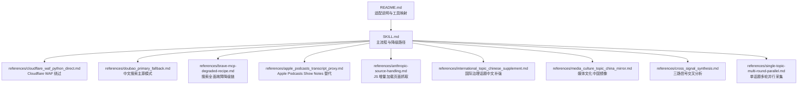
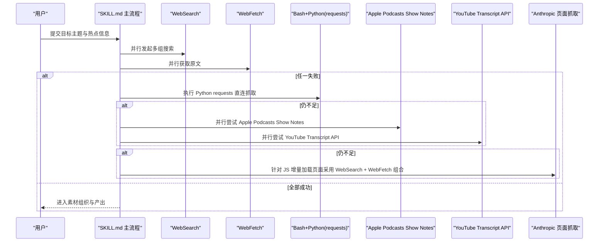
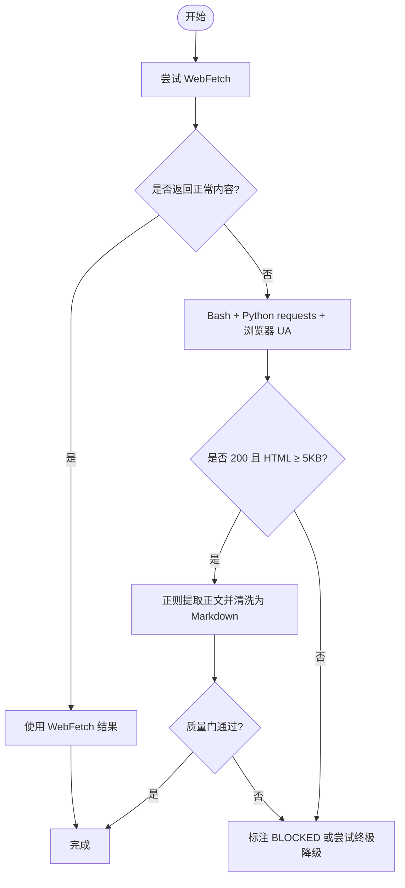
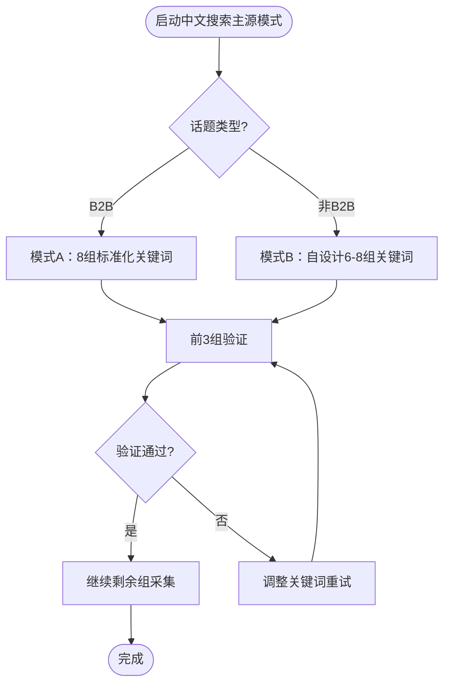
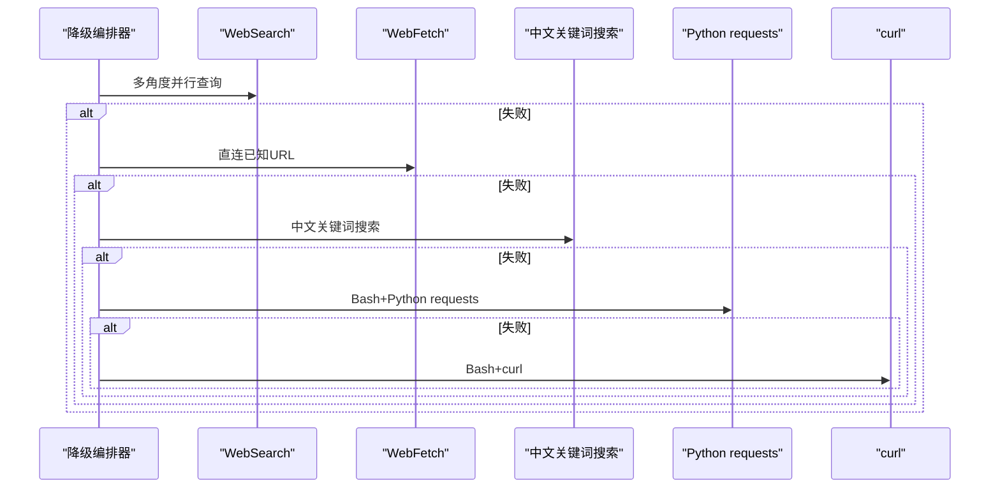
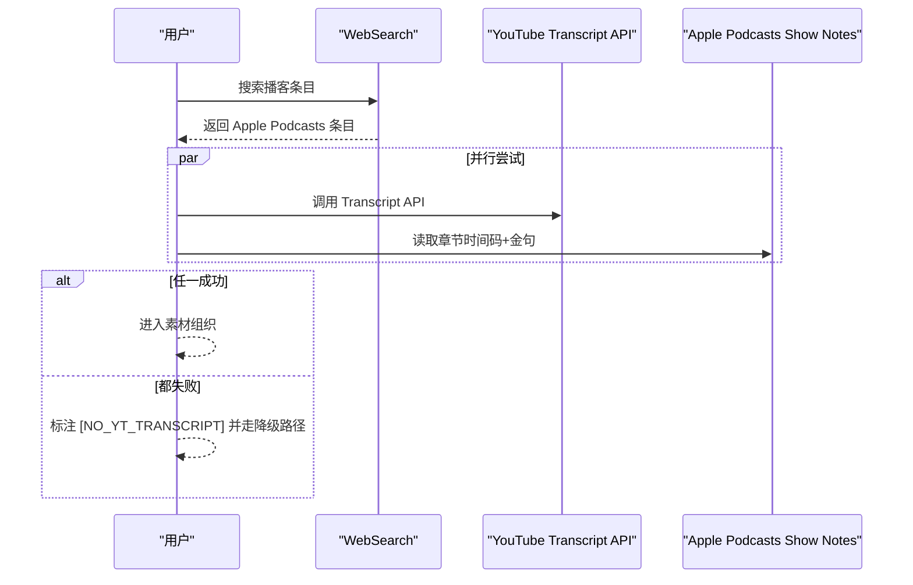
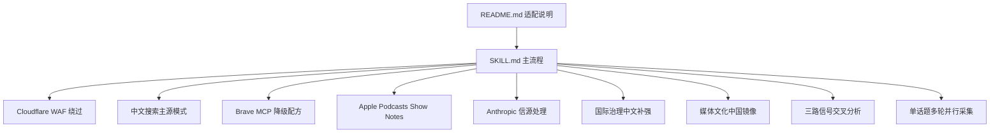

# 技术降级与故障处理

<cite>
**本文引用的文件**   
- [SKILL.md](file://hotspot-topic-excavator/skills/hotspot-topic-excavator/SKILL.md)
- [README.md](file://hotspot-topic-excavator/README.md)
- [cloudflare_waf_python_direct.md](file://hotspot-topic-excavator/skills/hotspot-topic-excavator/references/cloudflare_waf_python_direct.md)
- [doubao_primary_fallback.md](file://hotspot-topic-excavator/skills/hotspot-topic-excavator/references/doubao_primary_fallback.md)
- [brave-mcp-degraded-recipe.md](file://hotspot-topic-excavator/skills/hotspot-topic-excavator/references/brave-mcp-degraded-recipe.md)
- [apple_podcasts_transcript_proxy.md](file://hotspot-topic-excavator/skills/hotspot-topic-excavator/references/apple_podcasts_transcript_proxy.md)
- [anthropic-source-handling.md](file://hotspot-topic-excavator/skills/hotspot-topic-excavator/references/anthropic-source-handling.md)
- [international_topic_chinese_supplement.md](file://hotspot-topic-excavator/skills/hotspot-topic-excavator/references/international_topic_chinese_supplement.md)
- [media_culture_topic_china_mirror.md](file://hotspot-topic-excavator/skills/hotspot-topic-excavator/references/media_culture_topic_china_mirror.md)
- [cross_signal_synthesis.md](file://hotspot-topic-excavator/skills/hotspot-topic-excavator/references/cross_signal_synthesis.md)
- [single-topic-multi-round-parallel.md](file://hotspot-topic-excavator/skills/hotspot-topic-excavator/references/single-topic-multi-round-parallel.md)
- [calibration_checklist.md](file://hotspot-topic-excavator/skills/hotspot-topic-excavator/references/calibration_checklist.md)
- [data_quality.md](file://.skills/hotspot-research/references/data_quality.md)
</cite>

## 目录
1. [引言](#引言)
2. [项目结构](#项目结构)
3. [核心组件](#核心组件)
4. [架构总览](#架构总览)
5. [详细组件分析](#详细组件分析)
6. [依赖关系分析](#依赖关系分析)
7. [性能考量](#性能考量)
8. [故障诊断与排障指南](#故障诊断与排障指南)
9. [结论](#结论)
10. [附录](#附录)

## 引言
本指南聚焦“技术降级与故障处理”，围绕多层级降级路径的设计原理与实现方法，系统梳理以下关键技术点：
- Cloudflare WAF 绕过（Python 直连 + UA 伪装）
- 豆包主降级方案（中文搜索主源模式）
- Brave MCP 降级配方（搜索工具全面故障时的降级链路）
- Apple Podcasts 转录代理（Show Notes 作为 Transcript 替代）
- Python 直接访问、网络代理配置、API 密钥管理等运维技能
- 故障诊断工具与性能监控方法

目标是帮助读者在复杂网络环境与第三方服务不稳定场景下，仍能稳定产出高质量素材。

## 项目结构
该仓库以“热点主题深挖采集器”为核心，提供一套从采集到产出的完整方法论与参考实践。与降级和故障处理相关的核心内容集中在 SKILL.md 与各 references 文件中，涵盖搜索失败、反爬拦截、播客字幕不可用等典型场景的应对策略。



图表来源
- [SKILL.md:114-147](file://hotspot-topic-excavator/skills/hotspot-topic-excavator/SKILL.md#L114-L147)
- [README.md:17-31](file://hotspot-topic-excavator/README.md#L17-L31)

章节来源
- [SKILL.md:114-147](file://hotspot-topic-excavator/skills/hotspot-topic-excavator/SKILL.md#L114-L147)
- [README.md:17-31](file://hotspot-topic-excavator/README.md#L17-L31)

## 核心组件
- 多层级降级路径：按故障严重程度递进，确保任一环节失效时仍可继续采集
  - 第一层：WebSearch + WebFetch 并行；任一失败则另一者补充
  - 第二层：WebSearch 长时间不可用时，降级为 WebFetch 直连已知 URL
  - 第三层：WebSearch + WebFetch 同时不可用时，启用“中文搜索主源模式”
- 专项降级能力：
  - Cloudflare WAF 绕过：Python requests + 浏览器 UA + 正则提取正文
  - 播客 transcript 双路径：YouTube Transcript API 与 Apple Podcasts Show Notes 并行
  - JS 增量加载页面：Anthropic Research 页面的 WebSearch + WebFetch 组合
- 质量保障：校准清单（A-I）、三路信号交叉分析、单话题多轮并行采集

章节来源
- [SKILL.md:114-147](file://hotspot-topic-excavator/skills/hotspot-topic-excavator/SKILL.md#L114-L147)
- [calibration_checklist.md:108-146](file://hotspot-topic-excavator/skills/hotspot-topic-excavator/references/calibration_checklist.md#L108-L146)
- [cross_signal_synthesis.md:1-45](file://hotspot-topic-excavator/skills/hotspot-topic-excavator/references/cross_signal_synthesis.md#L1-L45)
- [single-topic-multi-round-parallel.md:10-26](file://hotspot-topic-excavator/skills/hotspot-topic-excavator/references/single-topic-multi-round-parallel.md#L10-L26)

## 架构总览
下图展示了从输入到输出的整体工作流，以及关键降级分支与回退机制。



图表来源
- [SKILL.md:114-147](file://hotspot-topic-excavator/skills/hotspot-topic-excavator/SKILL.md#L114-L147)
- [apple_podcasts_transcript_proxy.md:80-94](file://hotspot-topic-excavator/skills/hotspot-topic-excavator/references/apple_podcasts_transcript_proxy.md#L80-L94)
- [anthropic-source-handling.md:18-31](file://hotspot-topic-excavator/skills/hotspot-topic-excavator/references/anthropic-source-handling.md#L18-L31)

## 详细组件分析

### Cloudflare WAF 绕过（Python 直连 + 正则提取）
- 触发条件：WebFetch 返回占位文本（如 “Please wait...”），同一 URL 使用 Python requests + 浏览器 UA 可获完整 HTML
- 核心步骤：
  - 设置浏览器 UA 与 Accept/Accept-Language 头
  - 请求目标 URL，验证状态码与响应体大小
  - 使用正则匹配 WordPress/Gutenberg 正文块（entry-content 等）
  - 清洗为 Markdown，进行质量门校验（段落数量、长度阈值）
- 适用边界：对明确登录墙或强制 challenge 的场景不适用



图表来源
- [cloudflare_waf_python_direct.md:24-78](file://hotspot-topic-excavator/skills/hotspot-topic-excavator/references/cloudflare_waf_python_direct.md#L24-L78)
- [cloudflare_waf_python_direct.md:81-93](file://hotspot-topic-excavator/skills/hotspot-topic-excavator/references/cloudflare_waf_python_direct.md#L81-L93)

章节来源
- [cloudflare_waf_python_direct.md:10-78](file://hotspot-topic-excavator/skills/hotspot-topic-excavator/references/cloudflare_waf_python_direct.md#L10-L78)
- [cloudflare_waf_python_direct.md:81-139](file://hotspot-topic-excavator/skills/hotspot-topic-excavator/references/cloudflare_waf_python_direct.md#L81-L139)

### 豆包主降级方案（中文搜索主源模式）
- 触发条件：WebSearch 连续失败多次且 WebFetch 也不可用
- 设计原理：中文搜索已能覆盖大量英文源的转述与解读，可作为全信号主采集源
- 执行模式：
  - B2B 话题：使用标准化 8 组关键词（政策驱动、大厂路径、制造业实证、咨询业、路径对比、市场份额、基础设施、竞争估值）
  - 非 B2B 话题：自设计 6-8 组关键词（锚点核心、关联信号、对立争议、中国视角、发散类比）
- 验证规则：前 3 组完成后必须验证命中独立信源数量、数字交叉验证、中国视角与对立观点覆盖度



图表来源
- [doubao_primary_fallback.md:29-86](file://hotspot-topic-excavator/skills/hotspot-topic-excavator/references/doubao_primary_fallback.md#L29-L86)
- [doubao_primary_fallback.md:90-103](file://hotspot-topic-excavator/skills/hotspot-topic-excavator/references/doubao_primary_fallback.md#L90-L103)

章节来源
- [doubao_primary_fallback.md:1-119](file://hotspot-topic-excavator/skills/hotspot-topic-excavator/references/doubao_primary_fallback.md#L1-L119)

### Brave MCP 降级配方（搜索工具全面故障）
- 触发条件：WebSearch 连续失败且 WebFetch 不可用
- 降级链顺序：
  - Tool 1：WebSearch 多角度并行（保留主搜索能力）
  - Tool 2：WebFetch 直连已知 URL（最高质量原文）
  - Tool 3：中文关键词搜索（中文 + 中国视角）
  - Tool 4：Bash + Python requests（提取原文核心段落）
  - Tool 5：Bash + curl（直连新闻，仅时效信号）
- 验收清单：每个核心种子至少 2 个独立信源、至少 1 个 P1 一手源、时间戳范围、链接可打开等



图表来源
- [brave-mcp-degraded-recipe.md:10-68](file://hotspot-topic-excavator/skills/hotspot-topic-excavator/references/brave-mcp-degraded-recipe.md#L10-L68)
- [brave-mcp-degraded-recipe.md:90-101](file://hotspot-topic-excavator/skills/hotspot-topic-excavator/references/brave-mcp-degraded-recipe.md#L90-L101)

章节来源
- [brave-mcp-degraded-recipe.md:1-102](file://hotspot-topic-excavator/skills/hotspot-topic-excavator/references/brave-mcp-degraded-recipe.md#L1-L102)

### Apple Podcasts 转录代理（Show Notes 替代）
- 问题背景：YouTube Transcript API 可能因版本变更或网络限制失败；播客官网 show notes 极简
- 发现：WebSearch 命中 Apple Podcasts 条目时，可获得章节时间码 + 金句列表，完整度约 90%
- 建议工作流：YouTube Transcript 与 Apple Podcasts Show Notes 并行尝试，任一成功即可进入素材组织阶段



图表来源
- [apple_podcasts_transcript_proxy.md:16-50](file://hotspot-topic-excavator/skills/hotspot-topic-excavator/references/apple_podcasts_transcript_proxy.md#L16-L50)
- [apple_podcasts_transcript_proxy.md:80-94](file://hotspot-topic-excavator/skills/hotspot-topic-excavator/references/apple_podcasts_transcript_proxy.md#L80-L94)

章节来源
- [apple_podcasts_transcript_proxy.md:1-95](file://hotspot-topic-excavator/skills/hotspot-topic-excavator/references/apple_podcasts_transcript_proxy.md#L1-L95)

### Anthropic Research 信源处理（JS 增量加载）
- 现象：首页列表通过 JS 增量加载，WebFetch 仅能获取部分可见项
- 推荐流程：
  - Step 1：WebSearch site:anthropic.com/research 获取散布在不同路径的研究页面 URL
  - Step 2：WebFetch 首页辅助去重
  - Step 3：WebSearch 对每篇目标论文获取核心段落
  - Step 4：合并去重，编译论文表格
- 单篇博客页：Next.js SSR 页面，HTML 源码包含全文，优先 WebFetch，不完整时用 Bash + curl 直抓

```mermaid
flowchart TD
Start(["开始"]) --> List["WebSearch site:anthropic.com/research"]
List --> Home["WebFetch 首页辅助"]
Home --> Papers["WebSearch 逐篇获取核心段落"]
Papers --> Merge["合并去重 → 论文表格"]
alt 单篇博客页
Start2(["单篇博客页"]) --> TryWF2["WebFetch 尝试"]
TryWF2 --> OK2{"内容完整?"}
OK2 --> |是| UseWF2["直接使用"]
OK2 --> |否| Curl2["Bash + curl 直抓 HTML"]
Curl2 --> Extract2["正则提取 <p> 正文"]
end
```

图表来源
- [anthropic-source-handling.md:18-31](file://hotspot-topic-excavator/skills/hotspot-topic-excavator/references/anthropic-source-handling.md#L18-L31)
- [anthropic-source-handling.md:60-86](file://hotspot-topic-excavator/skills/hotspot-topic-excavator/references/anthropic-source-handling.md#L60-L86)

章节来源
- [anthropic-source-handling.md:1-96](file://hotspot-topic-excavator/skills/hotspot-topic-excavator/references/anthropic-source-handling.md#L1-L96)

### 国际治理话题·中文信源补强模式
- 触发条件：联合国/国际组织报告、跨国治理框架、全球行业事件、跨境监管动作、全球统计数据
- 根因：英文搜索对中文信源存在系统性盲区（索引层、语言层、政策层）
- 执行模板：基础调用 + 实战关键词模板（UN Women 性别偏见案例）
- 处理方式：将中文独有视角作为论据之一自然嵌入相应模块，不单独成章

章节来源
- [international_topic_chinese_supplement.md:1-133](file://hotspot-topic-excavator/skills/hotspot-topic-excavator/references/international_topic_chinese_supplement.md#L1-L133)

### 媒体/文化趋势话题·中国镜像模式
- 触发条件：美国/西方媒体驱动的文化/趋势/公众认知类话题，受众镜像潜力显著
- 关键词设计：情绪/身份锚定 > 事实锚定（身份焦虑、教育认知、薪资冲击、中美对比、教育体制反应、意见领袖）
- 素材处理：作为对照论据自然嵌入主线，保留中英文平行呈现的认知差叙事钩子

章节来源
- [media_culture_topic_china_mirror.md:1-102](file://hotspot-topic-excavator/skills/hotspot-topic-excavator/references/media_culture_topic_china_mirror.md#L1-L102)

## 依赖关系分析
- 主流程依赖各 reference 文件提供的具体降级策略与方法论
- 工具链映射（Hermes → Qoder）确保功能迁移后仍保持同等降级能力
- 校准清单与交叉分析模式贯穿全流程，保障输出质量



图表来源
- [SKILL.md:114-147](file://hotspot-topic-excavator/skills/hotspot-topic-excavator/SKILL.md#L114-L147)
- [README.md:17-31](file://hotspot-topic-excavator/README.md#L17-L31)

章节来源
- [SKILL.md:114-147](file://hotspot-topic-excavator/skills/hotspot-topic-excavator/SKILL.md#L114-L147)
- [README.md:17-31](file://hotspot-topic-excavator/README.md#L17-L31)

## 性能考量
- 并行化：多组 WebSearch 与 WebFetch 尽可能并行调用，提升采集效率
- 超时与重试：为 HTTP 请求设置合理超时，避免阻塞；对临时故障进行有限次重试
- 资源占用：正则提取与 HTML 清洗需控制内存占用，避免大文档导致 OOM
- 数据去重：指纹去重与重复检测可减少冗余处理，提高吞吐

[本节为通用指导，无需特定文件引用]

## 故障诊断与排障指南
- 网络诊断快速排查：
  - 使用 curl 检查 Google 与 Jina 可达性，区分网络中断与 IP 信誉阻止
  - 根据诊断结果决定等待恢复或使用替代路径
- Python 环境路径解析问题：
  - urllib3 版本与 Python 版本不兼容会导致 TypeError
  - 使用 venv 绝对路径或显式 python3.x 调用，避免 shebang 影响其他工具链
- 认证与权限错误：
  - 当出现 AuthenticationRequiredError 时，判定为 IP 信誉阻止，等待自动恢复并使用 WebSearch 替代
- 校准审查：
  - 事实校准、表述校准、框架补充、对立视角、理论偏向、叙事引力、受众工具链翻译、三角叙事补洞等九类检查需在初稿完成后逐项过审

章节来源
- [data_quality.md:171-189](file://.skills/hotspot-research/references/data_quality.md#L171-L189)
- [SKILL.md:149-168](file://hotspot-topic-excavator/skills/hotspot-topic-excavator/SKILL.md#L149-L168)
- [calibration_checklist.md:108-146](file://hotspot-topic-excavator/skills/hotspot-topic-excavator/references/calibration_checklist.md#L108-L146)

## 结论
通过多层级降级路径与专项降级能力，本体系能够在搜索工具不可用、反爬拦截、播客字幕缺失等复杂场景下保持稳定产出。结合校准审查与交叉分析方法，可有效提升内容的可信度与完整性。建议在持续实践中沉淀更多案例与经验，完善降级策略与诊断工具。

[本节为总结，无需特定文件引用]

## 附录
- 工具链映射与适配说明详见 README.md
- 报告模板与产出路径见 SKILL.md 与 README.md
- 相关参考文件可在 references 目录下查阅

[本节为指引，无需特定文件引用]