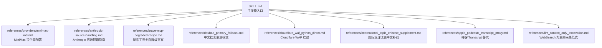
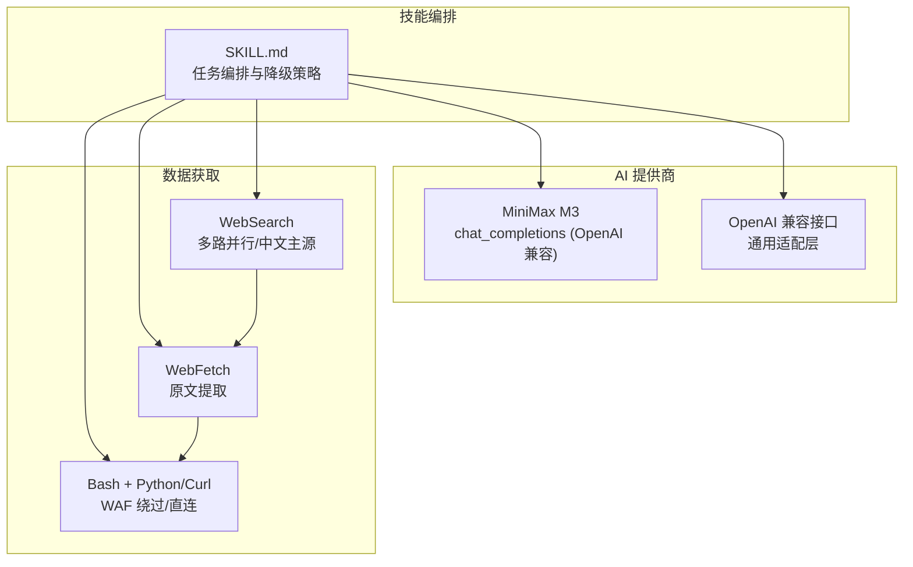
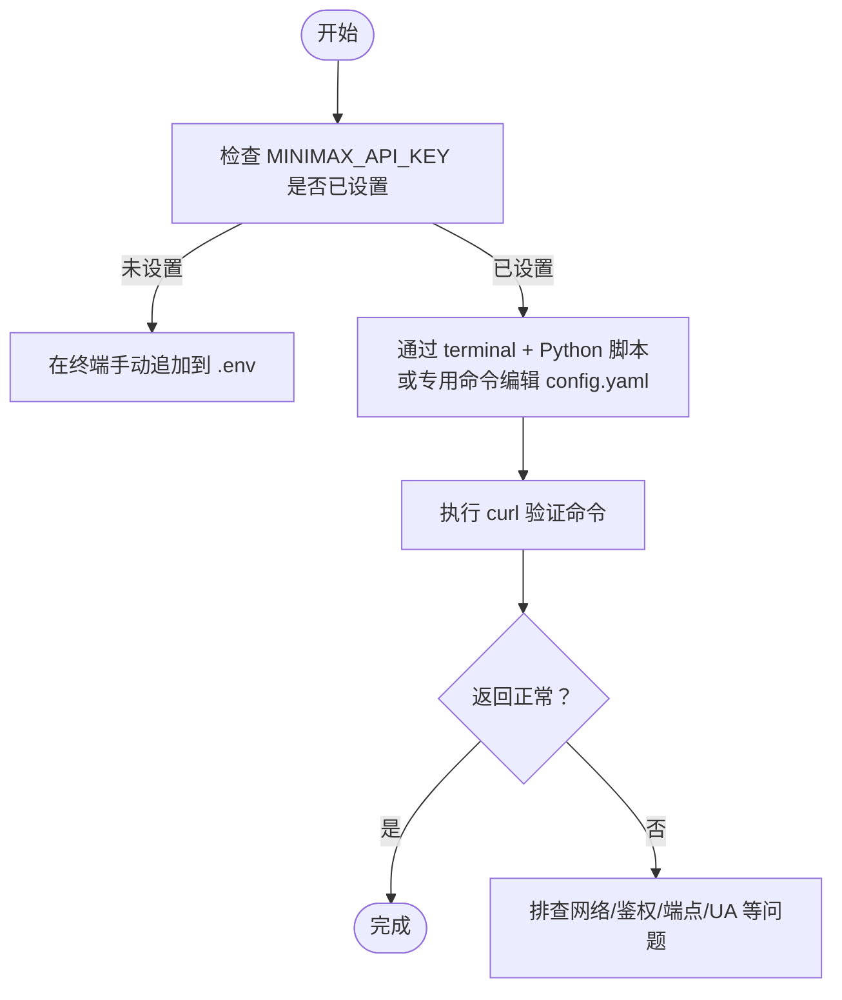
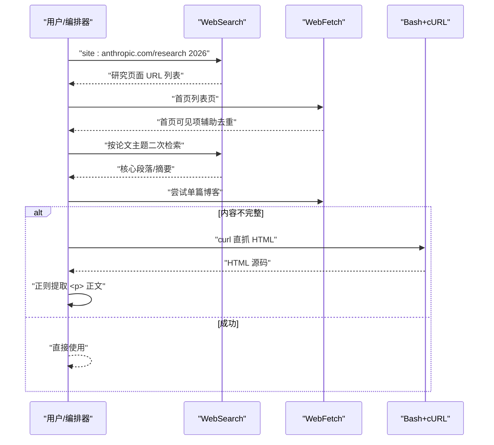
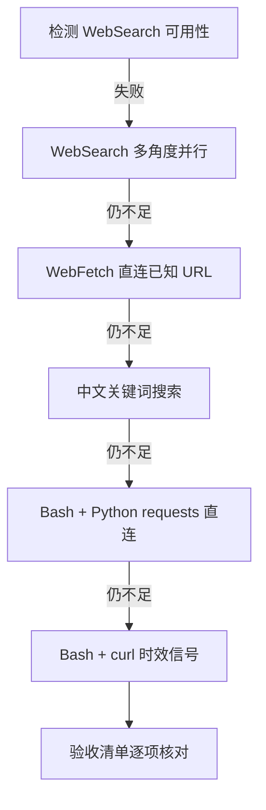
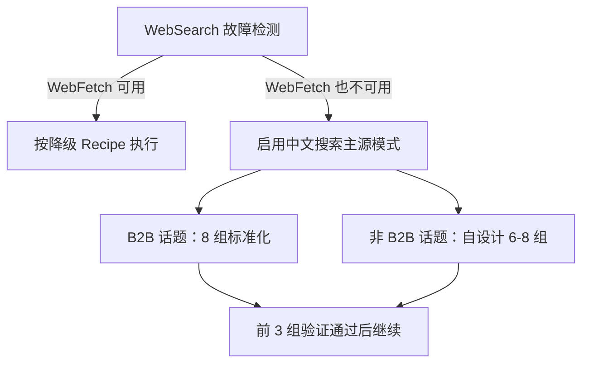
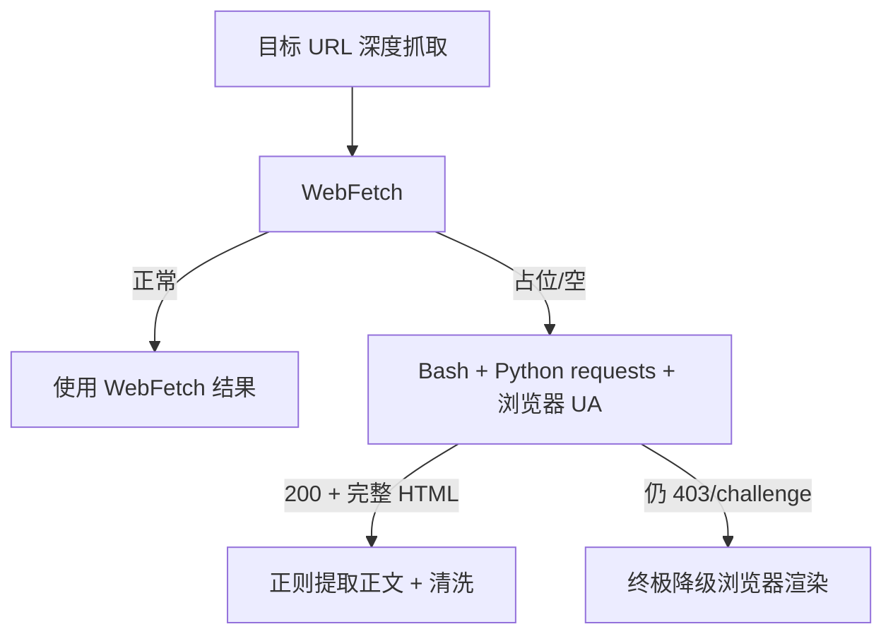
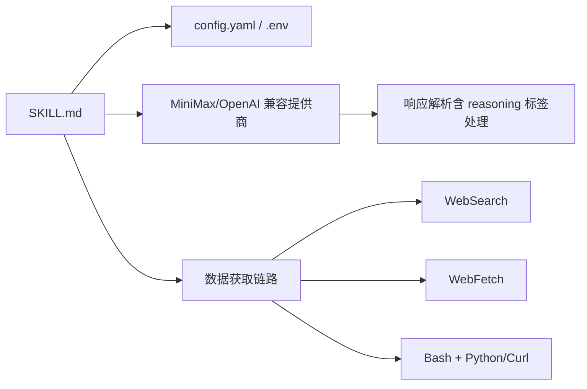

# 提供商集成配置

<cite>
**本文引用的文件**
- [hotspot-topic-excavator/skills/hotspot-topic-excavator/references/providers/minimax-m3.md](file://hotspot-topic-excavator/skills/hotspot-topic-excavator/references/providers/minimax-m3.md)
- [hotspot-topic-excavator/skills/hotspot-topic-excavator/references/anthropic-source-handling.md](file://hotspot-topic-excavator/skills/hotspot-topic-excavator/references/anthropic-source-handling.md)
- [hotspot-topic-excavator/skills/hotspot-topic-excavator/SKILL.md](file://hotspot-topic-excavator/skills/hotspot-topic-excavator/SKILL.md)
- [hotspot-topic-excavator/README.md](file://hotspot-topic-excavator/README.md)
- [hotspot-topic-excavator/skills/hotspot-topic-excavator/references/brave-mcp-degraded-recipe.md](file://hotspot-topic-excavator/skills/hotspot-topic-excavator/references/brave-mcp-degraded-recipe.md)
- [hotspot-topic-excavator/skills/hotspot-topic-excavator/references/doubao_primary_fallback.md](file://hotspot-topic-excavator/skills/hotspot-topic-excavator/references/doubao_primary_fallback.md)
- [hotspot-topic-excavator/skills/hotspot-topic-excavator/references/cloudflare_waf_python_direct.md](file://hotspot-topic-excavator/skills/hotspot-topic-excavator/references/cloudflare_waf_python_direct.md)
- [hotspot-topic-excavator/skills/hotspot-topic-excavator/references/international_topic_chinese_supplement.md](file://hotspot-topic-excavator/skills/hotspot-topic-excavator/references/international_topic_chinese_supplement.md)
- [hotspot-topic-excavator/skills/hotspot-topic-excavator/references/apple_podcasts_transcript_proxy.md](file://hotspot-topic-excavator/skills/hotspot-topic-excavator/references/apple_podcasts_transcript_proxy.md)
- [hotspot-topic-excavator/skills/hotspot-topic-excavator/references/llm_context_only_excavation.md](file://hotspot-topic-excavator/skills/hotspot-topic-excavator/references/llm_context_only_excavation.md)
</cite>

## 目录
1. [引言](#引言)
2. [项目结构](#项目结构)
3. [核心组件](#核心组件)
4. [架构总览](#架构总览)
5. [详细组件分析](#详细组件分析)
6. [依赖关系分析](#依赖关系分析)
7. [性能与成本控制](#性能与成本控制)
8. [故障排查指南](#故障排查指南)
9. [结论](#结论)
10. [附录：配置示例与验证流程](#附录配置示例与验证流程)

## 引言
本文件聚焦“提供商集成配置”，围绕以下目标展开：
- MiniMax M3 模型的接入与配置要点、已知行为与注意事项
- Anthropic Research 信源的数据获取技巧与降级策略
- 其他 AI 服务提供商的集成方案（以 OpenAI 兼容模式为主）
- API 密钥管理、请求格式转换、响应解析处理的技术细节
- 性能调优建议、错误处理策略与成本控制方法
- 完整配置示例与测试验证流程

## 项目结构
本项目为 Qoder 插件形态，提供热点主题素材深挖采集能力。与“提供商集成”直接相关的参考文档集中于 references/providers 与 references 下的若干技术指南。

图表来源
- [hotspot-topic-excavator/skills/hotspot-topic-excavator/SKILL.md](file://hotspot-topic-excavator/skills/hotspot-topic-excavator/SKILL.md)
- [hotspot-topic-excavator/skills/hotspot-topic-excavator/references/providers/minimax-m3.md](file://hotspot-topic-excavator/skills/hotspot-topic-excavator/references/providers/minimax-m3.md)
- [hotspot-topic-excavator/skills/hotspot-topic-excavator/references/anthropic-source-handling.md](file://hotspot-topic-excavator/skills/hotspot-topic-excavator/references/anthropic-source-handling.md)
- [hotspot-topic-excavator/skills/hotspot-topic-excavator/references/brave-mcp-degraded-recipe.md](file://hotspot-topic-excavator/skills/hotspot-topic-excavator/references/brave-mcp-degraded-recipe.md)
- [hotspot-topic-excavator/skills/hotspot-topic-excavator/references/doubao_primary_fallback.md](file://hotspot-topic-excavator/skills/hotspot-topic-excavator/references/doubao_primary_fallback.md)
- [hotspot-topic-excavator/skills/hotspot-topic-excavator/references/cloudflare_waf_python_direct.md](file://hotspot-topic-excavator/skills/hotspot-topic-excavator/references/cloudflare_waf_python_direct.md)
- [hotspot-topic-excavator/skills/hotspot-topic-excavator/references/international_topic_chinese_supplement.md](file://hotspot-topic-excavator/skills/hotspot-topic-excavator/references/international_topic_chinese_supplement.md)
- [hotspot-topic-excavator/skills/hotspot-topic-excavator/references/apple_podcasts_transcript_proxy.md](file://hotspot-topic-excavator/skills/hotspot-topic-excavator/references/apple_podcasts_transcript_proxy.md)
- [hotspot-topic-excavator/skills/hotspot-topic-excavator/references/llm_context_only_excavation.md](file://hotspot-topic-excavator/skills/hotspot-topic-excavator/references/llm_context_only_excavation.md)

章节来源
- [hotspot-topic-excavator/README.md](file://hotspot-topic-excavator/README.md)
- [hotspot-topic-excavator/skills/hotspot-topic-excavator/SKILL.md](file://hotspot-topic-excavator/skills/hotspot-topic-excavator/SKILL.md)

## 核心组件
- MiniMax M3 提供商配置：OpenAI 兼容 chat_completions 模式，支持 reasoning 输出；提供 config.yaml 与 .env 的配置项说明与验证命令。
- Anthropic Research 信源处理：针对 JS 增量加载与 SSR 博客页面的抓取策略，给出 WebSearch + WebFetch + Bash curl 的组合流程与决策树。
- 搜索与原文获取的降级链路：当 WebSearch/WebFetch 不可用时，按顺序切换到多路并行搜索、直连 URL、中文关键词搜索、Python requests/curl 等路径。
- 中文搜索主源模式：在双通道不可用情况下，将中文搜索升级为全信号主采集源，并给出 B2B 与非 B2B 两类模板化执行方式。
- Cloudflare WAF 绕过：通过 Python requests + 浏览器 UA 直连，正则提取正文，作为 WebFetch 被挡时的首选降级。
- 国际治理话题中文补强：强制增加中文关键词搜索，补齐政策、学术与本土案例视角。
- Apple Podcasts show notes 替代：在 YouTube transcript 失败时，使用 Apple Podcasts 章节时间码+金句作为高价值替代。
- LLM Context-Only 采集范式：以 WebSearch 为主力，配合少量 WebFetch 补充，达到高信息完整度。

章节来源
- [hotspot-topic-excavator/skills/hotspot-topic-excavator/references/providers/minimax-m3.md](file://hotspot-topic-excavator/skills/hotspot-topic-excavator/references/providers/minimax-m3.md)
- [hotspot-topic-excavator/skills/hotspot-topic-excavator/references/anthropic-source-handling.md](file://hotspot-topic-excavator/skills/hotspot-topic-excavator/references/anthropic-source-handling.md)
- [hotspot-topic-excavator/skills/hotspot-topic-excavator/references/brave-mcp-degraded-recipe.md](file://hotspot-topic-excavator/skills/hotspot-topic-excavator/references/brave-mcp-degraded-recipe.md)
- [hotspot-topic-excavator/skills/hotspot-topic-excavator/references/doubao_primary_fallback.md](file://hotspot-topic-excavator/skills/hotspot-topic-excavator/references/doubao_primary_fallback.md)
- [hotspot-topic-excavator/skills/hotspot-topic-excavator/references/cloudflare_waf_python_direct.md](file://hotspot-topic-excavator/skills/hotspot-topic-excavator/references/cloudflare_waf_python_direct.md)
- [hotspot-topic-excavator/skills/hotspot-topic-excavator/references/international_topic_chinese_supplement.md](file://hotspot-topic-excavator/skills/hotspot-topic-excavator/references/international_topic_chinese_supplement.md)
- [hotspot-topic-excavator/skills/hotspot-topic-excavator/references/apple_podcasts_transcript_proxy.md](file://hotspot-topic-excavator/skills/hotspot-topic-excavator/references/apple_podcasts_transcript_proxy.md)
- [hotspot-topic-excavator/skills/hotspot-topic-excavator/references/llm_context_only_excavation.md](file://hotspot-topic-excavator/skills/hotspot-topic-excavator/references/llm_context_only_excavation.md)

## 架构总览
下图展示“提供商集成”的关键交互：上层技能编排调用不同提供商（如 MiniMax），同时结合搜索与原文获取工具链完成数据采集与内容生产。

图表来源
- [hotspot-topic-excavator/skills/hotspot-topic-excavator/SKILL.md](file://hotspot-topic-excavator/skills/hotspot-topic-excavator/SKILL.md)
- [hotspot-topic-excavator/skills/hotspot-topic-excavator/references/providers/minimax-m3.md](file://hotspot-topic-excavator/skills/hotspot-topic-excavator/references/providers/minimax-m3.md)
- [hotspot-topic-excavator/skills/hotspot-topic-excavator/references/brave-mcp-degraded-recipe.md](file://hotspot-topic-excavator/skills/hotspot-topic-excavator/references/brave-mcp-degraded-recipe.md)
- [hotspot-topic-excavator/skills/hotspot-topic-excavator/references/cloudflare_waf_python_direct.md](file://hotspot-topic-excavator/skills/hotspot-topic-excavator/references/cloudflare_waf_python_direct.md)

## 详细组件分析

### MiniMax M3 提供商配置
- 模型与端点
  - 模型名：minimax-m3（非 abab-m3）
  - 端点：https://api.minimax.chat/v1/chat/completions
  - 模式：chat_completions（OpenAI 兼容）
  - Reasoning：输出包含 reasoning 标签块
  - 备选模型：minimax-m1（同样有 reasoning）、abab6.5s-chat（无 reasoning）
- 配置项
  - config.yaml：custom_providers 下新增 minimax，设置 base_url、api_key、api_mode，并在 models 中声明 context_length
  - .env：MINIMAX_API_KEY 环境变量注入
- 验证
  - 提供 curl 验证命令，用于快速确认鉴权与基本连通性
- 已知问题与规避
  - reasoning 标签可能导致下游解析残片，必要时切换至无 reasoning 的备选模型
  - 在特定会话环境中写入 .env 可能被拦截，需手动在终端追加
  - 直接写 config.yaml 会被保护机制拒绝，应通过 terminal + Python 脚本或专用配置命令编辑

图表来源
- [hotspot-topic-excavator/skills/hotspot-topic-excavator/references/providers/minimax-m3.md](file://hotspot-topic-excavator/skills/hotspot-topic-excavator/references/providers/minimax-m3.md)

章节来源
- [hotspot-topic-excavator/skills/hotspot-topic-excavator/references/providers/minimax-m3.md](file://hotspot-topic-excavator/skills/hotspot-topic-excavator/references/providers/minimax-m3.md)

### Anthropic Research 信源数据处理
- 页面特性
  - 列表页采用 JS 增量加载，WebFetch 仅能拿到首页可见项
  - 单篇博客为 Next.js SSR，全文嵌入 HTML，但 WebFetch 可能解析异常
- 推荐流程
  - Step 1：WebSearch 使用 site: 限定词发现研究页面 URL 集合
  - Step 2：WebFetch 获取首页可见项辅助去重
  - Step 3：对每篇目标论文再次 WebSearch 定位核心段落
  - Step 4：合并去重，编译论文表格
- 单篇博客抓取
  - 优先尝试 WebFetch；若内容不完整，改用 Bash + curl 直抓 HTML，并按特征 class 正则提取正文
  - 对特定域名访问受限则降级到 WebSearch 获取第三方解读

图表来源
- [hotspot-topic-excavator/skills/hotspot-topic-excavator/references/anthropic-source-handling.md](file://hotspot-topic-excavator/skills/hotspot-topic-excavator/references/anthropic-source-handling.md)

章节来源
- [hotspot-topic-excavator/skills/hotspot-topic-excavator/references/anthropic-source-handling.md](file://hotspot-topic-excavator/skills/hotspot-topic-excavator/references/anthropic-source-handling.md)

### 其他 AI 服务提供商集成方案（OpenAI 兼容）
- 适配原则
  - 统一使用 chat_completions 模式，遵循 OpenAI 兼容的请求/响应结构
  - 通过 custom_providers 抽象不同 base_url 与模型上下文长度
- 典型步骤
  - 在 config.yaml 中新增 provider，指定 base_url、api_key、api_mode、models
  - 在 .env 中注入对应 API Key
  - 使用 curl 或 SDK 进行最小可用验证
- 注意
  - 不同厂商对 reasoning、token 限制、并发限流等行为存在差异，需在 providers 文档中记录并做适配

章节来源
- [hotspot-topic-excavator/skills/hotspot-topic-excavator/references/providers/minimax-m3.md](file://hotspot-topic-excavator/skills/hotspot-topic-excavator/references/providers/minimax-m3.md)

### 搜索与原文获取的降级链路
- 触发条件
  - WebSearch 连续失败且 WebFetch 不可用
- 降级顺序
  - 多角度并行 WebSearch
  - 对已知 URL 使用 WebFetch 直取
  - 中文关键词搜索（覆盖中国视角）
  - Bash + Python requests 直连抓取
  - Bash + curl 时效信号抓取
- 验收标准
  - 每个核心种子至少 2 个独立信源
  - 至少 1 个 P1 一手源
  - 中国版至少 1 条（除非纯海外话题）
  - 反对/边界条件至少 1 条
  - 时间戳在合理窗口内
  - 参考资料链接可打开

图表来源
- [hotspot-topic-excavator/skills/hotspot-topic-excavator/references/brave-mcp-degraded-recipe.md](file://hotspot-topic-excavator/skills/hotspot-topic-excavator/references/brave-mcp-degraded-recipe.md)

章节来源
- [hotspot-topic-excavator/skills/hotspot-topic-excavator/references/brave-mcp-degraded-recipe.md](file://hotspot-topic-excavator/skills/hotspot-topic-excavator/references/brave-mcp-degraded-recipe.md)

### 中文搜索主源模式（WebSearch 不可用时的全信号采集）
- 触发条件
  - WebSearch 连续 ≥5 次失败且 WebFetch 不可用
- 适用场景
  - B2B 话题：使用标准化 8 组中文关键词模板
  - 非 B2B 话题：自设计 6-8 组关键词（锚点核心、关联信号、对立争议、中国视角、发散类比）
- 验证规则
  - 前 3 组完成后必须验证命中数量、数字交叉、中国视角与对立观点
- 与其他降级路径的关系
  - 与 Brave MCP 降级 Recipe 互补，明确何时启用中文主源

图表来源
- [hotspot-topic-excavator/skills/hotspot-topic-excavator/references/doubao_primary_fallback.md](file://hotspot-topic-excavator/skills/hotspot-topic-excavator/references/doubao_primary_fallback.md)
- [hotspot-topic-excavator/skills/hotspot-topic-excavator/references/brave-mcp-degraded-recipe.md](file://hotspot-topic-excavator/skills/hotspot-topic-excavator/references/brave-mcp-degraded-recipe.md)

章节来源
- [hotspot-topic-excavator/skills/hotspot-topic-excavator/references/doubao_primary_fallback.md](file://hotspot-topic-excavator/skills/hotspot-topic-excavator/references/doubao_primary_fallback.md)

### Cloudflare WAF 站点直连绕过
- 现象
  - WebFetch 返回占位文本（如 “Please wait...”）
  - Python requests + 浏览器 UA 可获完整 HTML
- 成功模式
  - 带浏览器 UA 的 Python requests 直连
  - 正则提取正文（WordPress/Gutenberg 常见结构）
  - 清洗为 Markdown，并进行质量门校验（≥3 个 
 标签）
- 决策树
  - WebFetch 正常 → 使用 WebFetch
  - 被 WAF 挡 → 切 Python requests + UA
  - 仍失败 → 终极降级（浏览器渲染）

图表来源
- [hotspot-topic-excavator/skills/hotspot-topic-excavator/references/cloudflare_waf_python_direct.md](file://hotspot-topic-excavator/skills/hotspot-topic-excavator/references/cloudflare_waf_python_direct.md)

章节来源
- [hotspot-topic-excavator/skills/hotspot-topic-excavator/references/cloudflare_waf_python_direct.md](file://hotspot-topic-excavator/skills/hotspot-topic-excavator/references/cloudflare_waf_python_direct.md)

### 国际治理话题·中文信源补强
- 触发条件
  - 联合国/国际组织报告、跨国治理框架、全球行业事件、跨境监管动作、全球统计数据
- 执行建议
  - 强制增加中文关键词搜索（1-3 组），补齐政策、学术与本土案例
  - 中文素材提升优先级（P1/P2），避免降为 P3
  - 标注发布时间戳，区分中英文报道时序
- 反模式
  - 用英文关键词搜中文信源
  - 忽略中文信源的时效延迟
  - 把中文独有视角当作低优先级

章节来源
- [hotspot-topic-excavator/skills/hotspot-topic-excavator/references/international_topic_chinese_supplement.md](file://hotspot-topic-excavator/skills/hotspot-topic-excavator/references/international_topic_chinese_supplement.md)

### Apple Podcasts Show Notes 作为 Transcript 替代
- 适用场景
  - YouTube transcript 失败或不可用时
- 价值
  - 章节时间码 + 金句，约 90% 完整度，可直接支撑权威引述与叙事骨架
- 工作流
  - 两条路径并行：YouTube transcript 与 Apple Podcasts show notes
  - 任一成功即可进入素材组织阶段

章节来源
- [hotspot-topic-excavator/skills/hotspot-topic-excavator/references/apple_podcasts_transcript_proxy.md](file://hotspot-topic-excavator/skills/hotspot-topic-excavator/references/apple_podcasts_transcript_proxy.md)

### LLM Context-Only 采集范式（WebSearch 为主）
- 结论
  - 仅使用 WebSearch 作为主力，无需 WebFetch，也可达到 93% 整体信息完整度
- 执行顺序
  - 第一轮：核心信号并行爆发（多个 WebSearch 同时发起）
  - 第二轮：发散与补充（含对立视角、市场份额等）
  - 缺口识别后，再按需使用 WebFetch 补充特定 URL
- 适用条件
  - 种子信号 ≥ 3 个，信源类型广泛（论文/财报/官方报告/博客）
  - 需要多源交叉验证的时间敏感话题

章节来源
- [hotspot-topic-excavator/skills/hotspot-topic-excavator/references/llm_context_only_excavation.md](file://hotspot-topic-excavator/skills/hotspot-topic-excavator/references/llm_context_only_excavation.md)

## 依赖关系分析
- 提供商抽象
  - 通过 custom_providers 抽象不同 base_url、api_key、api_mode 与模型参数
  - 与 SKILL.md 的任务编排形成松耦合：上层只关心“提供商名称 + 模型名”
- 数据获取链路
  - WebSearch 与 WebFetch 互为备份；在不可用时自动降级到 Python/Curl 直连
  - 中文搜索主源模式在极端条件下承担全信号采集职责
- 外部约束
  - Cloudflare WAF、Next.js SSR、JS 增量加载等页面特性决定具体抓取策略

图表来源
- [hotspot-topic-excavator/skills/hotspot-topic-excavator/SKILL.md](file://hotspot-topic-excavator/skills/hotspot-topic-excavator/SKILL.md)
- [hotspot-topic-excavator/skills/hotspot-topic-excavator/references/providers/minimax-m3.md](file://hotspot-topic-excavator/skills/hotspot-topic-excavator/references/providers/minimax-m3.md)
- [hotspot-topic-excavator/skills/hotspot-topic-excavator/references/brave-mcp-degraded-recipe.md](file://hotspot-topic-excavator/skills/hotspot-topic-excavator/references/brave-mcp-degraded-recipe.md)

章节来源
- [hotspot-topic-excavator/skills/hotspot-topic-excavator/SKILL.md](file://hotspot-topic-excavator/skills/hotspot-topic-excavator/SKILL.md)
- [hotspot-topic-excavator/skills/hotspot-topic-excavator/references/providers/minimax-m3.md](file://hotspot-topic-excavator/skills/hotspot-topic-excavator/references/providers/minimax-m3.md)
- [hotspot-topic-excavator/skills/hotspot-topic-excavator/references/brave-mcp-degraded-recipe.md](file://hotspot-topic-excavator/skills/hotspot-topic-excavator/references/brave-mcp-degraded-recipe.md)

## 性能与成本控制
- 并行化
  - 多路 WebSearch 并行发起，缩短首字节时间与整体耗时
  - WebSearch 与 WebFetch 并行调用，互为备份
- 选择合适的主采集策略
  - 在多数场景下，WebSearch 为主力可达到 85-95% 完整度，减少不必要的 WebFetch 调用
- 控制重试与超时
  - 对 WebFetch 与直连请求设置合理超时，避免长时间阻塞
- 降低推理成本
  - 对不需要 reasoning 的场景，选用无 reasoning 的备选模型（如 abab6.5s-chat）
  - 合理设置 max_tokens 与 context_length，避免过度消耗
- 缓存与去重
  - 对搜索结果与抓取内容进行指纹去重，避免重复处理

[本节为通用指导，不直接分析具体文件]

## 故障排查指南
- 提供商连通性
  - 使用 curl 验证命令快速确认鉴权与端点可达性
  - 若返回 reasoning 标签导致解析异常，切换至无 reasoning 的备选模型
- 搜索与抓取
  - 启动降级链路：先 WebSearch 多角度并行，再 WebFetch 直连，再中文搜索，最后 Python/Curl 直连
  - 遇到 Cloudflare WAF 时，优先使用 Python requests + 浏览器 UA 直连
- 环境配置
  - 确保 .env 中的 API Key 正确注入
  - 通过 terminal + Python 脚本或专用配置命令编辑 config.yaml，避免被保护机制拒绝

章节来源
- [hotspot-topic-excavator/skills/hotspot-topic-excavator/references/providers/minimax-m3.md](file://hotspot-topic-excavator/skills/hotspot-topic-excavator/references/providers/minimax-m3.md)
- [hotspot-topic-excavator/skills/hotspot-topic-excavator/references/brave-mcp-degraded-recipe.md](file://hotspot-topic-excavator/skills/hotspot-topic-excavator/references/brave-mcp-degraded-recipe.md)
- [hotspot-topic-excavator/skills/hotspot-topic-excavator/references/cloudflare_waf_python_direct.md](file://hotspot-topic-excavator/skills/hotspot-topic-excavator/references/cloudflare_waf_python_direct.md)

## 结论
- MiniMax M3 可通过 OpenAI 兼容模式快速接入，注意 reasoning 标签与配置写入保护
- Anthropic Research 信源需结合 WebSearch + WebFetch + Bash curl 的策略，应对 JS 增量加载与 SSR 页面
- 在搜索与原文获取不可用时，按既定降级链路推进，并以中文搜索主源模式兜底
- 通过并行化、主采集策略选择与成本控制手段，提升效率与稳定性

[本节为总结性内容，不直接分析具体文件]

## 附录：配置示例与验证流程

### MiniMax M3 配置示例
- config.yaml
  - 在 custom_providers 下新增 minimax，设置 base_url、api_key、api_mode，并在 models 中声明 context_length
- .env
  - 设置 MINIMAX_API_KEY
- 验证
  - 使用 curl 验证命令进行最小可用测试

章节来源
- [hotspot-topic-excavator/skills/hotspot-topic-excavator/references/providers/minimax-m3.md](file://hotspot-topic-excavator/skills/hotspot-topic-excavator/references/providers/minimax-m3.md)

### Anthropic Research 抓取验证流程
- 使用 site: 限定词进行 WebSearch，收集研究页面 URL
- 对首页与单篇博客分别尝试 WebFetch，若内容不完整则回退到 Bash + curl 直抓 HTML 并正则提取正文
- 合并去重，产出论文表格

章节来源
- [hotspot-topic-excavator/skills/hotspot-topic-excavator/references/anthropic-source-handling.md](file://hotspot-topic-excavator/skills/hotspot-topic-excavator/references/anthropic-source-handling.md)

### 搜索与抓取降级验证流程
- 模拟 WebSearch 失败场景，依次执行：
  - 多角度并行 WebSearch
  - WebFetch 直连已知 URL
  - 中文关键词搜索
  - Python requests 直连
  - curl 时效信号抓取
- 对照验收清单逐项核对

章节来源
- [hotspot-topic-excavator/skills/hotspot-topic-excavator/references/brave-mcp-degraded-recipe.md](file://hotspot-topic-excavator/skills/hotspot-topic-excavator/references/brave-mcp-degraded-recipe.md)

### 中文搜索主源模式验证流程
- 在 WebSearch 与 WebFetch 均不可用时启用
- B2B 话题：按 8 组标准化模板执行
- 非 B2B 话题：自设计 6-8 组关键词
- 前 3 组完成后进行验证，通过后继续剩余组

章节来源
- [hotspot-topic-excavator/skills/hotspot-topic-excavator/references/doubao_primary_fallback.md](file://hotspot-topic-excavator/skills/hotspot-topic-excavator/references/doubao_primary_fallback.md)

### Cloudflare WAF 绕过验证流程
- 对疑似 WAF 站点，先用 WebFetch 验证是否返回占位文本
- 若被挡，使用 Python requests + 浏览器 UA 直连，正则提取正文并清洗为 Markdown
- 进行质量门校验（≥3 个 
 标签）

章节来源
- [hotspot-topic-excavator/skills/hotspot-topic-excavator/references/cloudflare_waf_python_direct.md](file://hotspot-topic-excavator/skills/hotspot-topic-excavator/references/cloudflare_waf_python_direct.md)

### Apple Podcasts 替代验证流程
- 当 YouTube transcript 失败时，使用 WebSearch 命中 Apple Podcasts 条目
- 提取章节时间码与金句，作为权威引述素材
- 与 YouTube transcript 并行尝试，任一成功即可进入素材组织

章节来源
- [hotspot-topic-excavator/skills/hotspot-topic-excavator/references/apple_podcasts_transcript_proxy.md](file://hotspot-topic-excavator/skills/hotspot-topic-excavator/references/apple_podcasts_transcript_proxy.md)

### LLM Context-Only 采集验证流程
- 以 WebSearch 为主力，首轮并行发起多个核心信号查询
- 第二轮进行发散与补充，识别缺口后再按需使用 WebFetch
- 评估整体信息完整度，目标达到 85-95%

章节来源
- [hotspot-topic-excavator/skills/hotspot-topic-excavator/references/llm_context_only_excavation.md](file://hotspot-topic-excavator/skills/hotspot-topic-excavator/references/llm_context_only_excavation.md)