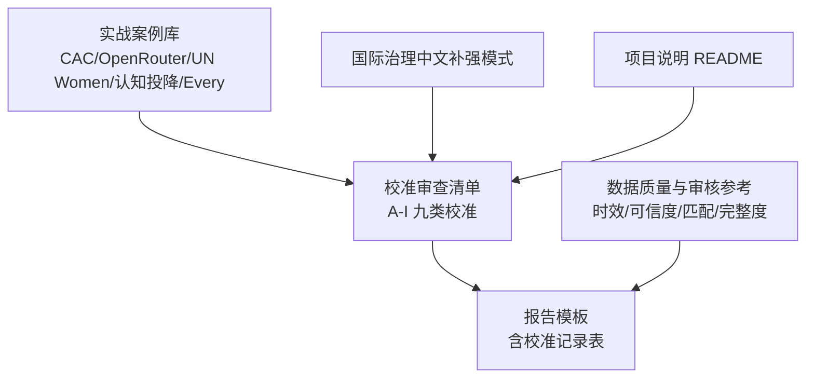
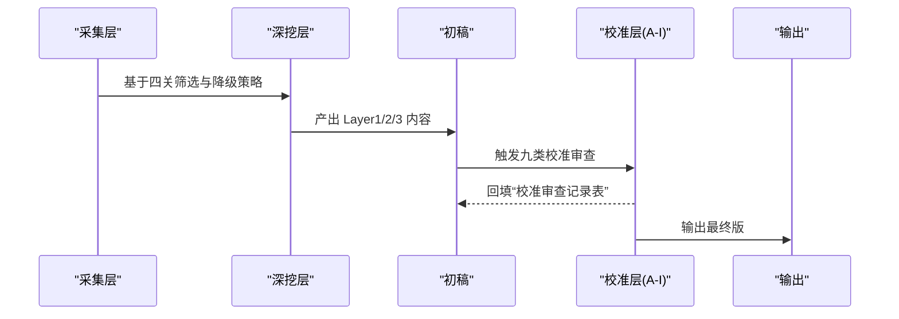
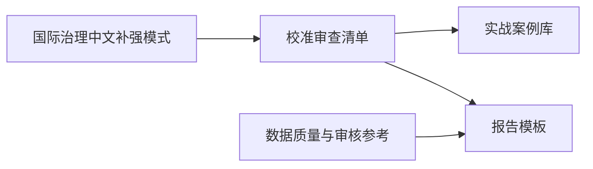
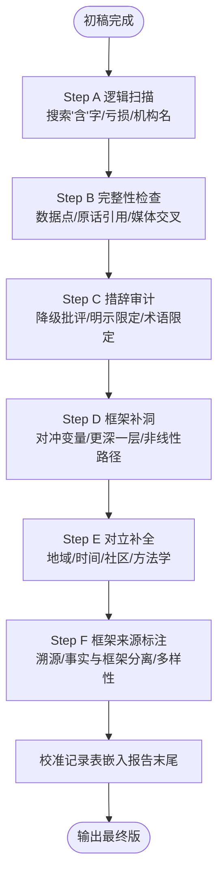
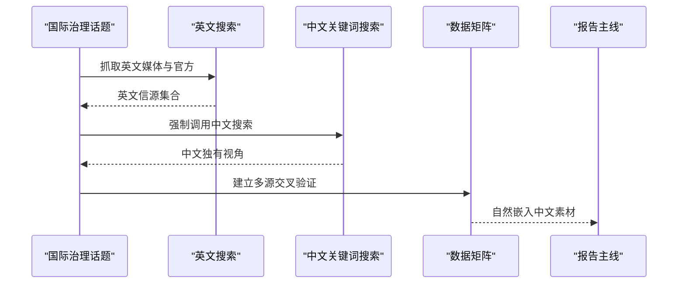

# 校准与质量保证

<cite>
**本文引用的文件**
- [校准审查清单](file://hotspot-topic-excavator/skills/hotspot-topic-excavator/references/calibration_checklist.md)
- [CAC “智能信息服务”专章案例](file://hotspot-topic-excavator/skills/hotspot-topic-excavator/references/calibration_case_cac_ai_services_chapter.md)
- [OpenRouter 数据口径与时序错配案例](file://hotspot-topic-excavator/skills/hotspot-topic-excavator/references/calibration_case_openrouter.md)
- [联合国妇女署国际议题升级案例](file://hotspot-topic-excavator/skills/hotspot-topic-excavator/references/calibration_case_un_women_international_upgrade.md)
- [认知投降学术溯源案例](file://hotspot-topic-excavator/skills/hotspot-topic-excavator/references/calibration_case_cognitive_surrender.md)
- [Every 复利工程上游误读案例](file://hotspot-topic-excavator/skills/hotspot-topic-excavator/references/calibration_case_every_compound_engineering.md)
- [国际治理话题·中文信源补强模式](file://hotspot-topic-excavator/skills/hotspot-topic-excavator/references/international_topic_chinese_supplement.md)
- [热点主题素材深挖报告模板](file://hotspot-topic-excavator/skills/hotspot-topic-excavator/templates/report_template.md)
- [数据质量与审核参考](file://.skills/hotspot-research/references/data_quality.md)
- [项目说明（README）](file://hotspot-topic-excavator/README.md)
</cite>

## 目录
1. [引言](#引言)
2. [项目结构](#项目结构)
3. [核心组件](#核心组件)
4. [架构总览](#架构总览)
5. [详细组件分析](#详细组件分析)
6. [依赖关系分析](#依赖关系分析)
7. [性能考量](#性能考量)
8. [故障排查指南](#故障排查指南)
9. [结论](#结论)
10. [附录](#附录)

## 引言
本文件面向“热点主题素材深挖采集器”的校准与质量保证体系，系统化梳理并落地九类校准审查标准流程与检查要点，覆盖事实校准、表述校准、框架补充、对立视角、理论偏向、叙事引力、受众工具链翻译、三角叙事补洞等维度。通过多个真实校准案例（CAC AI服务章节、OpenRouter、联合国妇女署国际升级、认知投降学术溯源、Every 复利工程上游误读），展示常见陷阱与修正方法，并提供校准记录表使用指南与质量评估标准，帮助读者在初稿完成后、输出前完成高质量校准闭环。

## 项目结构
本项目围绕“热点主题素材深挖采集器”的技能与参考资料组织，核心与校准相关的关键位置如下：
- 校准规则与执行流程：校准审查清单
- 实战案例库：多份校准案例文档
- 报告模板：包含“校准审查记录表”
- 数据质量与审核参考：时效、来源可信度、赛道匹配与信息完整度四关
- 国际治理中文补强模式：针对国际议题的中文信源补强策略
- 项目说明：功能概述、适配说明、文件结构与使用方法

图表来源
- [校准审查清单:1-158](file://hotspot-topic-excavator/skills/hotspot-topic-excavator/references/calibration_checklist.md#L1-L158)
- [热点主题素材深挖报告模板:107-121](file://hotspot-topic-excavator/skills/hotspot-topic-excavator/templates/report_template.md#L107-L121)
- [数据质量与审核参考:8-77](file://.skills/hotspot-research/references/data_quality.md#L8-L77)
- [项目说明（README）:1-130](file://hotspot-topic-excavator/README.md#L1-L130)

章节来源
- [项目说明（README）:1-130](file://hotspot-topic-excavator/README.md#L1-L130)

## 核心组件
- 九类校准审查清单：提供从事实到叙事的全面校验点与执行步骤，明确“何时做、怎么做、常见陷阱”。
- 实战案例库：以真实问题为锚点，沉淀“陷阱—危险—修正动作—验证信号”的方法论。
- 报告模板：内置“校准审查记录表”，将校准过程结构化嵌入报告末尾，便于追溯与复盘。
- 数据质量与审核参考：定义时效、来源可信度、赛道匹配与信息完整度四关，作为质量基线。
- 国际治理中文补强模式：强制对国际治理类话题进行中文信源补强，避免系统性盲区。

章节来源
- [校准审查清单:9-146](file://hotspot-topic-excavator/skills/hotspot-topic-excavator/references/calibration_checklist.md#L9-L146)
- [热点主题素材深挖报告模板:107-121](file://hotspot-topic-excavator/skills/hotspot-topic-excavator/templates/report_template.md#L107-L121)
- [数据质量与审核参考:8-77](file://.skills/hotspot-research/references/data_quality.md#L8-L77)
- [国际治理话题·中文信源补强模式:1-133](file://hotspot-topic-excavator/skills/hotspot-topic-excavator/references/international_topic_chinese_supplement.md#L1-L133)

## 架构总览
校准与质量保证体系贯穿“采集—深挖—初稿—校准—输出”的全链路，关键节点如下：
- 采集阶段：遵循数据质量四关，确保时效、可信度、匹配与完整度达标。
- 深挖阶段：按五路并行采集策略建立数据矩阵，交叉验证核心数字与引述。
- 初稿完成后：执行九类校准审查（A-I），逐项填写“校准审查记录表”。
- 输出前：依据反模式检查清单与自检问题，完成最终把关。

图表来源
- [数据质量与审核参考:8-77](file://.skills/hotspot-research/references/data_quality.md#L8-L77)
- [校准审查清单:108-146](file://hotspot-topic-excavator/skills/hotspot-topic-excavator/references/calibration_checklist.md#L108-L146)
- [热点主题素材深挖报告模板:107-121](file://hotspot-topic-excavator/skills/hotspot-topic-excavator/templates/report_template.md#L107-L121)

## 详细组件分析

### 九类校准审查标准流程与检查要点
- A 事实校准（数字逻辑矛盾检查）
  - 子项不能大于总量；同名机构多份报告区分；多口径财务数据不混用；内部量化总结与原始附录对齐。
  - 关键教训：“含”字是危险信号；出现“亏损”先问口径；同名机构≠同份报告。
- B 事实补充（多源遗漏检查）
  - 大型调查报告需完整数据；P1原文引用完整性；同一报告的多篇媒体报道交叉验证。
- C 表述校准（措辞精准度检查）
  - 批评尺度控制；限定条件明示；行业术语隐含限定（如“创作者”）。
- D 框架补充（分析结构完整性检查）
  - 经济判断必查对冲变量；核心命题“更深一层”；大方向成立≠路径直线。
- E 对立视角（论证自反性检查）
  - 地域差异；时间边界；社区反对声音；方法学质疑。
- F 框架来源透明性（实验性）
  - 框架溯源标注；事实层与框架层分离；跨话题框架多样性。
- G 叙事引力（JADEPUFFER 审查驱动）
  - 高引力话题的反引力锚；自检问题（是否夸大、对立观点是否整合、中国视角是否平行）。
- H 受众工具链翻译（JADEPUFFER 审查驱动）
  - 企业语言→超级个体工具名；T-Transform 段分两部分（工具链级自检表+通用行动清单）。
- I 三角叙事补洞（JADEPUFFER 审查驱动）
  - 寻找第三个点C，把两点叙事升级为三角形；强关联层新增条目、时间线补入、SOUL 框架表补充。

执行流程（建议用时约13分钟）：
- Step A 逻辑扫描（3分钟）→ Step B 完整性检查（2分钟）→ Step C 措辞审计（2分钟）→ Step D 框架补洞（3分钟）→ Step E 对立补全（2分钟）→ Step F 框架来源标注（1分钟）→ 校准记录表嵌入 → 输出最终版。

章节来源
- [校准审查清单:11-146](file://hotspot-topic-excavator/skills/hotspot-topic-excavator/references/calibration_checklist.md#L11-L146)

### 实战案例一：CAC “智能信息服务”专章（政策/法规类）
- 情境：国家网信办修订草案二次征求意见首设“智能信息服务”专章；WebSearch 连续不可用，全链路降级。
- 降级链路执行：中文关键词主源优先；直 curl CAC 官网获取专家解读全文；补采三组关键词拓展用户痛点与立法历程。
- 成果：504行报告、65个章节锚点、36+可引用素材项、5个选题卡、8项校准全部通过。
- 关键教训：
  - 中国政策话题应以“WebSearch（中文关键词）”为主源而非降级方案。
  - 直 curl .gov.cn 更可靠；用户反感素材来自“意想不到”的方向；跨条关联提升话题生命力。

章节来源
- [CAC “智能信息服务”专章案例:1-54](file://hotspot-topic-excavator/skills/hotspot-topic-excavator/references/calibration_case_cac_ai_services_chapter.md#L1-L54)

### 实战案例二：OpenRouter 数据口径与时序错配
- 陷阱A 口径错配：单周Top10子样本“中国AI占61%”与全平台同比“美国份额72%→33%”混用，导致量级放大与错误归因。
  - 修正：并列展示两个口径，明确子集属性，优先引用稳健口径。
- 陷阱B 时序错配：“连续9周”是周调用量第一，非市场份额9周或固定模型第一。
  - 修正：明确维度（周Token调用量）、区分领跑与主导、补充结构数据。
- 陷阱C 身份混同：LongCat Owl Alpha 匿名代号与 LongCat-2.0 同一模型两阶段。
  - 修正：明确身份关系、整合时间线、标注关键时点。
- 陷阱D 国产化栈边界：仅适用于单模型里程碑，不能泛化为整体全栈国产化。
  - 修正：明确主体、区分全栈国产与部分国产、避免宏大叙事。
- 综合教训：涉及百分比/排名/连续N周必须做“数字溯源”清单（口径、时间窗口、主体、冲突、子集与总体）。

章节来源
- [OpenRouter 数据口径与时序错配案例:1-139](file://hotspot-topic-excavator/skills/hotspot-topic-excavator/references/calibration_case_openrouter.md#L1-L139)

### 实战案例三：联合国妇女署国际议题升级（单源→多源汇聚 P0）
- 原始判定：单一信源被信号强度压制定为 P1。
- 深挖流程：拒绝标签锁定→判断升级潜力→五路并行采集→建立数据矩阵→标志性案例与引述→对接 SOUL 控制性理念→产出多平台内容。
- 关键教训：
  - P1 标签是初判而非终判，深挖前重新评估控制性理念关联度。
  - 国际治理话题必查中文；标志性数据矩阵替代单源数据；“能力惩罚”是 SOUL 标志性框架。
- 反模式检查：避免“已定P1不再深挖”“13篇媒体都这么说=一定对”“中文信源降级为P3”等。

章节来源
- [联合国妇女署国际议题升级案例:1-167](file://hotspot-topic-excavator/skills/hotspot-topic-excavator/references/calibration_case_un_women_international_upgrade.md#L1-L167)

### 实战案例四：认知投降学术溯源（概念归属校准）
- 陷阱：报道中误将“认知投降”归为个人创造，实为学术论文正式术语。
- 修正：概念溯源标准动作；引用学术概念标注作者/年份/论文标题；钩子保留引用方而非创造方。
- 方法论验证：三步类比链（GPS海马体→AI依赖前额叶假设）具备高ROI，但第三步须为科学假设而非修辞比喻。
- 新知识：认知萎缩（可逆）vs 认知止赎（可能不可逆），为受众分层提供心理学硬支撑。

章节来源
- [认知投降学术溯源案例:1-104](file://hotspot-topic-excavator/skills/hotspot-topic-excavator/references/calibration_case_cognitive_surrender.md#L1-L104)

### 实战案例五：Every 复利工程上游误读（上游客情校准）
- 三层叠加失真：关键数字改写（Plan+Review vs Coding）、步数演化过期（v1→v2）、产品数量欠完整。
- 修正动作：校准表嵌入§一开头；重写锚点描述；检测v1→v2演化；跳出标题党误读；预估校准时间。
- 验证信号：§一第一段有“已校准/已修正”小字；所有数字/步数/数量对应一手原文链接；反方/第二来源也提到v2；信息完整度提升路径清晰。
- 经验总结：上游 daily/weekly 报告是“锚点探测器”，不是“事实源”。

章节来源
- [Every 复利工程上游误读案例:1-75](file://hotspot-topic-excavator/skills/hotspot-topic-excavator/references/calibration_case_every_compound_engineering.md#L1-L75)

### 国际治理话题·中文信源补强模式
- 问题诊断：英文搜索对中文治理信源覆盖存在系统性盲区（索引层、语言层、政策层）。
- 触发条件：联合国/国际组织报告、跨国治理框架、全球行业事件、跨境监管动作、全球统计数据。
- 搜索命令模板：基础调用与实战关键词模板（UN Women 性别偏见案例实测命中多条核心中文独有视角）。
- 中文补强素材处理：信息分层原则（官方/权威媒体/国际会议/自媒体/UGC）；在报告中自然嵌入而非单独成章；可信度校验（官方原文链接、作者署名、交叉验证、时间戳）。
- 反模式：中文搜索用英文关键词；把中文独有视角当P3；忽略中文信源时效延迟。

章节来源
- [国际治理话题·中文信源补强模式:1-133](file://hotspot-topic-excavator/skills/hotspot-topic-excavator/references/international_topic_chinese_supplement.md#L1-L133)

### 校准记录表使用指南
- 位置：报告模板末尾“校准审查记录表”，涵盖A-I九类校准步骤。
- 填写规范：
  - 步骤：A-I 九类
  - 类型：事实校准/事实补充/表述校准/框架补充/对立视角/理论偏向/叙事引力/受众工具链翻译/三角叙事补洞
  - 检查结果：逐项填写发现的问题与证据
  - 修正动作：具体修改内容与依据
- 最佳实践：
  - 在校准过程中同步回填表格，避免事后补录遗漏。
  - 结合“反模式检查清单”逐项核对，确保无遗漏。
  - 将“校准时间预估”纳入生产节奏，保证效率与质量平衡。

章节来源
- [热点主题素材深挖报告模板:107-121](file://hotspot-topic-excavator/skills/hotspot-topic-excavator/templates/report_template.md#L107-L121)
- [校准审查清单:108-146](file://hotspot-topic-excavator/skills/hotspot-topic-excavator/references/calibration_checklist.md#L108-L146)

### 质量评估标准（四关）
- 时效关：日报24小时内、周报7天内；相对时间转绝对日期；保守推定与降级策略。
- 来源可信度：S/A/B/N-A评级与处理方式；Agent最终判断。
- 赛道匹配：双标签命中P0，单标签P1，子标签P2，无标签丢弃。
- 信息完整度：完整(100%)、高(80%)、中(60%)、低(30%)；P0需≥80%，否则降级。

章节来源
- [数据质量与审核参考:8-77](file://.skills/hotspot-research/references/data_quality.md#L8-L77)

## 依赖关系分析
- 校准清单依赖案例库提供“陷阱—修正—验证”的具体化示例。
- 报告模板依赖校准清单的执行流程，形成“初稿→校准→输出”的闭环。
- 数据质量四关为校准前置条件，决定深挖深度与优先级。
- 国际治理中文补强模式为特定话题类型的专项校准增强。

图表来源
- [校准审查清单:1-158](file://hotspot-topic-excavator/skills/hotspot-topic-excavator/references/calibration_checklist.md#L1-L158)
- [热点主题素材深挖报告模板:107-121](file://hotspot-topic-excavator/skills/hotspot-topic-excavator/templates/report_template.md#L107-L121)
- [数据质量与审核参考:8-77](file://.skills/hotspot-research/references/data_quality.md#L8-L77)
- [国际治理话题·中文信源补强模式:1-133](file://hotspot-topic-excavator/skills/hotspot-topic-excavator/references/international_topic_chinese_supplement.md#L1-L133)

## 性能考量
- 校准流程时间预算：约13分钟（逻辑扫描3分钟、完整性2分钟、措辞2分钟、框架补洞3分钟、对立补全2分钟、框架来源标注1分钟）。
- 深挖成本记录：信息完整度提升路径与工具调用时间应记录，确保性价比合理。
- 降级策略：网络异常或工具不可用时，采用中文关键词主源、直 curl 官网、Python bypass 等多路径保障采集效率。

[本节为一般性指导，无需列出章节来源]

## 故障排查指南
- 网络与工具可用性：
  - 快速诊断：curl 测试 Google 与 Jina 返回码；根据结果选择重试或降级。
  - Jina Reader 行为：DDoS防护站点直接接受搜索摘要，不强求重试。
- 已知问题：
  - 36氪缓存数据、搜狗微信成功率低、百度热搜噪声大、指纹去重阈值差异。
- 报告质量检查清单：
  - 8个必须section、P0/P1条目数量、发布日期标注、英文标题带中文翻译、中文摘要四要素、概览四字段、线索ID持久化、上期选题反馈不为空、理论中立性、时效检查（≤72h，>48h标注回溯）。

章节来源
- [数据质量与审核参考:171-209](file://.skills/hotspot-research/references/data_quality.md#L171-L209)

## 结论
本校准与质量保证体系以“九类校准审查”为核心，辅以“实战案例库”和“数据质量四关”，形成从采集到输出的全流程质量保障。通过标准化执行流程、反模式检查与自检问题，确保报告在事实准确性、表述严谨性、框架完整性与叙事平衡性上达到高标准。建议在每次深挖完成后回顾并沉淀新案例，持续完善 skill 的方法论与实践。

[本节为总结性内容，无需列出章节来源]

## 附录

### 流程图：九类校准执行流程

图表来源
- [校准审查清单:108-146](file://hotspot-topic-excavator/skills/hotspot-topic-excavator/references/calibration_checklist.md#L108-L146)

### 序列图：国际治理话题中文补强流程

图表来源
- [国际治理话题·中文信源补强模式:54-77](file://hotspot-topic-excavator/skills/hotspot-topic-excavator/references/international_topic_chinese_supplement.md#L54-L77)