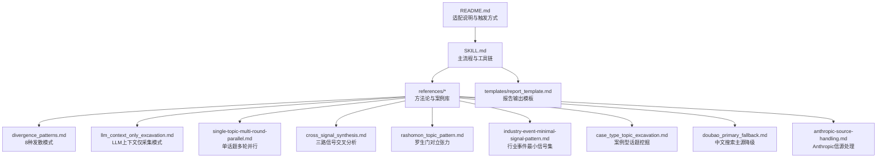
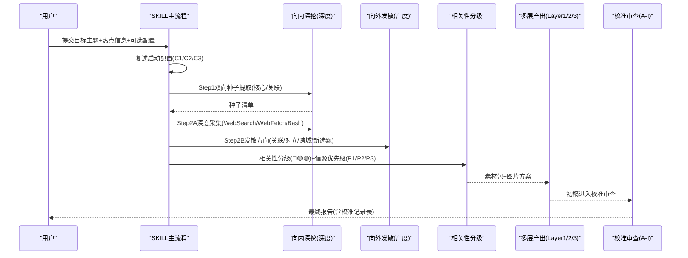
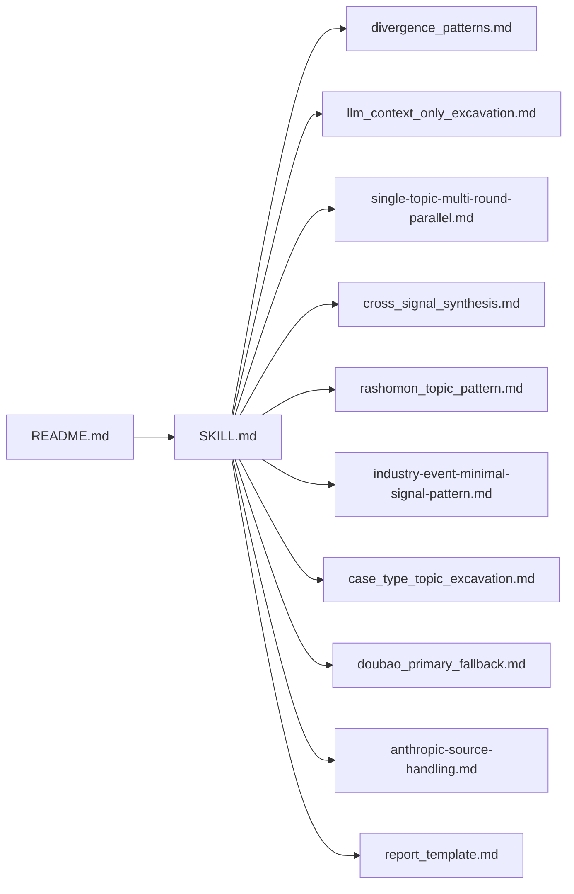

# 采集模式与方法

<cite>
**本文引用的文件**
- [SKILL.md](file://hotspot-topic-excavator/skills/hotspot-topic-excavator/SKILL.md)
- [README.md](file://hotspot-topic-excavator/README.md)
- [divergence_patterns.md](file://hotspot-topic-excavator/skills/hotspot-topic-excavator/references/divergence_patterns.md)
- [llm_context_only_excavation.md](file://hotspot-topic-excavator/skills/hotspot-topic-excavator/references/llm_context_only_excavation.md)
- [single-topic-multi-round-parallel.md](file://hotspot-topic-excavator/skills/hotspot-topic-excavator/references/single-topic-multi-round-parallel.md)
- [cross_signal_synthesis.md](file://hotspot-topic-excavator/skills/hotspot-topic-excavator/references/cross_signal_synthesis.md)
- [rashomon_topic_pattern.md](file://hotspot-topic-excavator/skills/hotspot-topic-excavator/references/rashomon_topic_pattern.md)
- [industry-event-minimal-signal-pattern.md](file://hotspot-topic-excavator/skills/hotspot-topic-excavator/references/industry-event-minimal-signal-pattern.md)
- [case_type_topic_excavation.md](file://hotspot-topic-excavator/skills/hotspot-topic-excavator/references/case_type_topic_excavation.md)
- [doubao_primary_fallback.md](file://hotspot-topic-excavator/skills/hotspot-topic-excavator/references/doubao_primary_fallback.md)
- [anthropic-source-handling.md](file://hotspot-topic-excavator/skills/hotspot-topic-excavator/references/anthropic-source-handling.md)
- [report_template.md](file://hotspot-topic-excavator/skills/hotspot-topic-excavator/templates/report_template.md)
</cite>

## 目录
1. [引言](#引言)
2. [项目结构](#项目结构)
3. [核心组件](#核心组件)
4. [架构总览](#架构总览)
5. [详细组件分析](#详细组件分析)
6. [依赖关系分析](#依赖关系分析)
7. [性能考量](#性能考量)
8. [故障排除指南](#故障排除指南)
9. [结论](#结论)
10. [附录](#附录)

## 引言
本文件系统化梳理热点主题素材深挖采集器的“双轴采集模型”与“发散模式”，并给出 LLM 上下文仅采集模式的特殊用法、单话题多轮并行采集的优化策略。文档覆盖每种模式的适用场景、配置参数、性能特点与最佳实践，并提供可追溯的代码级参考路径与可视化图示，帮助读者快速上手与排错。

## 项目结构
该技能以 SKILL.md 为入口，配合多个 references 提供方法论与实战案例，templates 提供报告模板，README 说明适配与使用方法。

图表来源
- [SKILL.md:1-120](file://hotspot-topic-excavator/skills/hotspot-topic-excavator/SKILL.md#L1-L120)
- [README.md:1-80](file://hotspot-topic-excavator/README.md#L1-L80)

章节来源
- [SKILL.md:1-120](file://hotspot-topic-excavator/skills/hotspot-topic-excavator/SKILL.md#L1-L120)
- [README.md:1-80](file://hotspot-topic-excavator/README.md#L1-L80)

## 核心组件
- 双轴采集模型：向内深挖（Depth）+ 向外发散（Breadth），以每日热点为锚点，产出三层弹药库（Layer 1/2/3）。
- 内容素材六类 + 图片素材三类，按相关性红黄绿分层。
- 校准审查九类（A-I），保障事实、框架、叙事与受众对齐。
- 工具链映射：WebSearch/WebFetch/Bash 三件套，支持多级降级与并行化。

章节来源
- [SKILL.md:15-120](file://hotspot-topic-excavator/skills/hotspot-topic-excavator/SKILL.md#L15-L120)
- [SKILL.md:177-204](file://hotspot-topic-excavator/skills/hotspot-topic-excavator/SKILL.md#L177-L204)
- [SKILL.md:207-236](file://hotspot-topic-excavator/skills/hotspot-topic-excavator/SKILL.md#L207-L236)
- [SKILL.md:251-317](file://hotspot-topic-excavator/skills/hotspot-topic-excavator/SKILL.md#L251-L317)

## 架构总览
下图展示从输入到产出的端到端流程，包括种子提取、双轴执行、分级与组装、以及校准审查闭环。

图表来源
- [SKILL.md:72-120](file://hotspot-topic-excavator/skills/hotspot-topic-excavator/SKILL.md#L72-L120)
- [SKILL.md:177-204](file://hotspot-topic-excavator/skills/hotspot-topic-excavator/SKILL.md#L177-L204)
- [SKILL.md:230-236](file://hotspot-topic-excavator/skills/hotspot-topic-excavator/SKILL.md#L230-L236)
- [SKILL.md:251-317](file://hotspot-topic-excavator/skills/hotspot-topic-excavator/SKILL.md#L251-L317)

## 详细组件分析

### 双轴采集模型（理论与实现）
- 理论要点
  - 锚点是跳板而非边界；一次只深挖一个锚点，但围绕它既深挖又发散。
  - 种子提取分两类：核心种子（直接相关）与关联种子（可碰撞/对照）。
  - 深度轴强调 P1 原文优先、多源交叉、播客 transcript 双路径与多级降级。
  - 广度轴受 C3 约束（发散选题 ≤ 5 个，每个须溯源回锚点）。
- 实现要点
  - 工具并行：WebSearch 与 WebFetch 互为备份，多组搜索同时发起。
  - 降级路径：单点故障→补充搜索→直连抓取→标注缺失项→中文搜索主源模式。
  - 信源优先级：P1 一手来源 > P2 权威媒体 > P3 社区讨论。
  - 相关性分级：核心层/强关联层/可延展层，分别用于深度分析、论证支撑与再创作选题。

章节来源
- [SKILL.md:72-120](file://hotspot-topic-excavator/skills/hotspot-topic-excavator/SKILL.md#L72-L120)
- [SKILL.md:177-204](file://hotspot-topic-excavator/skills/hotspot-topic-excavator/SKILL.md#L177-L204)
- [SKILL.md:230-236](file://hotspot-topic-excavator/skills/hotspot-topic-excavator/SKILL.md#L230-L236)

### 8种发散模式（应用场景与操作步骤）
以下模式均来源于 references/divergence_patterns.md，涵盖触发条件、搜索策略、信源组合与产出样例。

- 模式1：GPS类比链（跨领域类比迁移）
  - 触发：认知功能外包/技能退化/工具依赖等概念，需要非技术类比证据。
  - 步骤：三阶段阶梯搜索（建立类比基础→连接到AI→深化类比链）。
  - 产出：案例故事+对立张力素材，适用于长视频论证支柱或对比图。
- 模式2：LLM Context作为P1原文提取首选（信息完整度优化）
  - 触发：Substack/Medium/博客为主，WebFetch不可用或未安装，需85%+完整度。
  - 步骤：并行启动 WebSearch + WebFetch；调优 count/maximum_number_of_urls。
  - 产出：高完整度段落/金句/数据，适合深度分析。
- 模式3：反方观点的系统性纳入（对立张力增强）
  - 触发：有明确学术/行业反方的话题。
  - 步骤：识别反方人物→获取反方原文→构建正方-反方-综合三层结构。
- 模式4：多平台内容大纲差异化设计
  - 触发：同一素材需适配抖音/小红书/B站/公众号等不同形式。
  - 步骤：按平台特性调整钩子、论据链、金句密度与结构。
- 模式5：V1+V2对比报告的自动生成
  - 触发：已有V1材料库，本次完成V2深挖。
  - 步骤：多维度对比（信源数量/联网信源/完整度/图片/反方/选题卡）。
- 模式6：多信号并行搜索（颗粒化多信源高效采集）★
  - 触发：信号高度分散、时效紧迫、深挖与发散边界模糊。
  - 步骤：单轮并行启动多路搜索→一次性合成→第二轮补采缺口。
  - 参数：按核心/发散/政策/历史先例设置count/freshness。
- 模式7：全WebSearch降级模式（Brave+WebFetch同时不可用）★
  - 触发：WebSearch订阅无效且WebFetch被IP信誉阻止。
  - 步骤：两轮覆盖（核心信号深度覆盖→缺口补采+发散轴）。
  - 可达完整度：综合约85-93%，付费墙/论文全文受限。
- 模式8：罗生门叙事结构（矛盾叙事并置）★
  - 触发：≥3个互不兼容叙事并存，不同信源类型对同一现象给出矛盾结论。
  - 步骤：识别三路矛盾信号→验证每条局部真值→并置揭示完整真相。
  - 产出：三段牌式结构+张力解读，适合复杂议题。

章节来源
- [divergence_patterns.md:8-57](file://hotspot-topic-excavator/skills/hotspot-topic-excavator/references/divergence_patterns.md#L8-L57)
- [divergence_patterns.md:60-86](file://hotspot-topic-excavator/skills/hotspot-topic-excavator/references/divergence_patterns.md#L60-L86)
- [divergence_patterns.md:89-109](file://hotspot-topic-excavator/skills/hotspot-topic-excavator/references/divergence_patterns.md#L89-L109)
- [divergence_patterns.md:111-120](file://hotspot-topic-excavator/skills/hotspot-topic-excavator/references/divergence_patterns.md#L111-L120)
- [divergence_patterns.md:122-140](file://hotspot-topic-excavator/skills/hotspot-topic-excavator/references/divergence_patterns.md#L122-L140)
- [divergence_patterns.md:142-181](file://hotspot-topic-excavator/skills/hotspot-topic-excavator/references/divergence_patterns.md#L142-L181)
- [divergence_patterns.md:183-234](file://hotspot-topic-excavator/skills/hotspot-topic-excavator/references/divergence_patterns.md#L183-L234)
- [divergence_patterns.md:238-323](file://hotspot-topic-excavator/skills/hotspot-topic-excavator/references/divergence_patterns.md#L238-L323)

### LLM上下文仅采集模式（特殊用法）
- 适用条件
  - 种子信号≥3个，信源类型以博客/官方新闻稿/科技媒体报道/Substack/社区讨论为主。
  - 需要多源交叉验证的时间敏感话题。
- 执行顺序
  - 优先策略：WebSearch全信号并行→覆盖85-95%。
  - 补充策略：仍有缺口→WebFetch补采特定URL；付费墙深度→WebSearch advanced；学术论文→WebSearch+Bash直curl PDF。
- 新产品发布专项采集栈
  - 四调用并行范式：产品名+类别+功能；用户场景+具体测试；竞品并列；关键人物+动作+时效。
  - 关键query原则：产品名加引号、加入维度词、关键人物名+动作、竞品并列、机构+角色。
- 效果与局限
  - 典型完整度：93%（多信号、跨四类信源）。
  - 仍需WebFetch的场景：论文全文PDF/附录、图片/图表原始数据、精确引用定位。

章节来源
- [llm_context_only_excavation.md:1-82](file://hotspot-topic-excavator/skills/hotspot-topic-excavator/references/llm_context_only_excavation.md#L1-L82)
- [llm_context_only_excavation.md:85-139](file://hotspot-topic-excavator/skills/hotspot-topic-excavator/references/llm_context_only_excavation.md#L85-L139)

### 单话题多轮并行采集（优化策略）
- 适用场景
  - 单一叙事链条话题（如“从发布到封禁到即将恢复”的完整故事），非多信号交叉分析。
- 执行模式
  - 第一轮：覆盖广度+深度（4路并行：核心叙事/时效信号/辅助角度/争议与恢复）。
  - 第二轮：补漏+最新预测（拉取最新时效数据与预测市场）。
- 关键参数
  - R1：2×LLM Context + 2×News Search，freshness=pm，count=10-15，max_tokens=16384。
  - R2：1×LLM Context + 2×News Search + 1×LLM Context，freshness=pd，count=10-15，max_tokens=8192。
- 产出结构
  - 叙事链条 × 信号清单 × 恢复预测，目录包含 raw-sources-manifest.md 与 latest-restoration-signals.md。

章节来源
- [single-topic-multi-round-parallel.md:1-44](file://hotspot-topic-excavator/skills/hotspot-topic-excavator/references/single-topic-multi-round-parallel.md#L1-L44)

### 三路信号交叉分析与罗生门模式
- 三路信号交叉分析
  - 时间线收敛图：±7天内集中出现构成元信号。
  - 三层递归识别：事实层→叙事层→意义层。
  - 拐点判断：已到/正在加速/数据不足，禁止模糊整体判断。
  - 三源独立性验证：厂商+学术+实践者独立汇聚可信度高。
- 罗生门型话题
  - 双方都有真实证据与案例，无明确正确答案。
  - 对立张力表至少6-8个维度，每条都有对等证据。
  - SOUL框架连接：控制性理念/有限性智慧/通过仪式。
  - 报告结构调整：执行摘要用“双方同时为真”，RIVET的R/T相应调整。

章节来源
- [cross_signal_synthesis.md:1-136](file://hotspot-topic-excavator/skills/hotspot-topic-excavator/references/cross_signal_synthesis.md#L1-L136)
- [rashomon_topic_pattern.md:1-114](file://hotspot-topic-excavator/skills/hotspot-topic-excavator/references/rashomon_topic_pattern.md#L1-L114)

### 行业事件最小信号集与案例型话题
- 行业事件最小信号集
  - 适用：行业大会/年度热词/现场深度报道齐全。
  - 3路信号：意义层（现场深度）、叙事层（热词/趋势）、事实层（宏观数据矩阵）。
  - 总调用预算：7-9次，节省25-33%调用。
- 案例型话题挖掘
  - 自动推荐算法偏向事件型，压制案例型；建议显式加入“内容生产价值”评分。
  - 必挖维度：完整时间线、收入/数据拆解、长深度对话、金句提取、对立视角、同类对比、隐性成本。
  - 迭代式深化：v1→v2标准补充清单（长对话、最新数据、对立视角、AI时代视角）。

章节来源
- [industry-event-minimal-signal-pattern.md:1-46](file://hotspot-topic-excavator/skills/hotspot-topic-excavator/references/industry-event-minimal-signal-pattern.md#L1-L46)
- [case_type_topic_excavation.md:1-181](file://hotspot-topic-excavator/skills/hotspot-topic-excavator/references/case_type_topic_excavation.md#L1-L181)

### 信源处理与降级路径
- Anthropic Research信源处理
  - JS增量加载列表页→WebSearch发现URL→WebFetch获取摘要→合并去重。
  - 单篇博客SSR页面→WebFetch可能不完整→Bash curl直抓HTML正则提取正文。
- 中文搜索主源模式（WebSearch不可用时的全信号采集）
  - 触发：WebSearch连续失败≥5次且WebFetch不可用。
  - 模式A（B2B）：8组标准化关键词（政策驱动/大厂路径/制造业实证/咨询业/路径对比/市场份额/基础设施/竞争估值）。
  - 模式B（非B2B）：自设计6-8组关键词（锚点核心/关联信号/对立争议/中国视角/发散类比）。
  - 验证规则：前3组完成后必须验证命中数与交叉验证情况。

章节来源
- [anthropic-source-handling.md:1-96](file://hotspot-topic-excavator/skills/hotspot-topic-excavator/references/anthropic-source-handling.md#L1-L96)
- [doubao_primary_fallback.md:1-119](file://hotspot-topic-excavator/skills/hotspot-topic-excavator/references/doubao_primary_fallback.md#L1-L119)

## 依赖关系分析
- 模块耦合
  - SKILL.md为核心编排器，依赖references中的各模式文件与templates的报告模板。
  - README.md提供适配说明与触发方式，便于外部集成。
- 外部依赖
  - 工具链：WebSearch/WebFetch/Bash（Python requests、BeautifulSoup、youtube_transcript_api等）。
  - 环境要求：Python 3.10+（urllib3 2.7.0需要PEP 604语法）。
- 潜在循环依赖
  - 当前结构为单向依赖（SKILL→references→templates），未见循环导入。

图表来源
- [SKILL.md:1-120](file://hotspot-topic-excavator/skills/hotspot-topic-excavator/SKILL.md#L1-L120)
- [README.md:1-80](file://hotspot-topic-excavator/README.md#L1-L80)

章节来源
- [SKILL.md:1-120](file://hotspot-topic-excavator/skills/hotspot-topic-excavator/SKILL.md#L1-L120)
- [README.md:1-80](file://hotspot-topic-excavator/README.md#L1-L80)

## 性能考量
- 并行化收益
  - 多组 WebSearch 与 WebFetch 并行调用，显著提升采集效率。
  - 多信号并行搜索在时效紧迫时尤为有效。
- 降级路径的性能权衡
  - 全WebSearch降级模式可达85-93%完整度，但付费墙与论文全文受限。
  - 中文搜索主源模式在英文源转述覆盖良好，但英文社区讨论几乎不覆盖。
- 参数调优
  - 根据信号类型设置count/freshness，核心信号深度搜pw，发散历史先例不限时效。
  - LLM Context参数：count=15，maximum_number_of_urls=5，聚焦核心信源。

[本节为通用指导，无需列出章节来源]

## 故障排除指南
- Python环境路径解析问题
  - 症状：urllib3报错TypeError，系统python3版本过低。
  - 诊断：which python3 + python3 --version，确认3.10+。
  - 修复：使用venv绝对路径或python3.x显式调用脚本。
- Cloudflare WAF绕过
  - 现象：WebFetch返回占位页。
  - 方法：Bash + Python requests + 浏览器UA + 正则提取entry-content块。
- Anthropic SSR页面抓取异常
  - 现象：WebFetch内容不完整。
  - 方法：Bash curl直抓HTML，正则提取
正文。
- 中文搜索主源模式验证
  - 前3组完成后检查锚点核心命中数、数字交叉验证、中国视角独立信源、对立争议信源。
  - 未达标则调整关键词重试或追加一组中文关键词。

章节来源
- [SKILL.md:149-168](file://hotspot-topic-excavator/skills/hotspot-topic-excavator/SKILL.md#L149-L168)
- [SKILL.md:125-128](file://hotspot-topic-excavator/skills/hotspot-topic-excavator/SKILL.md#L125-L128)
- [anthropic-source-handling.md:47-96](file://hotspot-topic-excavator/skills/hotspot-topic-excavator/references/anthropic-source-handling.md#L47-L96)
- [doubao_primary_fallback.md:75-87](file://hotspot-topic-excavator/skills/hotspot-topic-excavator/references/doubao_primary_fallback.md#L75-L87)

## 结论
本体系以双轴模型为核心，结合8种发散模式与多种采集策略，形成从输入到产出的完整闭环。通过并行化与多级降级，兼顾效率与鲁棒性；通过九类校准审查，确保事实准确、框架透明与受众对齐。实际应用中，应根据话题类型选择合适模式，并在必要时启用LLM上下文仅采集与单话题多轮并行优化策略。

[本节为总结，无需列出章节来源]

## 附录

### 报告模板与产出结构
- Layer 1：素材包（6类内容+3类图片）
- Layer 2：文章/视频大纲+素材填充（RIVET结构）
- Layer 3：再创作选题建议（≤5个完整选题卡）
- 校准审查记录表嵌入报告末尾

章节来源
- [report_template.md:1-132](file://hotspot-topic-excavator/skills/hotspot-topic-excavator/templates/report_template.md#L1-L132)
- [SKILL.md:230-236](file://hotspot-topic-excavator/skills/hotspot-topic-excavator/SKILL.md#L230-L236)