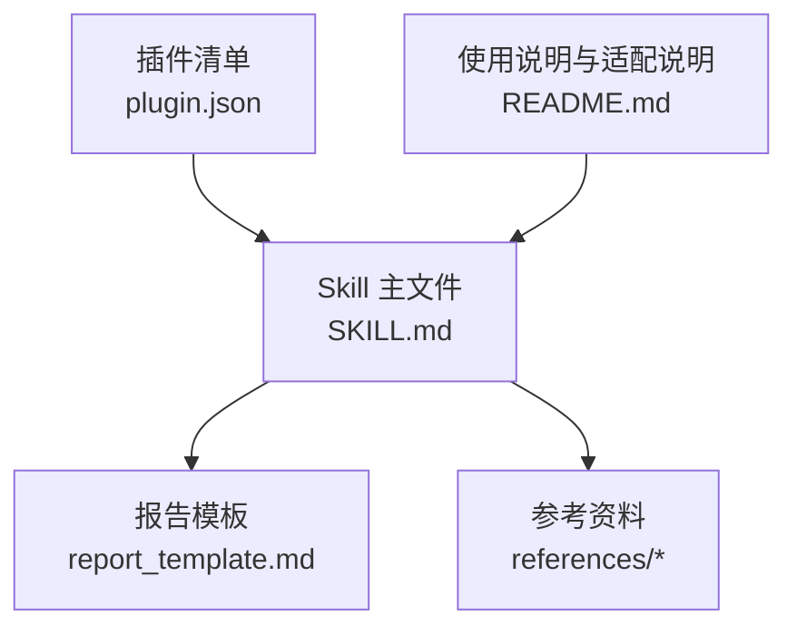
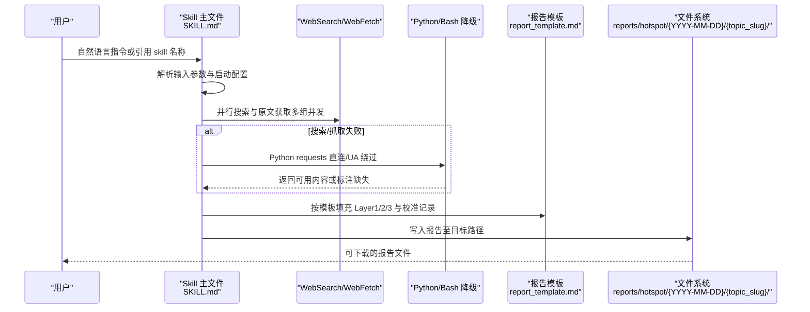
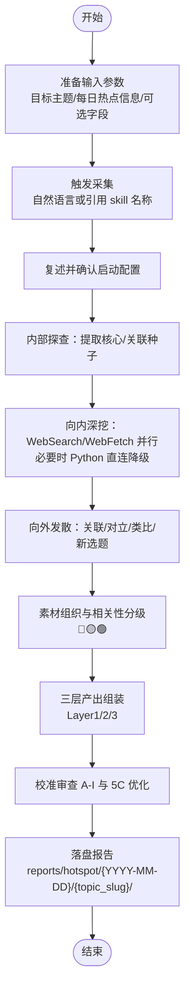
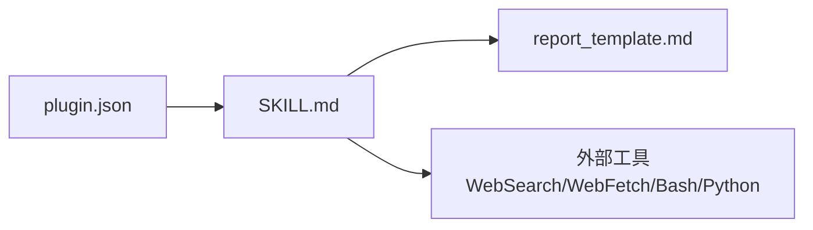

# 快速开始

<cite>
**本文引用的文件**   
- [README.md](file://hotspot-topic-excavator/README.md)
- [plugin.json](file://hotspot-topic-excavator/.qoder-plugin/plugin.json)
- [SKILL.md](file://hotspot-topic-excavator/skills/hotspot-topic-excavator/SKILL.md)
- [report_template.md](file://hotspot-topic-excavator/skills/hotspot-topic-excavator/templates/report_template.md)
</cite>

## 目录
1. [简介](#简介)
2. [项目结构](#项目结构)
3. [核心组件](#核心组件)
4. [架构总览](#架构总览)
5. [详细组件分析](#详细组件分析)
6. [依赖分析](#依赖分析)
7. [性能考虑](#性能考虑)
8. [故障排除指南](#故障排除指南)
9. [结论](#结论)
10. [附录](#附录)

## 简介
本指南面向新用户，帮助你在最短时间内上手“热点主题素材深挖采集器”的核心能力：以每日热点为锚点，采用“向内深挖 + 向外发散”双轴模型，产出内容素材包、文章/视频大纲与再创作选题建议，并附带多层校准审查。你将了解环境搭建、安装配置、触发方式、输入参数规范、输出路径与格式，以及一个从输入到报告的完整示例工作流。

## 项目结构
该插件以 Qoder 原生插件形式提供，包含主 Skill 定义、报告模板与参考文档。关键目录与职责如下：
- .qoder-plugin/plugin.json：插件元数据（名称、版本、描述、技能入口等）
- skills/hotspot-topic-excavator/SKILL.md：Skill 主文件，定义角色、流程、工具链、产出结构与执行原则
- skills/hotspot-topic-excavator/templates/report_template.md：报告输出模板
- README.md：功能概述、适配说明、使用方法与环境要求

图表来源
- [plugin.json:1-18](file://hotspot-topic-excavator/.qoder-plugin/plugin.json#L1-L18)
- [SKILL.md:1-40](file://hotspot-topic-excavator/skills/hotspot-topic-excavator/SKILL.md#L1-L40)
- [report_template.md:1-20](file://hotspot-topic-excavator/skills/hotspot-topic-excavator/templates/report_template.md#L1-L20)
- [README.md:1-40](file://hotspot-topic-excavator/README.md#L1-L40)

章节来源
- [README.md:1-40](file://hotspot-topic-excavator/README.md#L1-L40)
- [plugin.json:1-18](file://hotspot-topic-excavator/.qoder-plugin/plugin.json#L1-L18)

## 核心组件
- 插件清单（plugin.json）
  - 定义插件名称、显示名、版本、描述、作者、主页、仓库、Logo、关键词、分类、标签与技能入口路径。
- Skill 主文件（SKILL.md）
  - 定义角色与使命、输入规范、双轴采集流程、素材类型与图片方案、多层产出组装、平台适配、校准审查、连续性生产、触发规则与执行原则等。
- 报告模板（report_template.md）
  - 规定报告头部信息、真伪验证表、Layer 1/2/3 结构、校准审查记录表与参考资料清单的固定字段与顺序。
- 使用说明（README.md）
  - 提供功能概述、Hermes→Qoder 工具链映射、路径适配、使用方法（触发方式、输入字段、产出路径）、Setup 说明与保留核心功能清单。

章节来源
- [plugin.json:1-18](file://hotspot-topic-excavator/.qoder-plugin/plugin.json#L1-L18)
- [SKILL.md:1-120](file://hotspot-topic-excavator/skills/hotspot-topic-excavator/SKILL.md#L1-L120)
- [report_template.md:1-132](file://hotspot-topic-excavator/skills/hotspot-topic-excavator/templates/report_template.md#L1-L132)
- [README.md:1-130](file://hotspot-topic-excavator/README.md#L1-L130)

## 架构总览
整体工作流围绕“输入 → 双轴采集 → 素材组织 → 三层产出 → 校准审查 → 落盘报告”展开。

图表来源
- [SKILL.md:72-147](file://hotspot-topic-excavator/skills/hotspot-topic-excavator/SKILL.md#L72-L147)
- [report_template.md:1-132](file://hotspot-topic-excavator/skills/hotspot-topic-excavator/templates/report_template.md#L1-L132)
- [README.md:102-110](file://hotspot-topic-excavator/README.md#L102-L110)

## 详细组件分析

### 环境与安装
- 系统要求
  - 如需使用 Bash 降级路径（Python requests + BeautifulSoup），请确保系统安装 Python 3.10+ 及 requests、beautifulsoup4 包。
  - 如需使用 YouTube Transcript API，安装 youtube_transcript_api Python 包。
  - 无需额外的 API key 或 MCP 配置。
- 插件清单
  - 通过 plugin.json 注册插件元信息与技能入口，便于在 Qoder 中识别与调用。

章节来源
- [README.md:106-111](file://hotspot-topic-excavator/README.md#L106-L111)
- [plugin.json:1-18](file://hotspot-topic-excavator/.qoder-plugin/plugin.json#L1-L18)

### 触发方式
- 自然语言指令
  - “用素材深挖采集器分析XXX”
  - “帮我对XXX话题做深度素材挖掘”
  - “深挖 [话题名]”
- 引用 Skill 名称
  - 直接引用：“hotspot-topic-excavator”

章节来源
- [README.md:84-90](file://hotspot-topic-excavator/README.md#L84-L90)
- [SKILL.md:347-354](file://hotspot-topic-excavator/skills/hotspot-topic-excavator/SKILL.md#L347-L354)

### 输入参数规范
必填项
- 目标主题：本次深挖的唯一锚点主题
- 每日热点信息：文件路径或直接粘贴内容

选填项
- 来源线索：原始出处
- 选题角度：已确定的切入点
- 目标平台：抖音/B站/公众号/小红书（可多选，默认全平台）
- 内容形式：短视频口播/深度长视频/图文长文/笔记

章节来源
- [README.md:91-101](file://hotspot-topic-excavator/README.md#L91-L101)
- [SKILL.md:27-39](file://hotspot-topic-excavator/skills/hotspot-topic-excavator/SKILL.md#L27-L39)

### 启动配置（可选）
- 深挖/发散配比：默认 70%/30%，可调
- 再创作选题建议粒度：默认完整选题卡，可附加额外视角/观点
- 发散边界：默认 ≤ 5 个且须溯源，可调整上限

章节来源
- [SKILL.md:59-69](file://hotspot-topic-excavator/skills/hotspot-topic-excavator/SKILL.md#L59-L69)

### 采集与处理逻辑
- 内部探查：从每日热点中提取“核心种子”和“关联种子”，作为联网检索锚点。
- 向内深挖（Depth Axis）
  - 主力工具：WebSearch、WebFetch；中文关键词搜索用于本土信源补强。
  - 降级策略：单点故障时启用另一者补充；仍不足则使用 Bash + Python requests 直连抓取；必要时仅对 P0 热点进行 UA 绕过抓取，其余标注 [BLOCKED]。
  - 特殊场景：Cloudflare WAF 站点可通过 Python 直连绕过；国际治理/文化趋势类话题需并行中文关键词搜索。
- 向外发散（Breadth Axis）
  - 方向包括：关联话题/邻近事件、上下游概念/对立面、跨领域类比迁移、同主题不同切入角度、衍生新选题机会。
  - 约束：发散选题 ≤ 5 个，每个必须能溯源回锚点。
- 相关性分级
  - 🔴 核心层：直接关于原话题
  - 🟡 强关联层：紧密相关的延伸
  - 🟢 可延展层：能激发新选题的发散素材
- 信源优先级
  - P1 一手来源 > P2 权威媒体 > P3 社区讨论；每条素材必须可溯源。

章节来源
- [SKILL.md:72-204](file://hotspot-topic-excavator/skills/hotspot-topic-excavator/SKILL.md#L72-L204)

### 素材与图片方案
- 内容素材（6 类）
  - 热点资讯流、硬核事实、权威引述、案例故事、对立张力、可视化依据
- 图片素材方案（3 类）
  - 文章内可用配图、可下载图源、AI 绘图 prompt 概要

章节来源
- [SKILL.md:207-228](file://hotspot-topic-excavator/skills/hotspot-topic-excavator/SKILL.md#L207-L228)

### 三层产出与模板
- Layer 1：素材包（按 6 类 + 3 类分模块）
- Layer 2：文章/视频大纲 + 素材填充（RIVET 结构）
- Layer 3：再创作选题建议（≤ 5 个，完整选题卡）
- 报告模板字段
  - 头部信息（话题、日期、配置、信源完整度）
  - 真伪验证·事实校准（如用户提供预消化版本）
  - Layer 1/2/3 各模块表格与要点
  - 校准审查记录表（A-I）
  - 参考资料清单

章节来源
- [SKILL.md:230-237](file://hotspot-topic-excavator/skills/hotspot-topic-excavator/SKILL.md#L230-L237)
- [report_template.md:1-132](file://hotspot-topic-excavator/skills/hotspot-topic-excavator/templates/report_template.md#L1-L132)

### 平台适配重点
- 抖音：强钩子 + 金句 + 反常识结论（60-120秒口播，前3秒抓人）
- B站：完整论据链 + 数据 + 案例（深度长视频，逻辑闭环）
- 公众号：深度论证 + 案例故事 + 引述（图文长文，可读性强）
- 小红书：用户痛点 + 视觉化清单 + 干货点（笔记体，封面/标题强视觉）

章节来源
- [SKILL.md:240-248](file://hotspot-topic-excavator/skills/hotspot-topic-excavator/SKILL.md#L240-L248)

### 校准审查与优化
- 九类校准（A-I）：事实校准、事实补充、表述校准、框架补充、对立视角、理论偏向、叙事引力、受众工具链翻译、三角叙事补洞
- 审查补充优化（5C）：常见遗漏四类、叙事引力陷阱、受众工具链翻译、三角叙事升级

章节来源
- [SKILL.md:251-316](file://hotspot-topic-excavator/skills/hotspot-topic-excavator/SKILL.md#L251-L316)

### 输出路径与命名
- 报告产出保存到：reports/hotspot/{YYYY-MM-DD}/{topic_slug}/
- 模板路径：plugin 内 templates/report_template.md

章节来源
- [README.md:102-104](file://hotspot-topic-excavator/README.md#L102-L104)
- [SKILL.md:370-371](file://hotspot-topic-excavator/skills/hotspot-topic-excavator/SKILL.md#L370-L371)

### 完整示例工作流（端到端演示）
以下为一个标准工作流步骤，帮助你从输入热点话题到生成完整报告：
1. 准备输入
   - 明确“目标主题”
   - 准备“每日热点信息”（文件或粘贴）
   - 可选：来源线索、选题角度、目标平台、内容形式
2. 触发采集
   - 使用自然语言指令或引用 skill 名称
3. 启动配置确认
   - 复述当前配置（深挖/发散配比、选题卡粒度、发散上限）
4. 双轴采集
   - 内部提取种子 → 并行 WebSearch/WebFetch → 必要时 Python 直连降级
5. 素材组织与分层
   - 按 6 类内容与 3 类图片方案整理，并进行相关性分级（🔴🟡🟢）
6. 三层产出组装
   - Layer 1 素材包 / Layer 2 大纲填充 / Layer 3 选题建议
7. 校准审查
   - 逐项过 A-I 九类校准，并在报告中记录审查结果
8. 落盘报告
   - 将报告写入 reports/hotspot/{YYYY-MM-DD}/{topic_slug}/ 目录

[此图为概念流程图，不直接映射具体源码文件，故无图表来源]

## 依赖分析
- 外部工具与库
  - WebSearch、WebFetch：主要搜索与原文获取工具
  - Bash + Python requests、beautifulsoup4：降级直连抓取
  - youtube_transcript_api：YouTube 字幕获取（可选）
- 插件与 Skill 关系
  - plugin.json 声明插件元信息与技能入口
  - SKILL.md 定义全部采集、组装与审查流程
  - report_template.md 规定最终报告的结构与字段

图表来源
- [plugin.json:1-18](file://hotspot-topic-excavator/.qoder-plugin/plugin.json#L1-L18)
- [SKILL.md:84-147](file://hotspot-topic-excavator/skills/hotspot-topic-excavator/SKILL.md#L84-L147)
- [report_template.md:1-20](file://hotspot-topic-excavator/skills/hotspot-topic-excavator/templates/report_template.md#L1-L20)

章节来源
- [README.md:17-32](file://hotspot-topic-excavator/README.md#L17-L32)
- [SKILL.md:84-147](file://hotspot-topic-excavator/skills/hotspot-topic-excavator/SKILL.md#L84-L147)

## 性能考虑
- 并行化优先
  - 多组 WebSearch 与 WebFetch 尽可能并行调用，提升采集效率。
- 降级策略
  - 单点故障立即切换备用路径，避免阻塞整体流程。
- 信源质量
  - 坚持 P1/P2/P3 优先级，减少无效抓取与重复劳动。
- 中文补强
  - 国际治理与文化趋势类话题并行中文关键词搜索，提高覆盖度与共鸣性。

章节来源
- [SKILL.md:96-147](file://hotspot-topic-excavator/skills/hotspot-topic-excavator/SKILL.md#L96-L147)

## 故障排除指南
- 搜索/抓取失败
  - 现象：WebSearch 或 WebFetch 长时间不可用或部分站点返回占位页
  - 处理：切换到 Bash + Python requests 直连抓取；必要时使用浏览器 UA 绕过；无法恢复时仅对 P0 热点进行抓取，其余标注 [BLOCKED]
- Cloudflare WAF 拦截
  - 现象：部分中型新闻网返回“Please wait...”占位页
  - 处理：使用 Python 直连 + 正则提取正文块，同一 URL 可绕过 WAF
- Python 环境路径问题
  - 现象：urllib3 报错或 TypeError（PEP 604 语法需要 Python 3.10+）
  - 处理：显式使用 venv 绝对路径或 python3.x 调用脚本，避免系统默认 Python 3.9.x 干扰
- 播客 transcript 获取失败
  - 现象：YouTube Transcript API 失败或未添加章节
  - 处理：并行走 Apple Podcasts show notes 路径，任一成功即可进入素材组织

章节来源
- [SKILL.md:114-175](file://hotspot-topic-excavator/skills/hotspot-topic-excavator/SKILL.md#L114-L175)

## 结论
通过本快速开始指南，你已掌握：
- 如何安装与配置环境
- 如何触发采集与填写输入参数
- 双轴采集与降级策略的执行逻辑
- 三层产出结构与报告模板字段
- 完整的端到端工作流与常见问题排查方法
建议在首次使用时严格遵循“启动配置先行”和“真实可溯源优先”的原则，以获得高质量、可直接使用的素材与选题。

## 附录
- 相关参考
  - 报告模板字段与结构详见 report_template.md
  - 工具链映射与适配说明详见 README.md
  - 插件元信息与技能入口详见 plugin.json

章节来源
- [report_template.md:1-132](file://hotspot-topic-excavator/skills/hotspot-topic-excavator/templates/report_template.md#L1-L132)
- [README.md:17-42](file://hotspot-topic-excavator/README.md#L17-L42)
- [plugin.json:1-18](file://hotspot-topic-excavator/.qoder-plugin/plugin.json#L1-L18)