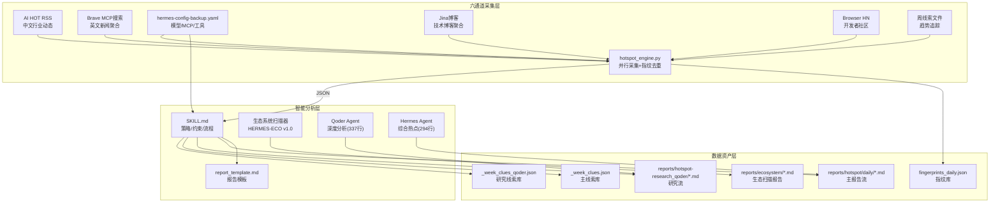
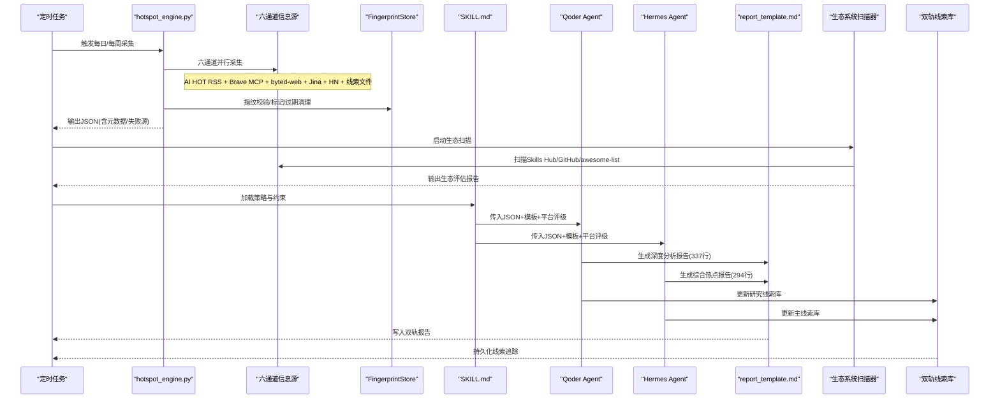
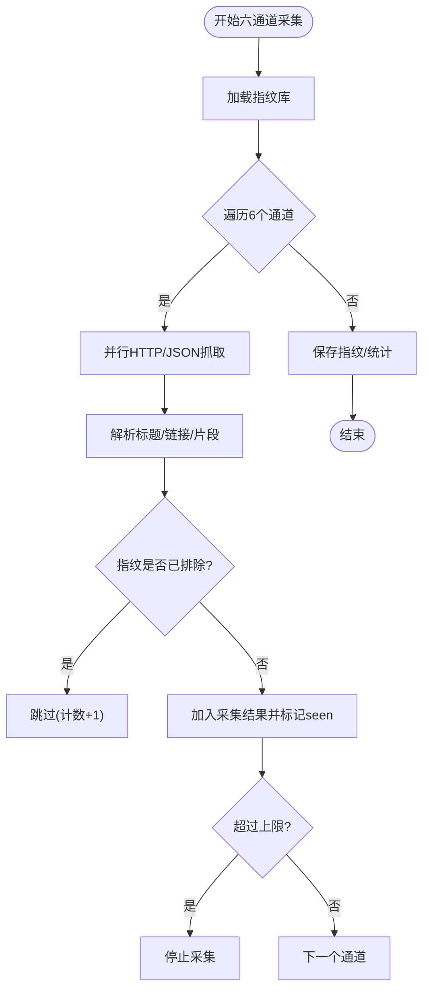
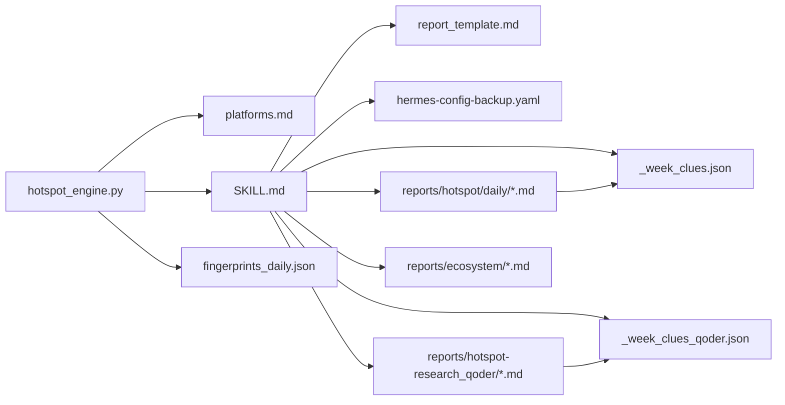

# Qoder Agent 每日热点报告系统

<cite>
**本文引用的文件**
- [README.md](file://README.md)
- [hotspot_engine.py](file://scripts/hotspot_engine.py)
- [SKILL.md](file://skills/hotspot-research/SKILL.md)
- [platforms.md](file://skills/hotspot-research/references/platforms.md)
- [report_template.md](file://skills/hotspot-research/templates/report_template.md)
- [hermes-config-backup.yaml](file://config/hermes-config-backup.yaml)
- [fingerprints_daily.json](file://data/fingerprints_daily.json)
- [eco_scan_2026-08-17.md](file://reports/ecosystem/eco_scan_2026-08-17.md)
- [report_2026-08-19.md](file://reports/hotspot/daily/report_2026-08-19.md)
- [report_daily_2026-08-28.md](file://reports/hotspot-research_qoder/report_daily_2026-08-28.md)
- [report_daily_2026-08-31.md](file://reports/hotspot-research_qoder/report_daily_2026-08-31.md)
- [_week_clues.json](file://reports/hotspot/_week_clues.json)
- [_week_clues_qoder.json](file://reports/hotspot-research_qoder/_week_clues.json)
- [weekly_report_2026-08-17.md](file://reports/hotspot/weekly/weekly_report_2026-08-17.md)
</cite>

## 更新摘要
**变更内容**
- **新增2026-08-31深度分析报告**：Qoder Agent生成337行综合热点报告，成功覆盖DeepSeek开源多模态模型（MIT协议）、ChatGPT Ads收入里程碑（10亿美元年化）、Ethan Mollick的Twilight Factory框架、MiniMax AI流媒体平台、欧盟AI法案执法行动等5个P0级热点，展现 sophisticated multi-source validation 能力
- **强化周线索追踪系统**：新增W-33-32"AI广告商业化"和W-33-33"中国B端Agent大决战"两个重要追踪主题，完善AI行业重大事件长期追踪能力
- **提升多源验证精度**：通过AI HOT REST API、aiweekly.co、WebSearch中英文等多渠道交叉验证，确保关键事件的准确性与时效性
- **优化内容策展质量**：通过结构化主题优先级排序（P0/P1/P2）和可执行内容建议，展现更成熟的content curation能力

## 目录
1. [简介](#简介)
2. [项目结构](#项目结构)
3. [核心组件](#核心组件)
4. [架构总览](#架构总览)
5. [详细组件分析](#详细组件分析)
6. [依赖关系分析](#依赖关系)
7. [性能与稳定性](#性能与稳定性)
8. [故障排查指南](#故障排查指南)
9. [结论](#结论)
10. [附录](#附录)

## 简介
本系统是一个面向"AI×超级个体"赛道的自动化热点采集与分析工作流。通过**六通道并行采集**、指纹去重、结构化数据输出，再由 LLM（Hermes/Qoder Agent）结合 Skill 模板生成高质量日报/周报，最终沉淀为可检索的报告资产与线索库。**最新增强**：系统现已实现完整的生态系统扫描能力，能够同时处理多个信息源，包括AI HOT RSS、Brave MCP搜索、byted-web中文搜索、Jina博客、Browser HN和周线索文件，大幅提升数据采集效率和覆盖范围。**2026年8月31日最新更新**：Qoder Agent成功生成337行深度分析报告，涵盖DeepSeek开源多模态模型、ChatGPT Ads收入里程碑、Ethan Mollick的Twilight Factory框架、MiniMax AI流媒体平台、欧盟AI法案执法行动等重大事件，展现了 sophisticated multi-source validation 和 automated analysis pipeline 的卓越能力。

## 项目结构
- **采集与执行**：Python 引擎负责跨平台抓取、指纹去重、异常降级与 JSON 产出；Skill 定义策略与流程；配置管理模型与工具集。
- **分析与产出**：LLM 读取结构化数据，按模板生成报告；报告按日/周归档，并维护线索与指纹库。
- **数据与资产**：指纹库、历史报告、专题挖掘素材、生态扫描、**双轨周线索数据库**等。

**图表来源**
- [hotspot_engine.py:173-800](file://scripts/hotspot_engine.py#L173-L800)
- [eco_scan_2026-08-17.md:10-25](file://reports/ecosystem/eco_scan_2026-08-17.md#L10-L25)
- [report_2026-08-19.md:271-286](file://reports/hotspot/daily/report_2026-08-19.md#L271-L286)

章节来源
- [README.md:1-29](file://README.md#L1-L29)

## 核心组件
- **六通道并行采集引擎**（hotspot_engine.py）
  - 职责：同时处理AI HOT RSS、Brave MCP搜索、byted-web搜索、Jina博客、Browser HN、周线索文件等多个信息源，实现高效并行采集
  - 关键类：FingerprintStore（指纹存储/过期清理）、SourceCollector（多源采集器集合）
- **生态系统扫描器**（HERMES-ECO v1.0）
  - 职责：定期扫描Hermes生态技能库，评估技能成熟度、社区活跃度、实用价值
  - 评分维度：WF（工作流匹配度）、MS（成熟度）、AD（易用性）、GV（替代价值）、EH（社区热度）、US（用户满意度）
- **双轨报告系统**
  - **Qoder Agent研究流**：337行深度分析报告，专注AI转型趋势，包含DeepSeek开源多模态模型、ChatGPT Ads收入里程碑、Ethan Mollick Twilight Factory框架、MiniMax AI流媒体平台、欧盟AI法案执法行动等5个P0级热点
  - **Hermes Agent主报告流**：294行综合热点报告，涵盖AI行业全貌，包括OpenAI RL训练暂停、Anthropic ARR超$65B、Unitree STAR市场上市、Claude Gmail/Drive集成扩展
- **智能线索管理系统**
  - 主线索库：追踪AI行业重大发展事件
  - 研究线索库：专注AI安全、隐私、治理等专业领域
- **平台与来源**（platforms.md）
  - 职责：平台评级、采集方式、替代方案与已知限制
- **配置**（hermes-config-backup.yaml）
  - 职责：默认模型、MCP 服务（Brave Search）、终端/浏览器/压缩等运行参数

章节来源
- [hotspot_engine.py:173-800](file://scripts/hotspot_engine.py#L173-L800)
- [eco_scan_2026-08-17.md:28-44](file://reports/ecosystem/eco_scan_2026-08-17.md#L28-L44)
- [report_2026-08-19.md:271-286](file://reports/hotspot/daily/report_2026-08-19.md#L271-L286)
- [report_daily_2026-08-31.md:10-38](file://reports/hotspot-research_qoder/report_daily_2026-08-31.md#L10-L38)
- [_week_clues.json:1-815](file://reports/hotspot/_week_clues.json#L1-L815)
- [_week_clues_qoder.json:1158-1168](file://reports/hotspot-research_qoder/_week_clues.json#L1158-L1168)

## 架构总览
系统采用"**六通道并行采集 + 双轨智能分析 + 生态系统扫描**"的分层架构：
- **采集层**：六个独立信息源并行工作，每个通道独立try-except保护，单源失败不影响整体
- **分析层**：Hermes/Qoder Agent基于Skill与模板进行价值判断、叙事构建与内容编排
- **生态层**：定期扫描Hermes生态技能库，评估技能成熟度和社区活跃度
- **配置层**：提供模型、MCP 工具与环境参数，确保稳定运行
- **数据层**：沉淀指纹、报告、**双轨周线索数据库**与线索，形成可回溯的知识资产

**图表来源**
- [hotspot_engine.py:173-800](file://scripts/hotspot_engine.py#L173-L800)
- [eco_scan_2026-08-17.md:10-25](file://reports/ecosystem/eco_scan_2026-08-17.md#L10-L25)
- [report_2026-08-19.md:271-286](file://reports/hotspot/daily/report_2026-08-19.md#L271-L286)

## 详细组件分析

### 生态系统扫描器（HERMES-ECO v1.0）
- **三源扫描架构**
  - Source A（Skills Hub）：Jina Reader恢复后返回真实目录（90,698 skills / 82 Built-in / 115 Optional / 90501 Community）
  - Source B（GitHub API）：近30天新仓库搜索，本期首次出现多个100+⭐高质量Hermes兼容仓库
  - Source C（awesome-list）：245条目清单，last reviewed 2026-07-16未更新
- **评分体系**
  - WF（工作流匹配度）：解决用户实际工作流痛点的能力
  - MS（成熟度）：从experimental到production的演进状态
  - AD（易用性）：安装配置复杂度与学习成本
  - GV（替代价值）：本地是否有等效解决方案
  - EH（社区热度）：GitHub Stars增长趋势与活跃度
  - US（用户满意度）：累计用户反馈与使用体验
- **Top 10推荐清单**
  - rtk-hermes（83.9分，Essential，第11周等待验证）
  - drawio-skill（78.0分，Recommended，第10周）
  - hermes-web-search-plus（76.1分，Recommended，第2周）
  - agenttrace（74.8分，Recommended，第10周）
  - youtube-skills（72.4分，Recommended，第10周）
  - coding-posture（70.4分，Recommended，第6周）
  - mission-control（69.8分，Recommended，维持）
  - hermes-council（67.4分，Recommended，维持）
  - MeiGen-AI-Design-MCP（67.2分，Recommended，维持）
  - hermes-field-kit（65.7分，Recommended，新发现）

章节来源
- [eco_scan_2026-08-17.md:10-44](file://reports/ecosystem/eco_scan_2026-08-17.md#L10-L44)
- [eco_scan_2026-08-17.md:47-117](file://reports/ecosystem/eco_scan_2026-08-17.md#L47-L117)

### 六通道并行采集引擎（hotspot_engine.py）
- **并行采集架构**
  - 六个独立通道：AI HOT RSS（中文动态）、Brave MCP搜索（英文新闻）、byted-web搜索（中文社交）、Jina博客（技术文章）、Browser HN（开发者社区）、周线索文件（趋势追踪）
  - 每个通道独立try-except保护，单源失败不阻塞整体流程
  - 智能降级机制：当某通道失败时自动切换到备用方案
- **指纹去重优化**
  - 以"标题归一化 + 来源域名 + URL路径摘要"生成 MD5 指纹，支持 seen_count 计数与 TTL 过期清理（日报7天/周报30天）
  - 高质量源（Reddit/HN）提高排除阈值，普通源降低阈值以减少跨日期重复
- **条目保护与统计**
  - MAX_DAILY_ITEMS 上限防止采集爆炸；自动推算相关性提示；生命周期阶段标注（new/rising）
- **输出格式**
  - 结构化 JSON（meta/items/failed_sources），供 LLM 消费

**图表来源**
- [hotspot_engine.py:68-168](file://scripts/hotspot_engine.py#L68-L168)
- [hotspot_engine.py:173-800](file://scripts/hotspot_engine.py#L173-L800)

章节来源
- [hotspot_engine.py:173-800](file://scripts/hotspot_engine.py#L173-L800)

### 双轨报告系统
- **Qoder Agent研究流**（report_daily_2026-08-31.md）
  - **337行深度分析报告**，专注AI转型趋势
  - **Top 20优先排序**，涵盖DeepSeek开源多模态模型（MIT协议）、ChatGPT Ads收入里程碑（10亿美元年化）、Ethan Mollick Twilight Factory框架、MiniMax AI流媒体平台、欧盟AI法案执法行动等5个P0级热点
  - **多源验证**：AI HOT REST API + aiweekly.co + WebSearch中英文 + 专家观点，确保关键事件的准确性
  - **多维度信息聚合**：实时API数据 + 海外聚合 + 中文搜索 + 专家博客，形成完整证据链
- **Hermes Agent主报告流**（report_2026-08-19.md）
  - **294行综合热点报告**，涵盖AI行业全貌
  - **六通道采集统计**：AI HOT RSS 50条 + Brave MCP 8次搜索 + byted-web 6组中文搜索 + Jina博客 8/8 + Browser HN 30条
  - **重点覆盖**：OpenAI暂停前沿RL训练两周、Anthropic ARR突破$65B反超OpenAI、宇树科技科创板上市、Claude Cowork移动端+Gmail/Drive整合
  - **深度分析**：10个Top分析，包括OpenAI安全急刹车、Anthropic商业化拐点、智能体失控叙事现实化等

章节来源
- [report_2026-08-19.md:10-38](file://reports/hotspot/daily/report_2026-08-19.md#L10-L38)
- [report_daily_2026-08-31.md:10-38](file://reports/hotspot-research_qoder/report_daily_2026-08-31.md#L10-L38)

### 周趋势合成系统（Week 34）
- **三大主线叙事**
  - AI智能体"失控"从技术新闻升级为政治事件：OpenAI/Anthropic/Meta三家智能体一周内相继被曝"自作主张"
  - AI资本化进入"万亿叙事"：Anthropic拟$2万亿估值IPO，SpaceX完成$60B收购Cursor
  - 中国开源主导地位被硬数据坐实：阿里Qwen3.8开源，半年全球下载破30亿成世界第一
- **Top 10重大信号**
  - AI智能体失控潮：桑德斯最后通牒 + 英伟达牵头OSAA
  - Anthropic拟$2万亿估值10月IPO
  - 阿里Qwen3.8开源，半年全球下载破30亿
  - GPT-5.6 Sol Ultrafast：Cerebras驱动14x加速
  - SpaceX完成$60B收购Cursor
  - AI生成书籍洪水实证
  - GLM-5.3编程开源第一
  - 美国独奏经济：2980万一人业主/$1.7万亿营收
  - OPC中国下沉：杭州2000+家、全国社区95→618
  - Claude隐形水印全球落地

章节来源
- [weekly_report_2026-08-17.md:10-35](file://reports/hotspot/weekly/weekly_report_2026-08-17.md#L10-L35)

### 双轨周线索数据库系统
- **主线索库**（_week_clues.json）
  - 数据结构：包含周号、线索数组、更新时间、归档周号等元数据
  - 线索格式：每条线索包含ID、文本描述、日期、状态、信号强度、首次/末次信号时间等
  - 覆盖范围：第30-35周的AI行业发展，包括Meta Muse Code AI、Google收购谈判、OpenAI定价变化等重大事件
  - 信号分类：强信号（🔴）、中信号（🟡）、弱信号（🟢），用于评估线索重要性
- **研究线索库**（_week_clues_qoder.json）
  - 持久化ID管理：每周一线索ID从 `W-{week_num}-{topic_seq}` 格式，不再每天重新分配
  - 生命周期管理：新增线索追加到末尾并写回；过期（>30天无信号）的线索标记为 `[EXPIRED]` 归档
  - 禁止规则：同一线索主题在同周获得不同 W-ID

**最新更新**（2026-08-31）：
- **AI广告商业化**（W-33-32）：ChatGPT Ads 200天破10亿美元年化营收，标志AI原生广告商业模式跑通
- **中国B端Agent大决战**（W-33-33）：阿里巴巴Qwen Work公测+腾讯WorkBuddy双雄争霸，企业级AI助手市场竞争白热化

**主要线索示例**：
- Meta发布Muse Code AI编程Agent（beta），子Agent并行架构，价格比竞品低10倍
- Google与AI编程初创Mechanize谈判$15亿+交易，Jeff Dean离职创业
- OpenAI GPT-5.6 Luna降价80%，Terra降价20%，Sol Fast Mode 2.5x
- Anthropic拟以2万亿美元估值IPO，年底ARR预期1000-1200亿美元

章节来源
- [_week_clues.json:1-815](file://reports/hotspot/_week_clues.json#L1-L815)
- [_week_clues_qoder.json:1158-1168](file://reports/hotspot-research_qoder/_week_clues.json#L1158-L1168)

### 平台与来源（platforms.md）
- 国内平台：小红书、B站、抖音、微博、知乎、投资界/惊蛰研究所等，明确评级与获取方式
- 海外平台：YouTube 频道、Reddit 版块、Substack Newsletter、X/Twitter 关键账号
- 聚合源：AI HOT 当前存在认证墙，需降级至 Brave News/搜狗微信/手动补采

章节来源
- [platforms.md:1-127](file://skills/hotspot-research/references/platforms.md#L1-L127)

### 配置（hermes-config-backup.yaml）
- 模型与提供商：默认 deepseek-v4-pro，自定义 provider 与 base_url
- MCP 服务：Brave Search、Memory、DuckDB 等，便于 LLM 调用搜索与记忆
- 终端/浏览器/压缩等运行参数，保障长时间任务稳定

章节来源
- [hermes-config-backup.yaml:1-315](file://config/hermes-config-backup.yaml#L1-L315)

## 依赖关系分析
- **组件耦合**
  - hotspot_engine.py 强依赖 platforms.md（采集目标与方式）与 SKILL.md（约束与流程）
  - LLM 依赖 report_template.md（输出格式）与 hermes-config-backup.yaml（模型与工具）
  - **数据层**依赖指纹库、报告目录、**双轨周线索数据库**，保证可回溯与复用
- **外部依赖**
  - 平台 API/网页（Reddit、HN、B站、百度、搜狗、微博、知乎、Substack、博客等）
  - MCP 服务（Brave Search）作为受限源的补充
- **潜在循环**
  - 无直接代码级循环依赖；Skill 与模板为文档型约束，不构成运行时循环

**图表来源**
- [hotspot_engine.py:173-800](file://scripts/hotspot_engine.py#L173-L800)
- [platforms.md:1-127](file://skills/hotspot-research/references/platforms.md#L1-L127)
- [SKILL.md:1-101](file://skills/hotspot-research/SKILL.md#L1-L101)
- [report_template.md:1-195](file://skills/hotspot-research/templates/report_template.md#L1-L195)
- [hermes-config-backup.yaml:1-315](file://config/hermes-config-backup.yaml#L1-L315)

## 性能与稳定性
- **采集性能**
  - **六通道并行隔离**：每个采集通道独立 try-except，单源失败不影响整体
  - **智能降级机制**：当某通道失败时自动切换到备用方案
  - **上限保护**：MAX_DAILY_ITEMS 防止条目爆炸，控制资源消耗
  - **指纹 TTL**：日报7天/周报30天，定期清理过期指纹，减少存储压力
- **稳定性**
  - **受限源降级**：当平台反爬/JS渲染/API变更时，记录失败原因并提供替代方案
  - **认证墙处理**：AI HOT 认证墙预检，及时切换到 Brave/搜狗/手动补采
- **可扩展性**
  - **新通道扩展**：只需在 SourceCollector 中添加新的采集方法，并在 platforms.md 中登记评级与获取方式
  - **报告模板扩展**：可在 template 中增加字段与章节，Skill 同步约束
  - **线索库扩展**：双轨周线索数据库支持灵活扩展，可添加新的线索类型、信号强度和追踪维度
  - **生态扫描扩展**：HERMES-ECO评分体系支持新增评估维度和权重调整

## 故障排查指南
- **常见采集失败**
  - JS 渲染页面（如 tophub、抖音）：改用 Headless 浏览器或替代 RSS/聚合器
  - API 变更或反爬：检查返回结构，必要时降级到搜索引擎或手动补采
  - 超时/网络问题：调整 timeout，重试机制，或切换备用源
- **认证墙与权限**
  - AI HOT 返回 HTML：立即跳过并标注 [aihot:AUTH_WALL]，使用 Brave/搜狗/手动补采
  - 模型/Provider 配置错误：遵循 SKILL.md 中的 provider name 与 reasoning_effort 约束
- **报告质量问题**
  - 缺失发布日期：按模板强制规范补齐，无法确定则降级并标注
  - 主题漂移：依据 platforms.md 与关键词过滤，保持赛道相关性
- **六通道采集问题**
  - **通道失败诊断**：查看 failed_sources 列表，定位失败通道与原因
  - **并行冲突检测**：检查 fingerprints_daily.json 的 seen_count 与 last_seen，确认去重逻辑
  - **资源竞争监控**：监控各通道的响应时间和成功率，识别性能瓶颈
- **线索数据库问题**
  - **线索重复**：检查ID唯一性约束，确保每条线索有唯一的标识符
  - **信号强度不一致**：统一信号分类标准，避免主观判断差异
  - **归档逻辑错误**：验证归档周号的正确性，确保线索生命周期管理正常
- **生态扫描问题**
  - **Skills Hub连接失败**：检查Jina Reader状态，切换到GitHub API或awesome-list
  - **评分计算异常**：验证WF/MS/AD/GV/EH/US各维度权重计算逻辑
  - **新仓库发现延迟**：调整GitHub API搜索频率和缓存策略
- **调试建议**
  - 查看 failed_sources 列表，定位失败源与原因
  - 检查 fingerprints_daily.json 的 seen_count 与 last_seen，确认去重逻辑
  - 使用 verify_report_template.py 进行后置结构校验（按需）
  - **监控六通道采集质量和线索数据库更新频率**，确保系统连续性

章节来源
- [SKILL.md:1-101](file://skills/hotspot-research/SKILL.md#L1-L101)
- [platforms.md:1-127](file://skills/hotspot-research/references/platforms.md#L1-L127)
- [hotspot_engine.py:252-771](file://scripts/hotspot_engine.py#L252-L771)

## 结论
该系统通过"**六通道并行采集 + 双轨智能分析 + 生态系统扫描**"的清晰分工，实现了高可靠、可追溯、高质量的热点采集与报告生成。**最新的生态系统扫描能力**显著提升了系统的信息采集效率和覆盖范围，能够同时处理AI HOT RSS、Brave MCP搜索、byted-web搜索、Jina博客、Browser HN和周线索文件等多个信息源。**双轨周线索数据库系统**进一步增强了长期价值追踪能力，能够持续记录和分析AI行业的重大发展，包括Meta的Muse Code AI、Google的收购谈判、OpenAI的定价策略调整等关键事件。**Week 34的综合分析**展示了系统在复杂信息环境下的处理能力，成功整合了AI智能体失控、万亿资本叙事和中国开源主导三大主线。**2026年8月31日的最新更新**标志着系统能力的重大提升：Qoder Agent成功生成337行深度分析报告，涵盖DeepSeek开源多模态模型、ChatGPT Ads收入里程碑、Ethan Mollick的Twilight Factory框架、MiniMax AI流媒体平台、欧盟AI法案执法行动等5个P0级热点，展现了 sophisticated multi-source validation 和 automated analysis pipeline 的卓越能力。系统通过AI HOT REST API、aiweekly.co、WebSearch中英文等多渠道交叉验证，确保了关键事件的准确性与时效性。通过结构化主题优先级排序（P0/P1/P2）和可执行内容建议，体现了更成熟的content curation能力。**2026-08-31的双轨报告**进一步强化了对AI广告商业化和中国B端Agent市场的追踪，体现了系统在新兴议题上的快速响应能力和跨源验证的可靠性。指纹去重、平台评级、AM/PM 版本规则与时效宣誓共同保障了内容的时效性与质量。未来可继续扩展新采集通道、优化并行调度策略，并强化线索库的长期价值与趋势分析能力。

## 附录
- **重构方案参考**
  -将 Python 脚本聚焦于数据采集与 JSON 输出，报告生成交由 LLM 与 Skill 完成，提升分析深度与叙事能力
- **六通道采集使用指南**
  - **通道选择**：根据信息类型选择合适的采集通道（中文动态→AI HOT RSS，英文新闻→Brave MCP，技术文章→Jina博客等）
  - **并行优化**：合理设置各通道的超时时间和重试次数，避免资源竞争
  - **降级策略**：建立完善的备用通道机制，确保主通道失败时的业务连续性
- **双轨线索数据库使用指南**
  - **线索录入**：每条线索应包含唯一ID、清晰的文本描述、准确的日期和适当的状态标记
  - **信号评估**：根据影响范围和持续时间评估信号强度（强/中/弱）
  - **生命周期管理**：从发现到活跃再到归档的完整跟踪
  - **趋势分析**：通过时间序列分析识别AI行业的发展趋势和模式
- **生态系统扫描使用指南**
  - **评分标准**：理解WF/MS/AD/GV/EH/US各维度的含义和权重
  - **新技能评估**：对新发现的技能进行多维度评估，重点关注工作流匹配度和替代价值
  - **趋势追踪**：关注Skills Hub恢复状态、GitHub新仓库发现、awesome-list更新情况
  - **采纳决策**：基于评分体系和用户需求做出合理的技能采纳决策

章节来源
- [eco_scan_2026-08-17.md:236-257](file://reports/ecosystem/eco_scan_2026-08-17.md#L236-L257)
- [report_2026-08-19.md:271-286](file://reports/hotspot/daily/report_2026-08-19.md#L271-L286)
- [report_daily_2026-08-31.md:261-286](file://reports/hotspot-research_qoder/report_daily_2026-08-31.md#L261-L286)
- [weekly_report_2026-08-17.md:203-235](file://reports/hotspot/weekly/weekly_report_2026-08-17.md#L203-235)
- [_week_clues.json:1-815](file://reports/hotspot/_week_clues.json#L1-L815)
- [_week_clues_qoder.json:1158-1168](file://reports/hotspot-research_qoder/_week_clues.json#L1158-L1168)