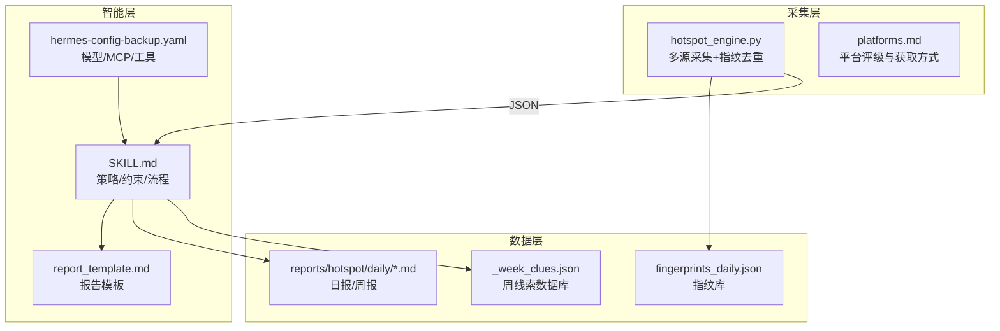
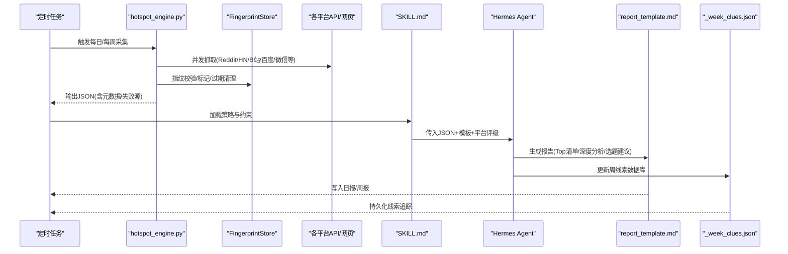
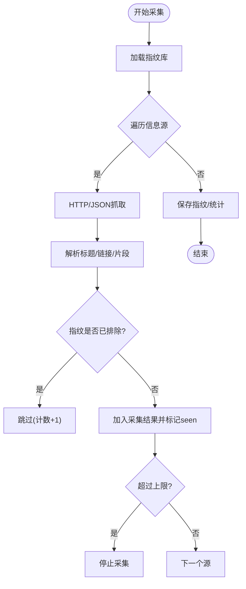
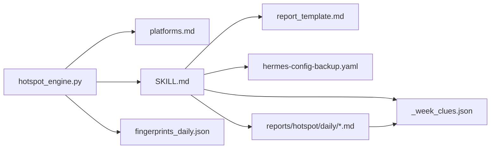

# Qoder Agent 每日热点报告系统

<cite>
**本文引用的文件**
- [README.md](file://README.md)
- [hotspot_engine.py](file://scripts/hotspot_engine.py)
- [SKILL.md](file://skills/hotspot-research/SKILL.md)
- [platforms.md](file://skills/hotspot-research/references/platforms.md)
- [report_template.md](file://skills/hotspot-research/templates/report_template.md)
- [hermes-config-backup.yaml](file://config/hermes-config-backup.yaml)
- [fingerprints_daily.json](file://data/fingerprints_daily.json)
- [report_2026-08-14.md](file://reports/hotspot/daily/report_2026-08-14.md)
- [hotspot-report-refactor.md](file://plans/2026-04-28_233000-hotspot-report-refactor.md)
- [_week_clues.json](file://reports/hotspot/_week_clues.json)
- [_week_clues_qoder.json](file://reports/hotspot-research_qoder/_week_clues.json)
</cite>

## 更新摘要
**变更内容**
- 新增周线索数据库功能，支持AI行业发展的长期追踪（第30-33周）
- 增强热点采集系统的线索持久化能力，包含Meta Muse Code AI、Google收购谈判、OpenAI定价变化等重大事件
- 扩展了多版本周线索数据库结构，支持信号强度评估和趋势分析
- 完善了热点报告的线索整合机制，提升长期价值追踪能力

## 目录
1. [简介](#简介)
2. [项目结构](#项目结构)
3. [核心组件](#核心组件)
4. [架构总览](#架构总览)
5. [详细组件分析](#详细组件分析)
6. [依赖关系分析](#依赖关系分析)
7. [性能与稳定性](#性能与稳定性)
8. [故障排查指南](#故障排查指南)
9. [结论](#结论)
10. [附录](#附录)

## 简介
本系统是一个面向"AI×超级个体"赛道的自动化热点采集与分析工作流。通过多平台信息源并行采集、指纹去重、结构化数据输出，再由 LLM（Hermes Agent）结合 Skill 模板生成高质量日报/周报，最终沉淀为可检索的报告资产与线索库。**最新增强**：系统现已具备完整的周线索数据库功能，能够持续追踪AI行业重大发展，包括Meta的Muse Code AI编程代理、Google的收购谈判以及OpenAI的定价策略调整等关键事件。

## 项目结构
- 采集与执行：Python 引擎负责跨平台抓取、指纹去重、异常降级与 JSON 产出；Skill 定义策略与流程；配置管理模型与工具集。
- 分析与产出：LLM 读取结构化数据，按模板生成报告；报告按日/周归档，并维护线索与指纹库。
- **数据与资产**：指纹库、历史报告、专题挖掘素材、生态扫描、**周线索数据库**等。

**图表来源**
- [hotspot_engine.py:1-120](file://scripts/hotspot_engine.py#L1-L120)
- [SKILL.md:1-101](file://skills/hotspot-research/SKILL.md#L1-L101)
- [platforms.md:1-127](file://skills/hotspot-research/references/platforms.md#L1-L127)
- [report_template.md:1-195](file://skills/hotspot-research/templates/report_template.md#L1-L195)
- [hermes-config-backup.yaml:1-315](file://config/hermes-config-backup.yaml#L1-L315)

章节来源
- [README.md:1-29](file://README.md#L1-L29)

## 核心组件
- 热点采集引擎（hotspot_engine.py）
  - 职责：多平台抓取、HTML/JSON 解析、指纹去重、受限源降级、条目上限保护、统计与失败记录。
  - 关键类：FingerprintStore（指纹存储/过期清理）、SourceCollector（采集器集合）。
- Skill 与工作流（SKILL.md + report_template.md）
  - 职责：定义采集策略、AM/PM 版本规则、时效宣誓、理论中立纪律、报告结构与字段规范。
- 平台与来源（platforms.md）
  - 职责：平台评级、采集方式、替代方案与已知限制（如 AI HOT 认证墙）。
- 配置（hermes-config-backup.yaml）
  - 职责：默认模型、MCP 服务（Brave Search）、终端/浏览器/压缩等运行参数。
- **数据与报告**
  - fingerprints_daily.json：指纹库，记录标题/来源/URL 摘要的哈希、出现次数与时间戳。
  - reports/hotspot/daily/*.md：按日生成的分析报告，含 Top 清单、中国 AI 圈动态、人物观点、深度分析、选题建议、线索更新等。
  - **_week_clues.json**：**周线索数据库**，追踪AI行业重大发展，包含线索ID、文本描述、日期、状态、信号强度等元数据。

章节来源
- [hotspot_engine.py:1-120](file://scripts/hotspot_engine.py#L1-L120)
- [SKILL.md:1-101](file://skills/hotspot-research/SKILL.md#L1-L101)
- [platforms.md:1-127](file://skills/hotspot-research/references/platforms.md#L1-L127)
- [report_template.md:1-195](file://skills/hotspot-research/templates/report_template.md#L1-L195)
- [hermes-config-backup.yaml:1-315](file://config/hermes-config-backup.yaml#L1-L315)
- [fingerprints_daily.json:1-800](file://data/fingerprints_daily.json#L1-L800)
- [report_2026-08-14.md:1-358](file://reports/hotspot/daily/report_2026-08-14.md#L1-L358)
- [_week_clues.json:1-629](file://reports/hotspot/_week_clues.json#L1-L629)

## 架构总览
系统采用"Python 采集 + LLM 分析"的分层架构：
- Python 层专注高可靠的数据抓取、去重与降级，输出结构化 JSON。
- LLM 层基于 Skill 与模板进行价值判断、叙事构建与内容编排。
- 配置层提供模型、MCP 工具与环境参数，确保稳定运行。
- **数据层**沉淀指纹、报告、**周线索数据库**与线索，形成可回溯的知识资产。

**图表来源**
- [hotspot_engine.py:170-800](file://scripts/hotspot_engine.py#L170-L800)
- [SKILL.md:1-101](file://skills/hotspot-research/SKILL.md#L1-L101)
- [report_template.md:1-195](file://skills/hotspot-research/templates/report_template.md#L1-L195)
- [_week_clues.json:1-629](file://reports/hotspot/_week_clues.json#L1-L629)

## 详细组件分析

### 热点采集引擎（hotspot_engine.py）
- 指纹去重
  - 以"标题归一化 + 来源域名 + URL路径摘要"生成 MD5 指纹，支持 seen_count 计数与 TTL 过期清理（日报7天/周报30天）。
  - 高质量源（Reddit/HN）提高排除阈值，普通源降低阈值以减少跨日期重复。
- 多源采集
  - 内置 Reddit、HN、B站、百度热搜、搜狗微信、微博热搜、知乎热榜、海外博客/Newsletter 等采集方法。
  - 每个采集器独立 try-except，单源失败不阻塞整体流程；失败源记录原因与建议。
- 条目保护
  - MAX_DAILY_ITEMS 上限防止采集爆炸；自动推算相关性提示；生命周期阶段标注（new/rising）。
- 输出
  - 结构化 JSON（meta/items/failed_sources），供 LLM 消费。

**图表来源**
- [hotspot_engine.py:68-168](file://scripts/hotspot_engine.py#L68-L168)
- [hotspot_engine.py:173-800](file://scripts/hotspot_engine.py#L173-L800)

章节来源
- [hotspot_engine.py:1-800](file://scripts/hotspot_engine.py#L1-L800)

### Skill 与工作流（SKILL.md + report_template.md）
- 策略要点
  - AM/PM 版本保留规则：同日多次运行不得覆盖已有报告，需追加后缀或 v2。
  - AI HOT 认证墙预检：每次运行前检测 Content-Type，若为 HTML 则立即切换替代源。
  - 时效宣誓：每条热点必须标注发布日期，超 24h/48h/72h 分别降级或丢弃。
  - 理论中立纪律：采集阶段不引入哲学框架，避免框架污染。
- 报告模板
  - 强制字段：中英双语标题、四要素摘要、概览四字段、发布日期、优先级（P0/P1/P2）。
  - 固定章节：Top 清单、中国 AI 圈动态、人物观点、深度分析、选题建议、执行路径、本周线索、素材深挖提示。

章节来源
- [SKILL.md:1-101](file://skills/hotspot-research/SKILL.md#L1-L101)
- [report_template.md:1-195](file://skills/hotspot-research/templates/report_template.md#L1-L195)

### 平台与来源（platforms.md）
- 国内平台：小红书、B站、抖音、微博、知乎、投资界/惊蛰研究所等，明确评级与获取方式。
- 海外平台：YouTube 频道、Reddit 版块、Substack Newsletter、X/Twitter 关键账号。
- 聚合源：AI HOT 当前存在认证墙，需降级至 Brave News/搜狗微信/手动补采。

章节来源
- [platforms.md:1-127](file://skills/hotspot-research/references/platforms.md#L1-L127)

### 配置（hermes-config-backup.yaml）
- 模型与提供商：默认 deepseek-v4-pro，自定义 provider 与 base_url。
- MCP 服务：Brave Search、Memory、DuckDB 等，便于 LLM 调用搜索与记忆。
- 终端/浏览器/压缩等运行参数，保障长时间任务稳定。

章节来源
- [hermes-config-backup.yaml:1-315](file://config/hermes-config-backup.yaml#L1-L315)

### **周线索数据库（_week_clues.json）**
- **数据结构**：包含周号、线索数组、更新时间、归档周号等元数据
- **线索格式**：每条线索包含ID、文本描述、日期、状态、信号强度、首次/末次信号时间等
- **覆盖范围**：第30-33周的AI行业发展，包括Meta Muse Code AI、Google收购谈判、OpenAI定价变化等重大事件
- **信号分类**：强信号（🔴）、中信号（🟡）、弱信号（🟢），用于评估线索重要性
- **趋势追踪**：支持线索的生命周期管理，从发现到归档的完整跟踪

**主要线索示例**：
- Meta发布Muse Code AI编程Agent（beta），子Agent并行架构，价格比竞品低10倍
- Google与AI编程初创Mechanize谈判$15亿+交易，Jeff Dean离职创业
- OpenAI GPT-5.6 Luna降价80%，Terra降价20%，Sol Fast Mode 2.5x
- Anthropic拟以2万亿美元估值IPO，年底ARR预期1000-1200亿美元

章节来源
- [_week_clues.json:1-629](file://reports/hotspot/_week_clues.json#L1-L629)
- [_week_clues_qoder.json:1-1052](file://reports/hotspot-research_qoder/_week_clues.json#L1-L1052)

### 数据与报告
- 指纹库（fingerprints_daily.json）
  - 记录指纹、标题、来源、seen_count、首次/末次出现时间，用于去重与趋势追踪。
- 日报样例（report_2026-08-14.md）
  - 包含 Top 20 优先排序、中国 AI 圈动态、关键人物观点、深度分析、选题建议、执行路径、本周线索、边缘信号等完整章节。

章节来源
- [fingerprints_daily.json:1-800](file://data/fingerprints_daily.json#L1-L800)
- [report_2026-08-14.md:1-358](file://reports/hotspot/daily/report_2026-08-14.md#L1-L358)

## 依赖关系分析
- 组件耦合
  - hotspot_engine.py 强依赖 platforms.md（采集目标与方式）与 SKILL.md（约束与流程）。
  - LLM 依赖 report_template.md（输出格式）与 hermes-config-backup.yaml（模型与工具）。
  - **数据层**依赖指纹库、报告目录、**周线索数据库**，保证可回溯与复用。
- 外部依赖
  - 平台 API/网页（Reddit、HN、B站、百度、搜狗、微博、知乎、Substack、博客等）。
  - MCP 服务（Brave Search）作为受限源的补充。
- 潜在循环
  - 无直接代码级循环依赖；Skill 与模板为文档型约束，不构成运行时循环。

**图表来源**
- [hotspot_engine.py:170-800](file://scripts/hotspot_engine.py#L170-L800)
- [platforms.md:1-127](file://skills/hotspot-research/references/platforms.md#L1-L127)
- [SKILL.md:1-101](file://skills/hotspot-research/SKILL.md#L1-L101)
- [report_template.md:1-195](file://skills/hotspot-research/templates/report_template.md#L1-L195)
- [hermes-config-backup.yaml:1-315](file://config/hermes-config-backup.yaml#L1-L315)
- [fingerprints_daily.json:1-800](file://data/fingerprints_daily.json#L1-L800)
- [_week_clues.json:1-629](file://reports/hotspot/_week_clues.json#L1-L629)

## 性能与稳定性
- 采集性能
  - 并发隔离：每个采集器独立 try-except，单源失败不影响整体。
  - 上限保护：MAX_DAILY_ITEMS 防止条目爆炸，控制资源消耗。
  - 指纹 TTL：日报7天/周报30天，定期清理过期指纹，减少存储压力。
- 稳定性
  - 受限源降级：当平台反爬/JS渲染/API变更时，记录失败原因并提供替代方案。
  - 认证墙处理：AI HOT 认证墙预检，及时切换到 Brave/搜狗/手动补采。
- **可扩展性**
  - 新增平台只需在 SourceCollector 中添加采集方法，并在 platforms.md 中登记评级与获取方式。
  - 报告模板扩展可在 template 中增加字段与章节，Skill 同步约束。
  - **周线索数据库**支持灵活扩展，可添加新的线索类型、信号强度和追踪维度。

[本节为通用指导，不直接分析具体文件]

## 故障排查指南
- 常见采集失败
  - JS 渲染页面（如 tophub、抖音）：改用 Headless 浏览器或替代 RSS/聚合器。
  - API 变更或反爬：检查返回结构，必要时降级到搜索引擎或手动补采。
  - 超时/网络问题：调整 timeout，重试机制，或切换备用源。
- 认证墙与权限
  - AI HOT 返回 HTML：立即跳过并标注 [aihot:AUTH_WALL]，使用 Brave/搜狗/手动补采。
  - 模型/Provider 配置错误：遵循 SKILL.md 中的 provider name 与 reasoning_effort 约束。
- 报告质量问题
  - 缺失发布日期：按模板强制规范补齐，无法确定则降级并标注。
  - 主题漂移：依据 platforms.md 与关键词过滤，保持赛道相关性。
- **周线索数据库问题**
  - 线索重复：检查ID唯一性约束，确保每条线索有唯一的标识符
  - 信号强度不一致：统一信号分类标准，避免主观判断差异
  - 归档逻辑错误：验证归档周号的正确性，确保线索生命周期管理正常
- 调试建议
  - 查看 failed_sources 列表，定位失败源与原因。
  - 检查 fingerprints_daily.json 的 seen_count 与 last_seen，确认去重逻辑。
  - 使用 verify_report_template.py 进行后置结构校验（按需）。
  - **监控周线索数据库的更新频率和质量**，确保线索追踪的连续性。

章节来源
- [SKILL.md:1-101](file://skills/hotspot-research/SKILL.md#L1-L101)
- [platforms.md:1-127](file://skills/hotspot-research/references/platforms.md#L1-L127)
- [hotspot_engine.py:252-771](file://scripts/hotspot_engine.py#L252-L771)

## 结论
该系统通过"Python 采集 + LLM 分析"的清晰分工，实现了高可靠、可追溯、高质量的热点采集与报告生成。**最新的周线索数据库功能**显著增强了系统的长期价值追踪能力，能够持续记录和分析AI行业的重大发展，包括Meta的Muse Code AI、Google的收购谈判、OpenAI的定价策略调整等关键事件。指纹去重、平台评级、AM/PM 版本规则与时效宣誓共同保障了内容的时效性与质量。未来可继续扩展平台源、优化降级策略，并强化线索库的长期价值与趋势分析能力。

[本节为总结性内容，不直接分析具体文件]

## 附录
- 重构方案参考
  - 将 Python 脚本聚焦于数据采集与 JSON 输出，报告生成交由 LLM 与 Skill 完成，提升分析深度与叙事能力。
- **周线索数据库使用指南**
  - 线索录入：每条线索应包含唯一ID、清晰的文本描述、准确的日期和适当的状态标记
  - 信号评估：根据影响范围和持续时间评估信号强度（强/中/弱）
  - 生命周期管理：从发现到活跃再到归档的完整跟踪
  - 趋势分析：通过时间序列分析识别AI行业的发展趋势和模式

章节来源
- [hotspot-report-refactor.md:1-138](file://plans/2026-04-28_233000-hotspot-report-refactor.md#L1-L138)
- [_week_clues.json:1-629](file://reports/hotspot/_week_clues.json#L1-L629)
- [_week_clues_qoder.json:1-1052](file://reports/hotspot-research_qoder/_week_clues.json#L1-L1052)