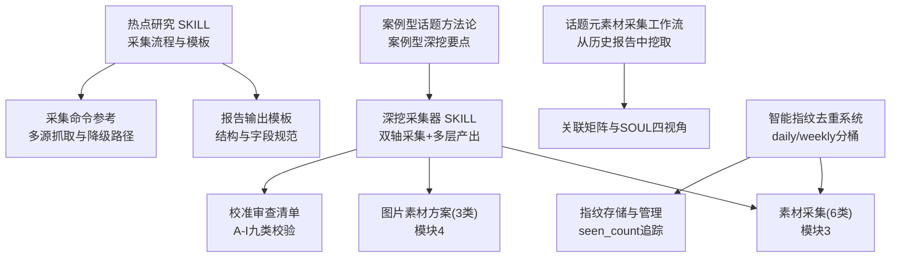
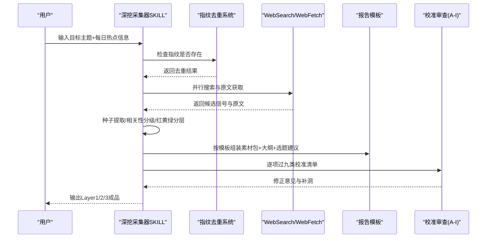
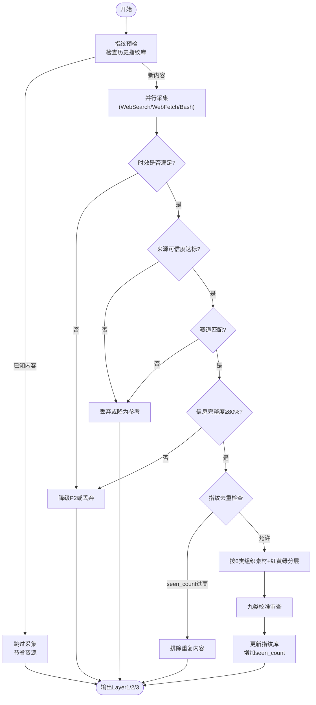
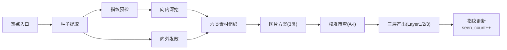
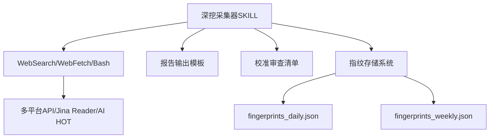

# 内容素材采集系统

<cite>
**本文引用的文件**
- [hotspot-topic-excavator SKILL.md](file://hotspot-topic-excavator/skills/hotspot-topic-excavator/SKILL.md)
- [热点研究 SKILL.md](file://.skills/hotspot-research/SKILL.md)
- [话题元素材采集工作流](file://.skills/hotspot-research/references/topic_materials_compilation.md)
- [数据质量与审核参考](file://.skills/hotspot-research/references/data_quality.md)
- [报告输出模板](file://.skills/hotspot-research/references/report_template.md)
- [采集命令参考](file://.skills/hotspot-research/references/collection_commands.md)
- [案例型话题深度挖掘方法论](file://hotspot-topic-excavator/skills/hotspot-topic-excavator/references/case_type_topic_excavation.md)
- [校准审查清单](file://hotspot-topic-excavator/skills/hotspot-topic-excavator/references/calibration_checklist.md)
- [热点采集核心引擎](file://scripts/hotspot_engine.py)
- [每日指纹数据](file://data/fingerprints_daily.json)
- [每周指纹数据](file://data/fingerprints_weekly.json)
- [示例日报数据](file://reports/hotspot/hotspot_daily_2026-04-29.json)
</cite>

## 更新摘要
**所做更改**
- 新增智能指纹去重系统章节，详细说明基于MD5哈希的去重机制
- 更新数据采集管道架构，加入指纹存储与生命周期管理
- 增强质量控制部分，包含seen_count阈值过滤和过期清理机制
- 扩展存储格式规范，涵盖指纹元数据结构
- 添加实际采集示例中的去重处理流程

## 目录
1. [引言](#引言)
2. [项目结构](#项目结构)
3. [核心组件](#核心组件)
4. [架构总览](#架构总览)
5. [详细组件分析](#详细组件分析)
6. [依赖关系分析](#依赖关系分析)
7. [性能考量](#性能考量)
8. [故障排查指南](#故障排查指南)
9. [结论](#结论)
10. [附录](#附录)

## 引言
本文件聚焦"模块3：内容素材采集（6类）"和"模块4：图片素材方案（3类）"，系统化说明采集标准、质量控制、模板与存储规范，并给出实操示例与常见问题解决方案。目标受众包括内容创作者、编辑与自动化流水线工程师，力求在保持技术严谨的同时易于理解与落地。

**最新更新**：系统现已集成智能指纹去重机制，通过`fingerprints_daily.json`和`fingerprints_weekly.json`实现跨日期的内容去重，支持标题、来源、时间戳和出现次数的完整元数据存储。

## 项目结构
围绕素材采集与深挖，仓库包含两套 Skill：
- hotspot-research：跨平台热点采集与分析工作流（策略大脑与执行手册）
- hotspot-topic-excavator：以每日热点为锚点的深挖采集器（产出 Layer 1/2/3）



**图示来源**
- [热点研究 SKILL.md](file://.skills/hotspot-research/SKILL.md)
- [报告输出模板](file://.skills/hotspot-research/references/report_template.md)
- [采集命令参考](file://.skills/hotspot-research/references/collection_commands.md)
- [hotspot-topic-excavator SKILL.md](file://hotspot-topic-excavator/skills/hotspot-topic-excavator/SKILL.md)
- [校准审查清单](file://hotspot-topic-excavator/skills/hotspot-topic-excavator/references/calibration_checklist.md)
- [话题元素材采集工作流](file://.skills/hotspot-research/references/topic_materials_compilation.md)
- [案例型话题深度挖掘方法论](file://hotspot-topic-excavator/skills/hotspot-topic-excavator/references/case_type_topic_excavation.md)
- [热点采集核心引擎](file://scripts/hotspot_engine.py)

章节来源
- [热点研究 SKILL.md](file://.skills/hotspot-research/SKILL.md)
- [hotspot-topic-excavator SKILL.md](file://hotspot-topic-excavator/skills/hotspot-topic-excavator/SKILL.md)

## 核心组件
- 模块3：内容素材采集（6类弹药）
  - 热点资讯流：时效优先，追踪最新新闻与社区动态
  - 硬核事实：原始数据、实验细节、具体数字，必须可溯源
  - 权威引述：专家观点与可直接引用的金句，保留英文原文+中译
  - 案例故事：可叙事化的真实事件，含时间/人物/冲突/结果
  - 对立张力：争议点、反方观点、质疑声音，增强论证张力
  - 可视化依据：适合做图表的数据，标注原始出处
- 模块4：图片素材方案（3类）
  - 文章内可用配图：从信源链接中提取，附图片说明/链接/授权类型
  - 可下载图源：联网检索，标注来源平台+授权类型
  - AI绘图提示词概要：2-3条英文提示词概要，规避版权风险
- **新增**：智能指纹去重系统
  - 基于MD5哈希的标题+来源+URL去重
  - seen_count追踪与阈值过滤
  - daily/weekly分桶存储与TTL过期清理

章节来源
- [hotspot-topic-excavator SKILL.md](file://hotspot-topic-excavator/skills/hotspot-topic-excavator/SKILL.md)
- [热点采集核心引擎](file://scripts/hotspot_engine.py)

## 架构总览
深挖采集器采用"向内深挖 + 向外发散"的双轴模型，结合工具链并行化与多级降级策略，最终产出三层弹药库（Layer 1/2/3），并通过九类校准审查保障质量。**新增智能指纹去重机制确保跨日期内容不重复**。



**图示来源**
- [hotspot-topic-excavator SKILL.md](file://hotspot-topic-excavator/skills/hotspot-topic-excavator/SKILL.md)
- [报告输出模板](file://.skills/hotspot-research/references/report_template.md)
- [校准审查清单](file://hotspot-topic-excavator/skills/hotspot-topic-excavator/references/calibration_checklist.md)
- [热点采集核心引擎](file://scripts/hotspot_engine.py)

## 详细组件分析

### 模块3：六类内容素材采集标准与质量控制
- 采集标准
  - 热点资讯流：强调时效性，优先近24小时内的信号；对持续发酵事件需标注追踪天数
  - 硬核事实：必须提供可溯源的原始数据或实验细节，信息完整度≥80%
  - 权威引述：保留英文原文与中文翻译，标注来源与发布时间
  - 案例故事：具备时间线、人物、冲突与结果，能支撑叙事弧线
  - 对立张力：明确呈现反方观点与质疑，避免单侧叙事
  - 可视化依据：提供可用于图表的数据及原始出处
- 质量控制要求
  - 三关审核：时效关、来源可信度关、赛道匹配关
  - 信息完整度分级：完整(100%)、高(80%)、中(60%)、低(30%)，P0需≥80%
  - 发布日期强制标注：超过48h自动降级P2并标注回溯，超过72h丢弃
  - 理论中立性：采集阶段不署名引用哲学家理论概念
  - 九类校准审查：事实校准/补充/表述校准/框架补充/对立视角/理论偏向/叙事引力/受众工具链翻译/三角叙事补洞
- **新增**：智能去重控制
  - 高质量源（Reddit/HN等）：seen_count ≥ 4才排除
  - 普通源：seen_count ≥ 2即排除
  - 跨日期追踪：first_seen/last_seen记录首次和最后出现时间

章节来源
- [hotspot-topic-excavator SKILL.md](file://hotspot-topic-excavator/skills/hotspot-topic-excavator/SKILL.md)
- [数据质量与审核参考](file://.skills/hotspot-research/references/data_quality.md)
- [热点研究 SKILL.md](file://.skills/hotspot-research/SKILL.md)
- [校准审查清单](file://hotspot-topic-excavator/skills/hotspot-topic-excavator/references/calibration_checklist.md)
- [热点采集核心引擎](file://scripts/hotspot_engine.py)

#### 智能指纹去重系统
**工作原理**
- 指纹生成：基于标题归一化 + 来源域名 + URL路径的MD5哈希
- 存储结构：JSON格式，每个指纹包含title、source、seen_count、first_seen、last_seen
- 去重策略：混合模式（采集前预检 + 采集后完整对比）
- 生命周期：每日指纹保留7天，每周指纹保留30天

**数据结构示例**
```json
{
  "f599a523fcc3288ab235ef7c4373f0ca": {
    "title": "中芯国际与嘉楠科技合作14nm矿机芯片",
    "source": "36氪",
    "seen_count": 3,
    "first_seen": "2026-04-28T20:59:50.335651",
    "last_seen": "2026-04-28T23:18:28.880655"
  }
}
```

**去重阈值配置**
- 高质量源（Reddit/HackerNews）：seen_count ≥ 4排除
- 普通源：seen_count ≥ 2排除  
- 周报模式：seen_count ≥ 2排除

章节来源
- [热点采集核心引擎](file://scripts/hotspot_engine.py)
- [每日指纹数据](file://data/fingerprints_daily.json)
- [每周指纹数据](file://data/fingerprints_weekly.json)

#### 六类素材采集模板（字段定义）
- 通用字段
  - 标题（原文·必带中文翻译）、发布日期、来源URL、摘要（主体/动作/关键数字/影响）、优先级（P0/P1/P2）、信息完整度、关联强度（核心/强关联/可延展）
- 分类字段
  - 热点资讯流：时效标签（如"持续追踪D+N"）、平台共振情况
  - 硬核事实：数据来源、统计口径、样本量、置信区间（如有）
  - 权威引述：英文原文、中文翻译、作者头衔、发布场合
  - 案例故事：时间线节点、关键人物、冲突点、结果与代价
  - 对立张力：反方核心论点、证据、适用边界
  - 可视化依据：指标名称、单位、时间窗口、原始数据集链接
- **新增**：去重相关字段
  - fingerprint：唯一标识符
  - is_repeat：是否重复内容
  - repeat_count：重复次数
  - lifecycle_stage：new/rising（生命周期阶段）

章节来源
- [报告输出模板](file://.skills/hotspot-research/references/report_template.md)
- [数据质量与审核参考](file://.skills/hotspot-research/references/data_quality.md)
- [示例日报数据](file://reports/hotspot/hotspot_daily_2026-04-29.json)

#### 质量检查清单（节选）
- 8个必须section全部存在
- P0条目数量与P1条目数量符合日报约定
- 每条热点标注发布日期且来源可追溯
- 英文标题全部带中文翻译
- 中文摘要包含四要素
- 概览包含4个固定字段（冲突/异常、数据锚点、受众关联、叙事钩子）
- 线索ID持久化且不重复分配
- 理论中立性检查通过
- 时效检查无超72h内容，超48h已标注回溯
- **新增**：指纹去重检查通过，无重复内容进入最终报告

章节来源
- [热点研究 SKILL.md](file://.skills/hotspot-research/SKILL.md)
- [数据质量与审核参考](file://.skills/hotspot-research/references/data_quality.md)

#### 存储格式规范
- 报告输出目录：reports/hotspot/{YYYY-MM-DD}/{topic_slug}/
- 命名规范：report_daily_YYYY-MM-DD[_am|_pm][_vN].md；周报 report_weekly_YYYY-WXX.md
- 软链接：report_daily.md → 最新日报
- 附件与素材：图片说明/链接/授权类型随文归档，AI绘图prompt概要独立段落保存
- **新增**：指纹存储格式
  - fingerprints_daily.json：每日指纹库，TTL=7天
  - fingerprints_weekly.json：每周指纹库，TTL=30天
  - 数据结构：{fingerprint: {title, source, seen_count, first_seen, last_seen}}

章节来源
- [热点研究 SKILL.md](file://.skills/hotspot-research/SKILL.md)
- [hotspot-topic-excavator SKILL.md](file://hotspot-topic-excavator/skills/hotspot-topic-excavator/SKILL.md)
- [热点采集核心引擎](file://scripts/hotspot_engine.py)

#### 实际采集示例（步骤级）
- 输入：目标主题"某公司AI产品发布"+当日热点文件路径
- 启动配置复述：深挖/发散配比、选题卡粒度、发散上限
- 内部探查：提取核心种子与关联种子
- **新增**：指纹预检：检查内容是否已在历史指纹库中出现
- 向内深挖：WebSearch+WebFetch并行，必要时Bash直连绕过WAF
- **新增**：去重处理：计算指纹，检查seen_count，决定是否排除
- 向外发散：关联话题/上下游概念/跨领域类比/新选题机会
- 相关性分级：核心层🔴/强关联层🟡/可延展层🟢
- 素材组织：按6类填充模板字段，红黄绿分层
- 校准审查：逐项过A-I清单，记录修正项
- **新增**：指纹更新：记录首次出现时间和出现次数
- 输出：Layer1素材包+Layer2大纲填充+Layer3选题建议

章节来源
- [hotspot-topic-excavator SKILL.md](file://hotspot-topic-excavator/skills/hotspot-topic-excavator/SKILL.md)
- [采集命令参考](file://.skills/hotspot-research/references/collection_commands.md)
- [热点采集核心引擎](file://scripts/hotspot_engine.py)

### 模块4：三类图片素材方案与版权合规
- 文章内可用配图
  - 获取策略：从信源链接中提取，优先官方图/媒体图
  - 标注要求：图片说明、原链接、授权类型（CC/公有领域/需授权）
- 可下载图源
  - 获取策略：联网检索高质量图库与开放资源站
  - 标注要求：来源平台、授权类型、使用限制
- AI绘图提示词概要
  - 获取策略：基于主题生成2-3条英文提示词概要，避免直接复制受版权保护图像
  - 标注要求：提示词用途、风格关键词、规避敏感元素

章节来源
- [hotspot-topic-excavator SKILL.md](file://hotspot-topic-excavator/skills/hotspot-topic-excavator/SKILL.md)

#### 图片版权合规要点
- 优先选择CC0/CC BY等开放许可；若需授权，保留授权凭证与链接
- 避免直接使用付费墙站点截图；必要时用WebSearch摘要替代
- AI绘图需规避品牌Logo、肖像权与受版权保护的视觉元素

章节来源
- [数据采集与审核参考](file://.skills/hotspot-research/references/data_quality.md)

### 复杂逻辑流程图（素材分级与降级）


**图示来源**
- [数据质量与审核参考](file://.skills/hotspot-research/references/data_quality.md)
- [热点研究 SKILL.md](file://.skills/hotspot-research/SKILL.md)
- [校准审查清单](file://hotspot-topic-excavator/skills/hotspot-topic-excavator/references/calibration_checklist.md)
- [热点采集核心引擎](file://scripts/hotspot_engine.py)

### 概念性总览（非代码映射）


[此图为概念性工作流示意，无需图示来源]

## 依赖关系分析
- 采集器依赖
  - WebSearch/WebFetch为主力工具链，Bash作为降级路径
  - 报告模板驱动结构化输出
  - 校准审查清单贯穿生产全流程
  - **新增**：指纹存储系统（JSON文件）用于去重和生命周期管理
- 外部依赖
  - 多平台API（HackerNews/Reddit/B站/微博/36氪/搜狗微信等）
  - Jina Reader用于网页转Markdown
  - 可选AI HOT API预检与回退



**图示来源**
- [hotspot-topic-excavator SKILL.md](file://hotspot-topic-excavator/skills/hotspot-topic-excavator/SKILL.md)
- [采集命令参考](file://.skills/hotspot-research/references/collection_commands.md)
- [报告输出模板](file://.skills/hotspot-research/references/report_template.md)
- [校准审查清单](file://hotspot-topic-excavator/skills/hotspot-topic-excavator/references/calibration_checklist.md)
- [热点采集核心引擎](file://scripts/hotspot_engine.py)

章节来源
- [采集命令参考](file://.skills/hotspot-research/references/collection_commands.md)
- [热点研究 SKILL.md](file://.skills/hotspot-research/SKILL.md)

## 性能考量
- 并行化：多组WebSearch与WebFetch并行调用，缩短整体时延
- 降级路径：Jina失败→WebFetch→WebSearch摘要→Browser MCP；Cloudflare WAF场景使用Python直连绕过
- 重试策略：Jina空内容/超时/阻断时的重试与降级决策树
- **新增**：智能去重优化
  - 采集前预检：跳过已知内容，减少网络请求
  - 阈值过滤：根据seen_count自动排除重复内容
  - TTL管理：定期清理过期指纹，保持数据库大小可控
  - 分桶存储：daily/weekly分离，提高查询效率

章节来源
- [数据采集与审核参考](file://.skills/hotspot-research/references/data_quality.md)
- [采集命令参考](file://.skills/hotspot-research/references/collection_commands.md)
- [热点采集核心引擎](file://scripts/hotspot_engine.py)

## 故障排查指南
- 网络诊断
  - 快速检测Google与Jina连通性，区分全局断网与单点故障
- Jina行为
  - 常见阻断站点（Fortune/TIME/Guardian/TechCrunch/NYT/Bloomberg）接受搜索摘要替代
- Python环境
  - urllib3版本与Python版本不匹配导致TypeError时，显式调用python3.x绝对路径
- 平台受限
  - 小红书/抖音受限源需Browser MCP或手动补采；百度热搜无法确定发布时间，默认低优先级
- **新增**：指纹系统问题
  - JSON文件格式错误：检查fingerprints_daily.json/weekly.json语法
  - 去重失效：验证指纹生成算法（标题归一化+来源+URL）
  - 存储空间增长：检查TTL清理机制是否正常工作
  - 阈值调整：根据业务需求调整HIGH_QUALITY_EXCLUDE_THRESHOLD和DEFAULT_EXCLUDE_THRESHOLD

章节来源
- [数据采集与审核参考](file://.skills/hotspot-research/references/data_quality.md)
- [采集命令参考](file://.skills/hotspot-research/references/collection_commands.md)
- [热点研究 SKILL.md](file://.skills/hotspot-research/SKILL.md)
- [热点采集核心引擎](file://scripts/hotspot_engine.py)

## 结论
本系统以"双轴采集+多层产出+九类校准+智能去重"为核心，确保六类内容素材与三类图片素材的高质量、可溯源与合规。通过严格的时效与完整性控制、完善的降级路径与并行化策略，以及创新的指纹去重机制，既提升采集效率，又保障内容生产的稳定性与可复用性。

**核心改进**：智能指纹去重系统有效解决了跨日期内容重复问题，通过seen_count追踪和阈值过滤，显著减少了冗余内容的产生，同时保持了内容的新鲜度和多样性。

## 附录

### 从历史报告进行话题元素材采集（工作流）
- 触发条件：用户需要为特定话题补充素材，而非全量采集
- 双层搜索：先报告库（MD+JSON+周报），后外部补采（标注"日报遗漏补采"）
- 精选与分级：去重→P0/P1/P2→关联矩阵
- 输出：核心信息摘要表、补充话题维度表、关联矩阵、SOUL四视角整合、三平台分发方案、素材来源索引

章节来源
- [话题元素材采集工作流](file://.skills/hotspot-research/references/topic_materials_compilation.md)

### 案例型话题深挖要点
- 判断启发式：信源≤2、线索≤1、人物/案例型、用户明确要求深挖
- 必挖维度：完整时间线、收入/数据拆解、长深度对话、金句提取、对立视角、同类对比、隐性成本
- 内容产出模板：短视频脚本结构、反常识钩子、代价章节

章节来源
- [案例型话题深度挖掘方法论](file://hotspot-topic-excavator/skills/hotspot-topic-excavator/references/case_type_topic_excavation.md)

### 智能指纹去重系统技术细节
**指纹生成算法**
```python
def make_fingerprint(title: str, source: str, url: str = "") -> str:
    norm_title = re.sub(r'\s+', ' ', title.strip().lower())[:80]
    domain = ""
    if url:
        try:
            domain = urlparse(url).netloc.replace("www.", "")
        except:
            pass
    raw = f"{norm_title}|{source}|{domain}"
    return hashlib.md5(raw.encode("utf-8")).hexdigest()
```

**生命周期管理**
- 首次出现：seen_count=1，lifecycle_stage="new"
- 跨日期重复：seen_count≥2，lifecycle_stage="rising"  
- 高频重复：seen_count≥阈值，被排除出采集结果

**存储优化**
- 每日指纹TTL：7天自动清理
- 每周指纹TTL：30天自动清理
- 压缩存储：只保留必要元数据，避免冗余

章节来源
- [热点采集核心引擎](file://scripts/hotspot_engine.py)
- [每日指纹数据](file://data/fingerprints_daily.json)
- [每周指纹数据](file://data/fingerprints_weekly.json)