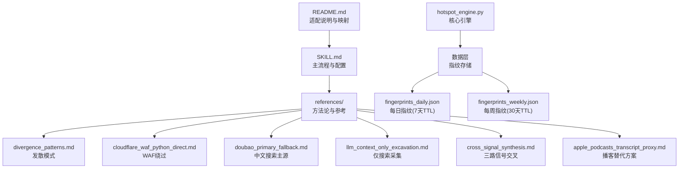
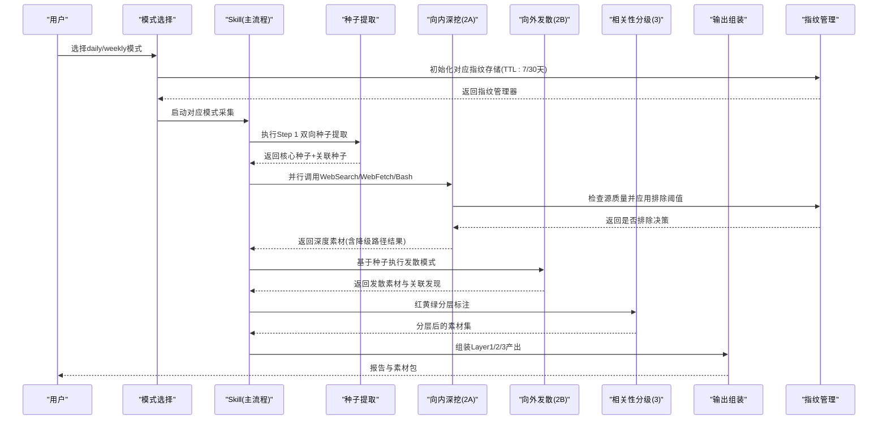
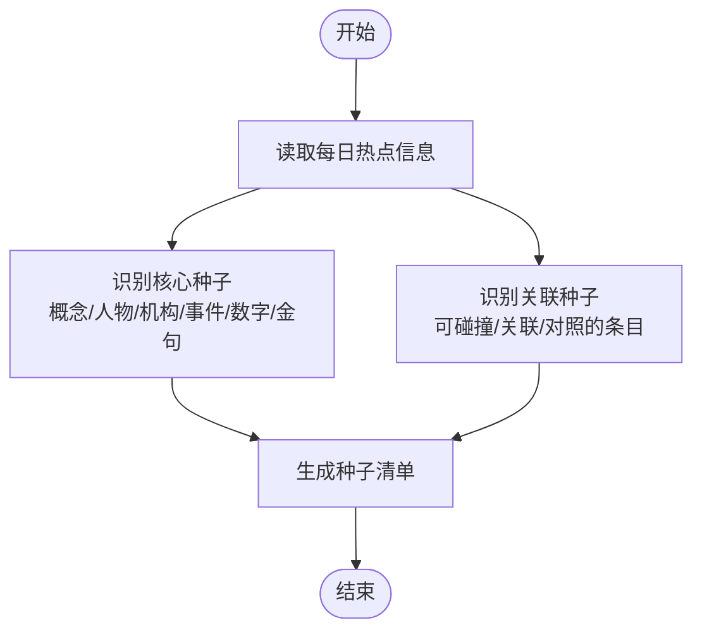
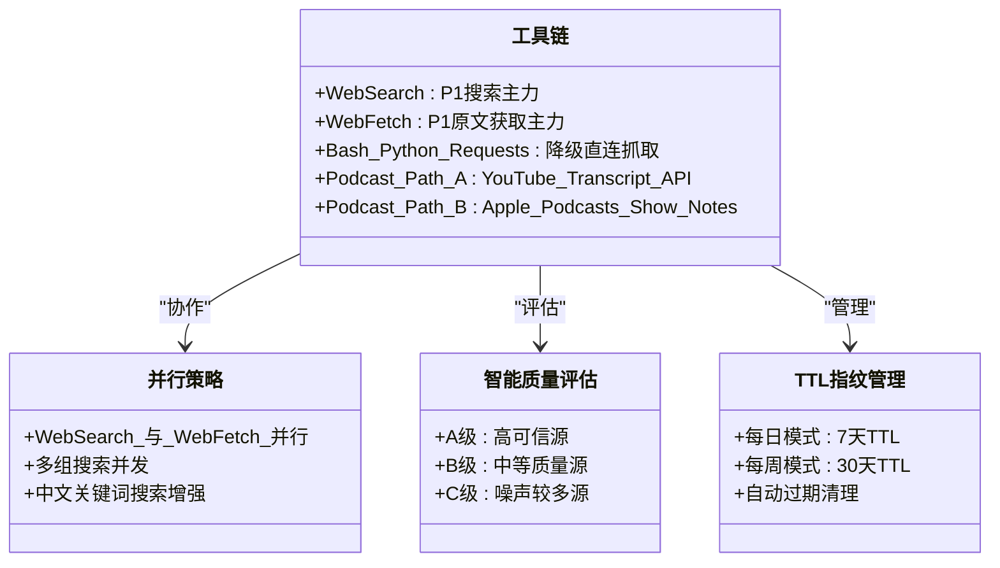
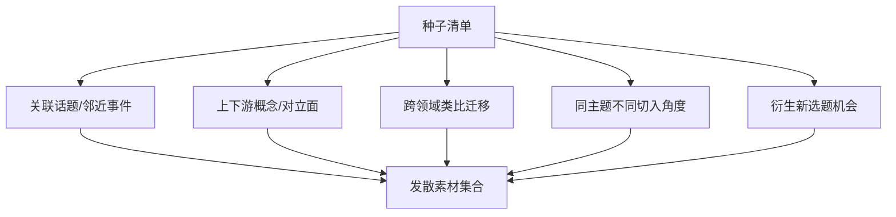
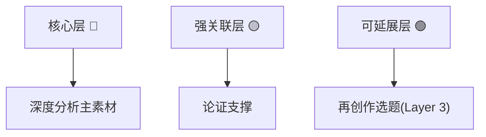
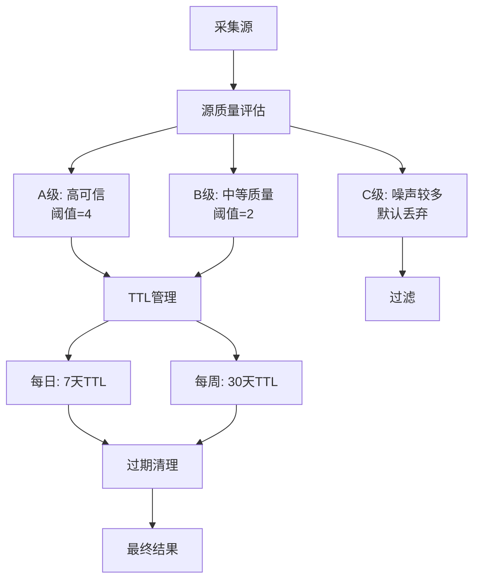
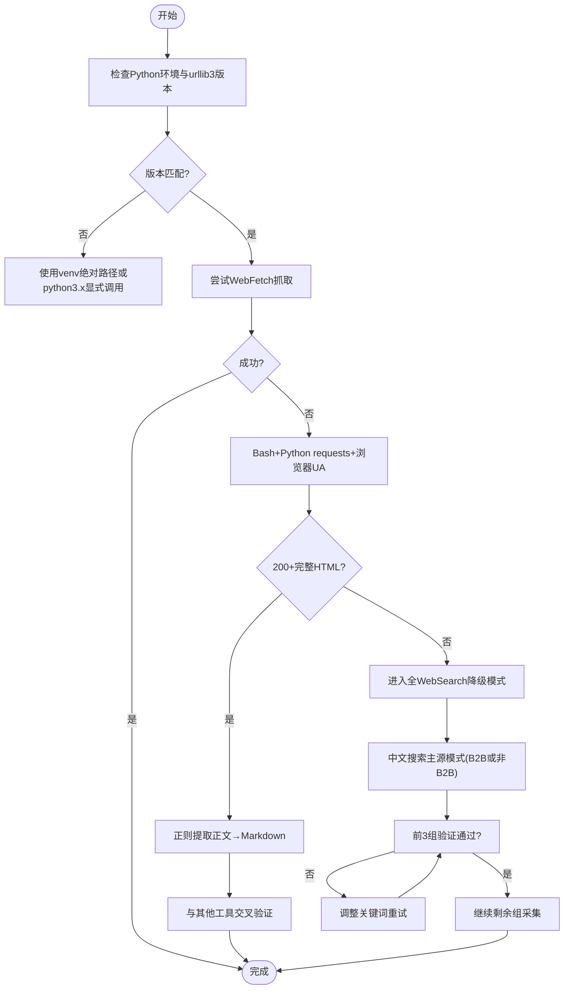
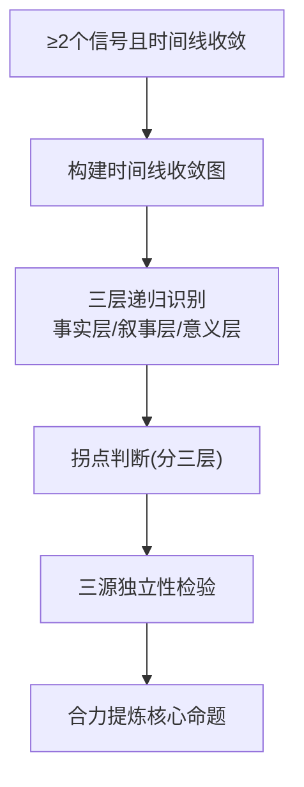
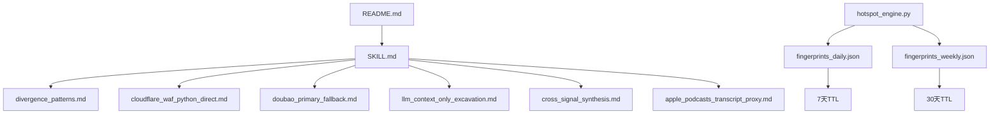

# 双轴采集引擎

<cite>
**本文引用的文件**
- [hotspot_engine.py](file://scripts/hotspot_engine.py)
- [fingerprints_daily.json](file://data/fingerprints_daily.json)
- [fingerprints_weekly.json](file://data/fingerprints_weekly.json)
- [SKILL.md](file://skills/hotspot-topic-excavator/skills/hotspot-topic-excavator/SKILL.md)
- [README.md](file://skills/hotspot-topic-excavator/README.md)
- [divergence_patterns.md](file://skills/hotspot-topic-excavator/skills/hotspot-topic-excavator/references/divergence_patterns.md)
- [cloudflare_waf_python_direct.md](file://skills/hotspot-topic-excavator/skills/hotspot-topic-excavator/references/cloudflare_waf_python_direct.md)
- [doubao_primary_fallback.md](file://skills/hotspot-topic-excavator/skills/hotspot-topic-excavator/references/doubao_primary_fallback.md)
- [llm_context_only_excavation.md](file://skills/hotspot-topic-excavator/skills/hotspot-topic-excavator/references/llm_context_only_excavation.md)
- [cross_signal_synthesis.md](file://skills/hotspot-topic-excavator/skills/hotspot-topic-excavator/references/cross_signal_synthesis.md)
- [apple_podcasts_transcript_proxy.md](file://skills/hotspot-topic-excavator/skills/hotspot-topic-excavator/references/apple_podcasts_transcript_proxy.md)
- [data_quality.md](file://skills/hotspot-research_qoder_v2/references/data_quality.md)
</cite>

## 更新摘要
**所做更改**
- 新增每日/每周报告模式支持，包括智能源质量评分和TTL指纹过期机制
- 更新指纹去重系统，实现按源质量的自动排除阈值
- 增强数据采集流程，支持跨日期去重和生命周期追踪
- 完善工具链配置，优化WebSearch、WebFetch、Bash等工具的优先级策略
- 扩展发散模式库，增加5种新的发散模式和关联发现机制

## 目录
1. [引言](#引言)
2. [项目结构](#项目结构)
3. [核心组件](#核心组件)
4. [架构总览](#架构总览)
5. [详细组件分析](#详细组件分析)
6. [依赖关系分析](#依赖关系分析)
7. [性能考量](#性能考量)
8. [故障排查指南](#故障排查指南)
9. [结论](#结论)
10. [附录](#附录)

## 引言
本文件聚焦"双轴采集引擎"的核心实现与运行机制，围绕以下目标展开：
- Step 1 双向种子提取：核心种子与关联种子的识别逻辑
- Step 2A 向内深挖：WebSearch、WebFetch、Bash 等工具的优先级与并行策略
- Step 2B 向外发散：5 种发散模式与关联发现机制
- Step 3 相关性分级：红黄绿三层分类标准
- 工具陷阱诊断与降级路径的完整流程图

该引擎以热点为锚点，采用"向内深挖 + 向外发散"的双轴模型，产出多层弹药库（内容素材 + 图片素材），并支持多平台适配与连续性生产。

**更新** 新增每日/每周报告模式支持，包含智能源质量评分、TTL指纹过期机制和基于源质量的自动排除阈值。

## 项目结构
仓库包含 Qoder 插件形态的"热点主题素材深挖采集器"，其核心由主 Skill 与多个参考文档组成，覆盖采集方法、降级策略、发散模式、交叉分析等。

**图表来源**
- [SKILL.md:1-120](file://skills/hotspot-topic-excavator/skills/hotspot-topic-excavator/SKILL.md#L1-L120)
- [README.md:1-80](file://skills/hotspot-topic-excavator/README.md#L1-L80)
- [hotspot_engine.py:36-54](file://scripts/hotspot_engine.py#L36-L54)

章节来源
- [SKILL.md:1-120](file://skills/hotspot-topic-excavator/skills/hotspot-topic-excavator/SKILL.md#L1-L120)
- [README.md:1-80](file://skills/hotspot-topic-excavator/README.md#L1-L80)
- [hotspot_engine.py:36-54](file://scripts/hotspot_engine.py#L36-L54)

## 核心组件
- 输入与启动配置：目标主题、每日热点信息、来源线索、选题角度、目标平台、内容形式；以及深挖/发散配比、再创作粒度、发散边界等可配置项
- **双模式采集引擎**：支持每日(daily)和每周(weekly)两种报告模式，各自独立的指纹存储和TTL管理
- **智能源质量评分**：A(高可信)/B(中等)/C(噪声多)三级评分，影响排除阈值和权重
- **TTL指纹过期机制**：每日指纹保留7天，每周指纹保留30天，自动清理过期记录
- **基于源质量的自动排除**：高质量源(Reddit/HN)阈值=4，普通源阈值=2，减少跨日期重复
- 双轴采集流程：Step 1 双向种子提取 → Step 2A 向内深挖 → Step 2B 向外发散 → Step 3 相关性分级
- 工具链与降级：WebSearch/WebFetch/Bash 组合，按严重度递进的降级路径
- 发散模式库：跨领域类比、反方纳入、多信号并行、全 WebSearch 降级、罗生门叙事等
- 交叉分析与校准：三路信号交叉、九类校准清单、审查补充优化循环

**更新** 新增智能源质量评分、TTL指纹管理和基于源质量的自动排除机制。

章节来源
- [SKILL.md:27-120](file://skills/hotspot-topic-excavator/skills/hotspot-topic-excavator/SKILL.md#L27-L120)
- [SKILL.md:177-204](file://skills/hotspot-topic-excavator/skills/hotspot-topic-excavator/SKILL.md#L177-L204)
- [SKILL.md:251-316](file://skills/hotspot-topic-excavator/skills/hotspot-topic-excavator/SKILL.md#L251-L316)
- [hotspot_engine.py:52-60](file://scripts/hotspot_engine.py#L52-L60)
- [hotspot_engine.py:127-144](file://scripts/hotspot_engine.py#L127-L144)

## 架构总览
双轴采集引擎的整体工作流如下：

**图表来源**
- [SKILL.md:72-120](file://skills/hotspot-topic-excavator/skills/hotspot-topic-excavator/SKILL.md#L72-L120)
- [SKILL.md:177-204](file://skills/hotspot-topic-excavator/skills/hotspot-topic-excavator/SKILL.md#L177-L204)
- [hotspot_engine.py:74-79](file://scripts/hotspot_engine.py#L74-L79)

## 详细组件分析

### Step 1 双向种子提取（核心种子与关联种子）
- 核心种子：从热点信息中抽取与目标主题直接相关的概念、人物、机构、事件、数字、金句
- 关联种子：从热点清单中识别可与本主题碰撞/关联/对照的其他条目线索
- 输出：种子清单作为后续联网采集的锚点

**图表来源**
- [SKILL.md:74-80](file://skills/hotspot-topic-excavator/skills/hotspot-topic-excavator/SKILL.md#L74-L80)

章节来源
- [SKILL.md:74-80](file://skills/hotspot-topic-excavator/skills/hotspot-topic-excavator/SKILL.md#L74-L80)

### Step 2A 向内深挖（工具链配置、优先级与并行策略）
- 工具定位与优先级
  - WebSearch：P1 搜索主力，支持时效信号（OneDay/OneWeek）
  - WebFetch：P1 原文获取主力，替代 Jina Reader，通用网页内容提取
  - Bash（Python requests）：降级直连抓取，用于 Cloudflare WAF 站点与反爬场景
  - 播客 transcript 双路径：YouTube Transcript API（Bash+Python）与 Apple Podcasts show notes（WebSearch）并行
- 关键策略
  - WebSearch 与 WebFetch 并行调用，互为备份
  - 多组搜索同时发起，提升效率
  - 中文关键词搜索在特定话题（国际治理/文化趋势）下强制或增强使用
- **智能源质量评估**：根据平台特性自动分配A/B/C级质量评分
- **TTL指纹管理**：按模式选择不同TTL（每日7天/每周30天）

**更新** 新增智能源质量评估和TTL指纹管理机制。

**图表来源**
- [SKILL.md:82-128](file://skills/hotspot-topic-excavator/skills/hotspot-topic-excavator/SKILL.md#L82-L128)
- [apple_podcasts_transcript_proxy.md:1-95](file://skills/hotspot-topic-excavator/skills/hotspot-topic-excavator/references/apple_podcasts_transcript_proxy.md#L1-L95)
- [hotspot_engine.py:52-60](file://scripts/hotspot_engine.py#L52-L60)

章节来源
- [SKILL.md:82-128](file://skills/hotspot-topic-excavator/skills/hotspot-topic-excavator/SKILL.md#L82-L128)
- [apple_podcasts_transcript_proxy.md:1-95](file://skills/hotspot-topic-excavator/skills/hotspot-topic-excavator/references/apple_podcasts_transcript_proxy.md#L1-L95)
- [hotspot_engine.py:52-60](file://scripts/hotspot_engine.py#L52-L60)

### Step 2B 向外发散（5 种发散模式与关联发现机制）
- 发散方向
  - 关联话题/邻近事件
  - 上下游概念/对立面
  - 跨领域类比迁移（★）
  - 同主题不同切入角度
  - 衍生新选题机会
- 约束：发散选题 ≤ 5 个，每个必须能溯源回锚点
- 扩展模式（参考库）
  - GPS 类比链（跨领域类比迁移）
  - LLM Context 作为 P1 原文提取首选
  - 反方观点的系统性纳入
  - 多平台内容大纲差异化设计
  - V1+V2 对比报告自动生成
  - 多信号并行搜索（颗粒化多信源高效采集）
  - 全 WebSearch 降级模式（Brave + WebFetch 同时不可用）
  - 罗生门叙事结构（矛盾叙事并置）

**图表来源**
- [SKILL.md:177-187](file://skills/hotspot-topic-excavator/skills/hotspot-topic-excavator/SKILL.md#L177-L187)
- [divergence_patterns.md:1-323](file://skills/hotspot-topic-excavator/skills/hotspot-topic-excavator/references/divergence_patterns.md#L1-L323)

章节来源
- [SKILL.md:177-187](file://skills/hotspot-topic-excavator/skills/hotspot-topic-excavator/SKILL.md#L177-L187)
- [divergence_patterns.md:1-323](file://skills/hotspot-topic-excavator/skills/hotspot-topic-excavator/references/divergence_patterns.md#L1-L323)

### Step 3 相关性分级（红黄绿三层分类标准）
- 核心层（🔴）：直接关于原话题，用于深度分析主素材
- 强关联层（🟡）：紧密相关的延伸，用于论证支撑
- 可延展层（🟢）：能激发新选题的发散素材，用于再创作选题（Layer 3）

**图表来源**
- [SKILL.md:189-196](file://skills/hotspot-topic-excavator/skills/hotspot-topic-excavator/SKILL.md#L189-L196)

章节来源
- [SKILL.md:189-196](file://skills/hotspot-topic-excavator/skills/hotspot-topic-excavator/SKILL.md#L189-L196)

### 智能源质量评分与自动排除机制
- **源质量评级**：
  - A级（高可信）：Reddit、HackerNews等技术社区，排除阈值=4
  - B级（中等质量）：搜狗微信、B站等平台，排除阈值=2
  - C级（噪声较多）：百度热搜等聚合平台，默认丢弃除非明确相关
- **TTL指纹管理**：
  - 每日模式：指纹保留7天，适合短期热点追踪
  - 每周模式：指纹保留30天，适合长期趋势分析
- **自动排除逻辑**：根据源质量和出现次数动态调整排除阈值

**更新** 新增智能源质量评分和基于TTL的自动排除机制。

**图表来源**
- [hotspot_engine.py:56-60](file://scripts/hotspot_engine.py#L56-L60)
- [hotspot_engine.py:127-144](file://scripts/hotspot_engine.py#L127-L144)
- [hotspot_engine.py:151-167](file://scripts/hotspot_engine.py#L151-L167)

章节来源
- [hotspot_engine.py:56-60](file://scripts/hotspot_engine.py#L56-L60)
- [hotspot_engine.py:127-144](file://scripts/hotspot_engine.py#L127-L144)
- [hotspot_engine.py:151-167](file://scripts/hotspot_engine.py#L151-L167)

### 工具陷阱诊断与降级路径（完整流程图）
- Python 环境路径解析问题（urllib3 版本与 shebang 解析）
- Cloudflare WAF 绕过（WebFetch 被挡时切换 Bash + Python requests + 浏览器 UA）
- 全 WebSearch 降级模式（WebSearch 连续失败且 WebFetch 不可用时，中文搜索升级为全信号主采集源）
- 播客 transcript 双路径并行（YouTube Transcript API 与 Apple Podcasts show notes）
- **跨日期去重**：利用完整指纹库进行采集前预检，避免重复采集

**更新** 新增跨日期去重机制和完整的指纹管理流程。

**图表来源**
- [SKILL.md:149-171](file://skills/hotspot-topic-excavator/skills/hotspot-topic-excavator/SKILL.md#L149-L171)
- [cloudflare_waf_python_direct.md:1-139](file://skills/hotspot-topic-excavator/skills/hotspot-topic-excavator/references/cloudflare_waf_python_direct.md#L1-L139)
- [doubao_primary_fallback.md:1-119](file://skills/hotspot-topic-excavator/skills/hotspot-topic-excavator/references/doubao_primary_fallback.md#L1-L119)
- [apple_podcasts_transcript_proxy.md:1-95](file://skills/hotspot-topic-excavator/skills/hotspot-topic-excavator/references/apple_podcasts_transcript_proxy.md#L1-L95)

章节来源
- [SKILL.md:149-171](file://skills/hotspot-topic-excavator/skills/hotspot-topic-excavator/SKILL.md#L149-L171)
- [cloudflare_waf_python_direct.md:1-139](file://skills/hotspot-topic-excavator/skills/hotspot-topic-excavator/references/cloudflare_waf_python_direct.md#L1-L139)
- [doubao_primary_fallback.md:1-119](file://skills/hotspot-topic-excavator/skills/hotspot-topic-excavator/references/doubao_primary_fallback.md#L1-L119)
- [apple_podcasts_transcript_proxy.md:1-95](file://skills/hotspot-topic-excavator/skills/hotspot-topic-excavator/references/apple_podcasts_transcript_proxy.md#L1-L95)

### 三路信号交叉分析（辅助深度判断）
- 适用条件：种子信号 ≥ 2 且时间线收敛（±7天内出现）
- 三层递归识别：事实层→叙事层→意义层
- 拐点判断：分三层独立回答（已到/正在加速/数据不足）
- 三源独立性检验：避免伪多源，强调立场/利益结构/认知路径的独立汇聚

**图表来源**
- [cross_signal_synthesis.md:1-136](file://skills/hotspot-topic-excavator/skills/hotspot-topic-excavator/references/cross_signal_synthesis.md#L1-L136)

章节来源
- [cross_signal_synthesis.md:1-136](file://skills/hotspot-topic-excavator/skills/hotspot-topic-excavator/references/cross_signal_synthesis.md#L1-L136)

## 依赖关系分析
- 主 Skill 定义流程与配置，引用多个 reference 文件作为方法论与降级策略依据
- README 提供 Hermes→Qoder 的工具链映射与适配说明
- divergence_patterns 提供发散模式的系统化参考
- cloudflare_waf_python_direct 提供 WAF 绕过的具体实践
- doubao_primary_fallback 提供中文搜索主源模式的触发与执行规则
- llm_context_only_excavation 提供仅搜索采集的完整度与策略
- cross_signal_synthesis 提供三路信号交叉分析方法
- apple_podcasts_transcript_proxy 提供播客 transcript 替代方案
- **hotspot_engine.py** 提供核心引擎实现，包含双模式支持和智能质量管理

**更新** 新增核心引擎文件的依赖关系。

**图表来源**
- [SKILL.md:1-120](file://skills/hotspot-topic-excavator/skills/hotspot-topic-excavator/SKILL.md#L1-L120)
- [README.md:1-80](file://skills/hotspot-topic-excavator/README.md#L1-L80)
- [hotspot_engine.py:36-54](file://scripts/hotspot_engine.py#L36-L54)

章节来源
- [SKILL.md:1-120](file://skills/hotspot-topic-excavator/skills/hotspot-topic-excavator/SKILL.md#L1-L120)
- [README.md:1-80](file://skills/hotspot-topic-excavator/README.md#L1-L80)
- [hotspot_engine.py:36-54](file://scripts/hotspot_engine.py#L36-L54)

## 性能考量
- 并行优先：WebSearch 与 WebFetch 并行调用，多组搜索同时发起，减少等待时间
- 降级快速切换：遇到单点故障立即切换到备用路径，不阻塞整体流程
- 中文搜索主源模式：在英文搜索不可用时迅速启用，保证采集连续性
- 仅搜索采集：在多数情况下达到 85-95% 完整度，适合时效敏感场景
- **智能去重优化**：基于源质量的动态阈值减少重复采集，提高采集效率
- **TTL内存管理**：定期清理过期指纹，控制存储空间增长

**更新** 新增智能去重和TTL管理的性能优化。

[本节为一般性指导，无需具体文件分析]

## 故障排查指南
- Python 环境路径解析：urllib3 版本与 shebang 解析不一致导致 TypeError，应使用 venv 绝对路径或 python3.x 显式调用
- Cloudflare WAF 阻断：WebFetch 返回占位文本时，改用 Bash + Python requests + 浏览器 UA，并通过正则提取正文
- 全 WebSearch 降级：WebSearch 连续失败且 WebFetch 不可用时，启用中文搜索主源模式，先验证前 3 组再推进
- 播客 transcript 失败：YouTube Transcript API 失败时并行走 Apple Podcasts show notes 路径，任一成功即可继续
- **指纹存储异常**：检查JSON文件格式和权限，确保TTL清理功能正常运行
- **跨日期去重失效**：验证完整指纹库加载，检查prev_report_dir备份文件可用性

**更新** 新增指纹存储和跨日期去重的故障排查指南。

章节来源
- [SKILL.md:149-171](file://skills/hotspot-topic-excavator/skills/hotspot-topic-excavator/SKILL.md#L149-L171)
- [cloudflare_waf_python_direct.md:1-139](file://skills/hotspot-topic-excavator/skills/hotspot-topic-excavator/references/cloudflare_waf_python_direct.md#L1-L139)
- [doubao_primary_fallback.md:1-119](file://skills/hotspot-topic-excavator/skills/hotspot-topic-excavator/references/doubao_primary_fallback.md#L1-L119)
- [apple_podcasts_transcript_proxy.md:1-95](file://skills/hotspot-topic-excavator/skills/hotspot-topic-excavator/references/apple_podcasts_transcript_proxy.md#L1-L95)
- [hotspot_engine.py:1037-1058](file://scripts/hotspot_engine.py#L1037-L1058)

## 结论
双轴采集引擎通过"双向种子提取 + 向内深挖 + 向外发散 + 相关性分级"的闭环流程，结合完善的工具链与多级降级策略，能够在复杂网络环境下稳定产出高质量素材包与再创作选题建议。其并行化与降级机制显著提升了采集效率与鲁棒性，适用于 AI/科技/超级个体等多赛道的内容生产流水线。

**更新** 新增的智能源质量评分、TTL指纹管理和双模式支持进一步增强了系统的智能化水平和适应性，使其能够更好地处理不同时间尺度的热点追踪需求。

[本节为总结性内容，无需具体文件分析]

## 附录
- 信源优先级：P1 一手来源 / P2 权威媒体 / P3 社区讨论
- 内容素材六类：热点资讯流 / 硬核事实 / 权威引述 / 案例故事 / 对立张力 / 可视化依据
- 图片素材三类：文章内可用配图 / 可下载图源 / AI 绘图 prompt 概要
- 多层产出组装：Layer 1 素材包 / Layer 2 大纲填充 / Layer 3 再创作选题建议
- **双模式配置**：
  - 每日模式：7天TTL，适合短期热点追踪，高质量源阈值=4
  - 每周模式：30天TTL，适合长期趋势分析，统一阈值=2
- **源质量评级标准**：
  - A级：技术社区、权威博客等高可信源
  - B级：社交平台、视频平台等中等质量源  
  - C级：聚合平台、热搜榜单等噪声较多源

**更新** 新增双模式配置和源质量评级标准的详细说明。

章节来源
- [SKILL.md:197-236](file://skills/hotspot-topic-excavator/skills/hotspot-topic-excavator/SKILL.md#L197-L236)
- [hotspot_engine.py:52-60](file://scripts/hotspot_engine.py#L52-L60)
- [data_quality.md:40-54](file://skills/hotspot-research_qoder_v2/references/data_quality.md#L40-L54)