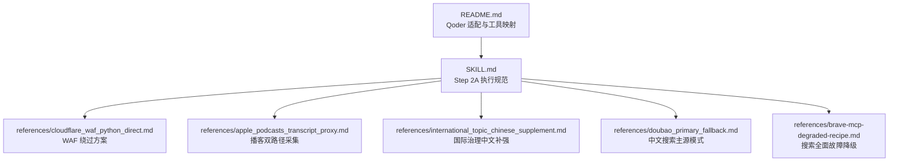
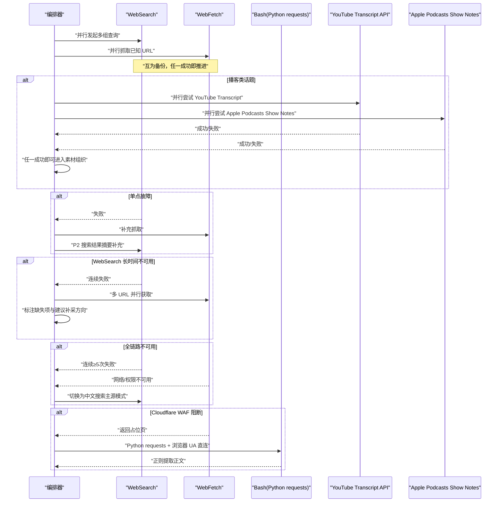
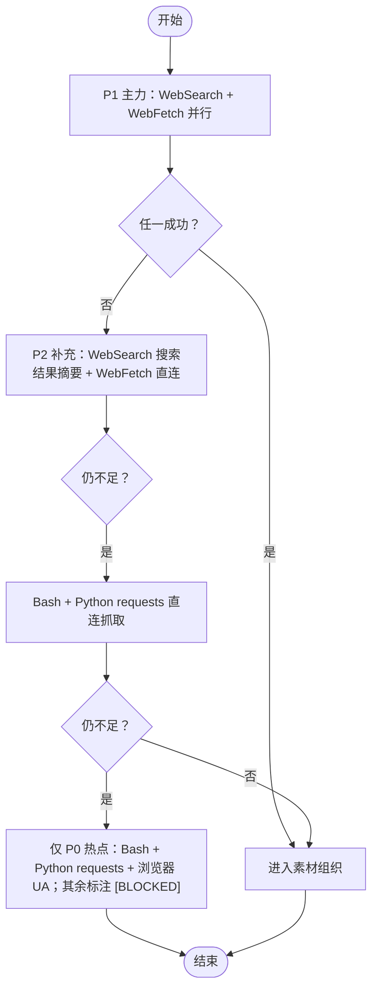
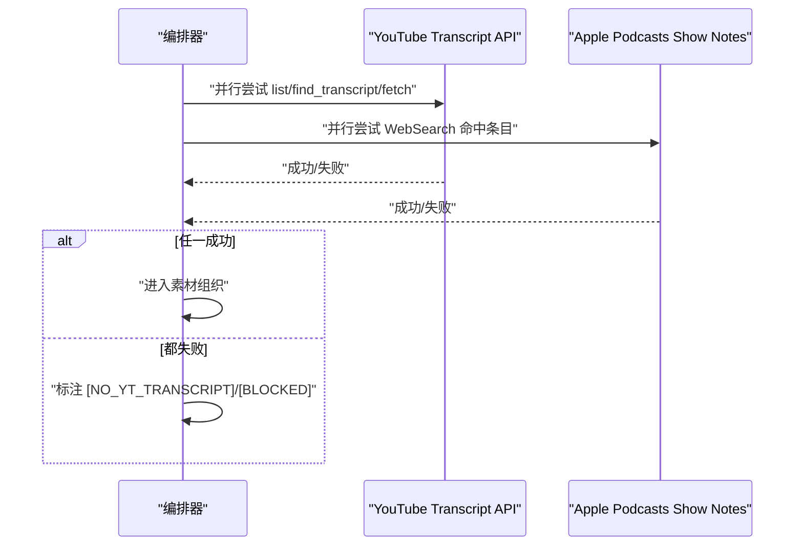
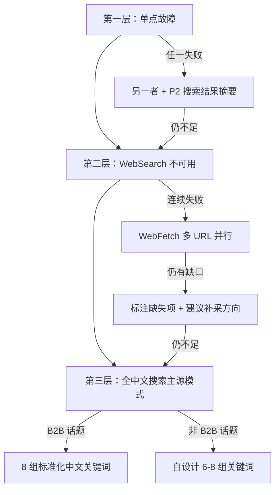
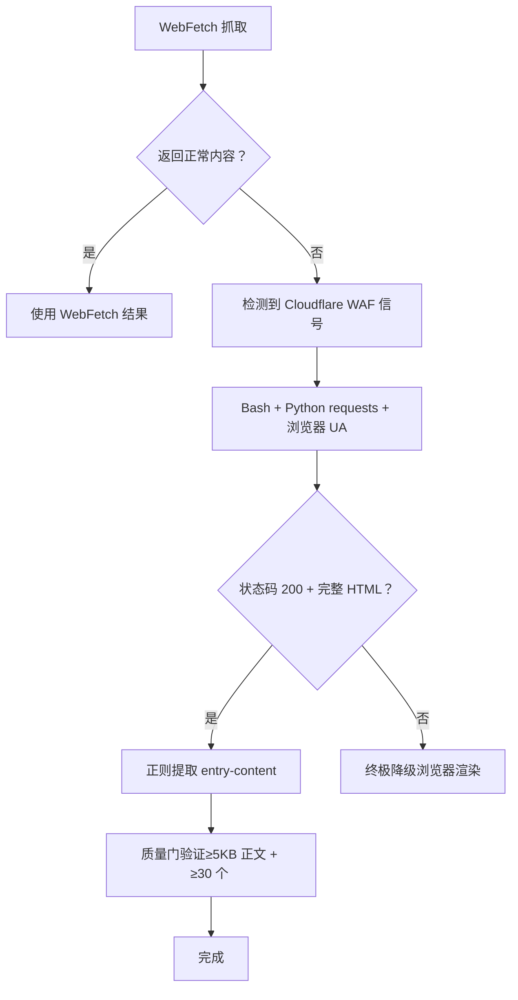
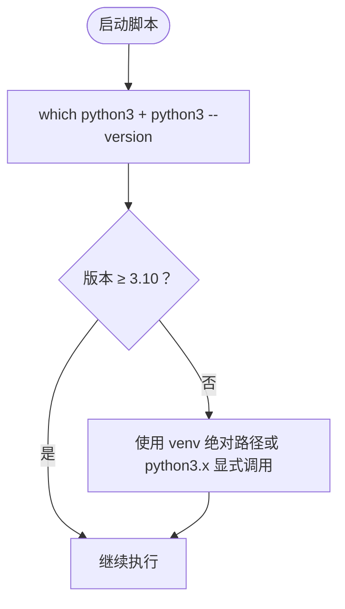
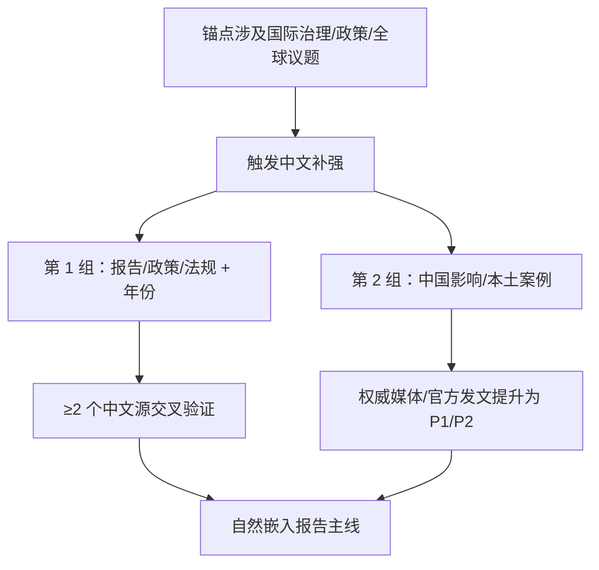
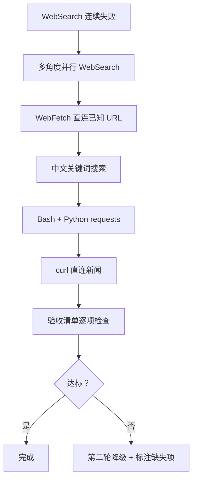
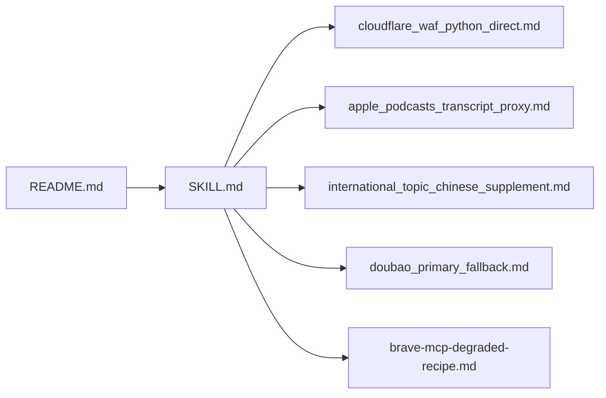

# 向内深挖模块

<cite>
**本文引用的文件**
- [SKILL.md](file://hotspot-topic-excavator/skills/hotspot-topic-excavator/SKILL.md)
- [README.md](file://hotspot-topic-excavator/README.md)
- [cloudflare_waf_python_direct.md](file://hotspot-topic-excavator/skills/hotspot-topic-excavator/references/cloudflare_waf_python_direct.md)
- [apple_podcasts_transcript_proxy.md](file://hotspot-topic-excavator/skills/hotspot-topic-excavator/references/apple_podcasts_transcript_proxy.md)
- [international_topic_chinese_supplement.md](file://hotspot-topic-excavator/skills/hotspot-topic-excavator/references/international_topic_chinese_supplement.md)
- [doubao_primary_fallback.md](file://hotspot-topic-excavator/skills/hotspot-topic-excavator/references/doubao_primary_fallback.md)
- [brave-mcp-degraded-recipe.md](file://hotspot-topic-excavator/skills/hotspot-topic-excavator/references/brave-mcp-degraded-recipe.md)
</cite>

## 目录
1. [引言](#引言)
2. [项目结构](#项目结构)
3. [核心组件](#核心组件)
4. [架构总览](#架构总览)
5. [详细组件分析](#详细组件分析)
6. [依赖关系分析](#依赖关系分析)
7. [性能考量](#性能考量)
8. [故障排查指南](#故障排查指南)
9. [结论](#结论)
10. [附录](#附录)

## 引言
本文件聚焦“向内深挖”模块（Step 2A）的实现细节与执行策略，围绕工具链配置、并行调用机制、三层降级路径、播客双路径采集、Cloudflare WAF 绕过、Python 环境路径诊断、国际治理话题中文补强等关键主题进行系统化说明。目标是帮助读者在不深入源码的情况下，也能准确理解并落地执行该模块的采集流程与容错策略。

## 项目结构
- 主技能定义位于 SKILL.md，包含 Step 2A 的执行工具链、并行策略、降级路径、播客双路径、中文补强规则等。
- README.md 提供 Qoder 适配说明、工具映射、安装与使用方式。
- references 目录下存放各专项参考文档，包括 Cloudflare WAF 绕过、Apple Podcasts show notes 替代、国际治理中文补强、搜索不可用时的降级 Recipe、以及中文搜索主源模式等。

**图表来源**
- [SKILL.md:82-176](file://hotspot-topic-excavator/skills/hotspot-topic-excavator/SKILL.md#L82-L176)
- [README.md:17-32](file://hotspot-topic-excavator/README.md#L17-L32)

**章节来源**
- [SKILL.md:82-176](file://hotspot-topic-excavator/skills/hotspot-topic-excavator/SKILL.md#L82-L176)
- [README.md:17-32](file://hotspot-topic-excavator/README.md#L17-L32)

## 核心组件
- 工具链与优先级：WebSearch（主力）、WebFetch（原文获取主力）、Bash（Python requests 直连，用于降级与 WAF 绕过）。
- 并行策略：多组 WebSearch 与 WebFetch 并行调用，互为备份；播客 transcript 双路径并行。
- 三层降级路径：单点故障处理 → WebSearch 不可用降级 → 全中文搜索主源模式。
- 播客双路径：YouTube Transcript API + Apple Podcasts show notes 并行执行。
- 中文补强：国际治理话题强制中文关键词搜索，提升政策与本土案例覆盖。
- 故障恢复：搜索全面故障时按降级 Recipe 执行，不等待自动恢复。

**章节来源**
- [SKILL.md:82-176](file://hotspot-topic-excavator/skills/hotspot-topic-excavator/SKILL.md#L82-L176)
- [SKILL.md:149-176](file://hotspot-topic-excavator/skills/hotspot-topic-excavator/SKILL.md#L149-L176)
- [SKILL.md:177-205](file://hotspot-topic-excavator/skills/hotspot-topic-excavator/SKILL.md#L177-L205)

## 架构总览
Step 2A 的执行以“并行优先、降级兜底”为核心原则。WebSearch 与 WebFetch 作为 P1 主力，Bash（Python requests）作为降级与反爬绕过手段。当搜索不可用时，中文搜索可升级为全信号主源；当两者均不可用时，进入降级 Recipe 的多路协同。

**图表来源**
- [SKILL.md:82-176](file://hotspot-topic-excavator/skills/hotspot-topic-excavator/SKILL.md#L82-L176)
- [cloudflare_waf_python_direct.md:81-93](file://hotspot-topic-excavator/skills/hotspot-topic-excavator/references/cloudflare_waf_python_direct.md#L81-L93)
- [apple_podcasts_transcript_proxy.md:72-84](file://hotspot-topic-excavator/skills/hotspot-topic-excavator/references/apple_podcasts_transcript_proxy.md#L72-L84)
- [doubao_primary_fallback.md:90-103](file://hotspot-topic-excavator/skills/hotspot-topic-excavator/references/doubao_primary_fallback.md#L90-L103)
- [brave-mcp-degraded-recipe.md:10-68](file://hotspot-topic-excavator/skills/hotspot-topic-excavator/references/brave-mcp-degraded-recipe.md#L10-L68)

## 详细组件分析

### Step 2A 执行工具链与优先级
- 主力工具：WebSearch（多源搜索、交叉验证、英文信源）、WebFetch（博客/Substack/Medium/新闻长文、网页内容提取）。
- 时效信号：WebSearch 带 timeRange=OneDay/OneWeek。
- 中文信源：WebSearch 中文关键词。
- 降级直连：Bash（Python requests），用于 Cloudflare WAF 站点与反爬场景。
- 播客替代：WebFetch/WebSearch 作为 YouTube Transcript 失败时的首选降级。

**图表来源**
- [SKILL.md:82-128](file://hotspot-topic-excavator/skills/hotspot-topic-excavator/SKILL.md#L82-L128)

**章节来源**
- [SKILL.md:82-128](file://hotspot-topic-excavator/skills/hotspot-topic-excavator/SKILL.md#L82-L128)

### 播客 transcript 双路径并行采集
- 路径 A：YouTube Transcript API（Bash 执行 Python youtube_transcript_api），逐字稿完整度最高。
- 路径 B：Apple Podcasts show notes（WebSearch 命中条目后读取章节时间码+金句），完整度约 90%。
- 执行规则：两条路径同时并行，任一成功即可进入素材组织；都成功则交叉校验金句准确性。

**图表来源**
- [apple_podcasts_transcript_proxy.md:72-84](file://hotspot-topic-excavator/skills/hotspot-topic-excavator/references/apple_podcasts_transcript_proxy.md#L72-L84)
- [SKILL.md:98-112](file://hotspot-topic-excavator/skills/hotspot-topic-excavator/SKILL.md#L98-L112)

**章节来源**
- [apple_podcasts_transcript_proxy.md:1-95](file://hotspot-topic-excavator/skills/hotspot-topic-excavator/references/apple_podcasts_transcript_proxy.md#L1-L95)
- [SKILL.md:98-112](file://hotspot-topic-excavator/skills/hotspot-topic-excavator/SKILL.md#L98-L112)

### 三层降级路径设计
- 第一层：单点故障处理
  - WebSearch + WebFetch 并行；任一失败由另一者补充，必要时引入 P2 搜索结果摘要。
- 第二层：WebSearch 长时间不可用
  - 全部降级到 WebFetch 直连已知 URL，多 URL 并行获取；仍有缺口则标注具体缺失项与建议补采方向。
- 第三层：WebSearch + WebFetch 同时不可用
  - 中文搜索从“Chinese supplement”升级为全信号主采集源，承载全部中英文信号；B2B 与非 B2B 分别采用标准化模板或自设计关键词。

**图表来源**
- [SKILL.md:114-147](file://hotspot-topic-excavator/skills/hotspot-topic-excavator/SKILL.md#L114-L147)
- [doubao_primary_fallback.md:29-86](file://hotspot-topic-excavator/skills/hotspot-topic-excavator/references/doubao_primary_fallback.md#L29-L86)

**章节来源**
- [SKILL.md:114-147](file://hotspot-topic-excavator/skills/hotspot-topic-excavator/SKILL.md#L114-L147)
- [doubao_primary_fallback.md:1-119](file://hotspot-topic-excavator/skills/hotspot-topic-excavator/references/doubao_primary_fallback.md#L1-L119)

### Cloudflare WAF 绕过方案
- 现象：WebFetch 返回占位文本（如 “Please wait...”），同一 URL 通过 Bash + Python requests + 浏览器 UA 可获取完整 HTML。
- 根因：Cloudflare WAF 对 fetcher 特征敏感，带浏览器 UA 的请求可通过 challenge。
- 决策树：WebFetch 被挡 → Bash + Python requests + 浏览器 UA → 正则提取 entry-content → 质量门验证（≥5KB 正文且 ≥30 个 
）。

**图表来源**
- [cloudflare_waf_python_direct.md:81-93](file://hotspot-topic-excavator/skills/hotspot-topic-excavator/references/cloudflare_waf_python_direct.md#L81-L93)
- [cloudflare_waf_python_direct.md:125-139](file://hotspot-topic-excavator/skills/hotspot-topic-excavator/references/cloudflare_waf_python_direct.md#L125-L139)

**章节来源**
- [cloudflare_waf_python_direct.md:1-139](file://hotspot-topic-excavator/skills/hotspot-topic-excavator/references/cloudflare_waf_python_direct.md#L1-L139)

### Python 环境路径解析问题诊断
- 症状：urllib3 报错 TypeError（PEP 604 语法需要 Python 3.10+），但 shebang 解析到系统 Python 3.9.x。
- 根因：venv 中为 Python 3.11+，但 python3 指向系统版本导致兼容性问题。
- 修复：使用 venv 绝对路径或显式 python3.x 调用脚本，避免修改 shebang。

**图表来源**
- [SKILL.md:149-168](file://hotspot-topic-excavator/skills/hotspot-topic-excavator/SKILL.md#L149-L168)

**章节来源**
- [SKILL.md:149-168](file://hotspot-topic-excavator/skills/hotspot-topic-excavator/SKILL.md#L149-L168)

### 国际治理话题中文补强策略
- 触发条件：联合国/国际组织报告、跨国治理框架、全球行业事件、跨境监管动作、全球统计数据。
- 执行规则：强制调用中文关键词搜索 1-2 组；中文独有视角提升为 P1/P2；标注发布时间戳并与英文区分。
- 处理方式：将中文视角自然嵌入报告主线，而非单独成章；关键数据需 ≥2 个中文源交叉验证。

**图表来源**
- [international_topic_chinese_supplement.md:32-104](file://hotspot-topic-excavator/skills/hotspot-topic-excavator/references/international_topic_chinese_supplement.md#L32-L104)

**章节来源**
- [international_topic_chinese_supplement.md:1-133](file://hotspot-topic-excavator/skills/hotspot-topic-excavator/references/international_topic_chinese_supplement.md#L1-L133)

### 搜索工具全面故障降级 Recipe
- 触发条件：WebSearch 连续 ≥3 次失败或返回异常，且 WebFetch 也不可用。
- 降级链：多角度并行 WebSearch → WebFetch 直连已知 URL → 中文关键词搜索 → Bash + Python requests → curl 直连。
- 验收清单：每个核心种子至少 2 个独立信源；至少 1 个 P1；中国版至少 1 条；反对/边界条件至少 1 条；时间戳在 ±30 天内；参考资料链接实测可打开。

**图表来源**
- [brave-mcp-degraded-recipe.md:10-102](file://hotspot-topic-excavator/skills/hotspot-topic-excavator/references/brave-mcp-degraded-recipe.md#L10-L102)

**章节来源**
- [brave-mcp-degraded-recipe.md:1-102](file://hotspot-topic-excavator/skills/hotspot-topic-excavator/references/brave-mcp-degraded-recipe.md#L1-L102)

## 依赖关系分析
- 主技能文件依赖多个 reference 文档，形成“规范 + 专项方案”的结构化知识体系。
- 工具映射由 README.md 明确，确保 Hermes → Qoder 的工具链一致性。

**图表来源**
- [SKILL.md:377-415](file://hotspot-topic-excavator/skills/hotspot-topic-excavator/SKILL.md#L377-L415)
- [README.md:17-32](file://hotspot-topic-excavator/README.md#L17-L32)

**章节来源**
- [SKILL.md:377-415](file://hotspot-topic-excavator/skills/hotspot-topic-excavator/SKILL.md#L377-L415)
- [README.md:17-32](file://hotspot-topic-excavator/README.md#L17-L32)

## 性能考量
- 并行优先：多组 WebSearch 与 WebFetch 并行调用，减少串行等待。
- 降级快速切换：一旦检测到失败信号，立即切换到下一路径，避免阻塞。
- 质量门控：对 Bash 直连结果进行质量门验证，确保正文完整性与可读性。
- 中文主源模式：在搜索不可用时，利用中文搜索的高转述覆盖率维持信息完整度。

[本节为通用指导，无需特定文件引用]

## 故障排查指南
- Cloudflare WAF 阻断：检测占位文本 → 切换 Bash + Python requests + 浏览器 UA → 正则提取 → 质量门验证。
- Python 环境路径：出现 urllib3 TypeError → 检查 which python3 与版本 → 使用 venv 绝对路径或 python3.x 显式调用。
- 搜索全面故障：按降级 Recipe 执行，不等待自动恢复；完成后逐项验收清单检查。
- 播客 transcript 失败：任一路径成功即可推进；都失败则标注 [NO_YT_TRANSCRIPT]/[BLOCKED]。

**章节来源**
- [cloudflare_waf_python_direct.md:81-93](file://hotspot-topic-excavator/skills/hotspot-topic-excavator/references/cloudflare_waf_python_direct.md#L81-L93)
- [SKILL.md:149-168](file://hotspot-topic-excavator/skills/hotspot-topic-excavator/SKILL.md#L149-L168)
- [brave-mcp-degraded-recipe.md:82-102](file://hotspot-topic-excavator/skills/hotspot-topic-excavator/references/brave-mcp-degraded-recipe.md#L82-L102)
- [apple_podcasts_transcript_proxy.md:72-84](file://hotspot-topic-excavator/skills/hotspot-topic-excavator/references/apple_podcasts_transcript_proxy.md#L72-L84)

## 结论
Step 2A 的“向内深挖”模块以并行优先与多层降级为核心，确保在不同网络与平台限制下仍能稳定产出高质量素材。通过明确的工具优先级、严格的降阶策略、播客双路径并行、WAF 绕过方案、Python 环境诊断与国际治理中文补强，该模块具备高鲁棒性与可扩展性，适合持续生产与复杂场景下的深度挖掘任务。

[本节为总结性内容，无需特定文件引用]

## 附录
- 工具映射与适配说明参见 README.md。
- 各专项参考文档可在 references 目录查阅，涵盖 WAF 绕过、播客替代、国际治理中文补强、搜索不可用降级、中文搜索主源模式等。

**章节来源**
- [README.md:17-32](file://hotspot-topic-excavator/README.md#L17-L32)
- [SKILL.md:377-415](file://hotspot-topic-excavator/skills/hotspot-topic-excavator/SKILL.md#L377-L415)