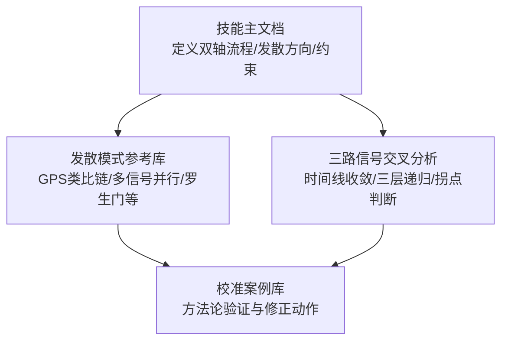
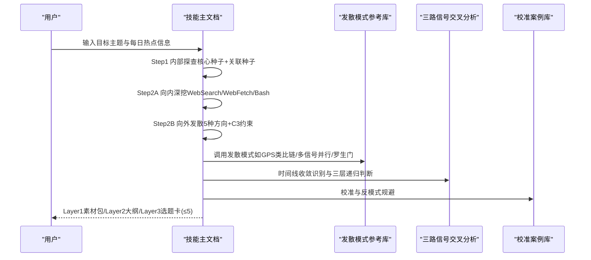
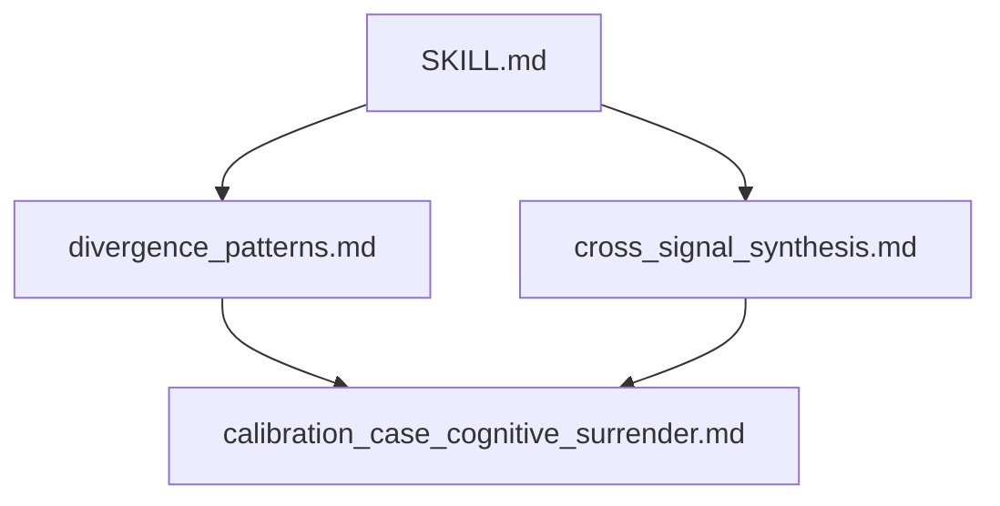
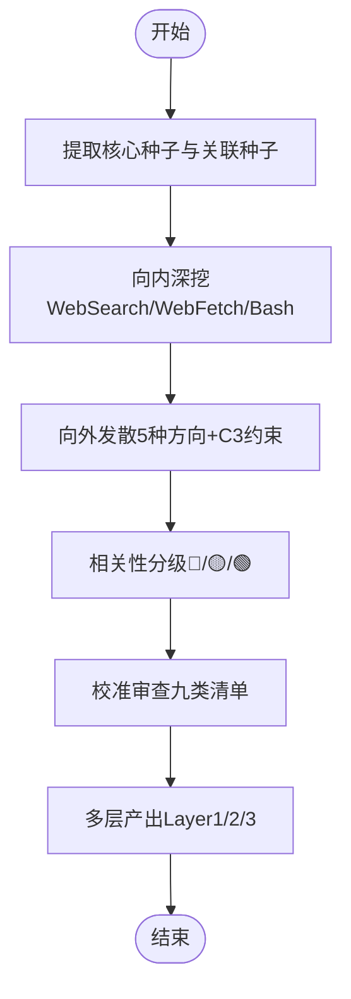

# 向外发散模块

<cite>
**本文引用的文件**   
- [SKILL.md](file://hotspot-topic-excavator/skills/hotspot-topic-excavator/SKILL.md)
- [divergence_patterns.md](file://hotspot-topic-excavator/skills/hotspot-topic-excavator/references/divergence_patterns.md)
- [cross_signal_synthesis.md](file://hotspot-topic-excavator/skills/hotspot-topic-excavator/references/cross_signal_synthesis.md)
- [calibration_case_cognitive_surrender.md](file://hotspot-topic-excavator/skills/hotspot-topic-excavator/references/calibration_case_cognitive_surrender.md)
</cite>

## 目录
1. [引言](#引言)
2. [项目结构](#项目结构)
3. [核心组件](#核心组件)
4. [架构总览](#架构总览)
5. [详细组件分析](#详细组件分析)
6. [依赖分析](#依赖分析)
7. [性能考量](#性能考量)
8. [故障排查指南](#故障排查指南)
9. [结论](#结论)
10. [附录](#附录)

## 引言
本文件聚焦“向外发散模块”的核心算法与执行策略，系统解析五种发散模式的实现逻辑、边界控制（C3约束）、关联发现方法（语义相似度、知识图谱关联、时间线收敛识别）、质量评估标准，并提供案例演示与最佳实践。该模块以热点为锚点，在“向内深挖 + 向外发散”的双轴模型中，产出多层弹药库并生成可执行的再创作选题建议。

## 项目结构
向外发散能力由技能主文档与参考模式共同构成：
- 技能主文档定义双轴流程、发散方向、相关性分级、信源优先级与审查校准机制
- 参考模式库沉淀了跨领域类比迁移、多信号并行搜索、罗生门叙事结构等经过验证的发散范式
- 三路信号交叉分析模式提供时间线收敛识别与三层递归判断的方法论支撑
- 校准案例库对发散模式的有效性进行实证校验

图表来源
- [SKILL.md:177-197](file://hotspot-topic-excavator/skills/hotspot-topic-excavator/SKILL.md#L177-L197)
- [divergence_patterns.md:1-38](file://hotspot-topic-excavator/skills/hotspot-topic-excavator/references/divergence_patterns.md#L1-L38)
- [cross_signal_synthesis.md:1-37](file://hotspot-topic-excavator/skills/hotspot-topic-excavator/references/cross_signal_synthesis.md#L1-L37)

章节来源
- [SKILL.md:177-197](file://hotspot-topic-excavator/skills/hotspot-topic-excavator/SKILL.md#L177-L197)
- [divergence_patterns.md:1-38](file://hotspot-topic-excavator/skills/hotspot-topic-excavator/references/divergence_patterns.md#L1-L38)
- [cross_signal_synthesis.md:1-37](file://hotspot-topic-excavator/skills/hotspot-topic-excavator/references/cross_signal_synthesis.md#L1-L37)

## 核心组件
- 发散方向与边界控制
  - 五种发散方向：关联话题/邻近事件、上下游概念/对立面、跨领域类比迁移、同主题不同切入角度、衍生新选题机会
  - C3约束：发散选题≤5个，每个必须能溯源回锚点
- 相关性分级与信源优先级
  - 层级：核心层（直接相关）、强关联层（紧密延伸）、可延展层（激发新选题）
  - 信源优先级：P1一手来源、P2权威媒体、P3社区讨论
- 校准与审查
  - 九类校准清单覆盖事实、框架、对立视角、理论偏向、叙事引力、受众工具链翻译、三角叙事补洞等维度

章节来源
- [SKILL.md:177-197](file://hotspot-topic-excavator/skills/hotspot-topic-excavator/SKILL.md#L177-L197)
- [SKILL.md:256-276](file://hotspot-topic-excavator/skills/hotspot-topic-excavator/SKILL.md#L256-L276)

## 架构总览
向外发散模块的执行路径遵循“种子提取 → 双向采集（深挖+发散）→ 相关性分级 → 校准审查 → 多层产出”的流水线。发散阶段受C3约束，确保创新性与可溯源性并重。

图表来源
- [SKILL.md:177-197](file://hotspot-topic-excavator/skills/hotspot-topic-excavator/SKILL.md#L177-L197)
- [divergence_patterns.md:1-38](file://hotspot-topic-excavator/skills/hotspot-topic-excavator/references/divergence_patterns.md#L1-L38)
- [cross_signal_synthesis.md:1-37](file://hotspot-topic-excavator/skills/hotspot-topic-excavator/references/cross_signal_synthesis.md#L1-L37)

## 详细组件分析

### 组件一：关联话题发现（邻近事件与横向关联）
- 触发条件
  - 锚点存在相邻热点或同一时间窗口内的并发事件
- 算法要点
  - 种子提取：从每日热点信息中抽取“关联种子”，作为联网锚点
  - 横向检索：结合V1/V2档案中的横向关联话题，避免重复与遗漏
  - 时间线收敛：当信号≥2且出现于±7天内，强制进入三路交叉分析，识别是否构成同一场对话
- 输出与用途
  - 归入强关联层（🟡），用于论证支撑与时间线补全

章节来源
- [SKILL.md:74-81](file://hotspot-topic-excavator/skills/hotspot-topic-excavator/SKILL.md#L74-L81)
- [cross_signal_synthesis.md:1-37](file://hotspot-topic-excavator/skills/hotspot-topic-excavator/references/cross_signal_synthesis.md#L1-L37)

### 组件二：上下游概念延伸（前提/反方/对立张力）
- 触发条件
  - 锚点概念具备明确的学术/行业反方或前置假设
- 算法要点
  - 反方识别：从核心信源中提取被引用或批评的人物/观点
  - 原文获取：通过WebSearch/WebFetch获取反方原文，建立“正方-反方-综合”三层结构
  - 对立张力：将矛盾叙事并置，增强内容智识张力
- 输出与用途
  - 归入强关联层（🟡），用于构建完整论据链与平台差异化大纲

章节来源
- [divergence_patterns.md:89-109](file://hotspot-topic-excavator/skills/hotspot-topic-excavator/references/divergence_patterns.md#L89-L109)
- [SKILL.md:177-197](file://hotspot-topic-excavator/skills/hotspot-topic-excavator/SKILL.md#L177-L197)

### 组件三：跨领域类比迁移（GPS类比链）
- 触发条件
  - 锚点涉及认知功能外包、技能退化、工具依赖等概念；需要“这不只是AI的问题”的证据
- 算法要点
  - 三阶段阶梯搜索：
    - 阶段1：建立类比基础（科学背书与非技术类比文章）
    - 阶段2：连接到AI（明确将历史现象与AI关联的文章）
    - 阶段3：深化类比链（方向性类比与替代方案对照）
  - 类比链路模板：具体现象 → 反向现象 → 规律提炼 → 当代映射 → 出路对照
- 输出与用途
  - 归入可延展层（🟢），形成独立抖音/小红书选题，提升内容生产价值

章节来源
- [divergence_patterns.md:8-57](file://hotspot-topic-excavator/skills/hotspot-topic-excavator/references/divergence_patterns.md#L8-L57)
- [calibration_case_cognitive_surrender.md:57-74](file://hotspot-topic-excavator/skills/hotspot-topic-excavator/references/calibration_case_cognitive_surrender.md#L57-L74)

### 组件四：同主题多视角切入（换视角的新解读）
- 触发条件
  - 同一话题在不同信源类型（企业行为/媒体调查/政府数据）给出矛盾结论
- 算法要点
  - 罗生门叙事结构：
    - 步骤1：识别三路矛盾信号（不同信源类型）
    - 步骤2：验证每条叙事的局部真值
    - 步骤3：并置揭示“完整真相”（张力关系即结论）
  - 独立性矩阵：检验三源是否具备独立的利益结构与认识路径
- 输出与用途
  - 归入强关联层（🟡），用于构建高共鸣的多维叙事

章节来源
- [divergence_patterns.md:238-323](file://hotspot-topic-excavator/skills/hotspot-topic-excavator/references/divergence_patterns.md#L238-L323)
- [cross_signal_synthesis.md:77-136](file://hotspot-topic-excavator/skills/hotspot-topic-excavator/references/cross_signal_synthesis.md#L77-L136)

### 组件五：衍生新选题机会（可独立成篇的新方向）
- 触发条件
  - 锚点激发出具备高内容生产价值的独立方向
- 算法要点
  - 多信号并行搜索：单轮并行启动多个WebSearch组，覆盖核心信号与发散轴
  - 参数调优：按搜索类型调整count/freshness，兼顾时效与覆盖面
  - 降级模式：全WebSearch降级（Brave+WebFetch不可用）时，以多角度搜索覆盖所有种子信号
- 输出与用途
  - 归入可延展层（🟢），形成Layer 3完整选题卡（标题/角度/形式/步骤/平台/溯源）

章节来源
- [divergence_patterns.md:142-234](file://hotspot-topic-excavator/skills/hotspot-topic-excavator/references/divergence_patterns.md#L142-L234)
- [SKILL.md:230-237](file://hotspot-topic-excavator/skills/hotspot-topic-excavator/SKILL.md#L230-L237)

### 发散边界控制机制（C3约束）
- 规则
  - 发散选题≤5个
  - 每个选题必须能溯源回锚点（提供信源与连接逻辑）
- 执行位置
  - Step 2B 向外发散阶段强制生效
  - Layer 3 再创作选题建议输出前再次校验

章节来源
- [SKILL.md:177-197](file://hotspot-topic-excavator/skills/hotspot-topic-excavator/SKILL.md#L177-L197)

### 关联发现的算法原理
- 语义相似度计算
  - 通过种子提取与关键词组合，使用WebSearch的多角度搜索实现语义匹配与扩展
  - 中文补强与文化镜像：针对国际治理与媒体文化趋势话题，采用情绪/身份锚定关键词提升中文镜像对比效果
- 知识图谱关联
  - 横向关联：结合V1/V2档案中的既有横向关联话题，构建“锚点—邻近事件—跨域类比”的关系网络
  - 三源独立性验证：通过立场/利益结构/认知路径的矩阵评估，确认真正多源而非重复引用
- 时间线收敛识别
  - 适用条件：种子信号≥2且出现于±7天内
  - 三层递归识别：事实层→叙事层→意义层递进
  - 拐点判断：分三层诚实回答（已到/正在加速/数据不足）

章节来源
- [SKILL.md:169-176](file://hotspot-topic-excavator/skills/hotspot-topic-excavator/SKILL.md#L169-L176)
- [cross_signal_synthesis.md:1-37](file://hotspot-topic-excavator/skills/hotspot-topic-excavator/references/cross_signal_synthesis.md#L1-L37)
- [cross_signal_synthesis.md:77-136](file://hotspot-topic-excavator/skills/hotspot-topic-excavator/references/cross_signal_synthesis.md#L77-L136)

### 发散质量评估标准
- 创新性
  - 是否提供“超出任一单路信号的认知”（三路合力后新判断）
  - 是否具备高内容生产价值（可直接落地为多平台内容）
- 关联性
  - 是否满足C3约束（≤5个且可溯源回锚点）
  - 是否归入正确相关性层级（🔴/🟡/🟢）
- 可信度
  - 三源独立性验证通过
  - 信源优先级符合P1/P2/P3要求
- 可执行性
  - Layer 3选题卡包含标题/角度/形式/步骤/平台/溯源说明

章节来源
- [SKILL.md:189-204](file://hotspot-topic-excavator/skills/hotspot-topic-excavator/SKILL.md#L189-L204)
- [cross_signal_synthesis.md:39-46](file://hotspot-topic-excavator/skills/hotspot-topic-excavator/references/cross_signal_synthesis.md#L39-L46)
- [divergence_patterns.md:142-234](file://hotspot-topic-excavator/skills/hotspot-topic-excavator/references/divergence_patterns.md#L142-L234)

### 实际案例演示
- GPS类比链验证
  - 三步类比链成为独立抖音/小红书选题，内容生产价值高
  - 第三步需保持“科学假设”语气，若无可支撑文献则降级为两步并标注未来研究方向
- 多信号并行搜索
  - 单轮并行启动6-7个工具，覆盖核心信号与发散轴，一次性合成素材
  - 全WebSearch降级模式下仍可达85-93%信息完整度
- 罗生门叙事结构
  - 三条叙事同时成立的原因在于描述同一现象的不同层面，完整真相在张力关系中

章节来源
- [calibration_case_cognitive_surrender.md:57-74](file://hotspot-topic-excavator/skills/hotspot-topic-excavator/references/calibration_case_cognitive_surrender.md#L57-L74)
- [divergence_patterns.md:142-234](file://hotspot-topic-excavator/skills/hotspot-topic-excavator/references/divergence_patterns.md#L142-L234)
- [divergence_patterns.md:238-323](file://hotspot-topic-excavator/skills/hotspot-topic-excavator/references/divergence_patterns.md#L238-L323)

### 最佳实践指导
- 启动配置先行：复述当前配置（C1配比/C2粒度/C3边界），必要时调整
- 真实可溯源优先：杜绝编造链接/数据，无法溯源者标注“待核实”
- 工具并行化：Step 2A中多组WebSearch与WebFetch尽可能并行调用
- 校准审查强制：初稿完成后逐项过九类校准清单，嵌入报告末尾
- 平台差异化：根据平台特性设计大纲与素材侧重（抖音/B站/公众号/小红书）

章节来源
- [SKILL.md:59-70](file://hotspot-topic-excavator/skills/hotspot-topic-excavator/SKILL.md#L59-L70)
- [SKILL.md:362-374](file://hotspot-topic-excavator/skills/hotspot-topic-excavator/SKILL.md#L362-L374)
- [SKILL.md:240-248](file://hotspot-topic-excavator/skills/hotspot-topic-excavator/SKILL.md#L240-L248)

## 依赖分析
- 组件耦合
  - 技能主文档驱动发散流程，依赖发散模式参考库与三路信号交叉分析方法
  - 校准案例库对发散模式进行实证校验，反馈至模式优化
- 外部依赖
  - WebSearch/WebFetch/Bash工具链用于信息采集与降级处理
  - 中文搜索主源模式在WebSearch不可用时升级为全信号主采集源

图表来源
- [SKILL.md:177-197](file://hotspot-topic-excavator/skills/hotspot-topic-excavator/SKILL.md#L177-L197)
- [divergence_patterns.md:1-38](file://hotspot-topic-excavator/skills/hotspot-topic-excavator/references/divergence_patterns.md#L1-L38)
- [cross_signal_synthesis.md:1-37](file://hotspot-topic-excavator/skills/hotspot-topic-excavator/references/cross_signal_synthesis.md#L1-L37)
- [calibration_case_cognitive_surrender.md:57-74](file://hotspot-topic-excavator/skills/hotspot-topic-excavator/references/calibration_case_cognitive_surrender.md#L57-L74)

章节来源
- [SKILL.md:177-197](file://hotspot-topic-excavator/skills/hotspot-topic-excavator/SKILL.md#L177-L197)
- [divergence_patterns.md:1-38](file://hotspot-topic-excavator/skills/hotspot-topic-excavator/references/divergence_patterns.md#L1-L38)
- [cross_signal_synthesis.md:1-37](file://hotspot-topic-excavator/skills/hotspot-topic-excavator/references/cross_signal_synthesis.md#L1-L37)

## 性能考量
- 并行化策略
  - 多组WebSearch与WebFetch并行调用，互为备份，提升采集效率
  - 单轮并行启动6-7个工具，一次性合成素材，减少往返延迟
- 降级路径
  - 第一层：单点故障（WebSearch/WebFetch并行）
  - 第二层：WebSearch长时间不可用（直连已知URL并行获取）
  - 第三层：中文搜索主源模式（全信号主采集源）
- 信息完整度
  - LLM Context与WebSearch交叉可达95%完整度
  - 全WebSearch降级模式可达85-93%完整度

章节来源
- [SKILL.md:84-147](file://hotspot-topic-excavator/skills/hotspot-topic-excavator/SKILL.md#L84-L147)
- [divergence_patterns.md:60-86](file://hotspot-topic-excavator/skills/hotspot-topic-excavator/references/divergence_patterns.md#L60-L86)
- [divergence_patterns.md:183-234](file://hotspot-topic-excavator/skills/hotspot-topic-excavator/references/divergence_patterns.md#L183-L234)

## 故障排查指南
- Python环境路径解析问题
  - 症状：urllib3报错TypeError，Python版本不匹配
  - 诊断：检查python3版本与venv绝对路径
  - 修复：显式调用python3.x绝对路径，不修改shebang
- Cloudflare WAF绕过
  - 症状：WebFetch返回占位页
  - 解决：Bash+Python requests直连抓取，保留entry-content块
- 播客transcript双路径
  - 路径A：YouTube Transcript API（逐字稿）
  - 路径B：Apple Podcasts show notes（金句+结构）
  - 执行：两条路径并行，任一成功即可继续

章节来源
- [SKILL.md:149-168](file://hotspot-topic-excavator/skills/hotspot-topic-excavator/SKILL.md#L149-L168)
- [SKILL.md:98-128](file://hotspot-topic-excavator/skills/hotspot-topic-excavator/SKILL.md#L98-L128)

## 结论
向外发散模块以C3约束为核心边界，通过五种发散模式与三路信号交叉分析，实现“创新性与关联性并重”的高质量选题生成。并行化工具链与多级降级策略保障采集效率与鲁棒性，校准审查与反模式规避确保内容可信度与可执行性。

## 附录
- 术语表
  - 锚点：本次深挖的唯一主题起点
  - 种子：核心种子与关联种子，作为联网锚点
  - 相关性层级：核心层（🔴）、强关联层（🟡）、可延展层（🟢）
  - 信源优先级：P1一手来源、P2权威媒体、P3社区讨论
- 流程图（概念性）
