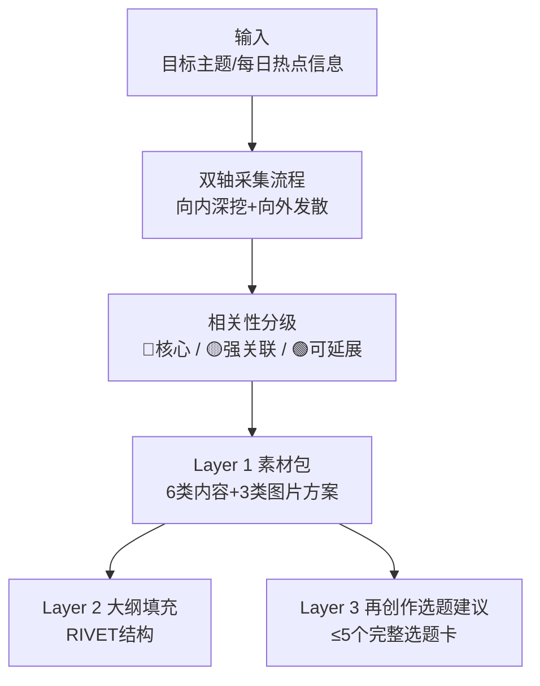
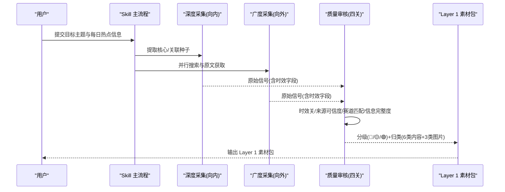
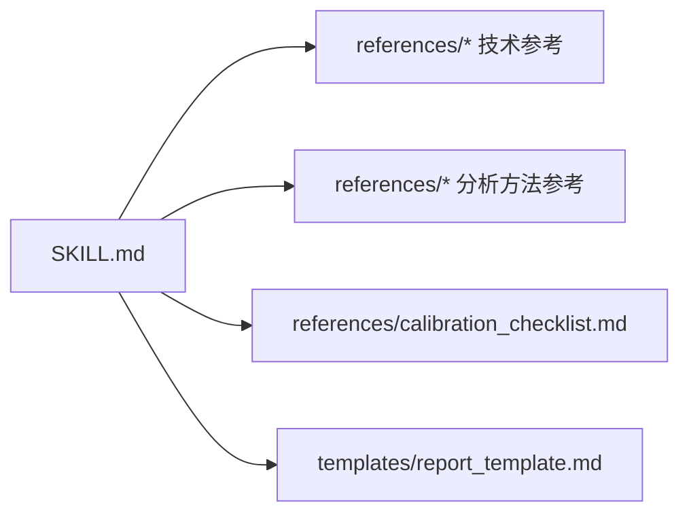

# Layer 1 素材包

<cite>
**本文引用的文件**
- [hotspot-topic-excavator/SKILL.md](file://hotspot-topic-excavator/skills/hotspot-topic-excavator/SKILL.md)
- [report_template.md（深挖报告模板）](file://hotspot-topic-excavator/skills/hotspot-topic-excavator/templates/report_template.md)
- [data_quality.md](file://.skills/hotspot-research/references/data_quality.md)
- [tags.md](file://.skills/hotspot-research/references/tags.md)
- [calibration_checklist.md](file://hotspot-topic-excavator/skills/hotspot-topic-excavator/references/calibration_checklist.md)
</cite>

## 目录
1. [引言](#引言)
2. [项目结构](#项目结构)
3. [核心组件](#核心组件)
4. [架构总览](#架构总览)
5. [详细组件分析](#详细组件分析)
6. [依赖关系分析](#依赖关系分析)
7. [性能与可用性考量](#性能与可用性考量)
8. [故障排查指南](#故障排查指南)
9. [结论](#结论)
10. [附录：模板字段规范与检查清单](#附录模板字段规范与检查清单)

## 引言
本文件聚焦“Layer 1 素材包”的完整结构与组织逻辑，围绕以下目标展开：
- 明确 6 类内容素材的分类标准与采集方法
- 解释 3 层分级系统（红🔴/黄🟡/绿🟢）的判定标准与优先级管理
- 阐述图片素材方案的三类设计（文章配图、可下载图源、AI 绘图提示词）
- 提供完整的表格模板使用指南与数据字段规范
- 给出素材质量评估标准与信源完整性检查清单

## 项目结构
Layer 1 素材包由“热点主题素材深挖采集器”Skill 驱动，输出包含三层产物：Layer 1 素材包、Layer 2 大纲填充、Layer 3 再创作选题建议。其中 Layer 1 素材包按“6 类内容 + 3 类图片素材”模块化组织，并内嵌红/黄/绿三级分层标签。

图表来源
- [hotspot-topic-excavator/SKILL.md:72-187](file://hotspot-topic-excavator/skills/hotspot-topic-excavator/SKILL.md#L72-L187)
- [hotspot-topic-excavator/SKILL.md:207-237](file://hotspot-topic-excavator/skills/hotspot-topic-excavator/SKILL.md#L207-L237)

章节来源
- [hotspot-topic-excavator/SKILL.md:1-130](file://hotspot-topic-excavator/skills/hotspot-topic-excavator/SKILL.md#L1-L130)
- [hotspot-topic-excavator/SKILL.md:207-237](file://hotspot-topic-excavator/skills/hotspot-topic-excavator/SKILL.md#L207-L237)

## 核心组件
- 双轴采集流程：以“向内深挖 + 向外发散”为骨架，先提取种子，再并行执行多源采集与交叉验证。
- 相关性分级：将素材分为核心层（🔴）、强关联层（🟡）、可延展层（🟢），用于后续组织与呈现。
- 素材分类：6 类内容素材（热点资讯流、硬核事实、权威引述、案例故事、对立张力、可视化依据）。
- 图片素材方案：3 类（文章内可用配图、可下载图源、AI 绘图 prompt 概要）。
- 多层产出组装：Layer 1 素材包 → Layer 2 大纲填充 → Layer 3 选题建议。

章节来源
- [hotspot-topic-excavator/SKILL.md:72-187](file://hotspot-topic-excavator/skills/hotspot-topic-excavator/SKILL.md#L72-L187)
- [hotspot-topic-excavator/SKILL.md:189-204](file://hotspot-topic-excavator/skills/hotspot-topic-excavator/SKILL.md#L189-L204)
- [hotspot-topic-excavator/SKILL.md:207-237](file://hotspot-topic-excavator/skills/hotspot-topic-excavator/SKILL.md#L207-L237)

## 架构总览
下图展示从输入到 Layer 1 素材包的端到端流程，以及关键质量控制点（时效、可信度、赛道匹配、完整度）。

图表来源
- [hotspot-topic-excavator/SKILL.md:72-187](file://hotspot-topic-excavator/skills/hotspot-topic-excavator/SKILL.md#L72-L187)
- [data_quality.md:10-76](file://.skills/hotspot-research/references/data_quality.md#L10-L76)

## 详细组件分析

### 一、6 类内容素材的分类标准与采集方法
- 热点资讯流
  - 采集内容：相关新闻、社区讨论的最新动态
  - 质量标准：时效性优先
  - 采集要点：优先 WebSearch(timeRange=OneDay/OneWeek) + WebFetch 抓取高价值页面；保留发布时间字段
- 硬核事实
  - 采集内容：原始数据、实验细节、具体数字
  - 质量标准：必须可溯源（P1/P2/P3 标注）
  - 采集要点：一手来源优先（原论文/原报告/官方发布/作者本人发文）
- 权威引述
  - 采集内容：专家观点、可直接引用的金句
  - 质量标准：保留英文原文 + 中译
  - 采集要点：尽量引用 P1 来源；必要时用 P2 权威媒体补充
- 案例故事
  - 采集内容：可叙事化的真实事件
  - 质量标准：含时间/人物/冲突/结果
  - 采集要点：优先有清晰时间线与多方信源的案例
- 对立张力
  - 采集内容：争议点、反方观点、质疑声音
  - 质量标准：增强张力，避免只取单方
  - 采集要点：结合社区讨论（X/Reddit/HN/知乎/小红书/B站）与权威报道对照
- 可视化依据
  - 采集内容：值得做图表的数据
  - 质量标准：标注原始数据出处
  - 采集要点：优先结构化数据源（API/公开数据集/机构报告）

章节来源
- [hotspot-topic-excavator/SKILL.md:207-217](file://hotspot-topic-excavator/skills/hotspot-topic-excavator/SKILL.md#L207-L217)
- [hotspot-topic-excavator/SKILL.md:197-204](file://hotspot-topic-excavator/skills/hotspot-topic-excavator/SKILL.md#L197-L204)

### 二、3 层分级系统（红🔴/黄🟡/绿🟢）判定标准与优先级管理
- 核心层 🔴：直接关于原话题，适合深度分析主素材
- 强关联层 🟡：紧密相关的延伸，用于论证支撑
- 可延展层 🟢：能激发新选题的发散素材，用于 Layer 3 再创作

判定与优先级管理要点：
- 与锚点主题的因果/对比/伏笔关系越强，越可能进入 🔴
- 方法论层/认知层关联或上下游概念，倾向 🟡
- 跨领域类比迁移、同主题不同切入角度，倾向 🟢
- 每条素材需标注层级，并在报告中统一呈现

章节来源
- [hotspot-topic-excavator/SKILL.md:189-196](file://hotspot-topic-excavator/skills/hotspot-topic-excavator/SKILL.md#L189-L196)

### 三、图片素材方案的三类设计
- 文章内可用配图：从信源链接中提取，需标注图片说明/链接/授权类型
- 可下载图源：联网检索，需标注来源平台 + 授权类型
- AI 绘图 prompt 概要：2-3 条英文提示词概要，规避版权风险

章节来源
- [hotspot-topic-excavator/SKILL.md:220-227](file://hotspot-topic-excavator/skills/hotspot-topic-excavator/SKILL.md#L220-L227)
- [report_template.md（深挖报告模板）:61-68](file://hotspot-topic-excavator/skills/hotspot-topic-excavator/templates/report_template.md#L61-L68)

### 四、采集方法与工具链适配
- 主力工具：WebSearch + WebFetch 并行调用，互为备份
- 降级路径：单点故障→另一者+补充搜索→Bash 直连抓取→仅 P0 热点特殊处理
- 播客 transcript 双路径：YouTube Transcript API 与 Apple Podcasts show notes 并行
- 中文补强：国际治理/文化趋势等场景强制增加中文关键词搜索
- 信源优先级：P1 一手来源 > P2 权威媒体 > P3 社区讨论

章节来源
- [hotspot-topic-excavator/SKILL.md:82-176](file://hotspot-topic-excavator/skills/hotspot-topic-excavator/SKILL.md#L82-L176)
- [hotspot-topic-excavator/SKILL.md:197-204](file://hotspot-topic-excavator/skills/hotspot-topic-excavator/SKILL.md#L197-L204)

### 五、素材质量评估标准（四关审核）
- 时效关：日报 24h 内、周报 7 天内；相对时间转绝对日期；无法确定日期自动降级
- 来源可信度：S/A/B/N-A 评级参考，Agent 最终判断
- 赛道匹配：[AI]+[超级个体] 双标签命中优先（P0），单标签命中次之（P1），子标签（P2），无标签丢弃
- 信息完整度：完整(100%)≥高(80%)≥中(60%)≥低(30%)；P0 要求 ≥80%

章节来源
- [data_quality.md:10-76](file://.skills/hotspot-research/references/data_quality.md#L10-L76)
- [tags.md:1-19](file://.skills/hotspot-research/references/tags.md#L1-19)

### 六、信源完整性检查清单
- 每条素材必须可溯源，无法溯源的不收录或标注「待核实」
- 优先 P1 一手来源，其次 P2 权威媒体，最后 P3 社区讨论
- 对重大治理/资本事件可使用 Wikipedia 作为交叉验证工具（非首发源）
- 网络诊断：Jina/WebFetch 失败时快速诊断并降级策略

章节来源
- [hotspot-topic-excavator/SKILL.md:197-204](file://hotspot-topic-excavator/skills/hotspot-topic-excavator/SKILL.md#L197-L204)
- [data_quality.md:118-149](file://.skills/hotspot-research/references/data_quality.md#L118-L149)
- [data_quality.md:171-187](file://.skills/hotspot-research/references/data_quality.md#L171-L187)

### 七、校准审查（九类）与常见陷阱
- 事实校准：数字逻辑矛盾、口径一致性、同名机构多份报告区分
- 事实补充：大型调查报告的多数据点、P1 原文引用完整性、多媒体报道交叉
- 表述校准：批评尺度、限定条件明示、“创作者”术语边界
- 框架补充：经济判断必查对冲变量、核心命题更深一层、非线性路径
- 对立视角：地域差异、时间边界、社区反对、方法学质疑
- 理论偏向：框架来源透明化、事实层与框架层分离、跨话题框架多样性
- 叙事引力：高引力话题的反引力锚、对立观点整合进主线、中国视角平行式
- 受众工具链翻译：企业语言→超级个体工具名映射，输出自检表与行动清单
- 三角叙事补洞：两点叙事升级为三角形，加入中国平行发展

章节来源
- [calibration_checklist.md:11-105](file://hotspot-topic-excavator/skills/hotspot-topic-excavator/references/calibration_checklist.md#L11-L105)
- [hotspot-topic-excavator/SKILL.md:251-316](file://hotspot-topic-excavator/skills/hotspot-topic-excavator/SKILL.md#L251-L316)

## 依赖关系分析
- Skill 主流程依赖：
  - 采集技术参考（降級路径、WAF 绕过、播客替代、中文补强等）
  - 分析方法参考（三路信号交叉、发散模式、罗生门型对立张力、案例型挖掘、行业事件最小信号集、单话题多轮并行）
  - 校准参考（九类校准清单与案例）
- 模板依赖：
  - 深挖报告模板定义 Layer 1 各模块表格结构与字段
  - 报告模板确保输出一致性与可追溯性

图表来源
- [hotspot-topic-excavator/SKILL.md:377-415](file://hotspot-topic-excavator/skills/hotspot-topic-excavator/SKILL.md#L377-L415)
- [hotspot-topic-excavator/SKILL.md:207-237](file://hotspot-topic-excavator/skills/hotspot-topic-excavator/SKILL.md#L207-L237)
- [report_template.md（深挖报告模板）:23-68](file://hotspot-topic-excavator/skills/hotspot-topic-excavator/templates/report_template.md#L23-L68)

## 性能与可用性考量
- 并行化：多组 WebSearch 与 WebFetch 并行调用，提升采集效率
- 降级策略：单点故障→补充搜索→直连抓取→仅 P0 特殊处理，保障可用性
- 中文主源模式：当 WebSearch/WebFetch 同时不可用时，中文搜索升级为主采集源
- 时序控制：严格时效宣誓与日期标注，避免回溯污染

章节来源
- [hotspot-topic-excavator/SKILL.md:114-176](file://hotspot-topic-excavator/skills/hotspot-topic-excavator/SKILL.md#L114-L176)
- [hotspot-topic-excavator/SKILL.md:362-374](file://hotspot-topic-excavator/skills/hotspot-topic-excavator/SKILL.md#L362-L374)

## 故障排查指南
- Jina/WebFetch 阻断或超时：重试一次后降级到 WebSearch；若仍失败，标记 [BLOCKED] 并使用摘要
- 中文搜索主源模式：连续失败达到阈值后启用，按锚点种子设计 6-8 组中文关键词
- Python 环境路径解析：urllib3 版本与 Python 版本不匹配导致 TypeError，显式指定 python3.x 绝对路径
- 网络诊断：快速检测 Google/Jina 连通性，定位问题范围

章节来源
- [data_quality.md:80-97](file://.skills/hotspot-research/references/data_quality.md#L80-L97)
- [data_quality.md:171-187](file://.skills/hotspot-research/references/data_quality.md#L171-L187)
- [hotspot-topic-excavator/SKILL.md:149-168](file://hotspot-topic-excavator/skills/hotspot-topic-excavator/SKILL.md#L149-L168)

## 结论
Layer 1 素材包通过“双轴采集 + 四级审核 + 三层分级 + 六类内容 + 三类图片”的组合，形成一套可复用、可扩展、可追溯的内容弹药库。配合九类校准与模板化输出，既能保证高质量信源与严谨事实，又能兼顾叙事张力与受众共鸣，为后续 Layer 2/3 的生产提供坚实基础。

## 附录：模板字段规范与检查清单

### Layer 1 素材包模板字段规范
- 热点资讯流
  - 字段：#、信息、来源、时效、层级
- 硬核事实
  - 字段：#、事实、数据、来源(P1/P2/P3)、层级
- 权威引述
  - 字段：#、引述（英文原文）、中译、来源、层级
- 案例故事
  - 字段：#、案例、时间、人物、冲突、结果、来源
- 对立张力
  - 字段：#、争议点、正方观点、反方观点、来源
- 可视化依据
  - 字段：#、图表内容、原始数据、数据出处
- 图片素材方案
  - 字段：类型、内容、来源/链接、授权类型

章节来源
- [report_template.md（深挖报告模板）:23-68](file://hotspot-topic-excavator/skills/hotspot-topic-excavator/templates/report_template.md#L23-L68)

### 素材质量评估标准速查
- 时效关：日报 24h 内、周报 7 天内；相对时间转绝对日期；无法确定日期自动降级
- 来源可信度：S/A/B/N-A 评级参考，Agent 最终判断
- 赛道匹配：[AI]+[超级个体] 双标签命中优先（P0），单标签命中次之（P1），子标签（P2），无标签丢弃
- 信息完整度：完整(100%)≥高(80%)≥中(60%)≥低(30%)；P0 要求 ≥80%

章节来源
- [data_quality.md:10-76](file://.skills/hotspot-research/references/data_quality.md#L10-L76)
- [tags.md:1-19](file://.skills/hotspot-research/references/tags.md#L1-19)

### 信源完整性检查清单
- 每条素材必须可溯源，无法溯源的不收录或标注「待核实」
- 优先 P1 一手来源，其次 P2 权威媒体，最后 P3 社区讨论
- 重大治理/资本事件可使用 Wikipedia 作为交叉验证工具（非首发源）
- 网络诊断：Jina/WebFetch 失败时快速诊断并降级策略

章节来源
- [hotspot-topic-excavator/SKILL.md:197-204](file://hotspot-topic-excavator/skills/hotspot-topic-excavator/SKILL.md#L197-L204)
- [data_quality.md:118-149](file://.skills/hotspot-research/references/data_quality.md#L118-L149)
- [data_quality.md:171-187](file://.skills/hotspot-research/references/data_quality.md#L171-L187)