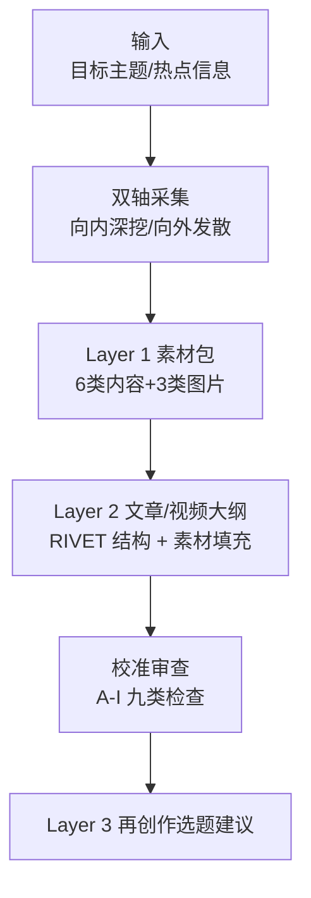
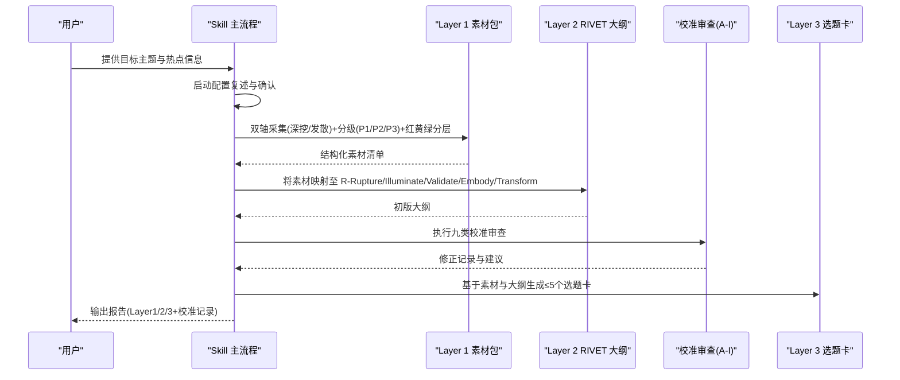
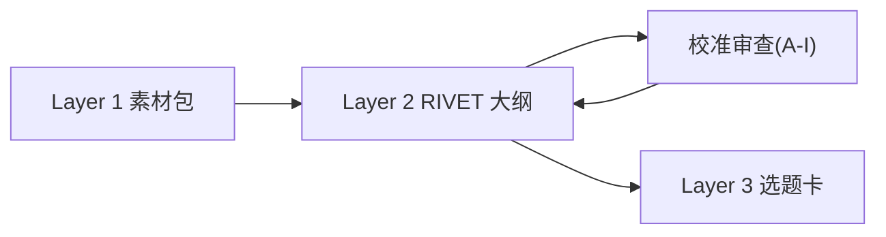

# Layer 2 文章大纲

<cite>
**本文引用的文件**
- [SKILL.md](file://hotspot-topic-excavator/skills/hotspot-topic-excavator/SKILL.md)
- [report_template.md](file://hotspot-topic-excavator/skills/hotspot-topic-excavator/templates/report_template.md)
- [README.md](file://hotspot-topic-excavator/README.md)
- [calibration_checklist.md](file://hotspot-topic-excavator/skills/hotspot-topic-excavator/references/calibration_checklist.md)
- [post_generation_review_pattern.md](file://hotspot-topic-excavator/skills/hotspot-topic-excavator/references/post_generation_review_pattern.md)
- [rashomon_topic_pattern.md](file://hotspot-topic-excavator/skills/hotspot-topic-excavator/references/rashomon_topic_pattern.md)
- [case_type_topic_excavation.md](file://hotspot-topic-excavator/skills/hotspot-topic-excavator/references/case_type_topic_excavation.md)
</cite>

## 目录
1. [引言](#引言)
2. [项目结构](#项目结构)
3. [核心组件](#核心组件)
4. [架构总览](#架构总览)
5. [详细组件分析](#详细组件分析)
6. [依赖关系分析](#依赖关系分析)
7. [性能与效率考量](#性能与效率考量)
8. [故障排查指南](#故障排查指南)
9. [结论](#结论)
10. [附录：RIVET填写示例与最佳实践](#附录rivet填写示例与最佳实践)

## 引言
本文件聚焦“Layer 2 文章大纲”的 RIVET 结构设计原理与内容填充机制，系统阐述五步框架（场景爆破、照亮盲区、验证处境、具身化、转化行动）在热点深挖流程中的落地方式，并说明如何将 Layer 1 素材包有效映射到各结构中。同时，文档解释“叙事引力检测”和“受众工具链翻译”的实现逻辑，并提供不同内容形式（文章/视频/播客）的适配策略与完整填写示例路径。

## 项目结构
该能力以 Skill 驱动，围绕“双轴采集 + 三层产出”组织：
- 输入：目标主题 + 每日热点信息（可含用户预消化版本）
- 采集：向内深挖（深度）+ 向外发散（广度），并行检索与降级策略保障完整性
- 产出：Layer 1 素材包 → Layer 2 文章/视频大纲（RIVET 结构 + 素材填充）→ Layer 3 再创作选题建议

图示来源
- [SKILL.md:72-147](file://hotspot-topic-excavator/skills/hotspot-topic-excavator/SKILL.md#L72-L147)
- [SKILL.md:230-237](file://hotspot-topic-excavator/skills/hotspot-topic-excavator/SKILL.md#L230-L237)
- [SKILL.md:251-267](file://hotspot-topic-excavator/skills/hotspot-topic-excavator/SKILL.md#L251-L267)

章节来源
- [README.md:1-13](file://hotspot-topic-excavator/README.md#L1-L13)
- [SKILL.md:27-69](file://hotspot-topic-excavator/skills/hotspot-topic-excavator/SKILL.md#L27-L69)
- [SKILL.md:230-237](file://hotspot-topic-excavator/skills/hotspot-topic-excavator/SKILL.md#L230-L237)

## 核心组件
- Layer 1 素材包：按 6 类内容（热点资讯流、硬核事实、权威引述、案例故事、对立张力、可视化依据）与 3 类图片素材方案组织，并按相关性分层（🔴核心层、🟡强关联层、🟢可延展层）。
- Layer 2 文章/视频大纲：采用 RIVET 五步结构，逐段填充来自 Layer 1 的素材，确保每段有钩子、论证、数据、隐喻与行动。
- 校准审查（A-I）：事实校准、事实补充、表述校准、框架补充、对立视角、理论偏向、叙事引力、受众工具链翻译、三角叙事补洞。
- 平台适配：抖音/B站/公众号/小红书各有侧重点与形式提示。

章节来源
- [SKILL.md:189-204](file://hotspot-topic-excavator/skills/hotspot-topic-excavator/SKILL.md#L189-L204)
- [SKILL.md:207-228](file://hotspot-topic-excavator/skills/hotspot-topic-excavator/SKILL.md#L207-L228)
- [SKILL.md:240-248](file://hotspot-topic-excavator/skills/hotspot-topic-excavator/SKILL.md#L240-L248)
- [SKILL.md:251-267](file://hotspot-topic-excavator/skills/hotspot-topic-excavator/SKILL.md#L251-L267)

## 架构总览
RIVET 作为 Layer 2 的核心骨架，贯穿从素材到产出的全链路；校准审查贯穿生成后阶段，确保质量与受众对齐。

图示来源
- [SKILL.md:72-147](file://hotspot-topic-excavator/skills/hotspot-topic-excavator/SKILL.md#L72-L147)
- [SKILL.md:230-237](file://hotspot-topic-excavator/skills/hotspot-topic-excavator/SKILL.md#L230-L237)
- [SKILL.md:251-267](file://hotspot-topic-excavator/skills/hotspot-topic-excavator/SKILL.md#L251-L267)

## 详细组件分析

### RIVET 五步框架与应用方法
- 场景爆破（Rupture）
  - 作用：用反常识或强冲突开场，打破受众既有认知平衡。
  - 素材来源：Layer 1 的“热点资讯流”“对立张力”“权威引述”中具备冲击力的点。
  - 要点：避免夸大“完全自主/零人类干预”等措辞，需精确界定“高度自主”等边界。
- 照亮盲区（Illuminate）
  - 作用：给出核心论证与洞察，解释现象背后的结构与机制。
  - 素材来源：Layer 1 的“硬核事实”“权威引述”“案例故事”。
  - 要点：对高引力话题主动加入反引力锚（前例时间线、平行事件、第三方限制）。
- 验证处境（Validate）
  - 作用：用数据与证据支撑论点，建立可信度。
  - 素材来源：Layer 1 的“硬核事实”“可视化依据”“权威引述”。
  - 要点：区分口径（如财务口径）、标注限定条件、交叉验证多源。
- 具身化（Embody）
  - 作用：通过核心隐喻或类比让抽象概念可感知。
  - 素材来源：Layer 1 的“案例故事”“权威引述”“可视化依据”。
  - 要点：选择能引发身份共鸣的隐喻，连接 SOUL 的“控制性理念/有限性智慧”。
- 转化行动（Transform）
  - 作用：给出可执行的下一步，推动受众从理解到行动。
  - 素材来源：Layer 1 的“硬核事实”“权威引述”“对立张力”中的可行解。
  - 要点：进行“受众工具链翻译”，把企业级建议翻译成超级个体常用工具名，并分两部分输出（工具链自检表 + 通用行动清单）。

章节来源
- [report_template.md:72-88](file://hotspot-topic-excavator/skills/hotspot-topic-excavator/templates/report_template.md#L72-L88)
- [SKILL.md:285-308](file://hotspot-topic-excavator/skills/hotspot-topic-excavator/SKILL.md#L285-L308)
- [calibration_checklist.md:83-94](file://hotspot-topic-excavator/skills/hotspot-topic-excavator/references/calibration_checklist.md#L83-L94)

### 将 Layer 1 素材填充到 RIVET 的结构化映射
- 映射原则
  - 每个 RIVET 段落至少对应 1-2 条 P1/P2 信源的素材，优先使用“硬核事实”“权威引述”“案例故事”。
  - “对立张力”用于 R 与 I 段的张力构建，并在 T 段转化为“在矛盾中找到自己位置”的行动建议。
  - “可视化依据”用于 V 段的数据呈现与图表设计。
- 分层利用
  - 🔴 核心层：直接支撑主线 RIVET 各段。
  - 🟡 强关联层：为 I/V/E/T 提供补充论据与对比视角。
  - 🟢 可延展层：沉淀为 Layer 3 选题卡，供后续再创作。
- 校验与纠偏
  - 若首版在 R 段出现过度主张（如“完全自主”），需在审查阶段修正为更精确的表述，并将对立观点整合进主线而非孤立放置。

章节来源
- [SKILL.md:189-204](file://hotspot-topic-excavator/skills/hotspot-topic-excavator/SKILL.md#L189-L204)
- [post_generation_review_pattern.md:10-19](file://hotspot-topic-excavator/skills/hotspot-topic-excavator/references/post_generation_review_pattern.md#L10-L19)
- [rashomon_topic_pattern.md:74-77](file://hotspot-topic-excavator/skills/hotspot-topic-excavator/references/rashomon_topic_pattern.md#L74-L77)

### 叙事引力检测的实现逻辑
- 触发条件
  - 当话题属于“AI 自主攻击/全球首例/国家技术对抗/模型失控”等高引力类别时，自动提高对立视角比重。
- 检测与自问
  - 是否把“高度X”说成“完全X”？
  - 对立观点是否被整合进主线而非孤悬？
  - 中国视角是“回应式”还是“平行式”？
- 反引力锚
  - 引入人类决策点数量、前例时间线、同期平行事件、第三方独立分析的限制等，防止叙事滑向单一情绪方向。

章节来源
- [SKILL.md:285-298](file://hotspot-topic-excavator/skills/hotspot-topic-excavator/SKILL.md#L285-L298)
- [calibration_checklist.md:68-82](file://hotspot-topic-excavator/skills/hotspot-topic-excavator/references/calibration_checklist.md#L68-L82)

### 受众工具链翻译的实现逻辑
- 问题定位
  - 原始安全/技术分析建议面向企业，超级个体需要“工具名级”的具体指引。
- 翻译规则
  - 将企业级术语映射为常见工具（如 Langflow/Dify/Coze/n8n/Make/Cursor/MinIO/Nacos/API Key 管理等）。
  - 每个工具给出“检查什么 + 为什么”两列。
- 输出格式
  - T-Transform 段分为两部分：A. 工具链级自检表（约 8 行表格）；B. 通用 5 步行动清单。

章节来源
- [SKILL.md:299-307](file://hotspot-topic-excavator/skills/hotspot-topic-excavator/SKILL.md#L299-L307)
- [calibration_checklist.md:83-94](file://hotspot-topic-excavator/skills/hotspot-topic-excavator/references/calibration_checklist.md#L83-L94)
- [post_generation_review_pattern.md:39-45](file://hotspot-topic-excavator/skills/hotspot-topic-excavator/references/post_generation_review_pattern.md#L39-L45)

### 不同内容形式的适配策略
- 短视频口播（抖音）
  - 节奏：强钩子 + 金句 + 反常识结论；前 3 秒抓人，60-120 秒完成 RIVET 闭环。
- 深度长视频（B站）
  - 强调完整论据链 + 数据 + 案例，逻辑闭环，弹幕互动点与视觉方案配合。
- 图文长文（公众号）
  - 深度论证 + 案例故事 + 引述，可读性强，章节骨架清晰。
- 笔记体（小红书）
  - 用户痛点 + 视觉化清单 + 干货点，封面/标题强视觉。

章节来源
- [SKILL.md:240-248](file://hotspot-topic-excavator/skills/hotspot-topic-excavator/SKILL.md#L240-L248)
- [case_type_topic_excavation.md:99-108](file://hotspot-topic-excavator/skills/hotspot-topic-excavator/references/case_type_topic_excavation.md#L99-L108)

## 依赖关系分析
- 模块耦合
  - Layer 1 是 Layer 2 的直接上游；Layer 2 依赖 Layer 1 的六类素材与红黄绿分层。
  - 校准审查（A-I）作用于 Layer 2 的输出，修正后再进入 Layer 3 的选题卡生成。
- 外部依赖
  - 搜索与原文获取（WebSearch/WebFetch/Bash）构成采集层；YouTube Transcript API 与 Apple Podcasts show notes 作为播客 transcript 的双路径备选。
- 潜在循环
  - 无直接代码循环；流程上“审查补充优化”会回写 Layer 2 的 RIVET 段落，形成迭代闭环。

图示来源
- [SKILL.md:230-237](file://hotspot-topic-excavator/skills/hotspot-topic-excavator/SKILL.md#L230-L237)
- [SKILL.md:251-267](file://hotspot-topic-excavator/skills/hotspot-topic-excavator/SKILL.md#L251-L267)

章节来源
- [SKILL.md:230-237](file://hotspot-topic-excavator/skills/hotspot-topic-excavator/SKILL.md#L230-L237)
- [SKILL.md:251-267](file://hotspot-topic-excavator/skills/hotspot-topic-excavator/SKILL.md#L251-L267)

## 性能与效率考量
- 并行采集
  - WebSearch 与 WebFetch 并行调用，互为备份；多组搜索同时发起提升效率。
- 降级路径
  - 单点故障 → 另一者 + 补充搜索 → Bash 直连抓取 → 仅 P0 热点保留，其余标注缺失。
  - WebSearch 长时间不可用时，升级为中文搜索主源模式，承载全部中英文信号。
- 工具环境
  - Python 环境路径解析需注意版本差异，必要时使用 venv 绝对路径显式调用。

章节来源
- [SKILL.md:84-128](file://hotspot-topic-excavator/skills/hotspot-topic-excavator/SKILL.md#L84-L128)
- [SKILL.md:149-168](file://hotspot-topic-excavator/skills/hotspot-topic-excavator/SKILL.md#L149-L168)

## 故障排查指南
- 常见问题
  - 搜索结果不可用：切换至 WebFetch 直连已知 URL，或启用中文搜索主源模式。
  - 播客 transcript 失败：并行走 YouTube Transcript API 与 Apple Podcasts show notes 两条路径，任一成功即可继续。
  - Cloudflare WAF 拦截：使用 Bash + Python requests + 浏览器 UA 绕过，提取正文块。
- 校准问题
  - 事实迷雾：在 R/I 段增补精确措辞注脚，将对立观点整合进主线。
  - 受众脱靶：在 T 段做工具链翻译，输出“工具链级自检表 + 通用 5 步行动清单”。

章节来源
- [SKILL.md:98-128](file://hotspot-topic-excavator/skills/hotspot-topic-excavator/SKILL.md#L98-L128)
- [post_generation_review_pattern.md:10-19](file://hotspot-topic-excavator/skills/hotspot-topic-excavator/references/post_generation_review_pattern.md#L10-L19)
- [calibration_checklist.md:83-94](file://hotspot-topic-excavator/skills/hotspot-topic-excavator/references/calibration_checklist.md#L83-L94)

## 结论
RIVET 作为 Layer 2 的文章/视频大纲骨架，将 Layer 1 的多维素材有序组织为“破局—洞察—验证—共情—行动”的叙事弧线。通过“叙事引力检测”与“受众工具链翻译”两大校准机制，确保内容既不被情绪牵引，又能精准对接超级个体的实际工具链与行动路径。结合平台适配策略，RIVET 可在文章、视频、播客等多形态内容中稳定复用。

## 附录：RIVET填写示例与最佳实践

### 模板路径与字段说明
- 模板文件：Layer 2 的 RIVET 结构位于报告模板中，包含 R/I/V/E/T 五个段落的占位字段。
- 字段含义
  - R·场景爆破：钩子（反常识/强冲突）
  - I·照亮盲区：核心论证（结构与机制）
  - V·验证处境：数据支撑（P1/P2 信源）
  - E·具身化：核心隐喻（类比/身份共鸣）
  - T·转化行动：行动建议（工具链级自检表 + 通用 5 步清单）

章节来源
- [report_template.md:72-88](file://hotspot-topic-excavator/skills/hotspot-topic-excavator/templates/report_template.md#L72-L88)

### 示例一：案例型话题（短视频脚本）
- 参考结构
  - 0-5s：Rupture（极端数据开场）
  - 5-20s：Illuminate（起点故事）
  - 20-40s：Validate（时间线 + 收入拆解）
  - 40-60s：Embody（“为什么这样做”的金句与原话）
  - 60-80s：Transform（行动清单）
  - 80-90s：收尾（SOUL 框架金句）
- 关键要点
  - 必须包含“代价章节”（孤独、失败率、隐性成本），避免廉价成功学。
  - 反常识钩子常是“原来 Y 这样做的人成功了”，打破受众“必须这样”的信念。

章节来源
- [case_type_topic_excavation.md:99-118](file://hotspot-topic-excavator/skills/hotspot-topic-excavator/references/case_type_topic_excavation.md#L99-L118)

### 示例二：罗生门型话题（对立张力）
- 结构要点
  - R：用“两边都对”打破“必须选一边”的常识。
  - I：呈现双方真实证据与案例，不暗示“正确答案”。
  - V：每个维度都有对等粒度的具体证据。
  - E：连接 SOUL 的“有限性智慧”——承认“我不知道哪方是对的”。
  - T：给出“在矛盾中找到自己位置”的行动建议。
- 执行清单
  - 至少 6-8 个张力维度；每条都有对等证据；再创作选题中至少 1 个保持罗生门结构。

章节来源
- [rashomon_topic_pattern.md:74-107](file://hotspot-topic-excavator/skills/hotspot-topic-excavator/references/rashomon_topic_pattern.md#L74-L107)

### 示例三：安全/技术类话题（受众工具链翻译）
- 步骤
  - 识别企业级建议（如升级某工具、修改默认凭据、凭证分级管理）。
  - 映射为超级个体常用工具名（Langflow/Dify/Coze/n8n/Make/Cursor/MinIO/Nacos/API Key 管理等）。
  - 输出两部分：A. 工具链级自检表（约 8 行表格）；B. 通用 5 步行动清单。
- 注意事项
  - 每个工具给出“检查什么 + 为什么”两列，确保可操作性。

章节来源
- [calibration_checklist.md:83-94](file://hotspot-topic-excavator/skills/hotspot-topic-excavator/references/calibration_checklist.md#L83-L94)
- [post_generation_review_pattern.md:39-45](file://hotspot-topic-excavator/skills/hotspot-topic-excavator/references/post_generation_review_pattern.md#L39-L45)

### 最佳实践清单
- 启动配置先行：复述当前配置（深挖/发散配比、选题卡粒度、发散上限），确认后再执行。
- 信源优先级：一手来源 > 权威媒体 > 社区讨论；每条素材必须可溯源。
- 红黄绿分层：核心层支撑主线，强关联层补充论证，可延展层沉淀为选题卡。
- 校准强制：初稿完成后逐项过 A-I 九类校准，记录修正动作并嵌入报告末尾。
- 平台适配：根据平台特性调整钩子、论据链、视觉方案与互动点。

章节来源
- [SKILL.md:59-69](file://hotspot-topic-excavator/skills/hotspot-topic-excavator/SKILL.md#L59-L69)
- [SKILL.md:189-204](file://hotspot-topic-excavator/skills/hotspot-topic-excavator/SKILL.md#L189-L204)
- [SKILL.md:251-267](file://hotspot-topic-excavator/skills/hotspot-topic-excavator/SKILL.md#L251-L267)