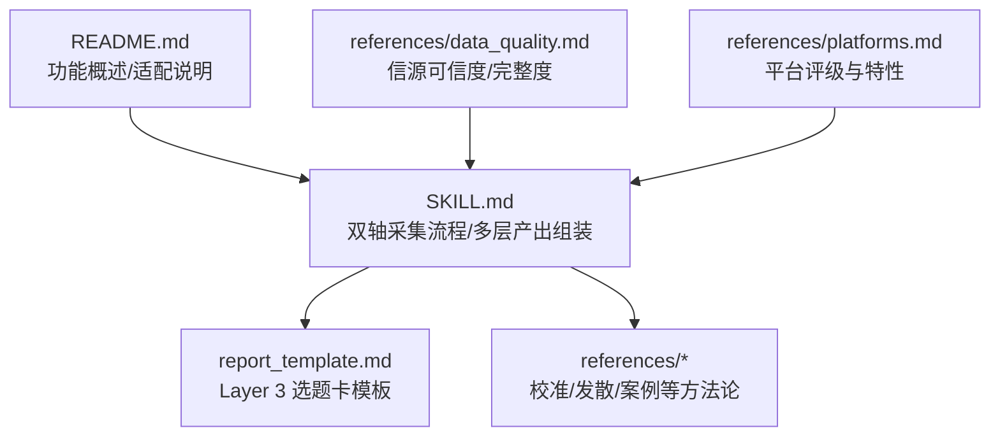
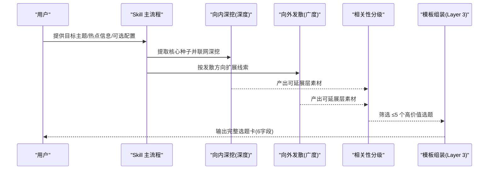
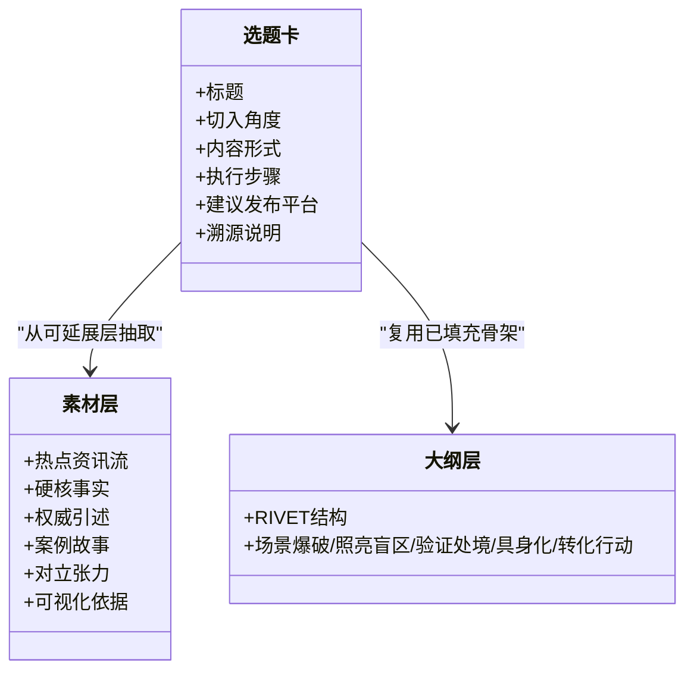
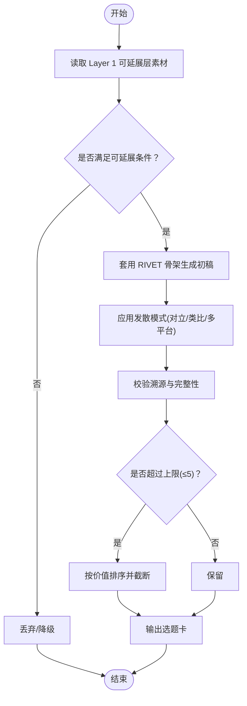
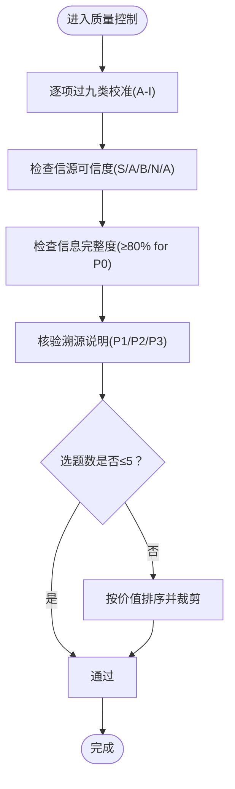
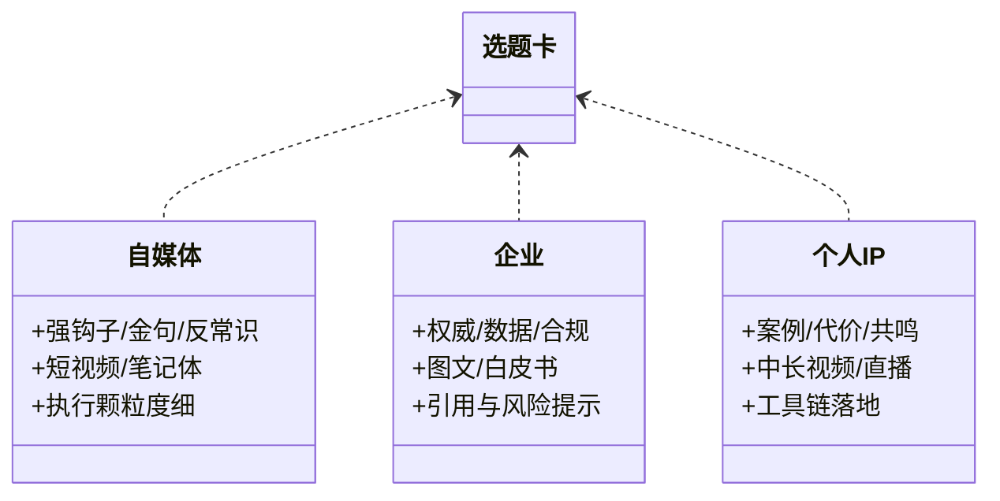
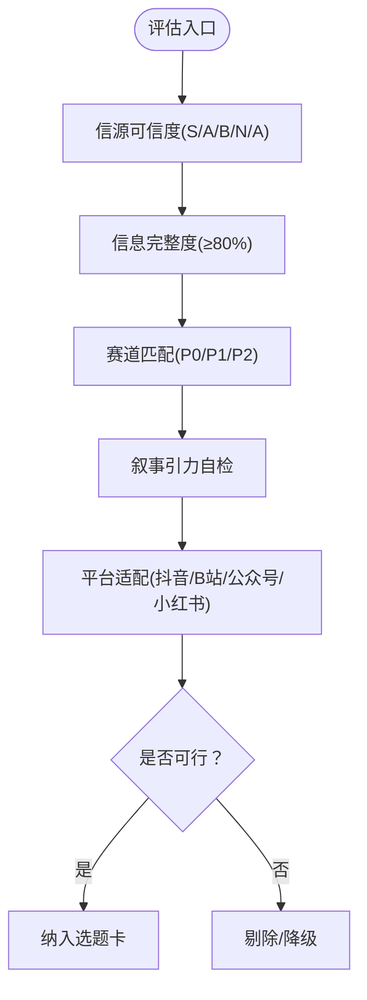
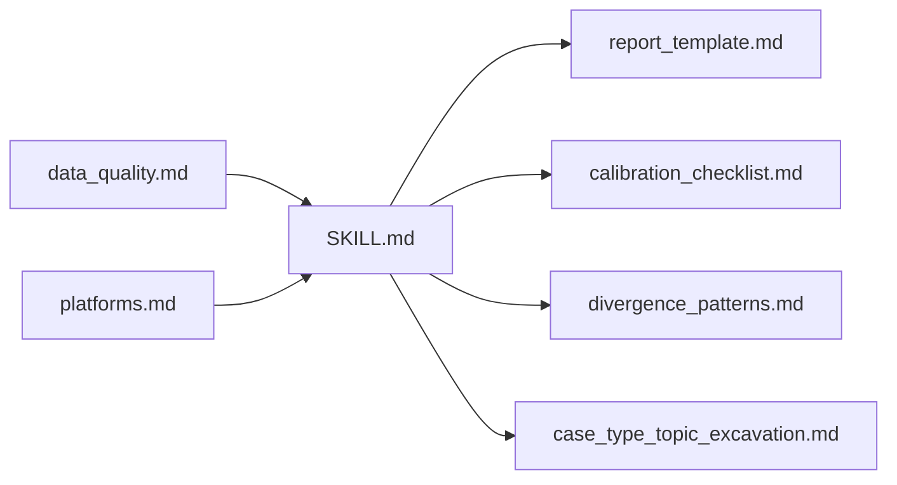

# Layer 3 选题建议

<cite>
**本文引用的文件**   
- [SKILL.md](file://hotspot-topic-excavator/skills/hotspot-topic-excavator/SKILL.md)
- [report_template.md](file://hotspot-topic-excavator/skills/hotspot-topic-excavator/templates/report_template.md)
- [README.md](file://hotspot-topic-excavator/README.md)
- [calibration_checklist.md](file://hotspot-topic-excavator/skills/hotspot-topic-excavator/references/calibration_checklist.md)
- [divergence_patterns.md](file://hotspot-topic-excavator/skills/hotspot-topic-excavator/references/divergence_patterns.md)
- [case_type_topic_excavation.md](file://hotspot-topic-excavator/skills/hotspot-topic-excavator/references/case_type_topic_excavation.md)
- [data_quality.md](file://.skills/hotspot-research/references/data_quality.md)
- [platforms.md](file://.skills/hotspot-research/references/platforms.md)
</cite>

## 目录
1. [引言](#引言)
2. [项目结构](#项目结构)
3. [核心组件](#核心组件)
4. [架构总览](#架构总览)
5. [详细组件分析](#详细组件分析)
6. [依赖关系分析](#依赖关系分析)
7. [性能与质量考量](#性能与质量考量)
8. [故障排查指南](#故障排查指南)
9. [结论](#结论)
10. [附录](#附录)

## 引言
本文件聚焦于“Layer 3 再创作选题建议”的生成机制与选题卡标准格式，系统阐述：
- 选题卡的6个核心字段及其设计逻辑
- 如何基于前两层产出进行深度再创作挖掘
- 选题卡数量限制（≤5个）的决策原则与质量控制标准
- 不同类型创作者（自媒体/企业/个人IP）的选题策略差异
- 选题可行性评估方法与平台适配建议

## 项目结构
本仓库围绕“热点主题素材深挖采集器”展开，Layer 3 相关内容主要位于 Skill 主文档、报告模板以及若干参考方法论文档中。

图示来源
- [SKILL.md:230-237](file://hotspot-topic-excavator/skills/hotspot-topic-excavator/SKILL.md#L230-L237)
- [report_template.md:92-104](file://hotspot-topic-excavator/skills/hotspot-topic-excavator/templates/report_template.md#L92-L104)
- [README.md:1-14](file://hotspot-topic-excavator/README.md#L1-L14)
- [data_quality.md:40-76](file://.skills/hotspot-research/references/data_quality.md#L40-L76)
- [platforms.md:40-76](file://.skills/hotspot-research/references/platforms.md#L40-L76)

章节来源
- [SKILL.md:230-237](file://hotspot-topic-excavator/skills/hotspot-topic-excavator/SKILL.md#L230-L237)
- [report_template.md:92-104](file://hotspot-topic-excavator/skills/hotspot-topic-excavator/templates/report_template.md#L92-L104)
- [README.md:1-14](file://hotspot-topic-excavator/README.md#L1-L14)

## 核心组件
- 双轴采集模型：向内深挖 + 向外发散，为 Layer 3 提供“可延展层”素材池
- 相关性分级：核心层/强关联层/可延展层，用于筛选适合再创作的素材
- 多层产出组装：Layer 1 素材包 → Layer 2 大纲填充 → Layer 3 再创作选题建议
- 选题卡模板：统一 6 字段规范，确保每个选题具备可执行性与可溯源性

章节来源
- [SKILL.md:177-204](file://hotspot-topic-excavator/skills/hotspot-topic-excavator/SKILL.md#L177-L204)
- [SKILL.md:230-237](file://hotspot-topic-excavator/skills/hotspot-topic-excavator/SKILL.md#L230-L237)
- [report_template.md:92-104](file://hotspot-topic-excavator/skills/hotspot-topic-excavator/templates/report_template.md#L92-L104)

## 架构总览
Layer 3 的生成遵循“输入配置 → 双轴采集 → 分层组织 → 模板化输出”的流水线。

图示来源
- [SKILL.md:72-187](file://hotspot-topic-excavator/skills/hotspot-topic-excavator/SKILL.md#L72-L187)
- [SKILL.md:230-237](file://hotspot-topic-excavator/skills/hotspot-topic-excavator/SKILL.md#L230-L237)
- [report_template.md:92-104](file://hotspot-topic-excavator/skills/hotspot-topic-excavator/templates/report_template.md#L92-L104)

## 详细组件分析

### Layer 3 选题卡标准格式与字段设计逻辑
- 标题：明确表达选题的核心主张或反常识点，便于跨平台传播
- 切入角度：从“可延展层”素材中选择差异化视角（如对立张力、跨领域类比、上下游概念）
- 内容形式：匹配平台特性与受众习惯（短视频口播/深度长视频/图文长文/笔记）
- 执行步骤：将选题拆解为可直接执行的工序清单（钩子→论证→证据→收尾），保证“可直接用”
- 建议发布平台：结合平台采集重点与形式提示，给出优先平台与备选平台
- 溯源说明：每条选题必须能回溯到具体信源（P1/P2/P3），无法溯源则标注“待核实”

图示来源
- [report_template.md:92-104](file://hotspot-topic-excavator/skills/hotspot-topic-excavator/templates/report_template.md#L92-L104)
- [SKILL.md:207-217](file://hotspot-topic-excavator/skills/hotspot-topic-excavator/SKILL.md#L207-L217)
- [SKILL.md:71-89](file://hotspot-topic-excavator/skills/hotspot-topic-excavator/SKILL.md#L71-L89)

章节来源
- [report_template.md:92-104](file://hotspot-topic-excavator/skills/hotspot-topic-excavator/templates/report_template.md#L92-L104)
- [SKILL.md:207-217](file://hotspot-topic-excavator/skills/hotspot-topic-excavator/SKILL.md#L207-L217)
- [SKILL.md:71-89](file://hotspot-topic-excavator/skills/hotspot-topic-excavator/SKILL.md#L71-L89)

### 基于前两层产出的深度再创作挖掘
- 从 Layer 1 的“可延展层（🟢）”素材中识别可独立成篇的方向
- 利用 Layer 2 的 RIVET 骨架快速拼装新选题的结构
- 使用发散模式库（如多信号并行搜索、对立张力增强、多平台大纲差异化）提升选题的可操作性与传播力

图示来源
- [SKILL.md:189-204](file://hotspot-topic-excavator/skills/hotspot-topic-excavator/SKILL.md#L189-L204)
- [SKILL.md:230-237](file://hotspot-topic-excavator/skills/hotspot-topic-excavator/SKILL.md#L230-L237)
- [divergence_patterns.md:111-119](file://hotspot-topic-excavator/skills/hotspot-topic-excavator/references/divergence_patterns.md#L111-L119)

章节来源
- [SKILL.md:189-204](file://hotspot-topic-excavator/skills/hotspot-topic-excavator/SKILL.md#L189-L204)
- [divergence_patterns.md:111-119](file://hotspot-topic-excavator/skills/hotspot-topic-excavator/references/divergence_patterns.md#L111-L119)

### 选题卡数量限制（≤5个）的决策原则与质量控制
- 决策原则
  - 资源约束：在有限时间内优先产出最高价值的选题
  - 可执行性：每个选题需达到“可直接用”的粒度，避免泛泛而谈
  - 可溯源性：每个选题必须能回锚点与具体信源
- 质量控制
  - 九类校准审查（A-I）贯穿生成后阶段，覆盖事实、框架、对立、叙事引力等维度
  - 信源可信度与信息完整度作为硬性门槛（P0 要求 ≥80% 完整度）

图示来源
- [SKILL.md:251-267](file://hotspot-topic-excavator/skills/hotspot-topic-excavator/SKILL.md#L251-L267)
- [calibration_checklist.md:41-149](file://hotspot-topic-excavator/skills/hotspot-topic-excavator/references/calibration_checklist.md#L41-L149)
- [data_quality.md:40-76](file://.skills/hotspot-research/references/data_quality.md#L40-L76)

章节来源
- [SKILL.md:251-267](file://hotspot-topic-excavator/skills/hotspot-topic-excavator/SKILL.md#L251-L267)
- [calibration_checklist.md:41-149](file://hotspot-topic-excavator/skills/hotspot-topic-excavator/references/calibration_checklist.md#L41-L149)
- [data_quality.md:40-76](file://.skills/hotspot-research/references/data_quality.md#L40-L76)

### 不同类型创作者的选题策略差异
- 自媒体（流量导向）
  - 侧重强钩子、金句与反常识结论；优先抖音/小红书
  - 选题卡强调“秒级时间码+画面描述+音效提示”的执行颗粒度
- 企业（品牌与专业背书）
  - 侧重权威引述、数据支撑与合规风险；优先公众号/知乎/LinkedIn
  - 选题卡强调“完整论据链+引用来源+风险提示”
- 个人IP（人设与信任资产）
  - 侧重真实案例、代价章节与自我暴露；优先B站/视频号
  - 选题卡强调“叙事弧线+受众共鸣+工具链落地”

图示来源
- [SKILL.md:240-248](file://hotspot-topic-excavator/skills/hotspot-topic-excavator/SKILL.md#L240-L248)
- [divergence_patterns.md:111-119](file://hotspot-topic-excavator/skills/hotspot-topic-excavator/references/divergence_patterns.md#L111-L119)
- [case_type_topic_excavation.md:110-119](file://hotspot-topic-excavator/skills/hotspot-topic-excavator/references/case_type_topic_excavation.md#L110-L119)

章节来源
- [SKILL.md:240-248](file://hotspot-topic-excavator/skills/hotspot-topic-excavator/SKILL.md#L240-L248)
- [divergence_patterns.md:111-119](file://hotspot-topic-excavator/skills/hotspot-topic-excavator/references/divergence_patterns.md#L111-L119)
- [case_type_topic_excavation.md:110-119](file://hotspot-topic-excavator/skills/hotspot-topic-excavator/references/case_type_topic_excavation.md#L110-L119)

### 选题可行性评估方法与平台适配建议
- 可行性评估
  - 信源可信度：优先 S/A 级来源，N/A 默认丢弃
  - 信息完整度：P0 热点需 ≥80%，否则降级
  - 赛道匹配：AI×超级个体为 P0，单标签为 P1，子标签为 P2
  - 叙事引力自检：警惕“AI自主攻击/全球首例/国家对抗”等话题的情绪放大
- 平台适配
  - 抖音：强钩子+金句+反转，60-120秒口播
  - B站：完整论据链+数据+案例，深度长视频
  - 公众号：深度论证+案例故事+引述，图文长文
  - 小红书：痛点+视觉化清单+干货点，封面/标题强视觉

图示来源
- [data_quality.md:40-76](file://.skills/hotspot-research/references/data_quality.md#L40-L76)
- [SKILL.md:240-248](file://hotspot-topic-excavator/skills/hotspot-topic-excavator/SKILL.md#L240-L248)
- [SKILL.md:285-298](file://hotspot-topic-excavator/skills/hotspot-topic-excavator/SKILL.md#L285-L298)

章节来源
- [data_quality.md:40-76](file://.skills/hotspot-research/references/data_quality.md#L40-L76)
- [SKILL.md:240-248](file://hotspot-topic-excavator/skills/hotspot-topic-excavator/SKILL.md#L240-L248)
- [SKILL.md:285-298](file://hotspot-topic-excavator/skills/hotspot-topic-excavator/SKILL.md#L285-L298)

## 依赖关系分析
- 模块耦合
  - SKILL.md 定义双轴采集与多层产出，直接驱动 report_template.md 的 Layer 3 输出
  - references/* 提供方法论与校准清单，作为质量控制与发散策略的依据
- 外部依赖
  - 平台评级与特性来自 platforms.md，影响选题卡“建议发布平台”字段
  - 数据质量规则来自 data_quality.md，决定选题是否进入候选池

图示来源
- [SKILL.md:230-237](file://hotspot-topic-excavator/skills/hotspot-topic-excavator/SKILL.md#L230-L237)
- [report_template.md:92-104](file://hotspot-topic-excavator/skills/hotspot-topic-excavator/templates/report_template.md#L92-L104)
- [calibration_checklist.md:41-149](file://hotspot-topic-excavator/skills/hotspot-topic-excavator/references/calibration_checklist.md#L41-L149)
- [divergence_patterns.md:111-119](file://hotspot-topic-excavator/skills/hotspot-topic-excavator/references/divergence_patterns.md#L111-L119)
- [case_type_topic_excavation.md:110-119](file://hotspot-topic-excavator/skills/hotspot-topic-excavator/references/case_type_topic_excavation.md#L110-L119)
- [data_quality.md:40-76](file://.skills/hotspot-research/references/data_quality.md#L40-L76)
- [platforms.md:40-76](file://.skills/hotspot-research/references/platforms.md#L40-L76)

章节来源
- [SKILL.md:230-237](file://hotspot-topic-excavator/skills/hotspot-topic-excavator/SKILL.md#L230-L237)
- [report_template.md:92-104](file://hotspot-topic-excavator/skills/hotspot-topic-excavator/templates/report_template.md#L92-L104)
- [calibration_checklist.md:41-149](file://hotspot-topic-excavator/skills/hotspot-topic-excavator/references/calibration_checklist.md#L41-L149)
- [divergence_patterns.md:111-119](file://hotspot-topic-excavator/skills/hotspot-topic-excavator/references/divergence_patterns.md#L111-L119)
- [case_type_topic_excavation.md:110-119](file://hotspot-topic-excavator/skills/hotspot-topic-excavator/references/case_type_topic_excavation.md#L110-L119)
- [data_quality.md:40-76](file://.skills/hotspot-research/references/data_quality.md#L40-L76)
- [platforms.md:40-76](file://.skills/hotspot-research/references/platforms.md#L40-L76)

## 性能与质量考量
- 并行采集：WebSearch 与 WebFetch 并行调用，互为备份，缩短端到端时延
- 降级路径：当搜索/抓取不可用时，启用中文搜索主源模式或直连抓取，保障产出连续性
- 质量门禁：九类校准与信源/完整度门槛前置，减少返工成本
- 产出颗粒度：强制“可直接用”的粒度，降低二次加工成本

[本节为通用指导，不直接分析具体文件]

## 故障排查指南
- 常见失败模式
  - WebSearch 长时间不可用：切换至 WebFetch 直连已知 URL 或多 URL 并行获取
  - Cloudflare WAF 拦截：使用 Bash + Python requests 直连绕过
  - YouTube Transcript API 失败：并行走 Apple Podcasts show notes 替代路径
- 诊断建议
  - 网络连通性快速诊断（curl 探测）
  - 版本与环境问题（Python 3.10+、urllib3 兼容性）

章节来源
- [SKILL.md:114-147](file://hotspot-topic-excavator/skills/hotspot-topic-excavator/SKILL.md#L114-L147)
- [SKILL.md:149-168](file://hotspot-topic-excavator/skills/hotspot-topic-excavator/SKILL.md#L149-L168)
- [data_quality.md:171-187](file://.skills/hotspot-research/references/data_quality.md#L171-L187)

## 结论
Layer 3 选题建议以“可延展层素材 + RIVET 骨架 + 严格校准”为核心，通过标准化选题卡实现从“素材”到“可执行选题”的高效转化。数量限制（≤5）与质量控制共同保障产出质量与生产效率，不同创作者类型可通过差异化策略最大化选题的传播与转化效果。

[本节为总结性内容，不直接分析具体文件]

## 附录
- 触发方式与输入字段参见 README 与 SKILL 启动配置
- 报告模板与校准记录表见 report_template.md 与 calibration_checklist.md

章节来源
- [README.md:82-104](file://hotspot-topic-excavator/README.md#L82-L104)
- [SKILL.md:27-68](file://hotspot-topic-excavator/skills/hotspot-topic-excavator/SKILL.md#L27-L68)
- [report_template.md:107-132](file://hotspot-topic-excavator/skills/hotspot-topic-excavator/templates/report_template.md#L107-L132)
- [calibration_checklist.md:108-149](file://hotspot-topic-excavator/skills/hotspot-topic-excavator/references/calibration_checklist.md#L108-L149)