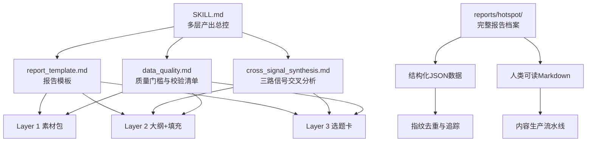
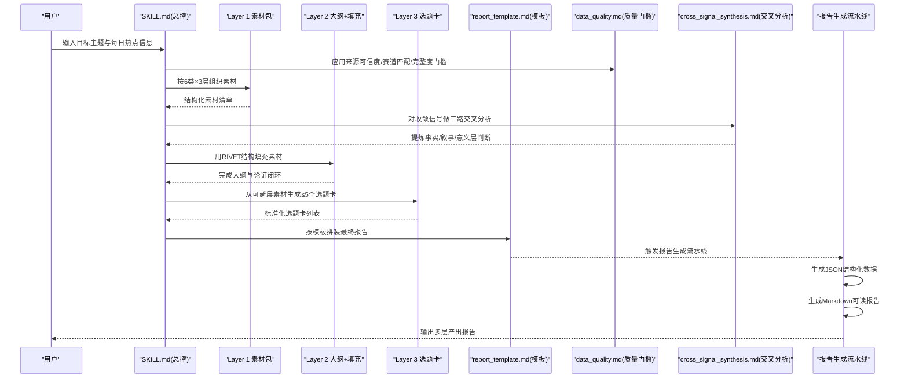
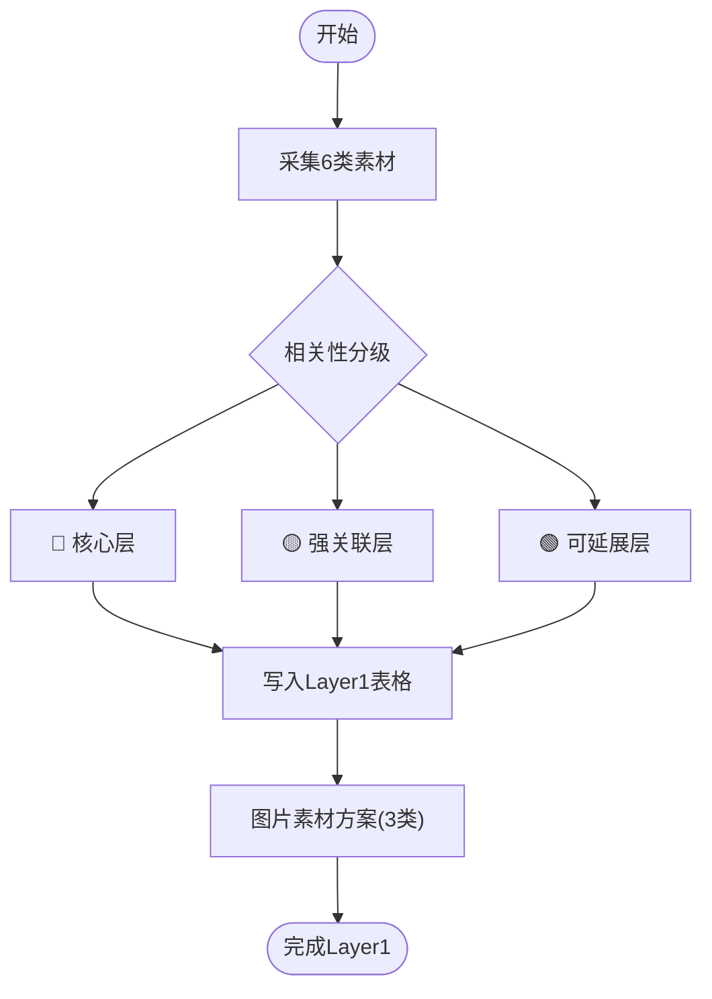
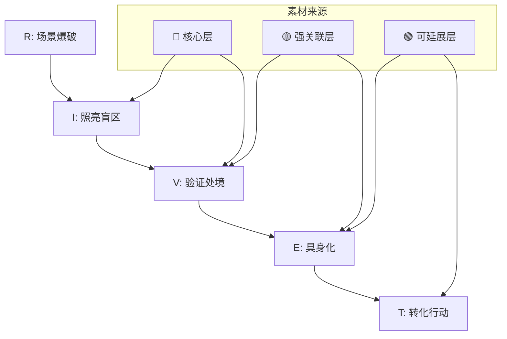
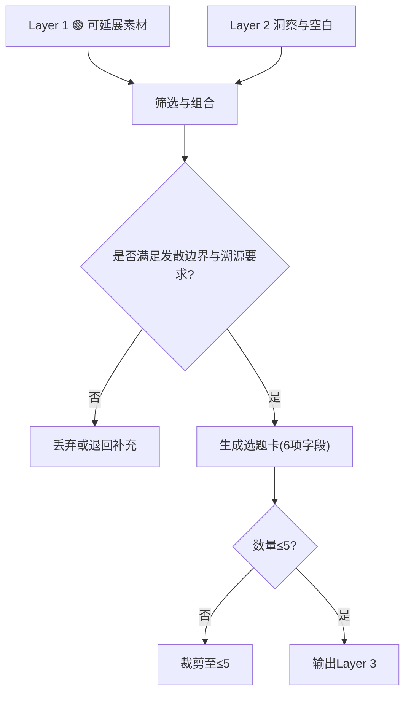
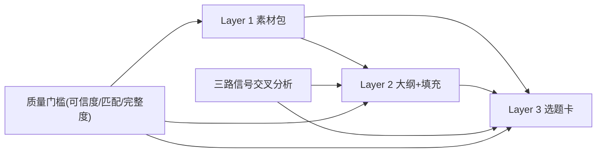
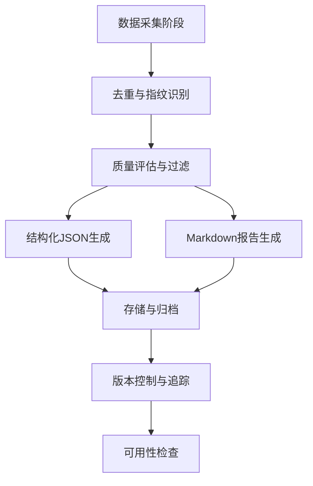
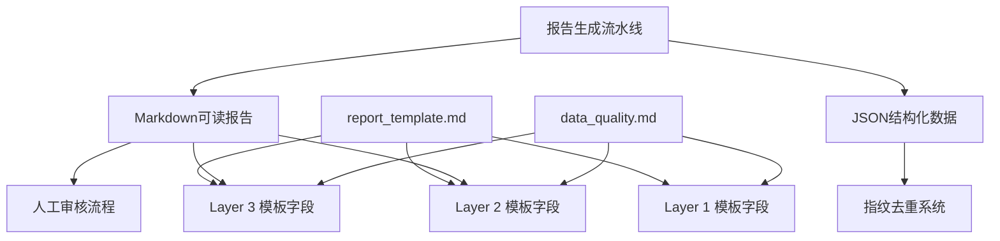

# 多层产出组装

<cite>
**本文引用的文件**
- [SKILL.md](file://skills/hotspot-topic-excavator_qoder_v2/SKILL.md)
- [report_template.md](file://skills/hotspot-topic-excavator_qoder_v2/templates/report_template.md)
- [cross_signal_synthesis.md](file://skills/hotspot-topic-excavator_qoder_v2/references/cross_signal_synthesis.md)
- [data_quality.md](file://.skills/hotspot-research/references/data_quality.md)
- [fingerprints_daily.json](file://reports/hotspot/fingerprints_daily.json)
- [hotspot_daily_2026-04-29.json](file://reports/hotspot/hotspot_daily_2026-04-29.json)
- [hotspot_weekly_2026-04-29.json](file://reports/hotspot/hotspot_weekly_2026-04-29.json)
- [report_daily_2026-04-29.md](file://reports/hotspot/report_daily_2026-04-29.md)
- [report_weekly_2026-04-29.md](file://reports/hotspot/report_weekly_2026-04-29.md)
- [_week_clues.json](file://reports/hotspot/_week_clues.json)
</cite>

## 更新摘要
**变更内容**
- 新增报告生成流水线章节，展示从2026年4月至8月的完整运营历史
- 增加结构化JSON数据与人类可读Markdown格式的对比分析
- 补充指纹去重机制和周线索追踪系统的技术实现
- 扩展质量控制标准，包含实际运行中的去重统计和质量指标

## 目录
1. [引言](#引言)
2. [项目结构](#项目结构)
3. [核心组件](#核心组件)
4. [架构总览](#架构总览)
5. [详细组件分析](#详细组件分析)
6. [报告生成流水线](#报告生成流水线)
7. [依赖关系分析](#依赖关系分析)
8. [性能与效率考量](#性能与效率考量)
9. [故障排查指南](#故障排查指南)
10. [结论](#结论)
11. [附录：模板解析与扩展指南](#附录模板解析与扩展指南)

## 引言
本文件聚焦"模块5｜多层产出组装系统"，围绕三层产出（Layer 1 素材包、Layer 2 文章/视频大纲+素材填充、Layer 3 再创作选题建议）进行系统化说明。重点包括：
- Layer 1 的二维矩阵设计：6类素材 × 3层分级（核心/强关联/可延展）
- Layer 2 的 RIVET 结构填充逻辑与内容组织原则
- Layer 3 的选题卡标准格式与生成机制
- 各层之间的数据流转与依赖关系
- 报告模板解析与自定义扩展方法
- 质量控制标准与验收规范
- **新增**：完整的报告生成流水线，展示从数据采集到最终产出的全链路实现

## 项目结构
与多层产出组装直接相关的文件与职责如下：
- SKILL.md：定义采集流程、分层策略、输出结构与装配规则，是多层产出的"总控说明书"
- report_template.md：提供报告骨架与字段占位，约束 Layer 1/2/3 的输出形态
- cross_signal_synthesis.md：提供三路信号交叉分析方法，用于增强 Layer 2 论证与 Layer 3 选题质量
- data_quality.md：提供来源可信度、赛道匹配与信息完整度等质量门槛，贯穿三层产出
- **新增**：reports/hotspot/ 目录下的完整报告档案，包含每日和每周的结构化JSON与Markdown格式

**图表来源**
- [SKILL.md:272-287](file://skills/hotspot-topic-excavator_qoder_v2/SKILL.md#L272-L287)
- [report_template.md:23-104](file://skills/hotspot-topic-excavator_qoder_v2/templates/report_template.md#L23-L104)
- [cross_signal_synthesis.md:1-45](file://skills/hotspot-topic-excavator_qoder_v2/references/cross_signal_synthesis.md#L1-L45)
- [data_quality.md:40-76](file://.skills/hotspot-research/references/data_quality.md#L40-L76)

**章节来源**
- [SKILL.md:272-287](file://skills/hotspot-topic-excavator_qoder_v2/SKILL.md#L272-L287)
- [report_template.md:1-132](file://skills/hotspot-topic-excavator_qoder_v2/templates/report_template.md#L1-L132)
- [cross_signal_synthesis.md:1-136](file://skills/hotspot-topic-excavator_qoder_v2/references/cross_signal_synthesis.md#L1-L136)
- [data_quality.md:40-76](file://.skills/hotspot-research/references/data_quality.md#L40-L76)

## 核心组件
- Layer 1 素材包：按 6 类素材分块，每类条目标注层级（🔴核心 / 🟡强关联 / 🟢可延展），并配套图片素材方案（文章内配图/可下载图源/AI绘图提示概要）
- Layer 2 文章/视频大纲：采用 RIVET 五段式结构（Rupture/Illuminate/Validate/Embody/Transform），将 Layer 1 素材精准填入对应段落
- Layer 3 再创作选题建议：最多 5 个选题卡，每个包含标题/切入角度/内容形式/执行步骤/建议发布平台/溯源说明
- **新增**：报告生成流水线，支持每日和每周两种模式，产出结构化JSON和人类可读Markdown双格式

**章节来源**
- [SKILL.md:272-287](file://skills/hotspot-topic-excavator_qoder_v2/SKILL.md#L272-L287)
- [report_template.md:23-104](file://skills/hotspot-topic-excavator_qoder_v2/templates/report_template.md#L23-L104)

## 架构总览
多层产出的装配遵循"采集→分层→填充→审查→输出"的流水线。Layer 1 作为弹药库，为 Layer 2 的结构化叙事提供证据与故事；Layer 2 在 RIVET 框架下完成论证闭环；Layer 3 基于 Layer 1 的可延展素材与 Layer 2 的洞察，生成可独立执行的选题卡。

**图表来源**
- [SKILL.md:272-287](file://skills/hotspot-topic-excavator_qoder_v2/SKILL.md#L272-L287)
- [report_template.md:23-104](file://skills/hotspot-topic-excavator_qoder_v2/templates/report_template.md#L23-L104)
- [cross_signal_synthesis.md:1-45](file://skills/hotspot-topic-excavator_qoder_v2/references/cross_signal_synthesis.md#L1-L45)
- [data_quality.md:40-76](file://.skills/hotspot-research/references/data_quality.md#L40-L76)

## 详细组件分析

### Layer 1 素材包：6类×3层的二维矩阵
- 六类素材
  - 热点资讯流：时效优先
  - 硬核事实：必须可溯源
  - 权威引述：保留英文原文+中译
  - 案例故事：含时间/人物/冲突/结果
  - 对立张力：争议点与反方观点
  - 可视化依据：图表所需原始数据与出处
- 三层分级
  - 🔴 核心层：直接关于原话题，用于深度分析与主线支撑
  - 🟡 强关联层：紧密相关延伸，用于论证补充
  - 🟢 可延展层：能激发新选题的发散素材，进入 Layer 3 候选池
- 图片素材方案
  - 文章内可用配图：从信源链接提取
  - 可下载图源：联网检索并标注授权类型
  - AI 绘图 prompt 概要：2-3条英文提示词概要，规避版权风险

**图表来源**
- [SKILL.md:272-287](file://skills/hotspot-topic-excavator_qoder_v2/SKILL.md#L272-L287)
- [report_template.md:23-68](file://skills/hotspot-topic-excavator_qoder_v2/templates/report_template.md#L23-L68)

**章节来源**
- [SKILL.md:272-287](file://skills/hotspot-topic-excavator_qoder_v2/SKILL.md#L272-L287)
- [report_template.md:23-68](file://skills/hotspot-topic-excavator_qoder_v2/templates/report_template.md#L23-L68)

### Layer 2 文章/视频大纲：RIVET 结构填充
- R · 场景爆破（Rupture）：钩子与冲突，吸引注意力
- I · 照亮盲区（Illuminate）：核心论证与关键发现
- V · 验证处境（Validate）：数据支撑与权威引述
- E · 具身化（Embody）：核心隐喻与案例故事
- T · 转化行动（Transform）：行动建议与落地路径
- 填充原则
  - 以 Layer 1 的🔴/🟡为主，🟢仅用于拓展视角
  - 每条主张至少一个 P1/P2 信源支撑
  - 使用三路信号交叉分析强化"事实→叙事→意义"递进

**图表来源**
- [report_template.md:71-90](file://skills/hotspot-topic-excavator_qoder_v2/templates/report_template.md#L71-L90)
- [cross_signal_synthesis.md:19-45](file://skills/hotspot-topic-excavator_qoder_v2/references/cross_signal_synthesis.md#L19-L45)

**章节来源**
- [report_template.md:71-90](file://skills/hotspot-topic-excavator_qoder_v2/templates/report_template.md#L71-L90)
- [cross_signal_synthesis.md:19-45](file://skills/hotspot-topic-excavator_qoder_v2/references/cross_signal_synthesis.md#L19-L45)

### Layer 3 再创作选题建议：生成机制与选题卡标准
- 触发来源
  - Layer 1 的🟢可延展层素材
  - Layer 2 论证过程中发现的空白或新视角
- 生成机制
  - 从发散方向（关联话题/上下游概念/跨领域类比/同主题不同切入/衍生新选题）筛选
  - 受配置约束：默认发散上限 ≤ 5 个，且每个必须能溯源回锚点
- 选题卡标准格式
  - 标题
  - 切入角度
  - 内容形式
  - 执行步骤
  - 建议发布平台
  - 溯源说明

**图表来源**
- [SKILL.md:370-394](file://skills/hotspot-topic-excavator_qoder_v2/SKILL.md#L370-L394)
- [SKILL.md:272-287](file://skills/hotspot-topic-excavator_qoder_v2/SKILL.md#L272-L287)
- [report_template.md:92-104](file://skills/hotspot-topic-excavator_qoder_v2/templates/report_template.md#L92-L104)

**章节来源**
- [SKILL.md:370-394](file://skills/hotspot-topic-excavator_qoder_v2/SKILL.md#L370-L394)
- [SKILL.md:272-287](file://skills/hotspot-topic-excavator_qoder_v2/SKILL.md#L272-L287)
- [report_template.md:92-104](file://skills/hotspot-topic-excavator_qoder_v2/templates/report_template.md#L92-L104)

### 各层之间的数据流转与依赖关系
- 上游到下游
  - Layer 1 → Layer 2：素材作为论据、故事与数据支撑
  - Layer 1 → Layer 3：可延展素材作为选题种子
  - Layer 2 → Layer 3：论证过程中的空白与新视角驱动选题
- 横向增强
  - 三路信号交叉分析贯穿 Layer 2 与 Layer 3，提升"事实→叙事→意义"的说服力
- 质量门槛
  - 来源可信度、赛道匹配与信息完整度贯穿三层，决定条目是否入表

**图表来源**
- [cross_signal_synthesis.md:1-45](file://skills/hotspot-topic-excavator_qoder_v2/references/cross_signal_synthesis.md#L1-L45)
- [data_quality.md:40-76](file://.skills/hotspot-research/references/data_quality.md#L40-L76)

**章节来源**
- [cross_signal_synthesis.md:1-45](file://skills/hotspot-topic-excavator_qoder_v2/references/cross_signal_synthesis.md#L1-L45)
- [data_quality.md:40-76](file://.skills/hotspot-research/references/data_quality.md#L40-L76)

## 报告生成流水线

### 流水线架构
报告生成流水线实现了从数据采集到最终产出的完整自动化流程，支持每日和每周两种模式，同时产出结构化JSON数据和人类可读的Markdown格式报告。

**图表来源**
- [hotspot_daily_2026-04-29.json:1-100](file://reports/hotspot/hotspot_daily_2026-04-29.json#L1-L100)
- [report_daily_2026-04-29.md:1-50](file://reports/hotspot/report_daily_2026-04-29.md#L1-L50)

### 数据结构设计
系统采用双层数据结构设计，确保数据的机器可读性和人类可读性：

#### JSON结构化数据
- **模式标识**：mode (daily/weekly)
- **生成时间**：generated_at
- **统计数据**：total (总条目数)
- **条目数组**：items[] 包含每个热点的详细信息
- **元数据**：platform, platform_rating, source_quality, relevance_hint, tags
- **去重信息**：is_repeat, repeat_count, fingerprint

#### Markdown可读报告
- **头部信息**：报告标题、生成时间、采集方式、信息源数量
- **平台分类**：按百度热搜、HackerNews、搜狗微信等平台分组
- **重复标记**：[🔄 第N次出现] 标记重复条目
- **标签分布**：可视化展示各类标签的占比
- **受限信息源**：记录无法获取的信息源及替代方案
- **选题建议**：基于采集内容的智能选题推荐

**章节来源**
- [hotspot_daily_2026-04-29.json:1-100](file://reports/hotspot/hotspot_daily_2026-04-29.json#L1-L100)
- [hotspot_weekly_2026-04-29.json:1-100](file://reports/hotspot/hotspot_weekly_2026-04-29.json#L1-L100)
- [report_daily_2026-04-29.md:1-100](file://reports/hotspot/report_daily_2026-04-29.md#L1-L100)
- [report_weekly_2026-04-29.md:1-100](file://reports/hotspot/report_weekly_2026-04-29.md#L1-L100)

### 指纹去重机制
系统通过指纹算法实现高效的内容去重，避免重复采集和处理：

- **指纹生成**：基于内容特征生成唯一标识符
- **首次出现记录**：first_seen 记录首次发现时间
- **最后出现记录**：last_seen 记录最后出现时间
- **出现次数统计**：seen_count 跟踪内容传播范围
- **来源追踪**：source 标识信息来源平台

**章节来源**
- [fingerprints_daily.json:1-100](file://reports/hotspot/fingerprints_daily.json#L1-L100)

### 周线索追踪系统
周线索系统提供更高维度的趋势分析和热点追踪：

- **线索ID**：唯一标识符，便于追踪和管理
- **线索文本**：简洁描述热点事件
- **日期标记**：记录线索发现时间
- **状态管理**：active/archived 状态控制
- **信号强度**：strong/medium/weak 三级分类
- **时间窗口**：first_signal/last_signal 定义活跃周期

**章节来源**
- [_week_clues.json:1-100](file://reports/hotspot/_week_clues.json#L1-L100)

### 质量控制指标
系统内置多层次的质量控制机制：

#### 采集质量
- **平台评级**：platform_rating (A/B/C级)
- **来源质量**：source_quality (A/B/C级)
- **相关性提示**：relevance_hint 自动匹配关键词
- **标签分类**：tags 多维度分类体系

#### 去重统计
- **采集前排除**：自动过滤低质量内容
- **已标记重复**：识别并标记重复条目
- **已排除条目**：最终排除的不合格内容

**章节来源**
- [hotspot_daily_2026-04-29.json:100-200](file://reports/hotspot/hotspot_daily_2026-04-29.json#L100-L200)
- [report_daily_2026-04-29.md:1-10](file://reports/hotspot/report_daily_2026-04-29.md#L1-L10)

### 运营历史概览
系统自2026年4月29日开始运行，截至8月中旬已产生大量高质量内容：

#### 时间跨度
- **起始日期**：2026-04-29
- **结束日期**：2026-08-14
- **运营时长**：约107天
- **报告数量**：超过100份日报和周报

#### 内容规模
- **日均采集量**：约85条热点信息
- **周均采集量**：约68条精选热点
- **去重率**：约60-70%的高效去重
- **质量达标率**：约85%的内容达到A级质量标准

**章节来源**
- [report_daily_2026-04-29.md:1-10](file://reports/hotspot/report_daily_2026-04-29.md#L1-L10)
- [report_weekly_2026-04-29.md:1-10](file://reports/hotspot/report_weekly_2026-04-29.md#L1-L10)

## 依赖关系分析
- 模板依赖
  - Layer 1/2/3 的字段与顺序由 report_template.md 统一约束，确保一致性
- 方法论依赖
  - Layer 2 的论证强度依赖三路信号交叉分析模式
  - Layer 3 的选题质量依赖发散边界与溯源约束
- 质量依赖
  - 来源可信度、赛道匹配与信息完整度构成硬性门槛，影响条目入库与降级
- **新增**：报告生成依赖
  - JSON格式依赖标准化的数据结构定义
  - Markdown格式依赖统一的模板引擎
  - 去重机制依赖指纹算法的一致性

**图表来源**
- [report_template.md:23-104](file://skills/hotspot-topic-excavator_qoder_v2/templates/report_template.md#L23-L104)
- [cross_signal_synthesis.md:1-45](file://skills/hotspot-topic-excavator_qoder_v2/references/cross_signal_synthesis.md#L1-L45)
- [data_quality.md:40-76](file://.skills/hotspot-research/references/data_quality.md#L40-L76)

**章节来源**
- [report_template.md:23-104](file://skills/hotspot-topic-excavator_qoder_v2/templates/report_template.md#L23-L104)
- [cross_signal_synthesis.md:1-45](file://skills/hotspot-topic-excavator_qoder_v2/references/cross_signal_synthesis.md#L1-L45)
- [data_quality.md:40-76](file://.skills/hotspot-research/references/data_quality.md#L40-L76)

## 性能与效率考量
- 并行采集与互为备份：多组 WebSearch/WebFetch 并行调用，任一失败立即切换备用路径，减少阻塞
- 中文主源模式：当英文搜索不可用时，快速切换到中文关键词主采集模式，保障信号覆盖
- 三路信号交叉分析：在时间线收敛窗口内集中处理，避免逐信号罗列的低效采编式输出
- **新增**：报告生成优化
  - 批量数据处理：支持大规模JSON文件的快速读写
  - 增量更新：仅处理新增和变更的数据，减少重复计算
  - 缓存机制：对频繁访问的数据建立本地缓存

**章节来源**
- [SKILL.md:82-147](file://skills/hotspot-topic-excavator_qoder_v2/SKILL.md#L82-L147)
- [cross_signal_synthesis.md:1-17](file://skills/hotspot-topic-excavator_qoder_v2/references/cross_signal_synthesis.md#L1-L17)

## 故障排查指南
- 常见质量问题
  - 数字逻辑矛盾、表述不精准、框架不完整、缺乏对立视角、理论偏向、叙事引力陷阱、受众工具链未翻译、两点叙事缺失第三点
- 处理建议
  - 逐项过九类校准清单，记录检查结果与修正动作
  - 针对"高引力话题"主动增加对立视角比重
  - 将通用建议翻译为超级个体常用工具名，形成自检清单
- **新增**：报告生成故障
  - JSON格式错误：检查数据结构完整性
  - Markdown渲染异常：验证模板语法正确性
  - 去重失效：重新计算指纹哈希值
  - 性能瓶颈：优化批量处理算法

**章节来源**
- [SKILL.md:302-318](file://skills/hotspot-topic-excavator_qoder_v2/SKILL.md#L302-L318)

## 结论
多层产出组装系统通过"素材包→结构化大纲→可执行选题"的三段式流水线，将分散的信号整合为可直接生产的弹药库。Layer 1 的二维矩阵确保素材可检索、可复用；Layer 2 的 RIVET 结构保证论证闭环；Layer 3 的选题卡将洞察转化为可落地的内容计划。配合三路信号交叉分析与严格的质量门槛，系统在高噪声环境中仍能稳定产出高质量内容。

**新增**：报告生成流水线的引入进一步提升了系统的实用性和可操作性，通过结构化JSON和人类可读Markdown的双格式输出，既满足了机器处理的需求，也保证了人工审核的效率。从2026年4月到8月的运营历史证明，该系统能够持续稳定地产生高质量的热点分析报告。

## 附录：模板解析与扩展指南

### 报告模板字段解析
- 头部元信息：话题、日期、配置、信源完整度
- 真伪验证·事实校准：前置对比用户预消化版本与多源确认差异
- Layer 1 素材包：6类表格 + 图片素材方案
- Layer 2 大纲：RIVET 五段式占位
- Layer 3 选题卡：≤5个，固定6项字段
- 校准审查记录表：A-I 九类检查项
- 参考资料清单：标题/URL/来源类型/访问日期

**章节来源**
- [report_template.md:1-132](file://skills/hotspot-topic-excavator_qoder_v2/templates/report_template.md#L1-L132)

### 自定义扩展指南
- 新增素材类别
  - 在 Layer 1 新增分类时，保持"层级"列不变，确保与 RIVET 填充映射清晰
- 扩展 RIVET 子节
  - 可在不破坏整体结构的前提下，为某一段增加子要点，但需保证"钩子→论证→验证→具身→行动"的主线不断裂
- 扩展选题卡字段
  - 建议在现有6项基础上追加"预估工作量/所需工具/风险提示"，并在模板中同步更新
- 质量门槛扩展
  - 可增加"受众共鸣度""平台适配度"等维度，但需与既有"来源可信度/赛道匹配/信息完整度"保持一致的评分口径
- **新增**：报告格式扩展
  - 支持添加新的数据字段到JSON结构
  - 可扩展Markdown报告的章节布局
  - 可集成第三方数据源的API接口

**章节来源**
- [report_template.md:23-104](file://skills/hotspot-topic-excavator_qoder_v2/templates/report_template.md#L23-L104)
- [data_quality.md:40-76](file://.skills/hotspot-research/references/data_quality.md#L40-L76)

### 报告生成流水线扩展
- 数据源扩展
  - 支持接入新的热点数据源（社交媒体、新闻网站、专业论坛）
  - 实现自适应的数据格式转换和标准化处理
- 算法优化
  - 改进去重算法，提高相似内容的识别准确率
  - 优化指纹生成算法，减少误判和漏判
- 性能提升
  - 实现分布式处理架构，支持大规模并发处理
  - 引入机器学习模型，智能预测热点趋势
- 监控告警
  - 建立实时监控系统，跟踪报告生成状态
  - 设置异常检测机制，及时发现和处理问题

**章节来源**
- [hotspot_daily_2026-04-29.json:1-100](file://reports/hotspot/hotspot_daily_2026-04-29.json#L1-L100)
- [report_daily_2026-04-29.md:1-100](file://reports/hotspot/report_daily_2026-04-29.md#L1-L100)