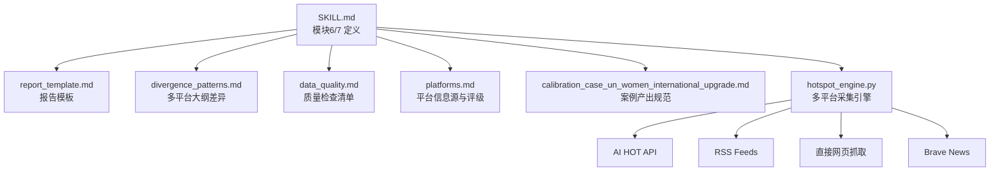
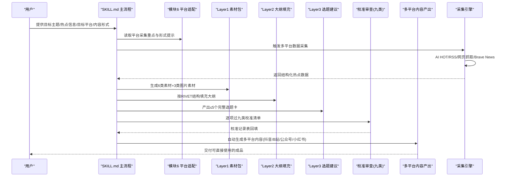
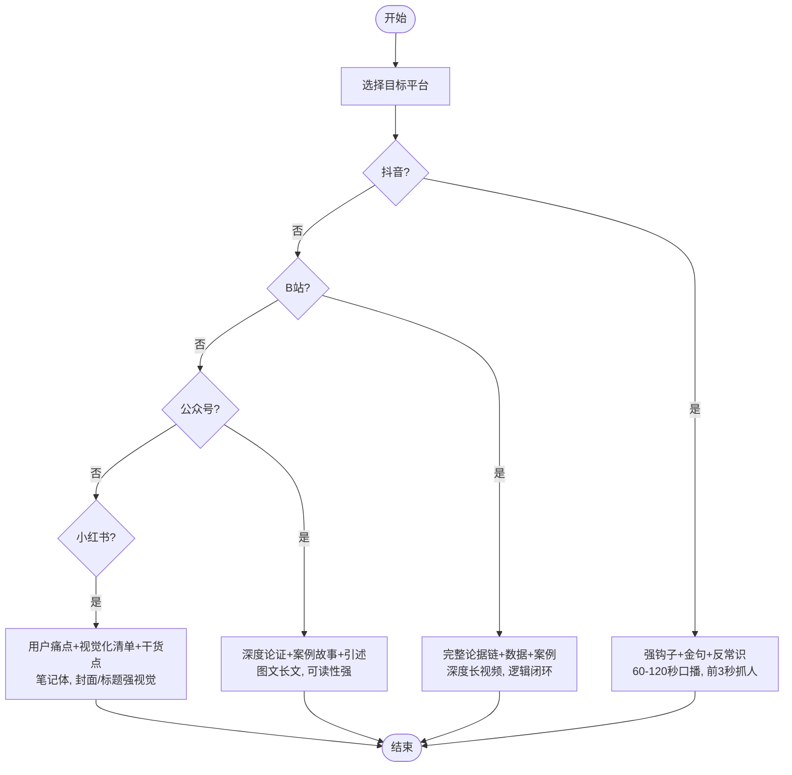
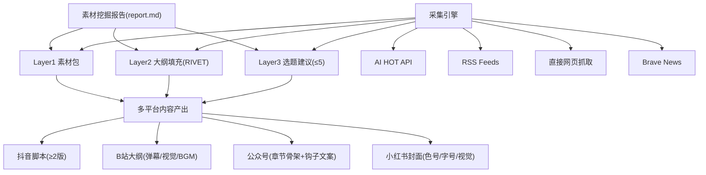
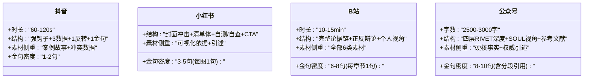
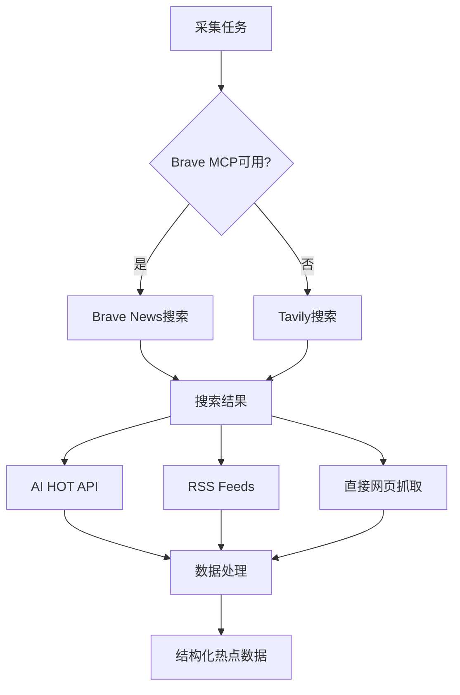
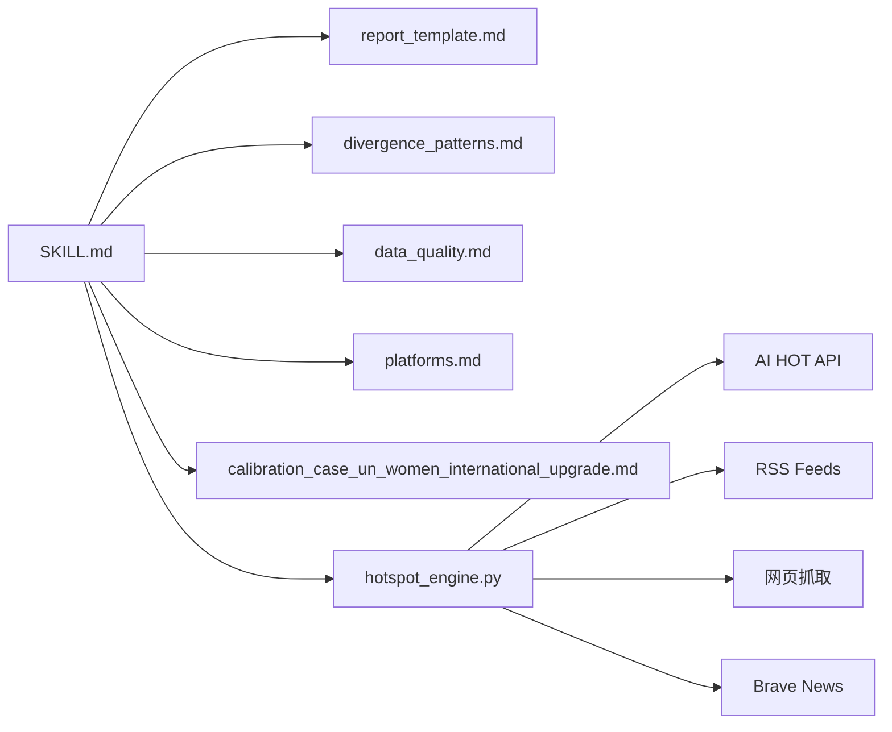

# 平台适配系统

<cite>
**本文引用的文件**
- [SKILL.md](file://hotspot-topic-excavator/skills/hotspot-topic-excavator/SKILL.md)
- [report_template.md](file://hotspot-topic-excavator/skills/hotspot-topic-excavator/templates/report_template.md)
- [platforms.md](file://.skills/hotspot-research/references/platforms.md)
- [data_quality.md](file://.skills/hotspot-research/references/data_quality.md)
- [divergence_patterns.md](file://hotspot-topic-excavator/skills/hotspot-topic-excavator/references/divergence_patterns.md)
- [calibration_case_un_women_international_upgrade.md](file://hotspot-topic-excavator/skills/hotspot-topic-excavator/references/calibration_case_un_women_international_upgrade.md)
- [provider_configuration.md](file://skills/hotspot-research/references/provider_configuration.md)
- [supplement_brave_tavily_2026-07-15.md](file://reports/hotspot/daily/supplement_brave_tavily_2026-07-15.md)
- [brave-mcp-degraded-recipe.md](file://skills/hotspot-topic-excavator/references/brave-mcp-degraded-recipe.md)
- [web_extract_degradation.md](file://skills/hotspot-research/references/web_extract_degradation.md)
- [llm_brave_context_alternative_path.md](file://skills/hotspot-research/references/llm_brave_context_alternative_path.md)
- [hotspot_engine.py](file://skills/hotspot-research_qoder_v2/scripts/hotspot_engine.py)
</cite>

## 更新摘要
**变更内容**
- 新增多平台集成支持：Brave News、AI HOT、RSS feeds、直接网页抓取
- 新增多种AI提供商支持与降级路径机制
- 增强采集系统的容错性和稳定性设计
- 补充Web提取工具的降级策略和替代方案

## 目录
1. [引言](#引言)
2. [项目结构](#项目结构)
3. [核心组件](#核心组件)
4. [架构总览](#架构总览)
5. [详细组件分析](#详细组件分析)
6. [依赖关系分析](#依赖关系分析)
7. [性能与稳定性考量](#性能与稳定性考量)
8. [故障排查指南](#故障排查指南)
9. [结论](#结论)
10. [附录：发布准备清单与质量检查标准](#附录发布准备清单与质量检查标准)

## 引言
本文件聚焦"模块6：平台采集重点适配"和"模块7：连续性生产流水线"，围绕抖音、B站、公众号、小红书四个平台的差异化采集重点与内容形式适配策略，系统化说明内容产出质量标准、自动化流程与流水线设计、平台特定钩子/视觉/互动策略，以及发布准备清单与质量检查标准。文档同时给出最佳实践与常见问题解决方案，帮助读者快速落地多平台内容生产。

**更新** 本次更新重点反映多平台集成的最新进展，包括Brave News、AI HOT、RSS feeds的直接采集能力，以及多种AI提供商的降级路径设计。

## 项目结构
该仓库包含热点主题深挖采集器（Qoder 插件）及其参考方法与模板。与平台适配和连续生产直接相关的核心文件如下：
- SKILL.md：定义双轴采集、多层产出、平台适配要点、校准审查与连续性生产流水线
- report_template.md：报告输出模板（Layer 1/2/3 结构与校验记录表）
- platforms.md：平台信息源与评级（含国内/海外平台监测对象与获取方式）
- data_quality.md：数据质量四关与报告内容质量检查清单
- divergence_patterns.md：多平台内容大纲差异化模式
- calibration_case_un_women_international_upgrade.md：案例中强制的多平台可执行产出规范
- hotspot_engine.py：多平台数据采集引擎，支持AI HOT、RSS、直接网页抓取等

图表来源
- [SKILL.md](file://hotspot-topic-excavator/skills/hotspot-topic-excavator/SKILL.md)
- [report_template.md](file://hotspot-topic-excavator/skills/hotspot-topic-excavator/templates/report_template.md)
- [hotspot_engine.py](file://skills/hotspot-research_qoder_v2/scripts/hotspot_engine.py)

章节来源
- [SKILL.md](file://hotspot-topic-excavator/skills/hotspot-topic-excavator/SKILL.md)
- [report_template.md](file://hotspot-topic-excavator/skills/hotspot-topic-excavator/templates/report_template.md)

## 核心组件
- 模块6：平台采集重点适配
  - 明确四大平台在采集侧的侧重点与形式提示，作为后续内容生产的输入约束
- 模块7：连续性生产流水线
  - 以"素材挖掘报告"为起点，自动进入"多平台内容产出"，并强制"可直接用"的粒度标准
- 多层产出组装（Layer 1/2/3）
  - Layer 1：素材包（6类内容+3类图片素材）
  - Layer 2：文章/视频大纲 + 素材填充（RIVET 结构）
  - Layer 3：再创作选题建议（≤5个完整选题卡）
- 校准审查（九类）与审查补充优化循环
  - 从事实到叙事、从理论偏向到受众工具链翻译，形成闭环质量控制
- **新增** 多平台集成采集系统
  - AI HOT中文AI资讯采集：REST API接口，指纹缓存优化
  - RSS feeds支持：YouTube频道订阅、新闻源RSS
  - 直接网页抓取：Jina Reader、web_extract工具链
  - Brave News集成：MCP工具调用，降级到Tavily搜索

章节来源
- [SKILL.md](file://hotspot-topic-excavator/skills/hotspot-topic-excavator/SKILL.md)
- [report_template.md](file://hotspot-topic-excavator/skills/hotspot-topic-excavator/templates/report_template.md)
- [hotspot_engine.py](file://skills/hotspot-research_qoder_v2/scripts/hotspot_engine.py)

## 架构总览
下图展示从"输入配置"到"多平台内容产出"的端到端流水线，以及平台适配与质量控制的嵌入点。

图表来源
- [SKILL.md](file://hotspot-topic-excavator/skills/hotspot-topic-excavator/SKILL.md)
- [report_template.md](file://hotspot-topic-excavator/skills/hotspot-topic-excavator/templates/report_template.md)
- [hotspot_engine.py](file://skills/hotspot-research_qoder_v2/scripts/hotspot_engine.py)

## 详细组件分析

### 模块6：平台采集重点适配（抖音/B站/公众号/小红书）
- 抖音
  - 采集重点：强钩子 + 金句 + 反常识结论
  - 形式提示：60-120秒口播，前3秒抓人
- B站
  - 采集重点：完整论据链 + 数据 + 案例
  - 形式提示：深度长视频，逻辑闭环
- 公众号
  - 采集重点：深度论证 + 案例故事 + 引述
  - 形式提示：图文长文，可读性强
- 小红书
  - 采集重点：用户痛点 + 视觉化清单 + 干货点
  - 形式提示：笔记体，封面/标题强视觉

图表来源
- [SKILL.md](file://hotspot-topic-excavator/skills/hotspot-topic-excavator/SKILL.md)

章节来源
- [SKILL.md](file://hotspot-topic-excavator/skills/hotspot-topic-excavator/SKILL.md)

### 模块7：连续性生产流水线与质量标准
- 默认流水线
  - 素材挖掘报告（report.md）→ 自动进入 → 独立产出：多平台内容（content-production-multi-platform.md）
- 内容产出质量标准（强制）
  - 抖音脚本：秒级时间码 + 画面描述 + 音效提示 + 口播逐句 + 制作要点；至少2个版本
  - 小红书封面：色号 + 字号位置 + 视觉元素
  - B站大纲：弹幕互动点 + 视觉方案 + BGM 建议
  - 公众号：章节骨架 + 引子/尾声具体钩子文案
- 禁止抽象描述，要求"可直接用"的粒度

**更新** 新增多平台数据采集能力，支持AI HOT、RSS、直接网页抓取等多种信息源。

图表来源
- [SKILL.md](file://hotspot-topic-excavator/skills/hotspot-topic-excavator/SKILL.md)
- [hotspot_engine.py](file://skills/hotspot-research_qoder_v2/scripts/hotspot_engine.py)

章节来源
- [SKILL.md](file://hotspot-topic-excavator/skills/hotspot-topic-excavator/SKILL.md)

### 多平台内容大纲差异化设计
- 抖音（60-120s）：单一强钩子 + 3个数据点 + 1个反转 + 1个金句；侧重案例故事与冲突数据；金句密度1-2句
- 小红书（9图）：封面冲击 + 清单体 + 自测/自查 + CTA；侧重可视化依据与引述；每图1句金句，共3-5句
- B站（10-15min）：完整论据链 + 正反辩论 + 个人视角；覆盖全部6类素材；金句密度6-8句（每章节1句）
- 公众号（2500-3000字）：四层RIVET深度 + SOUL视角 + 参考文献；侧重硬核事实与权威引述；金句密度8-10句（含分段引用）

图表来源
- [divergence_patterns.md](file://hotspot-topic-excavator/skills/hotspot-topic-excavator/references/divergence_patterns.md)

章节来源
- [divergence_patterns.md](file://hotspot-topic-excavator/skills/hotspot-topic-excavator/references/divergence_patterns.md)

### 平台特定的钩子、视觉与互动策略
- 抖音
  - 钩子：前3秒强刺激（反常识结论/冲突数据）
  - 视觉：高对比封面/字幕大字；关键数字放大
  - 互动：结尾抛出争议性问题引导评论
- B站
  - 钩子：开篇抛问题或悬念，预告论据链
  - 视觉：分屏对比/流程图/数据图表；章节卡片
  - 互动：弹幕互动点预埋（投票/二选一/填空）
- 公众号
  - 钩子：引子场景化切入，尾声行动号召
  - 视觉：段落留白、小标题清晰、配图标注来源
  - 互动：文末问答/延伸阅读/参考资料
- 小红书
  - 钩子：封面强视觉+标题直击痛点
  - 视觉：清单体排版、色号/字号明确、图示步骤
  - 互动：自测/自查清单+CTA收藏转发

章节来源
- [SKILL.md](file://hotspot-topic-excavator/skills/hotspot-topic-excavator/SKILL.md)
- [divergence_patterns.md](file://hotspot-topic-excavator/skills/hotspot-topic-excavator/references/divergence_patterns.md)

### 多平台集成采集系统
**新增** 系统化的多平台信息采集能力，支持多种数据源和降级路径：

#### AI HOT中文AI资讯采集
- REST API接口：`/api/public/items` 和 `/api/public/hot-topics`
- 指纹缓存机制：避免重复采集，提升效率
- 限流保护：60请求/分钟/IP限制
- 数据窗口：最近7天精选内容

#### RSS Feeds支持
- YouTube频道订阅：通过官方RSS feed获取视频信息
- 新闻源RSS：支持各类新闻网站的RSS订阅
- 自动解析：结构化处理RSS条目

#### 直接网页抓取
- Jina Reader：高质量网页内容提取
- web_extract工具：Hermes内置网页提取工具
- Python requests直连：底层网络请求能力

#### Brave News集成
- MCP工具调用：原生Brave搜索集成
- 降级路径：Brave不可用时自动切换到Tavily搜索
- 多源聚合：整合多个搜索引擎结果

图表来源
- [hotspot_engine.py](file://skills/hotspot-research_qoder_v2/scripts/hotspot_engine.py)
- [supplement_brave_tavily_2026-07-15.md](file://reports/hotspot/daily/supplement_brave_tavily_2026-07-15.md)

章节来源
- [hotspot_engine.py](file://skills/hotspot-research_qoder_v2/scripts/hotspot_engine.py)
- [supplement_brave_tavily_2026-07-15.md](file://reports/hotspot/daily/supplement_brave_tavily_2026-07-15.md)

### 案例中的强制产出规范（可直接用）
- 禁止抽象描述
- 强制：秒级时间码 + 具体画面 + 字幕字号 + BGM建议 + 引述授权清单
- 案例产出示例：抖音90s+60s双版本、小红书9图、B站12min、公众号3000字骨架

章节来源
- [calibration_case_un_women_international_upgrade.md](file://hotspot-topic-excavator/skills/hotspot-topic-excavator/references/calibration_case_un_women_international_upgrade.md)

## 依赖关系分析
- 模块6/7 依赖报告模板的结构字段（Layer 1/2/3、校准记录表）
- 多平台大纲差异化依赖 divergence_patterns 的模式定义
- 质量检查依赖 data_quality 的报告内容质量检查清单
- 平台信息源与评级依赖 platforms.md 的监测对象与可信度分级
- **新增** 多平台采集依赖 hotspot_engine.py 的采集能力和降级路径

图表来源
- [SKILL.md](file://hotspot-topic-excavator/skills/hotspot-topic-excavator/SKILL.md)
- [hotspot_engine.py](file://skills/hotspot-research_qoder_v2/scripts/hotspot_engine.py)

章节来源
- [SKILL.md](file://hotspot-topic-excavator/skills/hotspot-topic-excavator/SKILL.md)
- [hotspot_engine.py](file://skills/hotspot-research_qoder_v2/scripts/hotspot_engine.py)

## 性能与稳定性考量
- 并行采集：Step 2A 中多组 WebSearch 与 WebFetch 应尽可能并行调用，提升效率
- 降级路径：当搜索/抓取失败时，按层级降级（单点故障→第二层→第三层中文搜索主源），避免阻塞
- 信源优先级：一手来源(P1) > 权威媒体(P2) > 社区讨论(P3)，确保质量与时效平衡
- 完整性门槛：P0 热点必须信息完整度 ≥ 80%，否则降级处理
- **新增** 采集系统稳定性
  - AI HOT指纹缓存：避免重复API调用
  - 多源冗余：Brave→Tavily→直接搜索的降级链
  - 超时控制：各API调用设置合理超时时间
  - 错误隔离：单个源失败不影响整体采集流程

章节来源
- [SKILL.md](file://hotspot-topic-excavator/skills/hotspot-topic-excavator/SKILL.md)
- [data_quality.md](file://.skills/hotspot-research/references/data_quality.md)
- [hotspot_engine.py](file://skills/hotspot-research_qoder_v2/scripts/hotspot_engine.py)

## 故障排查指南
- 常见症状与定位
  - Python 环境路径解析错误（urllib3 类型不兼容）：优先确认 python3 版本与 venv 绝对路径
  - Cloudflare WAF 占位页：使用 Bash + Python requests 直连绕过
  - 播客 transcript 不可用：切换 Apple Podcasts show notes 替代路径
- 处理建议
  - 遇到网络/权限问题，立即启用降级路径，不要等待恢复
  - 对无法溯源的内容标注"待核实"，不纳入主线
  - 严格遵循"禁止抽象描述"的质量红线，确保成品可直接使用
- **新增** 多平台采集故障排查
  - Brave MCP不可用：自动降级到Tavily搜索
  - AI HOT API超时：检查网络连接，使用备用搜索方案
  - RSS订阅失败：验证URL有效性，切换到其他信息源
  - 网页抓取失败：尝试不同的提取工具（Jina→web_extract→requests）

章节来源
- [SKILL.md](file://hotspot-topic-excavator/skills/hotspot-topic-excavator/SKILL.md)
- [brave-mcp-degraded-recipe.md](file://skills/hotspot-topic-excavator/references/brave-mcp-degraded-recipe.md)
- [web_extract_degradation.md](file://skills/hotspot-research/references/web_extract_degradation.md)

## 结论
本系统通过"模块6：平台采集重点适配"与"模块7：连续性生产流水线"，将热点深挖与多平台内容生产打通，并以"可直接用"的强制质量标准保障产出可用性。结合九类校准审查与审查补充优化循环，形成从采集到产出的闭环质量体系。针对抖音、B站、公众号、小红书的差异化策略，可在保证一致性的前提下最大化各平台传播效果。

**更新** 新增的多平台集成采集系统显著提升了信息获取的广度和深度，通过AI HOT、RSS、直接网页抓取和Brave News等多源采集，配合完善的降级路径设计，确保了采集系统的稳定性和可靠性。

## 附录：发布准备清单与质量检查标准

### 发布准备清单（按平台）
- 抖音
  - 脚本：≥2个版本；秒级时间码/画面/音效/口播逐句/制作要点齐全
  - 封面与字幕：强视觉、大字、关键数字突出
  - 钩子：前3秒强刺激；结尾互动提问
- B站
  - 大纲：完整论据链；弹幕互动点；视觉方案；BGM建议
  - 章节卡片与数据图表完备
- 公众号
  - 章节骨架：引子/尾声钩子文案具体可用
  - 配图：来源标注清晰；段落留白与小标题清晰
- 小红书
  - 封面：色号/字号位置/视觉元素明确
  - 正文：清单体；自测/自查；CTA明确

章节来源
- [SKILL.md](file://hotspot-topic-excavator/skills/hotspot-topic-excavator/SKILL.md)
- [divergence_patterns.md](file://hotspot-topic-excavator/skills/hotspot-topic-excavator/references/divergence_patterns.md)

### 质量检查标准（报告与产出）
- 报告内容质量检查清单（节选）
  - 8个必须 section 全部存在
  - 每条热点标注发布日期
  - 英文标题带中文翻译
  - 中文摘要四要素齐全（主体/动作/关键数字/行业影响）
  - 概览四字段齐全（冲突/异常 + 数据锚点 + 受众关联 + 叙事钩子）
  - 线索ID持久化，不重新分配
  - 理论中立性检查：无哲学家署名引用
  - 时效检查：无超过72h内容；超48h标注回溯
- 校准审查（九类）
  - 事实校准/事实补充/表述校准/框架补充/对立视角/理论偏向/叙事引力/受众工具链翻译/三角叙事补洞
- 案例强制规范
  - 禁止抽象描述；强制秒级时间码/具体画面/字幕字号/BGM建议/引述授权清单
- **新增** 多平台采集质量检查
  - AI HOT数据完整性：检查指纹缓存是否正常工作
  - RSS订阅有效性：验证订阅源的可访问性
  - 网页抓取成功率：监控不同提取工具的可用性
  - 降级路径有效性：测试各降级方案的切换逻辑

章节来源
- [data_quality.md](file://.skills/hotspot-research/references/data_quality.md)
- [SKILL.md](file://hotspot-topic-excavator/skills/hotspot-topic-excavator/SKILL.md)
- [calibration_case_un_women_international_upgrade.md](file://hotspot-topic-excavator/skills/hotspot-topic-excavator/references/calibration_case_un_women_international_upgrade.md)