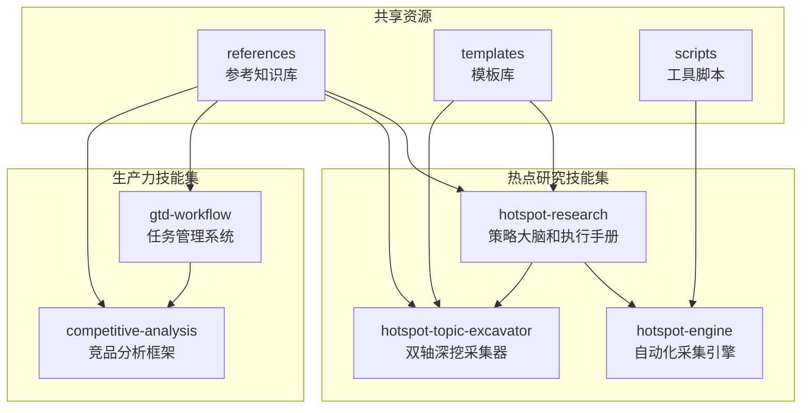
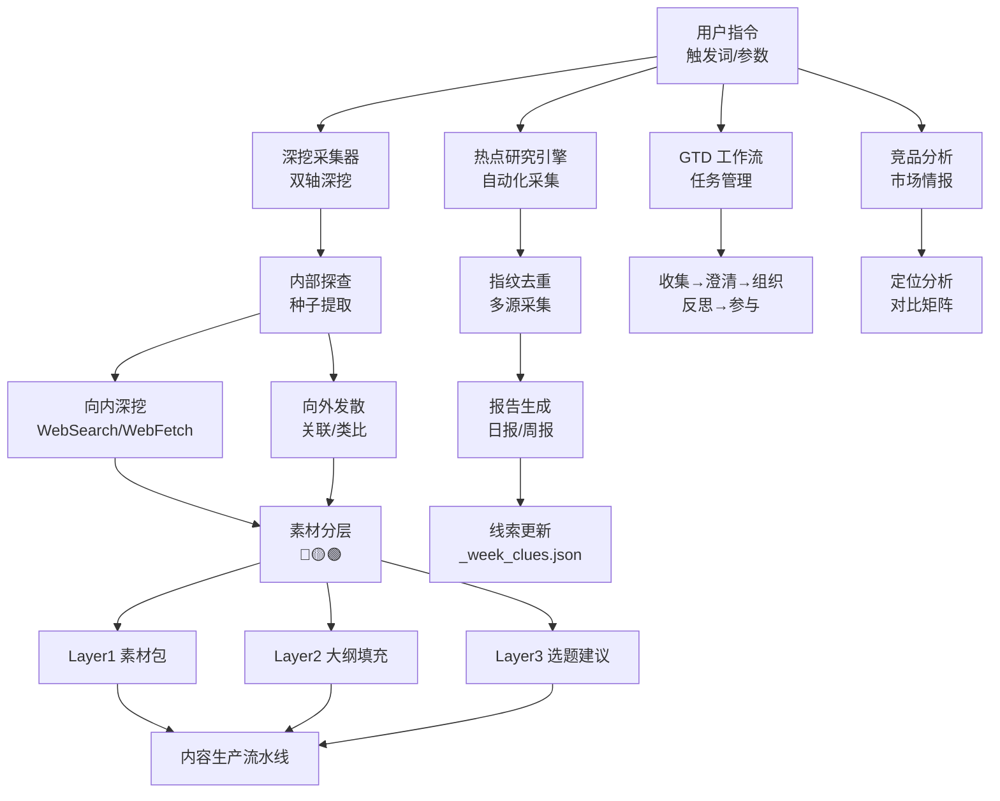
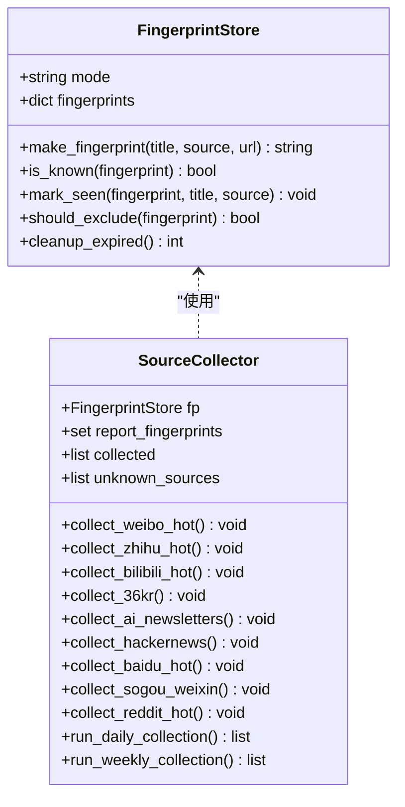
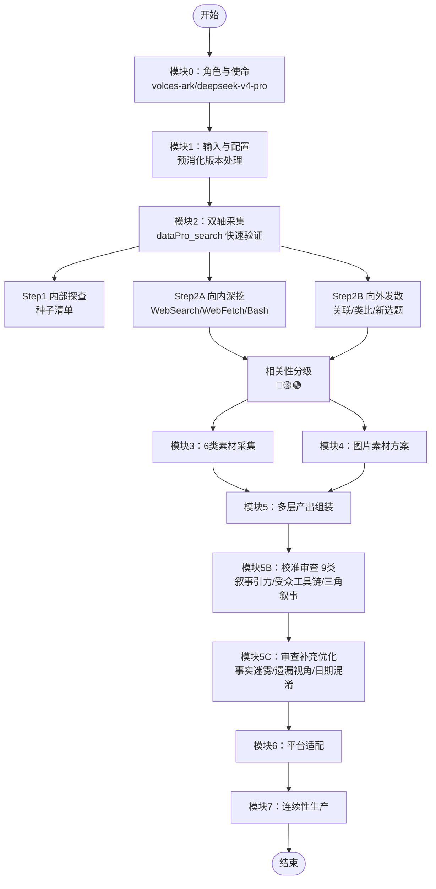
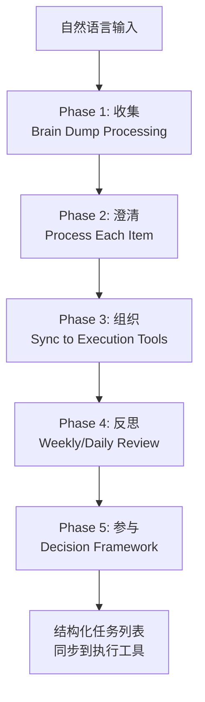
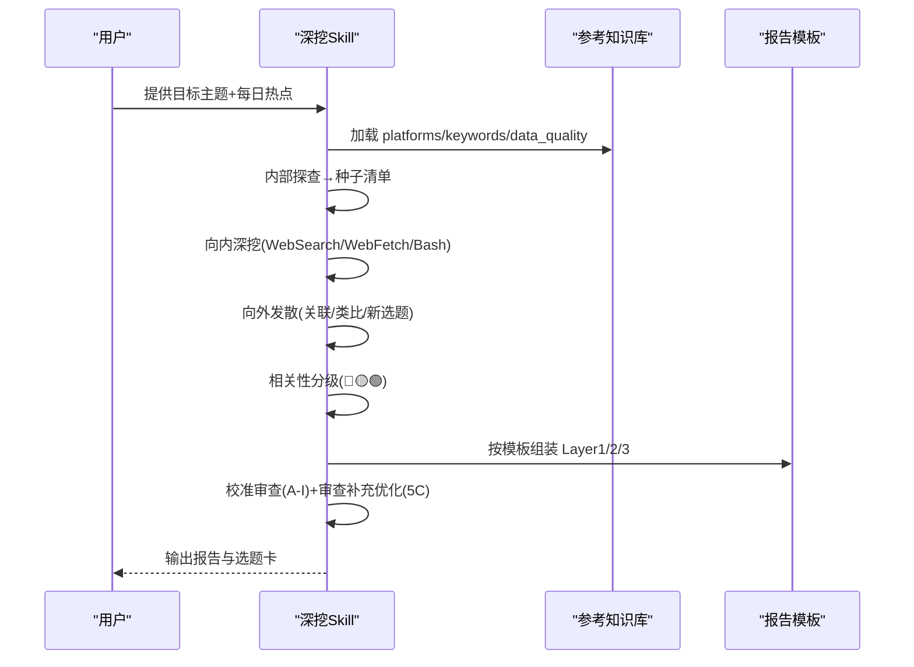
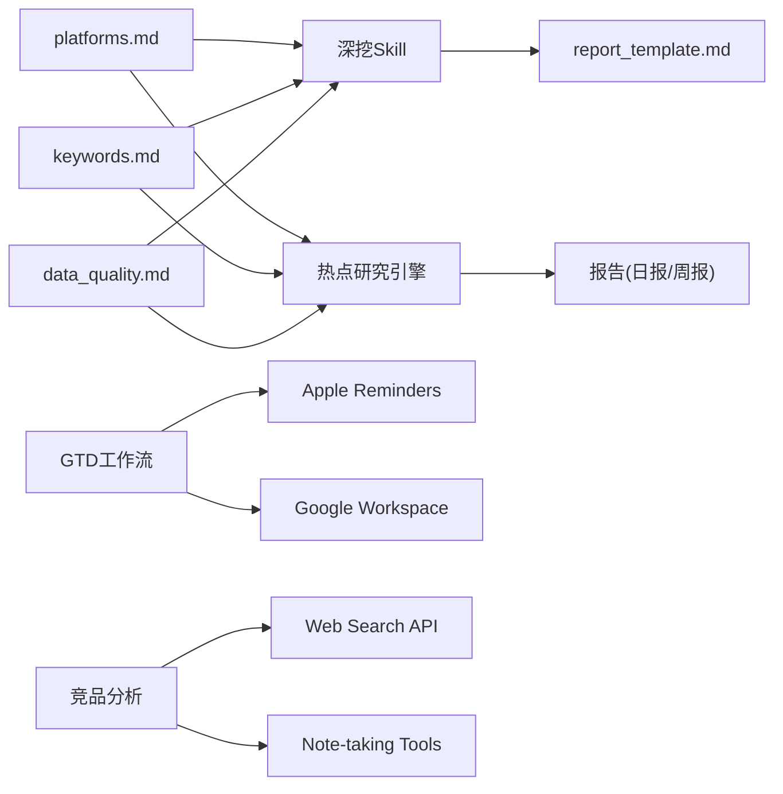
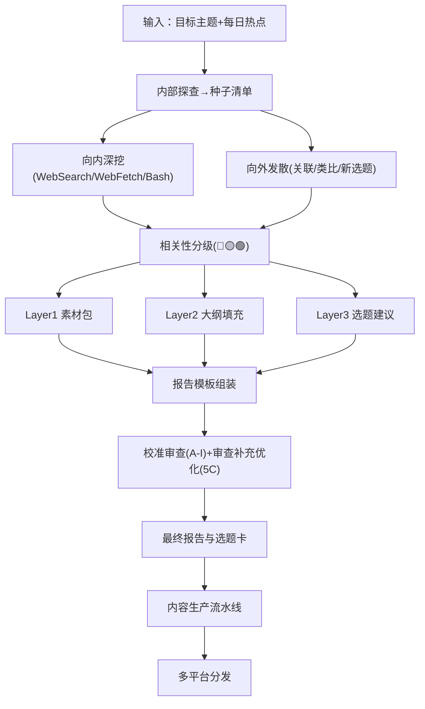
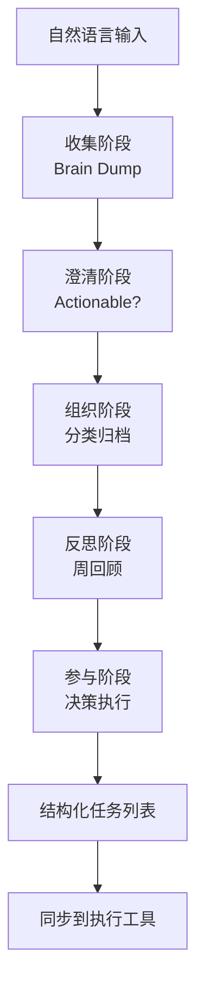
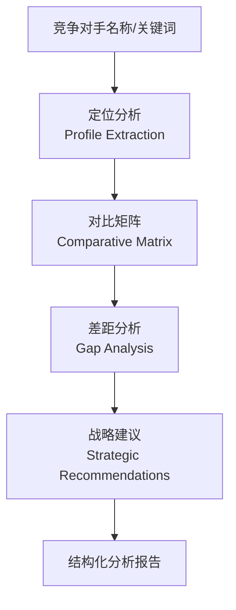

# 技能概览与架构

<cite>
**本文引用的文件**   
- [SKILL.md](file://skills/hotspot-research/SKILL.md)
- [hotspot_engine.py](file://skills/hotspot-research/scripts/hotspot_engine.py)
- [platforms.md](file://skills/hotspot-research/references/platforms.md)
- [report_template.md](file://skills/hotspot-research/templates/report_template.md)
- [SKILL.md](file://skills/hotspot-topic-excavator/SKILL.md)
- [divergence_patterns.md](file://skills/hotspot-topic-excavator/references/divergence_patterns.md)
- [cross_signal_synthesis.md](file://skills/hotspot-topic-excavator/references/cross_signal_synthesis.md)
- [SKILL.md](file://skills/productivity/gtd-workflow/SKILL.md)
- [SKILL.md](file://skills/research/competitive-analysis/SKILL.md)
- [SKILL.md](file://skills/research/hotspot-engine/SKILL.md)
</cite>

## 更新摘要
**所做更改**
- 新增生产力 GTD 工作流技能文档，完善个人任务管理系统
- 新增竞品分析技能文档，提供结构化竞争情报框架
- 增强热点引擎技能文档，补充生产级采集系统架构
- 更新双轴模型实现细节，反映 v2.7.5 版本最新变更
- 扩展技能生态系统图，展示五大核心技能的协作关系

## 目录
1. [引言](#引言)
2. [项目结构](#项目结构)
3. [核心组件](#核心组件)
4. [架构总览](#架构总览)
5. [详细组件分析](#详细组件分析)
6. [依赖关系分析](#依赖关系分析)
7. [性能与可靠性](#性能与可靠性)
8. [故障排查指南](#故障排查指南)
9. [结论](#结论)
10. [附录：输入输出规范与执行流程](#附录输入输出规范与执行流程)

## 引言
本文件为"热点主题素材深挖采集器"的全面技能概览，面向初学者与开发者。文档围绕双轴模型（向内深挖 + 向外发散）展开，系统阐述八大模块的整体架构、协作关系、输入输出规范、配置选项与执行流程，并提供系统架构图与数据流转图，解释与其他组件的集成方式与扩展机制。

**最新更新**：技能系统已扩展为包含五大核心能力的完整生态，涵盖热点研究、深度挖掘、生产力管理、竞品分析和专业研究等全方位能力。

## 项目结构
仓库现已形成完整的技能生态系统，包含五类核心技能：

**图表来源**
- [SKILL.md:1-101](file://skills/hotspot-research/SKILL.md#L1-L101)
- [SKILL.md:1-221](file://skills/research/hotspot-engine/SKILL.md#L1-L221)
- [SKILL.md:1-520](file://skills/hotspot-topic-excavator/SKILL.md#L1-L520)
- [SKILL.md:1-275](file://skills/productivity/gtd-workflow/SKILL.md#L1-L275)
- [SKILL.md:1-190](file://skills/research/competitive-analysis/SKILL.md#L1-L190)

章节来源
- [SKILL.md:1-101](file://skills/hotspot-research/SKILL.md#L1-L101)
- [SKILL.md:1-221](file://skills/research/hotspot-engine/SKILL.md#L1-L221)
- [SKILL.md:1-520](file://skills/hotspot-topic-excavator/SKILL.md#L1-L520)
- [SKILL.md:1-275](file://skills/productivity/gtd-workflow/SKILL.md#L1-L275)
- [SKILL.md:1-190](file://skills/research/competitive-analysis/SKILL.md#L1-L190)

## 核心组件
技能生态系统由以下核心组件构成：

### 热点研究子系统
- **热点研究引擎**：Python 批量采集与指纹去重，支持每日/每周报告生成
- **深挖采集器 Skill**：双轴模型、八模块工作流、三层产出体系
- **参考知识库**：平台评级、关键词体系、质量审核标准

### 生产力管理子系统
- **GTD 工作流**：完整的任务管理系统，集成 Apple Reminders 和 Google Workspace
- **竞品分析框架**：结构化竞争情报分析，识别差异化机会

### 共享基础设施
- **统一模板库**：标准化的报告模板和输出格式
- **工具脚本集**：网络抓取、OCR、验证等实用工具
- **参考文档库**：方法论指导和技术参考

章节来源
- [hotspot_engine.py:1-200](file://skills/hotspot-research/scripts/hotspot_engine.py#L1-L200)
- [SKILL.md:1-520](file://skills/hotspot-topic-excavator/SKILL.md#L1-L520)
- [SKILL.md:1-275](file://skills/productivity/gtd-workflow/SKILL.md#L1-L275)
- [SKILL.md:1-190](file://skills/research/competitive-analysis/SKILL.md#L1-L190)

## 架构总览
整体采用模块化设计，五大核心技能通过标准化接口协作：

**图表来源**
- [SKILL.md:1-101](file://skills/hotspot-research/SKILL.md#L1-L101)
- [SKILL.md:1-520](file://skills/hotspot-topic-excavator/SKILL.md#L1-L520)
- [SKILL.md:1-275](file://skills/productivity/gtd-workflow/SKILL.md#L1-L275)
- [SKILL.md:1-190](file://skills/research/competitive-analysis/SKILL.md#L1-L190)

## 详细组件分析

### 组件A：热点研究引擎（生产级自动化采集）
职责升级
- 生产级指纹去重（标题+来源+URL摘要哈希，带TTL过期机制）
- 多平台信息源采集（HTTP/RSS/聚合器，支持14个平台）
- 混合去重策略（采集前预检 + 采集后完整对比）
- 结构化 Markdown 报告生成（按平台分类、重复标记、时效检查）

关键数据结构与复杂度
- 指纹记录：{fingerprint, title, source, seen_count, first_seen, last_seen}
- 去重阈值：每日 seen≥3 排除，每周 seen≥2 排除
- 时间复杂度：O(N) 遍历采集结果；空间复杂度：O(M) 指纹库大小
- TTL 清理：按 last_seen 计算 cutoff，线性扫描删除过期项

**图表来源**
- [hotspot_engine.py:52-145](file://skills/hotspot-research/scripts/hotspot_engine.py#L52-L145)
- [hotspot_engine.py:150-746](file://skills/hotspot-research/scripts/hotspot_engine.py#L150-L746)

章节来源
- [hotspot_engine.py:1-200](file://skills/hotspot-research/scripts/hotspot_engine.py#L1-L200)
- [SKILL.md:1-221](file://skills/research/hotspot-engine/SKILL.md#L1-L221)

### 组件B：深挖采集器 Skill（v2.7.5 最新版本）
角色与使命升级
- 服务于 AI/科技深度内容与超级个体赛道
- 以热点为锚点，采用"向内深挖 + 向外发散"双轴模型
- 产出 Layer1 素材包、Layer2 大纲填充、Layer3 再创作选题建议

八模块概览（v2.7.5 增强版）
- 模块0：角色与使命（volces-ark/deepseek-v4-pro 配置）
- 模块1：输入规范与启动配置（含用户提供预消化版本处理）
- 模块2：双轴采集流程（Step 2A 增强：dataPro_search 快速验证）
- 模块3：内容素材采集（6类弹药 + 图片素材3类）
- 模块4：图片素材方案（文章配图/可下载图源/AI绘图prompt）
- 模块5：多层产出组装（Layer1/2/3 标准化输出）
- 模块5B：校准审查（9类A-I，新增叙事引力/受众工具链翻译/三角叙事）
- 模块5C：审查补充优化（Post-Generation Review Cycle）
- 模块6：平台采集重点适配（抖音/B站/公众号/小红书）
- 模块7：连续性生产（标准与默认流水线）

**图表来源**
- [SKILL.md:1-520](file://skills/hotspot-topic-excavator/SKILL.md#L1-L520)

章节来源
- [SKILL.md:1-520](file://skills/hotspot-topic-excavator/SKILL.md#L1-L520)

### 组件C：生产力 GTD 工作流
架构与流程
- 完整的 Getting Things Done (GTD) 系统
- 集成 Apple Reminders 和 Google Workspace 作为执行层
- 五阶段流程：收集 → 澄清 → 组织 → 反思 → 参与

核心特性
- 自然语言输入处理，自动分类为任务/项目/日历事件
- 优先级管理和上下文标签系统
- 周回顾模板和内容创作专项检查
- 最佳实践指导和常见陷阱规避

**图表来源**
- [SKILL.md:1-275](file://skills/productivity/gtd-workflow/SKILL.md#L1-L275)

章节来源
- [SKILL.md:1-275](file://skills/productivity/gtd-workflow/SKILL.md#L1-L275)

### 组件D：竞品分析框架
结构化分析方法
- 定位分析：核心主张、目标受众、人格原型、差异化主张
- 内容分析：主要平台、内容形式、发布频率、高绩效模式
- 增长分析：粉丝规模、增长趋势、互动模式、网络效应
- 变现分析：收入模式、价格定位、转化路径、规模化程度

输出模板
- 多维度对比矩阵（6-8个维度）
- SOUL 定位叠加分析
- 差异化机会识别
- 可执行的战略建议（3-5条）

章节来源
- [SKILL.md:1-190](file://skills/research/competitive-analysis/SKILL.md#L1-L190)

### 组件E：分析方法与模式库
增强版分析方法
- 信号分析型话题编译模型（事件→技术→商业→行业→信号五层递进）
- 横纵深度专题模板（纵轴历史脉络、横轴格局对比、交汇洞察）
- 发散模式参考库（GPS类比链、LLM Context优先、反方纳入、多平台差异化）
- 三路信号交叉分析（时间线收敛、三层递归识别、拐点判断、独立性矩阵）

**图表来源**
- [divergence_patterns.md:1-200](file://skills/hotspot-topic-excavator/references/divergence_patterns.md#L1-L200)
- [cross_signal_synthesis.md:1-136](file://skills/hotspot-topic-excavator/references/cross_signal_synthesis.md#L1-L136)
- [report_template.md:1-195](file://skills/hotspot-research/templates/report_template.md#L1-L195)

章节来源
- [divergence_patterns.md:1-200](file://skills/hotspot-topic-excavator/references/divergence_patterns.md#L1-L200)
- [cross_signal_synthesis.md:1-136](file://skills/hotspot-topic-excavator/references/cross_signal_synthesis.md#L1-L136)

## 依赖关系分析
技能生态系统中的依赖关系更加清晰和模块化：

**图表来源**
- [platforms.md:1-127](file://skills/hotspot-research/references/platforms.md#L1-L127)
- [SKILL.md:1-275](file://skills/productivity/gtd-workflow/SKILL.md#L1-L275)
- [SKILL.md:1-190](file://skills/research/competitive-analysis/SKILL.md#L1-L190)

章节来源
- [platforms.md:1-127](file://skills/hotspot-research/references/platforms.md#L1-L127)
- [SKILL.md:1-275](file://skills/productivity/gtd-workflow/SKILL.md#L1-L275)
- [SKILL.md:1-190](file://skills/research/competitive-analysis/SKILL.md#L1-L190)

## 性能与可靠性
系统性能与可靠性得到全面增强：

### 并发与并行
- 深挖采集器强调 WebSearch 与 WebFetch 并行调用，提升采集效率
- 热点研究引擎对每个采集器独立 try-except，单源失败不阻塞全流程
- GTD 工作流支持批量任务处理和异步同步

### 去重与增量
- 混合策略：采集前预检（跳过已知）、采集后完整对比（标记重复），按 seen_count 阈值排除
- TTL 清理：每日指纹保留7天，每周指纹保留30天
- 线索持久化：W-{week_num}-{topic_seq} 格式，避免重复分配

### 降级路径
- 深挖采集器：第一层（单点故障）→第二层（WebSearch不可用）→第三层（中文搜索主源模式）
- 热点研究引擎：HTTP直连→RSS/聚合器→搜索摘要；Jina Reader 重试与阻断处理
- GTD 工作流：本地存储→云端同步的双保险机制

### 时效控制
- 深挖采集器：P0/P1强制时效宣誓，超期降级或丢弃
- 热点研究引擎：三关审核中的时效关，相对时间转绝对日期，保守推定
- 竞品分析：定期更新机制（30-60天），避免过时情报

## 故障排查指南
全面的故障排查体系：

### 网络诊断
- 快速检查 Google/Jina 连通性，区分全局断网与特定服务阻断
- Brave MCP 连续 ≥5 次 unreachable 时启用豆包主源模式

### Jina Reader 行为
- 常见阻断站点（Fortune/TIME/Guardian/NYT/Bloomberg 等）→ 改用 WebSearch 摘要
- 重试策略：空内容/超时/403/503 分别处理

### Python 环境路径问题
- urllib3 版本与 Python 版本匹配，必要时使用 venv 绝对路径显式调用
- 沙箱路径解析失败时使用绝对路径 `/Users/lizhenjiang/.hermes/hermes-agent/venv/bin/python3`

### 平台限制
- 微博/知乎/即刻/YouTube 等平台存在反爬或 JS 渲染限制 → 使用 Browser MCP 或替代 API
- Cloudflare WAF 站点使用 Python requests + 浏览器 UA + 正则提取绕过

### GTD 工作流特定问题
- Apple Reminders 同步失败 → 检查网络连接和权限设置
- Google Workspace 集成问题 → 验证 OAuth 令牌和 API 配额
- 任务状态不同步 → 执行手动同步并检查日志

章节来源
- [SKILL.md:1-520](file://skills/hotspot-topic-excavator/SKILL.md#L1-L520)
- [SKILL.md:1-275](file://skills/productivity/gtd-workflow/SKILL.md#L1-L275)
- [SKILL.md:1-190](file://skills/research/competitive-analysis/SKILL.md#L1-L190)

## 结论
本系统通过五大核心技能的协同设计，构建了完整的热点研究与内容生产生态系统。从自动化的热点采集与去重，到深度的双轴挖掘与内容创作，再到高效的生产力管理和竞争情报分析，形成了一个闭环的工作流。

**核心优势**：
- 模块化设计：各技能独立运行又相互协作
- 标准化接口：统一的输入输出规范和模板
- 弹性架构：完善的降级路径和故障恢复机制
- 持续演进：基于实战反馈的快速迭代能力

**未来发展方向**：
- 更多平台的集成支持
- AI 驱动的智能内容推荐
- 跨语言的全球化内容生产
- 与企业系统的深度集成

## 附录：输入输出规范与执行流程

### 输入规范（深挖采集器 v2.7.5）
- 必填：目标主题、每日热点信息（文件或粘贴）
- 选填：来源线索、选题角度、目标平台、内容形式
- 启动配置：深挖/发散配比（默认70/30）、选题卡粒度（完整选题卡）、发散上限（≤5且须溯源）
- **新增**：用户提供预消化版本的处理（6项强制验证清单）

章节来源
- [SKILL.md:115-159](file://skills/hotspot-topic-excavator/SKILL.md#L115-L159)

### 输出规范（深挖采集器）
- Layer1：素材包（6类 + 图片素材3类，红黄绿分层）
- Layer2：文章/视频大纲 + 素材填充（RIVET 结构）
- Layer3：再创作选题建议（≤5个完整选题卡）
- 报告模板字段：话题、日期、配置、信源完整度、校验表、参考资料清单

章节来源
- [SKILL.md:334-341](file://skills/hotspot-topic-excavator/SKILL.md#L334-L341)
- [report_template.md:1-195](file://skills/hotspot-research/templates/report_template.md#L1-L195)

### 执行流程（热点研究）
- Step0：预检与初始化（模式选择、AM/PM版本管理、AI HOT预检、指纹库加载）
- Step1：多源信息采集（Python引擎批量采集或Qoder工具链交互式采集）
- Step2：筛选与深度挖掘（三关审核：时效/赛道/独家）
- Step3：时效检查（每条P0/P1条目三问宣誓）
- Step4：按模板生成报告（命名规范、标题与摘要强制规范、发布日期强制规范）
- Step5：线索更新（_week_clues.json）
- Step6：素材深挖提示（日报专属候选话题）
- Step7：上期选题反馈

章节来源
- [SKILL.md:34-174](file://skills/hotspot-research/SKILL.md#L34-L174)

### 数据流转图（端到端）

**图表来源**
- [SKILL.md:72-237](file://skills/hotspot-topic-excavator/SKILL.md#L72-L237)
- [report_template.md:1-195](file://skills/hotspot-research/templates/report_template.md#L1-L195)

### GTD 工作流执行流程

**图表来源**
- [SKILL.md:21-49](file://skills/productivity/gtd-workflow/SKILL.md#L21-L49)

章节来源
- [SKILL.md:53-218](file://skills/productivity/gtd-workflow/SKILL.md#L53-L218)

### 竞品分析执行流程

**图表来源**
- [SKILL.md:20-46](file://skills/research/competitive-analysis/SKILL.md#L20-L46)

章节来源
- [SKILL.md:48-118](file://skills/research/competitive-analysis/SKILL.md#L48-L118)