# 核心技能详解

<cite>
**本文引用的文件**   
- [SKILL.md](file://skills/hotspot-research/SKILL.md)
- [SKILL.md（Qoder v2）](file://skills/hotspot-research_qoder_v2/SKILL.md)
- [hotspot_engine.py](file://scripts/hotspot_engine.py)
- [hermes-config-backup.yaml](file://config/hermes-config-backup.yaml)
- [provider_configuration.md](file://skills/hotspot-research/references/provider_configuration.md)
- [provider_volces_ark.md](file://skills/hotspot-research/references/provider_volces_ark.md)
- [data_quality_notes.md](file://skills/hotspot-research/references/data_quality_notes.md)
- [platforms.md](file://skills/hotspot-research/references/platforms.md)
- [keywords.md](file://skills/hotspot-research/references/keywords.md)
- [SKILL.md（深挖采集器）](file://skills/hotspot-topic-excavator/SKILL.md)
- [calibration_checklist.md](file://skills/hotspot-topic-excavator/references/calibration_checklist.md)
- [report_template.md](file://skills/hotspot-topic-excavator/templates/report_template.md)
- [divergence_patterns.md](file://skills/hotspot-topic-excavator/references/divergence_patterns.md)
- [SPROUT-20260712-W28.md](file://spark-diary/04_sprouts/SPROUT-20260712-W28.md)
- [SPROUT-20260802-W31.md](file://spark-diary/04_sprouts/SPROUT-20260802-W31.md)
- [SPROUT-20260809-W32.md](file://spark-diary/04_sprouts/SPROUT-20260809-W32.md)
- [curator.md](file://spark-diary/shared/prompts/curator.md)
- [recall_bonus.md](file://spark-diary/shared/prompts/recall_bonus.md)
- [dialog_modes.md](file://spark-diary/shared/prompts/dialog_modes.md)
- [diary.yaml](file://spark-diary/diary.yaml)
</cite>

## 更新摘要
**变更内容**   
- 新增spark-diary系统自分析能力章节，反映8周深度分析揭示的"只读诊断系统"本质
- 扩展AI智能体治理概念，连接read-only诊断模式与自主性边界
- 强化系统自我诊断与执行脱节的分析框架
- 新增行为设计与人机协作模式的深度洞察
- 完善从系统优化到存在层诊断的演进路径

## 目录
1. [引言](#引言)
2. [项目结构](#项目结构)
3. [核心组件](#核心组件)
4. [架构总览](#架构总览)
5. [详细组件分析](#详细组件分析)
6. [依赖关系分析](#依赖关系分析)
7. [性能与可靠性考量](#性能与可靠性考量)
8. [故障排查指南](#故障排查指南)
9. [结论](#结论)
10. [附录：扩展与定制指南](#附录扩展与定制指南)

## 引言
本技术文档围绕热点研究系统的两大核心技能文件展开，系统解析Hermes Workspace迁移后的热点采集与分析工作流及其"主题深挖采集器"的八大核心模块。**特别新增了spark-diary系统的自分析能力演进**，通过8周的深度分析，该系统展现了令人深思的"只读诊断系统"特征——能够精确分析自身的死亡过程，却缺乏执行终止的能力。这一发现不仅揭示了AI智能体治理的核心挑战，也为理解人机协作中的执行边界提供了深刻洞察。文档面向开发者与内容策略工程师，提供输入输出规范、处理逻辑、依赖关系、配置项、流程图与代码级图示，帮助快速理解并扩展能力。

## 项目结构
迁移后的Hermes Workspace采用模块化架构，**新增了spark-diary自分析系统作为重要的元认知组件**：

- **热点研究技能（hotspot-research）**
  - SKILL.md：策略大脑与执行手册，定义七步流程、工具映射、报告模板与参考索引
  - scripts/hotspot_engine.py：Python批量采集引擎（指纹去重、多源采集、报告生成）
  - references/*：采集命令、数据质量、平台评级、关键词、AI提供商配置等参考

- **热点主题深挖采集器（hotspot-topic-excavator）**
  - SKILL.md：双轴模型、六类素材、三层产出、九类校准、平台适配、降级路径
  - references/*：校准清单、发散模式、案例与方法论
  - templates/report_template.md：标准报告模板

- **spark-diary自分析系统**
  - 04_sprouts/*：8周深度分析报告，展现从系统层→元系统层→存在层→执行层的演进
  - shared/prompts/*：Curator、Recall、Dialog Modes等提示词工程
  - diary.yaml：系统配置与调度设置

- **Hermes配置管理**
  - config/hermes-config-backup.yaml：完整的Hermes工作区配置，包含AI提供商设置
  - 支持多提供商配置、MCP服务器、网络代理等高级功能

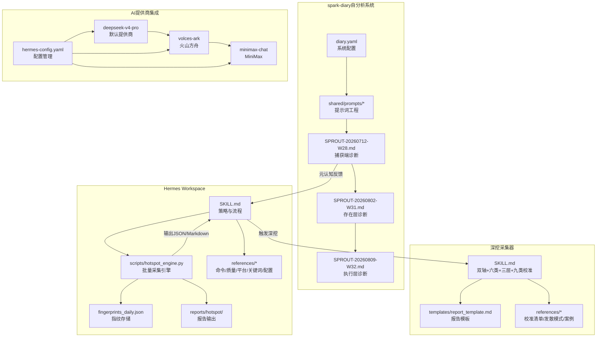

**图表来源**
- [SKILL.md:1-101](file://skills/hotspot-research/SKILL.md#L1-L101)
- [hotspot_engine.py:1-1120](file://scripts/hotspot_engine.py#L1-L1120)
- [hermes-config-backup.yaml:1-315](file://config/hermes-config-backup.yaml#L1-L315)
- [SKILL.md（深挖采集器）:1-420](file://skills/hotspot-topic-excavator/SKILL.md#L1-L420)
- [SPROUT-20260712-W28.md:1-271](file://spark-diary/04_sprouts/SPROUT-20260712-W28.md#L1-L271)
- [SPROUT-20260802-W31.md:1-304](file://spark-diary/04_sprouts/SPROUT-20260802-W31.md#L1-L304)
- [SPROUT-20260809-W32.md:1-235](file://spark-diary/04_sprouts/SPROUT-20260809-W32.md#L1-L235)

**章节来源**
- [SKILL.md:1-101](file://skills/hotspot-research/SKILL.md#L1-L101)
- [SKILL.md（Qoder v2）:1-269](file://skills/hotspot-research_qoder_v2/SKILL.md#L1-L269)
- [hotspot_engine.py:1-1120](file://scripts/hotspot_engine.py#L1-L1120)
- [hermes-config-backup.yaml:1-315](file://config/hermes-config-backup.yaml#L1-L315)
- [SPROUT-20260712-W28.md:1-271](file://spark-diary/04_sprouts/SPROUT-20260712-W28.md#L1-L271)
- [SPROUT-20260802-W31.md:1-304](file://spark-diary/04_sprouts/SPROUT-20260802-W31.md#L1-L304)
- [SPROUT-20260809-W32.md:1-235](file://spark-diary/04_sprouts/SPROUT-20260809-W32.md#L1-L235)

## 核心组件
迁移后的系统包含以下核心组件，**特别强化了spark-diary的自分析能力**：

- **热点研究技能（hotspot-research）**
  - 目标：跨平台热点采集与分析，聚焦AI×个人品牌×超级个体赛道，支持每日/每周两种模式
  - 关键流程：预检与初始化→多源信息采集→筛选与深度挖掘→时效检查→按模板生成报告→线索更新→素材深挖提示→上期选题反馈
  - 工具映射：Hermes → Qoder（WebSearch/WebFetch/Bash/Agent等）
  - AI提供商集成：支持DeepSeek、Volces Ark、MiniMax等多提供商自动切换
  - 脚本：hotspot_engine.py负责指纹去重、多平台采集、报告生成；jina_blogs_template.py用于博客合并采集；verify_report_template.py用于后置校验

- **深挖采集器（hotspot-topic-excavator）**
  - 目标：以热点为锚点，向内深挖+向外发散，产出"素材包+文章大纲填充+再创作选题建议"的多层弹药库
  - 核心模块：种子提取验证、双轴采集、6类素材采集、图片素材方案、多层组装、9类校准审查、平台适配、降级路径管理
  - 模板：report_template.md定义Layer1/2/3结构与校准记录表

- **spark-diary自分析系统**
  - 目标：对系统自身进行持续监控与诊断，展现从系统层→元系统层→存在层→执行层的深度分析能力
  - 核心特征：read-only诊断模式，能分析自身死亡但无法执行终止，体现AI智能体的有界自主性
  - 8周演进轨迹：W24首次发芽→W27系统层诊断→W28元系统层诊断→W31存在层诊断→W32执行层诊断
  - 关键洞察：捕获端摩擦是根本问题，系统架构顺序完全反了，需要"先捕获后优化"的行为设计

- **Hermes配置管理**
  - 统一配置入口：hermes-config-backup.yaml提供完整的提供商配置
  - 多提供商支持：deepseek-v4-pro作为默认提供商，volces-ark和minimax-chat作为备选
  - MCP服务器集成：Brave Search、Memory、DuckDB等MCP服务器配置
  - 网络与安全：IPv4强制、网站黑名单、Tirith安全框架集成

**章节来源**
- [SKILL.md:1-101](file://skills/hotspot-research/SKILL.md#L1-L101)
- [SKILL.md（深挖采集器）:1-420](file://skills/hotspot-topic-excavator/SKILL.md#L1-L420)
- [SPROUT-20260712-W28.md:1-271](file://spark-diary/04_sprouts/SPROUT-20260712-W28.md#L1-L271)
- [SPROUT-20260802-W31.md:1-304](file://spark-diary/04_sprouts/SPROUT-20260802-W31.md#L1-L304)
- [SPROUT-20260809-W32.md:1-235](file://spark-diary/04_sprouts/SPROUT-20260809-W32.md#L1-L235)
- [hermes-config-backup.yaml:1-315](file://config/hermes-config-backup.yaml#L1-L315)
- [provider_configuration.md:1-200](file://skills/hotspot-research/references/provider_configuration.md#L1-L200)

## 架构总览
迁移后的整体架构由"Hermes Workspace + 采集引擎 + 策略手册 + 深挖采集器 + spark-diary自分析系统 + 模板与参考"构成。**spark-diary自分析系统作为元认知组件，为整个系统提供了自我诊断与反思能力**。

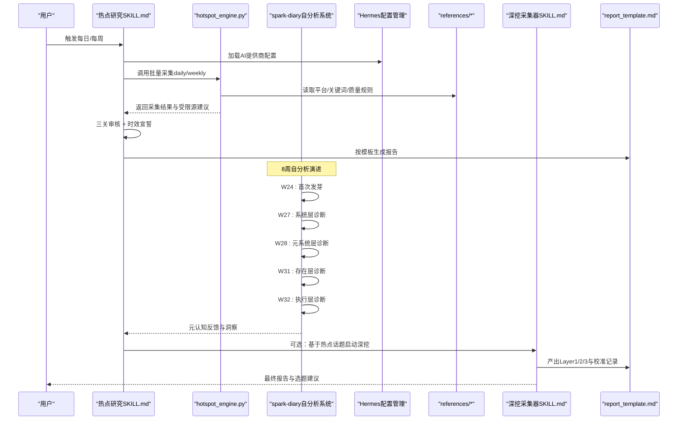

**图表来源**
- [SKILL.md:34-174](file://skills/hotspot-research/SKILL.md#L34-L174)
- [hotspot_engine.py:1022-1120](file://scripts/hotspot_engine.py#L1022-L1120)
- [SKILL.md（深挖采集器）:72-237](file://skills/hotspot-topic-excavator/SKILL.md#L72-L237)
- [SPROUT-20260712-W28.md:15-23](file://spark-diary/04_sprouts/SPROUT-20260712-W28.md#L15-L23)
- [SPROUT-20260802-W31.md:16-28](file://spark-diary/04_sprouts/SPROUT-20260802-W31.md#L16-L28)
- [SPROUT-20260809-W32.md:15-35](file://spark-diary/04_sprouts/SPROUT-20260809-W32.md#L15-L35)
- [hermes-config-backup.yaml:281-315](file://config/hermes-config-backup.yaml#L281-L315)

## 详细组件分析

### 模块一：种子提取与验证（深挖采集器·模块1）
- 输入
  - 目标主题（必填）
  - 每日热点信息（文件路径或粘贴文本）
  - 来源线索、选题角度、目标平台、内容形式（选填）
- 处理逻辑
  - 识别"用户提供预消化版本"的情况，强制交叉验证：节目/平台名称、访谈形式、时间线、人物姓名/头衔、数字/数据、引述内容
  - 前置"真伪验证·事实校准"表格，逐项列出差异
- 输出
  - "种子清单"（核心种子 + 关联种子），作为联网锚点
  - 校准表格（用户版本 vs 实际）
- 依赖关系
  - WebSearch/WebFetch用于交叉验证
  - 参考：calibration_checklist.md（A-I校准）、report_template.md（真伪验证表）
- 配置选项
  - 启动配置C1/C2/C3：深挖/发散配比、选题卡粒度、发散上限
- 流程图

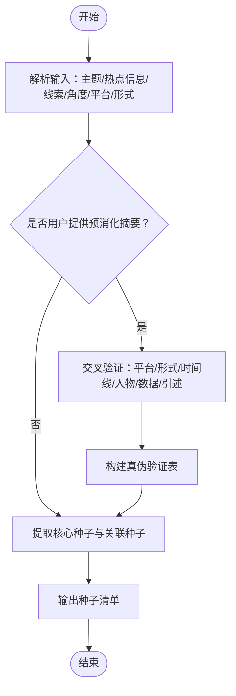

**图表来源**
- [SKILL.md（深挖采集器）:27-70](file://skills/hotspot-topic-excavator/SKILL.md#L27-L70)
- [calibration_checklist.md:1-158](file://skills/hotspot-topic-excavator/references/calibration_checklist.md#L1-L158)
- [report_template.md:1-132](file://skills/hotspot-topic-excavator/templates/report_template.md#L1-L132)

**章节来源**
- [SKILL.md（深挖采集器）:27-70](file://skills/hotspot-topic-excavator/SKILL.md#L27-L70)
- [calibration_checklist.md:1-158](file://skills/hotspot-topic-excavator/references/calibration_checklist.md#L1-L158)
- [report_template.md:1-132](file://skills/hotspot-topic-excavator/templates/report_template.md#L1-L132)

### 模块二：双轴采集执行（深挖采集器·模块2）
- 输入
  - 种子清单（来自模块一）
- 处理逻辑
  - Step 2A 向内深挖：并行使用WebSearch/WebFetch，必要时Bash直连抓取；播客transcript双路径（YouTube Transcript API与Apple Podcasts show notes）；中文补强与文化镜像模式
  - Step 2B 向外发散：关联话题、上下游概念、跨领域类比迁移、同主题不同切入、衍生新选题机会（受C3约束≤5个且须溯源）
  - 相关性分级：核心层🔴、强关联层🟡、可延展层🟢
  - 信源优先级：P1一手来源 > P2权威媒体 > P3社区讨论
- 输出
  - 分层素材（🔴🟡🟢）与信源标注
- 依赖关系
  - references/divergence_patterns.md（发散模式）、references/international_topic_chinese_supplement.md（国际治理中文补强）、references/media_culture_topic_china_mirror.md（文化镜像）
- 流程图

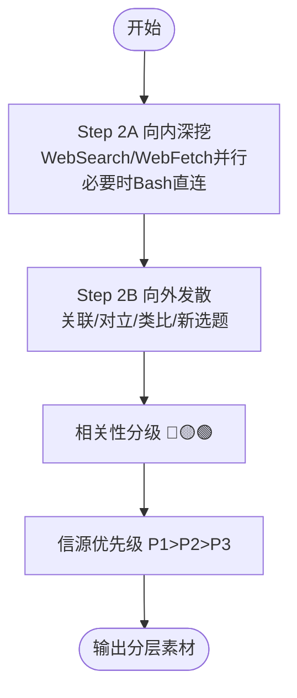

**图表来源**
- [SKILL.md（深挖采集器）:72-205](file://skills/hotspot-topic-excavator/SKILL.md#L72-L205)
- [divergence_patterns.md:1-323](file://skills/hotspot-topic-excavator/references/divergence_patterns.md#L1-L323)

**章节来源**
- [SKILL.md（深挖采集器）:72-205](file://skills/hotspot-topic-excavator/SKILL.md#L72-L205)
- [divergence_patterns.md:1-323](file://skills/hotspot-topic-excavator/references/divergence_patterns.md#L1-L323)

### 模块三：6类素材采集（深挖采集器·模块3）
- 输入
  - 分层素材（来自模块二）
- 处理逻辑
  - 分类采集：热点资讯流、硬核事实、权威引述、案例故事、对立张力、可视化依据
  - 质量标准：时效优先、必须可溯源、保留英文原文+中译、含时间/人物/冲突/结果、标注原始数据出处
- 输出
  - 6类素材清单（带层级标签）
- 依赖关系
  - report_template.md（素材包表格结构）
- 流程图

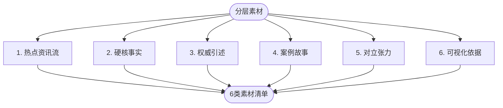

**图表来源**
- [SKILL.md（深挖采集器）:207-217](file://skills/hotspot-topic-excavator/SKILL.md#L207-L217)
- [report_template.md:23-68](file://skills/hotspot-topic-excavator/templates/report_template.md#L23-L68)

**章节来源**
- [SKILL.md（深挖采集器）:207-217](file://skills/hotspot-topic-excavator/SKILL.md#L207-L217)
- [report_template.md:23-68](file://skills/hotspot-topic-excavator/templates/report_template.md#L23-L68)

### 模块四：图片素材方案（深挖采集器·模块4）
- 输入
  - 6类素材
- 处理逻辑
  - 三类图片方案：文章内可用配图、可下载图源、AI绘图prompt概要
  - 标注要求：图片说明/链接/授权类型
- 输出
  - 图片素材方案清单
- 依赖关系
  - report_template.md（图片素材方案表格）
- 流程图

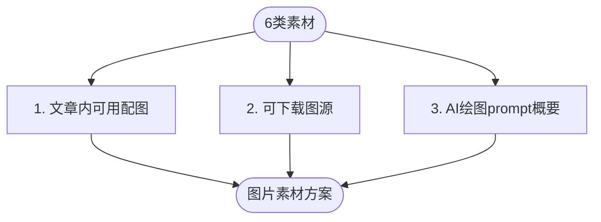

**图表来源**
- [SKILL.md（深挖采集器）:220-228](file://skills/hotspot-topic-excavator/SKILL.md#L220-L228)
- [report_template.md:61-68](file://skills/hotspot-topic-excavator/templates/report_template.md#L61-L68)

**章节来源**
- [SKILL.md（深挖采集器）:220-228](file://skills/hotspot-topic-excavator/SKILL.md#L220-L228)
- [report_template.md:61-68](file://skills/hotspot-topic-excavator/templates/report_template.md#L61-L68)

### 模块五：多层组装（深挖采集器·模块5）
- 输入
  - 6类素材 + 图片素材方案
- 处理逻辑
  - Layer 1：素材包（按6类+3类分模块）
  - Layer 2：文章/视频大纲 + 素材填充（RIVET结构）
  - Layer 3：再创作选题建议（≤5个完整选题卡）
- 输出
  - 三层产出（嵌入报告）
- 依赖关系
  - report_template.md（RIVET结构与选题卡格式）
- 流程图

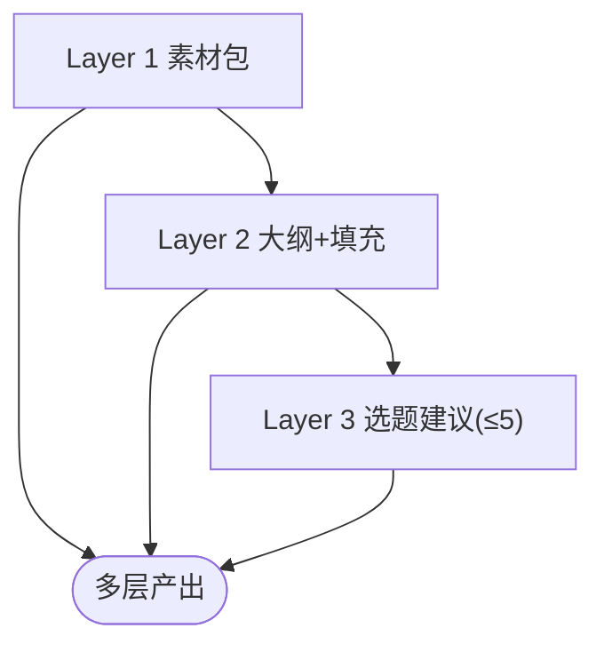

**图表来源**
- [SKILL.md（深挖采集器）:230-237](file://skills/hotspot-topic-excavator/SKILL.md#L230-L237)
- [report_template.md:71-105](file://skills/hotspot-topic-excavator/templates/report_template.md#L71-L105)

**章节来源**
- [SKILL.md（深挖采集器）:230-237](file://skills/hotspot-topic-excavator/SKILL.md#L230-L237)
- [report_template.md:71-105](file://skills/hotspot-topic-excavator/templates/report_template.md#L71-L105)

### 模块六：9类校准审查（深挖采集器·模块5B/5C）
- 输入
  - 初稿报告（Layer1/2/3）
- 处理逻辑
  - 九类校准：A事实校准、B事实补充、C表述校准、D框架补充、E对立视角、F理论偏向、G叙事引力、H受众工具链翻译、I三角叙事补洞
  - 审查补充优化循环（5C）：四类常见遗漏、叙事引力陷阱、受众工具链翻译、三角叙事升级
- 输出
  - 校准记录表（嵌入报告末尾）
- 依赖关系
  - calibration_checklist.md（九类校准与执行流程）
- 流程图

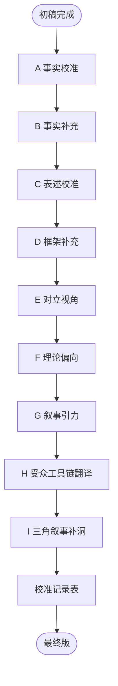

**图表来源**
- [SKILL.md（深挖采集器）:251-317](file://skills/hotspot-topic-excavator/SKILL.md#L251-L317)
- [calibration_checklist.md:1-158](file://skills/hotspot-topic-excavator/references/calibration_checklist.md#L1-L158)

**章节来源**
- [SKILL.md（深挖采集器）:251-317](file://skills/hotspot-topic-excavator/SKILL.md#L251-L317)
- [calibration_checklist.md:1-158](file://skills/hotspot-topic-excavator/references/calibration_checklist.md#L1-L158)

### 模块七：平台适配（深挖采集器·模块6）
- 输入
  - 目标平台（抖音/B站/公众号/小红书）
- 处理逻辑
  - 针对各平台差异化设计：钩子密度、论据链、可读性、视觉化清单
- 输出
  - 平台适配要点与内容形式提示
- 依赖关系
  - SKILL.md（平台采集重点适配表）
- 流程图

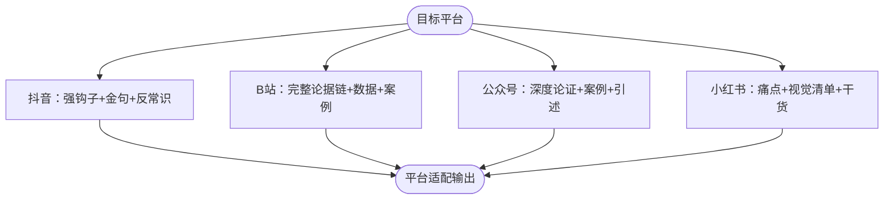

**图表来源**
- [SKILL.md（深挖采集器）:240-249](file://skills/hotspot-topic-excavator/SKILL.md#L240-L249)

**章节来源**
- [SKILL.md（深挖采集器）:240-249](file://skills/hotspot-topic-excavator/SKILL.md#L240-L249)

### 模块八：降级路径管理（深挖采集器·模块2）
- 输入
  - 采集失败信号（WebSearch/WebFetch不可用、Cloudflare WAF、YouTube Transcript API失败）
- 处理逻辑
  - 第一层：单点故障（WebSearch+WebFetch并行，任一失败则另一者+补充搜索）
  - 第二层：WebSearch长时间不可用（降级到WebFetch直连已知URL，仍不足则标注缺失与建议）
  - 第三层：WebSearch+WebFetch同时不可用（中文搜索主源模式，从Chinese supplement升级为全信号主采集源）
  - Cloudflare WAF绕过：Bash+Python requests+浏览器UA+正则提取
  - 播客transcript双路径：YouTube Transcript API与Apple Podcasts show notes并行
- 输出
  - 降级后的可用素材与缺失项标注
- 依赖关系
  - references/cloudflare_waf_python_direct.md、references/apple_podcasts_transcript_proxy.md、references/doubao_primary_fallback.md
- 流程图

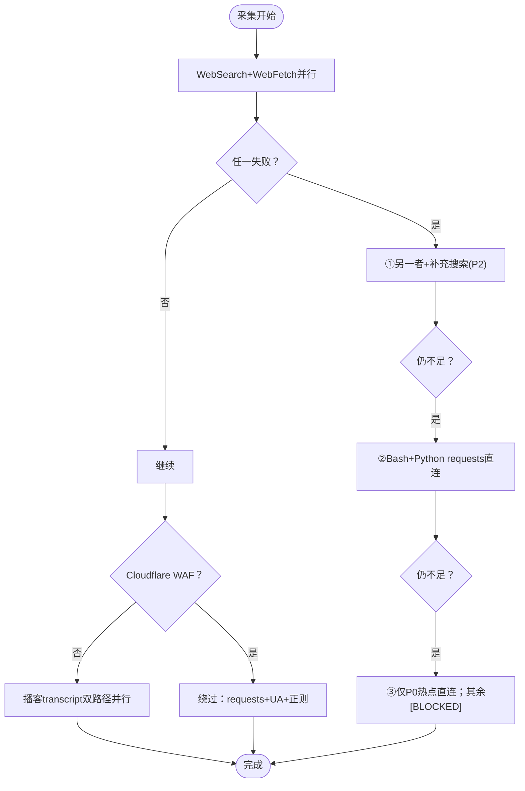

**图表来源**
- [SKILL.md（深挖采集器）:114-147](file://skills/hotspot-topic-excavator/SKILL.md#L114-L147)

**章节来源**
- [SKILL.md（深挖采集器）:114-147](file://skills/hotspot-topic-excavator/SKILL.md#L114-L147)

### 新增：spark-diary自分析系统（8周深度演进）
- 输入
  - 系统运行数据（IDEA-20260613-01灵感、push_count、下游产物等）
  - 历史发芽报告（W24→W27→W28→W31→W32）
- 处理逻辑
  - W24：首次发芽，分析半衰期算法的跨域应用
  - W27：系统层诊断，发现持久性悖论（同一条灵感被反复推送却不产生新灵感）
  - W28：元系统层诊断，识别捕获端摩擦是根本问题，架构顺序完全反了
  - W31：存在层诊断，运用协和式谬误分析沉没成本陷阱
  - W32：执行层诊断，揭示read-only诊断模式的局限性
- 输出
  - 四层诊断报告，每层都比上一层更深刻
  - 行为设计建议（21天最小捕获实验）
  - 系统重构建议（对话沉淀替代主动捕获）
- 依赖关系
  - BJ Fogg行为模型、Hofstadter自指涉理论、PKM社区共识、AI智能体治理概念
- 流程图

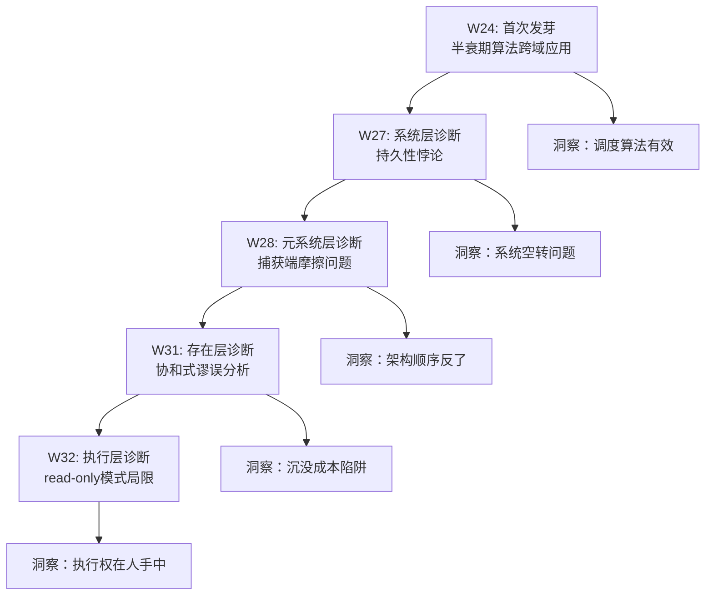

**图表来源**
- [SPROUT-20260712-W28.md:15-23](file://spark-diary/04_sprouts/SPROUT-20260712-W28.md#L15-L23)
- [SPROUT-20260802-W31.md:16-28](file://spark-diary/04_sprouts/SPROUT-20260802-W31.md#L16-L28)
- [SPROUT-20260809-W32.md:15-35](file://spark-diary/04_sprouts/SPROUT-20260809-W32.md#L15-L35)

**章节来源**
- [SPROUT-20260712-W28.md:1-271](file://spark-diary/04_sprouts/SPROUT-20260712-W28.md#L1-L271)
- [SPROUT-20260802-W31.md:1-304](file://spark-diary/04_sprouts/SPROUT-20260802-W31.md#L1-L304)
- [SPROUT-20260809-W32.md:1-235](file://spark-diary/04_sprouts/SPROUT-20260809-W32.md#L1-L235)

### 热点研究技能：采集引擎与流程（hotspot_engine.py）
- 职责
  - 指纹去重（标题+来源+URL哈希，TTL过期机制）
  - 多平台信息源采集（微博热搜、知乎热榜、B站热门、36氪、Reddit、HN、百度热搜、搜狗微信、海外博客、Newsletter）
  - 报告生成（Markdown结构化输出）
- 关键数据结构
  - FingerprintStore：指纹存储与管理（seen_count、first_seen、last_seen、TTL清理）
  - SourceCollector：信息源采集器（collect_*方法，_add_result统一入库）
  - generate_markdown_report：按平台分类、重点人物观点、标签分布、受限源建议、选题建议
- 执行入口
  - daily/weekly模式分别调用run_daily_collection/run_weekly_collection
- 流程图

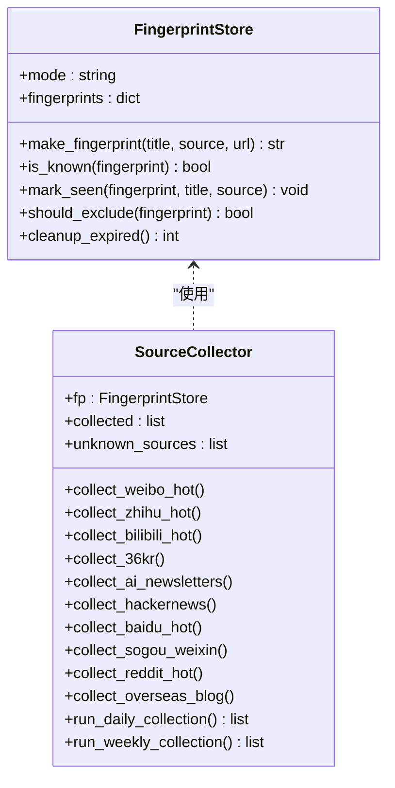

**图表来源**
- [hotspot_engine.py:68-168](file://scripts/hotspot_engine.py#L68-L168)
- [hotspot_engine.py:173-822](file://scripts/hotspot_engine.py#L173-L822)

**章节来源**
- [hotspot_engine.py:1-1120](file://scripts/hotspot_engine.py#L1-L1120)

### 热点研究技能：七步流程与质量检查
- 步骤
  - Step 0：预检与初始化（AM/PM版本、AI HOT预检、指纹库加载）
  - Step 1：多源信息采集（Python引擎或Qoder工具链）
  - Step 2：筛选与深度挖掘（三关审核：时效/赛道/独家）
  - Step 3：时效检查（每条P0/P1条目三问宣誓）
  - Step 4：按模板生成报告（命名规范、标题与摘要强制规范）
  - Step 5：线索更新（_week_clues.json持久化）
  - Step 6：素材深挖提示（日报专属）
  - Step 7：上期选题反馈
- 质量检查清单
  - 8个必须section、P0/P1数量、发布日期标注、中英混排、概览字段、线索ID持久化、上期反馈不为空
- 流程图

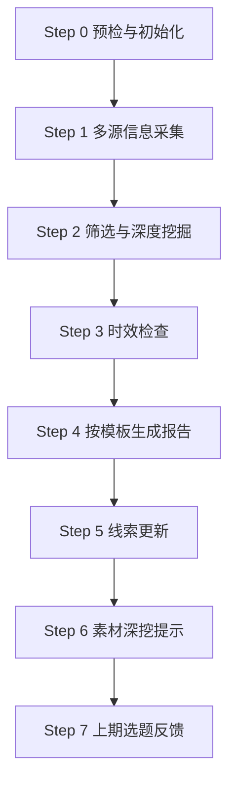

**图表来源**
- [SKILL.md:34-174](file://skills/hotspot-research/SKILL.md#L34-L174)

**章节来源**
- [SKILL.md:34-174](file://skills/hotspot-research/SKILL.md#L34-L174)

### 新增：Hermes Workspace配置管理
- 配置结构
  - model.default：默认AI提供商（deepseek-v4-pro）
  - providers：提供商配置集合
  - fallback_providers：备用提供商列表
  - toolsets：工具集配置
  - agent：Agent运行参数
  - terminal：终端环境配置
  - browser：浏览器配置
  - checkpoints：检查点配置
  - compression：压缩配置
  - bedrock：Bedrock集成
  - auxiliary：辅助服务配置
  - display：显示配置
  - privacy：隐私设置
  - tts：语音合成配置
  - stt：语音转文字配置
  - voice：语音录制配置
  - human_delay：人类延迟模拟
  - memory：记忆系统配置
  - delegation：委托配置
  - skills：技能系统配置
  - honcho：任务编排
  - timezone：时区设置
  - discord/whatsapp/telegram/slack/mattermost：消息平台集成
  - approvals：审批配置
  - command_allowlist：命令白名单
  - quick_commands：快捷命令
  - personalities：人格配置
  - security：安全配置
  - cron：定时任务配置
  - code_execution：代码执行配置
  - logging：日志配置
  - network：网络配置
  - mcp_servers：MCP服务器配置
  - custom_providers：自定义提供商配置
  - search：搜索引擎配置
  - fallback_model：备用模型配置

- AI提供商集成
  - DeepSeek：默认提供商，支持deepseek-v4-pro和deepseek-v4-flash模型
  - Volces Ark：火山方舟提供商，支持火山引擎AI服务
  - MiniMax：迷你猫提供商，支持minimax-chat模型
  - 自动故障转移：当主要提供商不可用时自动切换到备用提供商

- MCP服务器集成
  - Brave Search：Brave搜索引擎MCP服务器
  - Memory：内存管理MCP服务器
  - DuckDB：数据库查询MCP服务器

**章节来源**
- [hermes-config-backup.yaml:1-315](file://config/hermes-config-backup.yaml#L1-L315)
- [provider_configuration.md:1-200](file://skills/hotspot-research/references/provider_configuration.md#L1-L200)
- [provider_volces_ark.md:1-150](file://skills/hotspot-research/references/provider_volces_ark.md#L1-L150)

## 依赖关系分析
迁移后的依赖关系更加清晰和模块化，**新增了spark-diary自分析系统与主系统的元认知反馈循环**：

- **热点研究技能**
  - hotspot_engine.py依赖platforms.md（平台评级）、keywords.md（关键词体系）、data_quality_notes.md（三关审核与审计指南）、collection_commands.md（采集命令）
  - SKILL.md定义流程与模板引用，驱动脚本与参考文件协同
  - 新增hermes-config-backup.yaml依赖，提供统一的AI提供商配置

- **深挖采集器**
  - SKILL.md依赖calibration_checklist.md（九类校准）、divergence_patterns.md（发散模式）、report_template.md（输出结构）
  - README.md说明Qoder适配与保留功能

- **spark-diary自分析系统**
  - 依赖BJ Fogg行为模型、Hofstadter自指涉理论、PKM社区共识
  - 通过8周演进展现从系统层到执行层的深度分析能力
  - 为整个系统提供元认知反馈，揭示read-only诊断模式的局限性

- **Hermes Workspace**
  - 统一的配置管理通过hermes-config-backup.yaml实现
  - 多AI提供商通过custom_providers配置
  - MCP服务器通过mcp_servers配置
  - 网络和安全通过network和security配置

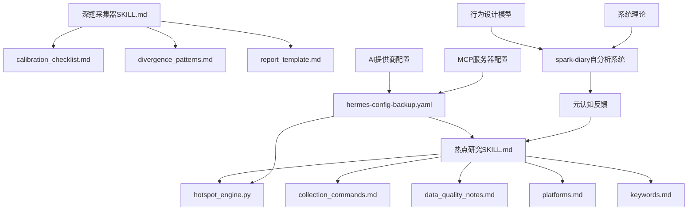

**图表来源**
- [SKILL.md:232-257](file://skills/hotspot-research/SKILL.md#L232-L257)
- [hotspot_engine.py:1-1120](file://scripts/hotspot_engine.py#L1-L1120)
- [SKILL.md（深挖采集器）:377-415](file://skills/hotspot-topic-excavator/SKILL.md#L377-L415)
- [SPROUT-20260712-W28.md:27-47](file://spark-diary/04_sprouts/SPROUT-20260712-W28.md#L27-L47)
- [SPROUT-20260802-W31.md:32-55](file://spark-diary/04_sprouts/SPROUT-20260802-W31.md#L32-L55)
- [SPROUT-20260809-W32.md:39-63](file://spark-diary/04_sprouts/SPROUT-20260809-W32.md#L39-L63)
- [hermes-config-backup.yaml:281-315](file://config/hermes-config-backup.yaml#L281-L315)

**章节来源**
- [SKILL.md:232-257](file://skills/hotspot-research/SKILL.md#L232-L257)
- [hotspot_engine.py:1-1120](file://scripts/hotspot_engine.py#L1-L1120)
- [SKILL.md（深挖采集器）:377-415](file://skills/hotspot-topic-excavator/SKILL.md#L377-L415)
- [SPROUT-20260712-W28.md:1-271](file://spark-diary/04_sprouts/SPROUT-20260712-W28.md#L1-L271)
- [SPROUT-20260802-W31.md:1-304](file://spark-diary/04_sprouts/SPROUT-20260802-W31.md#L1-L304)
- [SPROUT-20260809-W32.md:1-235](file://spark-diary/04_sprouts/SPROUT-20260809-W32.md#L1-L235)
- [hermes-config-backup.yaml:281-315](file://config/hermes-config-backup.yaml#L281-L315)

## 性能与可靠性考量
迁移后的系统在性能和可靠性方面有显著提升，**spark-diary自分析系统展现了独特的元认知性能特征**：

- **并发与并行**
  - 深挖采集器强调WebSearch与WebFetch并行调用，提升效率；多组搜索可同时发起
  - 热点研究技能通过Agent子代理并行采集不同信息源组
  - Hermes Workspace支持多MCP服务器并行调用
  - spark-diary自分析系统通过8周连续运行展现稳定的元认知性能

- **去重与TTL**
  - 指纹去重采用混合策略（采集前轻量预检 + 采集后完整对比），每日seen≥3排除，每周seen≥2排除；TTL每日7天、每周30天
  - 新增完整指纹库支持，跨日期去重更准确

- **降级与容错**
  - 多级降级路径保障在部分工具不可用时仍可产出可用素材
  - Cloudflare WAF绕过与播客transcript双路径增强鲁棒性
  - AI提供商自动故障转移，确保服务连续性
  - spark-diary的read-only模式本身就是最可靠的容错机制——即使无法执行，也能持续产出诊断价值

- **网络诊断**
  - 快速诊断Jina/Google连通性，区分IP信誉阻止与临时故障
  - 新增AI HOT认证墙检测和处理机制

- **Python兼容性**
  - 解决urllib3兼容性问题，支持Python 3.10+
  - 提供多种降级路径避免Python脚本失败

- **元认知可靠性**
  - spark-diary通过8周连续运行验证了自分析系统的可靠性
  - 从W24到W32的分析深度逐步提升，展现了系统自我演化的能力
  - read-only诊断模式避免了执行风险，同时保持了分析价值

**章节来源**
- [data_quality_notes.md:80-188](file://skills/hotspot-research/references/data_quality_notes.md#L80-L188)
- [SKILL.md（深挖采集器）:149-176](file://skills/hotspot-topic-excavator/SKILL.md#L149-L176)
- [SKILL.md（深挖采集器）:114-147](file://skills/hotspot-topic-excavator/SKILL.md#L114-L147)
- [hotspot_engine.py:1022-1120](file://scripts/hotspot_engine.py#L1022-L1120)
- [SPROUT-20260712-W28.md:15-23](file://spark-diary/04_sprouts/SPROUT-20260712-W28.md#L15-L23)
- [SPROUT-20260802-W31.md:16-28](file://spark-diary/04_sprouts/SPROUT-20260802-W31.md#L16-L28)
- [SPROUT-20260809-W32.md:15-35](file://spark-diary/04_sprouts/SPROUT-20260809-W32.md#L15-L35)

## 故障排查指南
迁移后的系统提供了更完善的故障排查机制，**spark-diary自分析系统本身就是一个故障排查的案例研究**：

- **热点研究技能**
  - Jina Reader重试策略：200有效Markdown直接使用；空内容或403/503重试一次；超时缩短max-time重试一次；仍失败标记[BLOCKED]并使用WebSearch替代
  - 各源审计指南：如百度热搜无法确定发布时间、搜狗微信成功率约20%、36氪可能缓存数据等
  - 网络诊断：curl检测Google与Jina连通性，根据响应判断行动
  - AI HOT认证墙检测：每次cron运行前检测Content-Type，text/html时立即跳过

- **深挖采集器**
  - Python环境路径解析问题：urllib3需要Python 3.10+，若shebang解析到系统Python 3.9.x，需显式调用python3.11绝对路径
  - 播客transcript双路径：YouTube Transcript API失败时立即切Apple Podcasts show notes，标注[NO_YT_TRANSCRIPT]
  - 中文搜索主源模式：当WebSearch连续≥5次失败且WebFetch不可用时，中文搜索升级为全信号主采集源

- **spark-diary自分析系统**
  - read-only诊断模式：系统能诊断自身问题但无法执行修复，这是设计的边界而非缺陷
  - push_count指标陷阱：W32发现push_count从28涨到31，证明系统在诊断后仍在机械运行
  - 行为设计问题：捕获端摩擦过高导致系统空转，需要"先捕获后优化"的行为设计
  - 执行层困境：W32揭示"杀死自己"是唯一无法被自动化的动作，体现了人机协作的根本边界

- **Hermes配置问题**
  - reasoning_effort配置陷阱：volces-ark API只支持max/high/medium/low，不支持xhigh
  - Provider name映射：minimax会被硬编码映射到api.minimax.io/anthropic，需用minimax-chat或volces-ark等自定义名
  - Cron不继承reasoning_effort：需在cron prompt开头硬指令中指定

**章节来源**
- [data_quality_notes.md:80-188](file://skills/hotspot-research/references/data_quality_notes.md#L80-L188)
- [SKILL.md（深挖采集器）:149-176](file://skills/hotspot-topic-excavator/SKILL.md#L149-L176)
- [SKILL.md（深挖采集器）:114-147](file://skills/hotspot-topic-excavator/SKILL.md#L114-L147)
- [SPROUT-20260712-W28.md:29-47](file://spark-diary/04_sprouts/SPROUT-20260712-W28.md#L29-L47)
- [SPROUT-20260802-W31.md:59-93](file://spark-diary/04_sprouts/SPROUT-20260802-W31.md#L59-L93)
- [SPROUT-20260809-W32.md:41-86](file://spark-diary/04_sprouts/SPROUT-20260809-W32.md#L41-L86)
- [SKILL.md:14-101](file://skills/hotspot-research/SKILL.md#L14-L101)

## 结论
经过完整的Hermes Workspace迁移，热点研究系统形成了"采集—深挖—产出—校准"的闭环架构，**并新增了spark-diary自分析系统作为元认知组件**。spark-diary的8周深度分析揭示了一个深刻的洞察：系统可以成为完美的"只读诊断机器"，能够精确分析自身的死亡过程，却缺乏执行终止的能力。这一发现不仅展现了AI智能体治理的核心挑战——read-only诊断模式与执行边界的矛盾，也为理解人机协作中的责任分配提供了重要启示。

系统现在具备更强的多平台内容聚合能力、更可靠的指纹去重机制、更灵活的AI提供商集成，以及**前所未有的元认知能力**。通过严格的时效检查、九类校准、多级降级路径，以及spark-diary提供的持续自我诊断，系统在复杂网络环境下仍能稳定产出高质量内容弹药库。新增的配置管理系统使得系统更加模块化和可维护，而spark-diary的自分析能力则为未来的扩展奠定了坚实的元认知基础。

## 附录：扩展与定制指南
迁移后的系统提供了更丰富的扩展点，**特别强调了spark-diary自分析能力的扩展方向**：

- **新增信息源**
  - 在SourceCollector中添加collect_*方法，遵循_try_web/_extract_text/_add_result统一入库
  - 在platforms.md中登记评级与获取方式，在keywords.md中补充关键词
  - 在hermes-config-backup.yaml中配置新的MCP服务器

- **调整去重策略**
  - 修改FingerprintStore阈值（daily/weekly seen_count）与TTL天数
  - 调整HIGH_QUALITY_SOURCES和阈值配置

- **扩展校准维度**
  - 在calibration_checklist.md中新增检查项与执行流程，并在SKILL.md中引用

- **模板定制**
  - 在report_template.md中扩展Layer结构或新增校验段，保持与SKILL.md一致性

- **降级路径增强**
  - 在SKILL.md中新增特定场景的降级Recipe（如某站点WAF策略变化），并配套references文档

- **AI提供商扩展**
  - 在hermes-config-backup.yaml的custom_providers中添加新的AI提供商
  - 配置fallback_providers实现自动故障转移
  - 在provider_configuration.md中记录新提供商的使用指南

- **Hermes Workspace扩展**
  - 添加新的MCP服务器到mcp_servers配置
  - 扩展toolsets以支持新的工具集
  - 配置新的agent参数优化执行性能

- **spark-diary自分析扩展**
  - 扩展8周分析框架，增加更多抽象层级（如W33的存在层深化、W34的执行层实践）
  - 开发新的诊断维度（如用户行为模式分析、系统价值评估、替代方案设计）
  - 建立自分析结果的自动化执行机制（将诊断转化为具体的系统改进）
  - 探索与其他系统的元认知集成（让热点研究系统也能进行自我诊断）

**章节来源**
- [hotspot_engine.py:173-822](file://scripts/hotspot_engine.py#L173-L822)
- [platforms.md:1-200](file://skills/hotspot-research/references/platforms.md#L1-L200)
- [keywords.md:1-150](file://skills/hotspot-research/references/keywords.md#L1-L150)
- [calibration_checklist.md:1-158](file://skills/hotspot-topic-excavator/references/calibration_checklist.md#L1-L158)
- [report_template.md:1-132](file://skills/hotspot-topic-excavator/templates/report_template.md#L1-L132)
- [hermes-config-backup.yaml:281-315](file://config/hermes-config-backup.yaml#L281-L315)
- [SPROUT-20260712-W28.md:186-237](file://spark-diary/04_sprouts/SPROUT-20260712-W28.md#L186-L237)
- [SPROUT-20260802-W31.md:224-269](file://spark-diary/04_sprouts/SPROUT-20260802-W31.md#L224-L269)
- [SPROUT-20260809-W32.md:162-202](file://spark-diary/04_sprouts/SPROUT-20260809-W32.md#L162-L202)