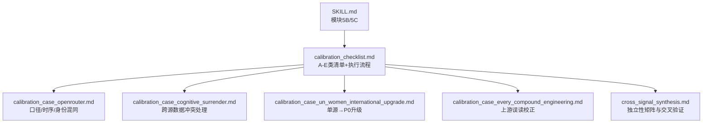
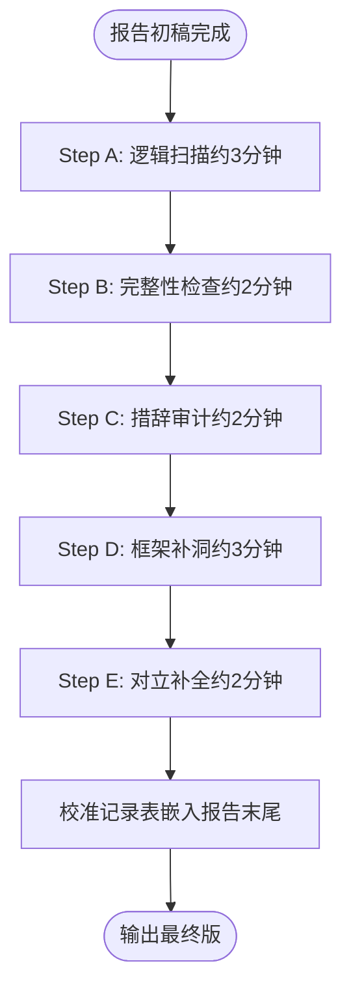
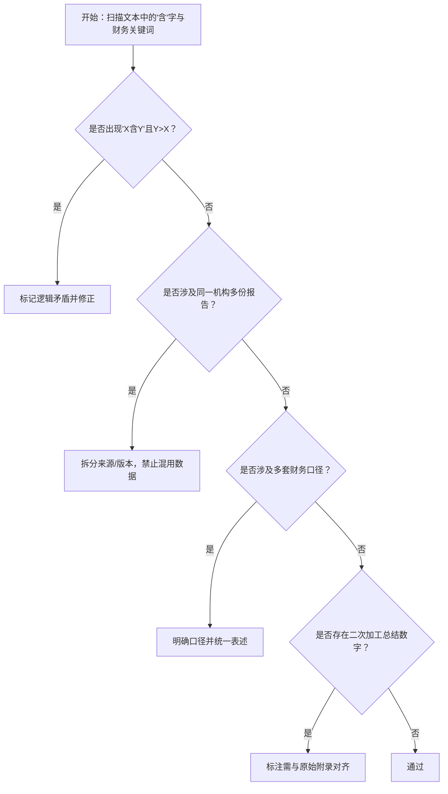
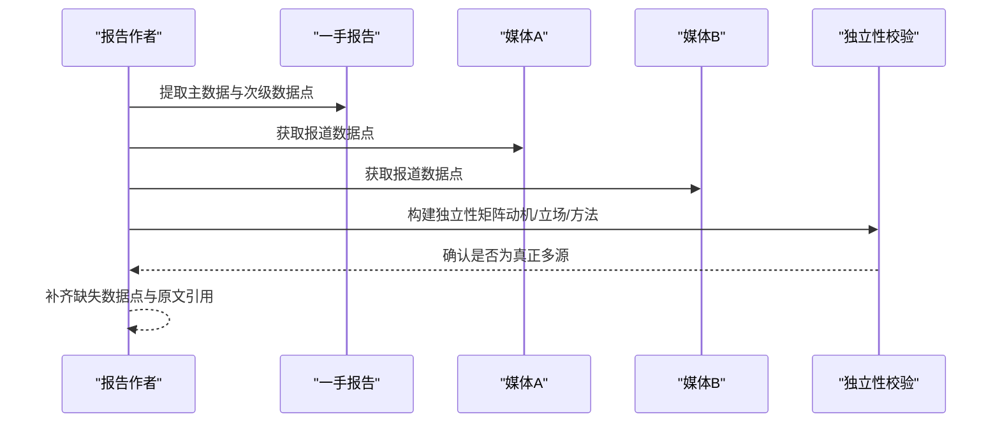
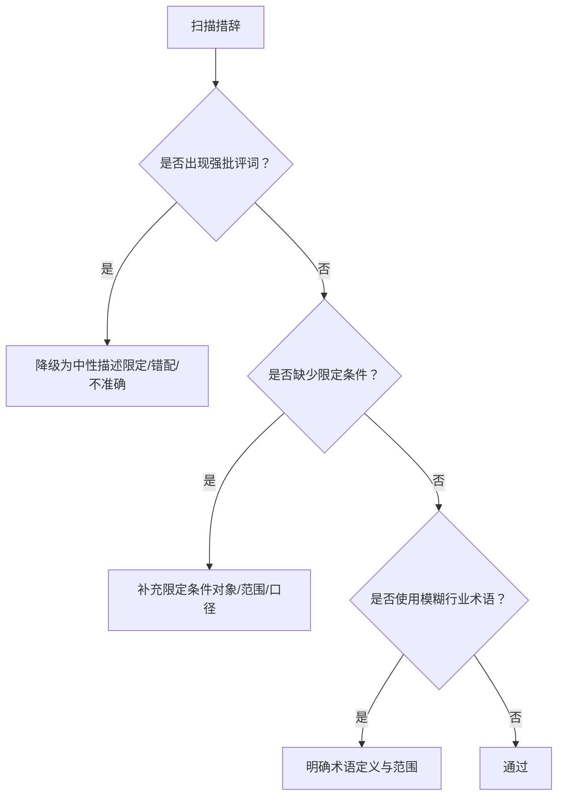
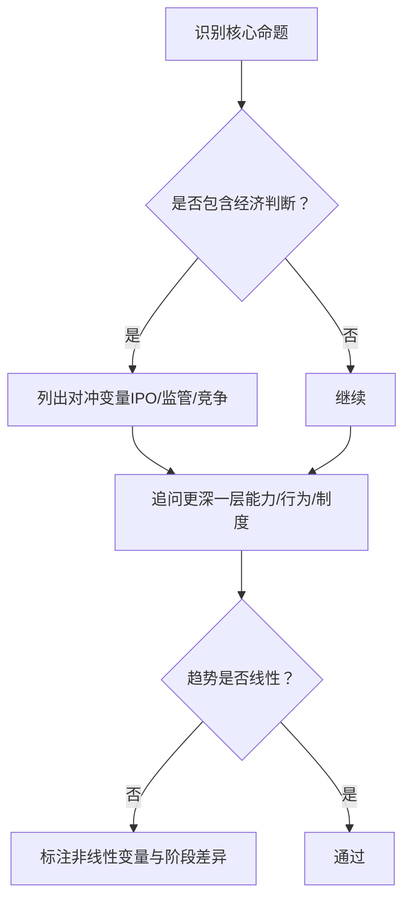
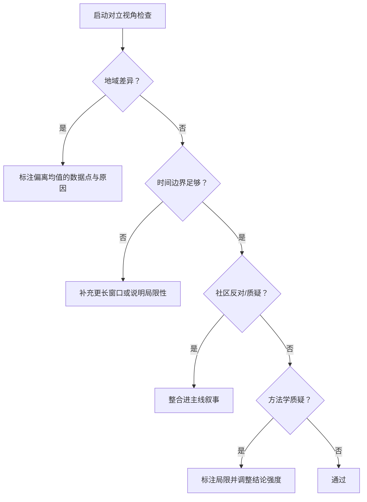
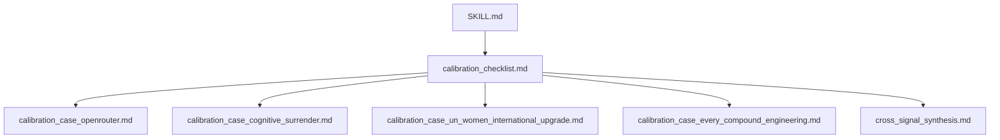

# 基础校准审查（A-E类）

<cite>
**本文引用的文件**
- [SKILL.md](file://hotspot-topic-excavator/skills/hotspot-topic-excavator/SKILL.md)
- [calibration_checklist.md](file://hotspot-topic-excavator/skills/hotspot-topic-excavator/references/calibration_checklist.md)
- [calibration_case_openrouter.md](file://hotspot-topic-excavator/skills/hotspot-topic-excavator/references/calibration_case_openrouter.md)
- [calibration_case_cognitive_surrender.md](file://hotspot-topic-excavator/skills/hotspot-topic-excavator/references/calibration_case_cognitive_surrender.md)
- [calibration_case_un_women_international_upgrade.md](file://hotspot-topic-excavator/skills/hotspot-topic-excavator/references/calibration_case_un_women_international_upgrade.md)
- [calibration_case_every_compound_engineering.md](file://hotspot-topic-excavator/skills/hotspot-topic-excavator/references/calibration_case_every_compound_engineering.md)
- [cross_signal_synthesis.md](file://hotspot-topic-excavator/skills/hotspot-topic-excavator/references/cross_signal_synthesis.md)
</cite>

## 目录
1. [引言](#引言)
2. [项目结构](#项目结构)
3. [核心组件](#核心组件)
4. [架构总览](#架构总览)
5. [详细组件分析](#详细组件分析)
6. [依赖关系分析](#依赖关系分析)
7. [性能与时间分配建议](#性能与时间分配建议)
8. [故障排查指南](#故障排查指南)
9. [结论](#结论)

## 引言
本文件聚焦“基础校准审查”的5类核心检查项（A-E），系统化解析事实校准、事实补充、表述校准、框架补充、对立视角的具体操作方法、常见陷阱与执行流程。内容基于仓库内校准清单与多份实战案例提炼，旨在帮助读者在热点深挖与报告产出中建立可复用的质量控制体系。

## 项目结构
围绕校准审查的核心文档与案例分布如下：
- 规则与流程定义：SKILL.md 模块5B/5C 明确九类校准清单与审查触发条件
- 五类校准速查与执行流程：calibration_checklist.md 提供A-E类检查项、常见陷阱与步骤化执行时序
- 实战案例库：OpenRouter口径与时序错配、跨源数据冲突处理、单源国际议题升级、Every复利工程上游误读等，覆盖A-E各类典型问题与修正动作

图示来源
- [SKILL.md:251-276](file://hotspot-topic-excavator/skills/hotspot-topic-excavator/SKILL.md#L251-L276)
- [calibration_checklist.md:1-149](file://hotspot-topic-excavator/skills/hotspot-topic-excavator/references/calibration_checklist.md#L1-L149)

章节来源
- [SKILL.md:251-276](file://hotspot-topic-excavator/skills/hotspot-topic-excavator/SKILL.md#L251-L276)
- [calibration_checklist.md:1-149](file://hotspot-topic-excavator/skills/hotspot-topic-excavator/references/calibration_checklist.md#L1-L149)

## 核心组件
- 事实校准（A）：数字逻辑矛盾检查，重点包括子集与总量关系验证、同名机构多份报告区分、财务数据口径一致性、内部量化总结与原始附录对齐
- 事实补充（B）：多源遗漏检查，重点包括大型调查报告完整数据提取、P1原文引用完整性、同一报告的多篇媒体报道交叉验证
- 表述校准（C）：措辞精准度检查，重点包括批评尺度控制、限定条件明示、行业术语准确使用
- 框架补充（D）：分析结构完整性检查，重点包括对冲变量识别、核心命题深化、趋势路径非线性分析
- 对立视角（E）：论证自反性检查，重点包括地域差异发现、时间边界验证、社区反对声音收集、方法学质疑处理

章节来源
- [calibration_checklist.md:11-57](file://hotspot-topic-excavator/skills/hotspot-topic-excavator/references/calibration_checklist.md#L11-L57)

## 架构总览
校准审查作为报告初稿完成后的强制环节，按A→B→C→D→E顺序执行，并在末尾嵌入校准记录表后输出最终版。

图示来源
- [calibration_checklist.md:108-146](file://hotspot-topic-excavator/skills/hotspot-topic-excavator/references/calibration_checklist.md#L108-L146)

章节来源
- [calibration_checklist.md:108-146](file://hotspot-topic-excavator/skills/hotspot-topic-excavator/references/calibration_checklist.md#L108-L146)

## 详细组件分析

### A. 事实校准（数字逻辑矛盾检查）
- 子集与总量关系验证
  - 操作要点：出现“X含Y”时立即验算Y<X；若Y>X则标记为逻辑矛盾并修正
  - 常见陷阱：将子样本瞬时份额当作总体份额，导致量级错觉与错误归因
  - 参考案例：OpenRouter“中国AI占61%”是单周Top10子样本，而“美国份额72%→33%”是全平台同比口径，二者不可混用
- 同名机构多份报告区分
  - 操作要点：同一机构在不同时间/部门可能发布多份文件，需严格区分来源与版本，避免数据混用
  - 参考案例：Anthropic经济学论文与产品侧PDF属不同文件，数据不可合并
- 财务数据口径一致性
  - 操作要点：至少识别运营亏损/GAAP净亏损/调整后亏损等多套口径，禁止混用
  - 参考案例：OpenAI存在多套亏损口径，必须明确标注口径后再写
- 内部量化总结与原始附录对齐
  - 操作要点：对“专家N次动作”等二次加工数字，标注“需与原始附录对齐”，列入最优先补充动作
- 关键教训
  - “含”字是危险信号；财务数据出现“亏损”先问口径；同名机构≠同份报告

图示来源
- [calibration_checklist.md:11-24](file://hotspot-topic-excavator/skills/hotspot-topic-excavator/references/calibration_checklist.md#L11-L24)
- [calibration_case_openrouter.md:9-36](file://hotspot-topic-excavator/skills/hotspot-topic-excavator/references/calibration_case_openrouter.md#L9-L36)
- [calibration_case_cognitive_surrender.md:30-54](file://hotspot-topic-excavator/skills/hotspot-topic-excavator/references/calibration_case_cognitive_surrender.md#L30-L54)

章节来源
- [calibration_checklist.md:11-24](file://hotspot-topic-excavator/skills/hotspot-topic-excavator/references/calibration_checklist.md#L11-L24)
- [calibration_case_openrouter.md:9-36](file://hotspot-topic-excavator/skills/hotspot-topic-excavator/references/calibration_case_openrouter.md#L9-L36)
- [calibration_case_cognitive_surrender.md:30-54](file://hotspot-topic-excavator/skills/hotspot-topic-excavator/references/calibration_case_cognitive_surrender.md#L30-L54)

### B. 事实补充（多源遗漏检查）
- 大型调查报告的完整数据提取
  - 操作要点：除主标题数据外，至少提取5-8个次级数据点，避免只取 headline number
  - 常见陷阱：漏掉信心指数、表现优势、判断不可替代性、版权期望、披露率、态度指标等
- P1原文引用完整性
  - 操作要点：每个权威来源至少引用一处原文金句，确保分析逻辑可追溯
  - 常见陷阱：仅取数字不引用分析逻辑
- 同一报告的多篇媒体报道交叉验证
  - 操作要点：不同媒体突出不同数据点，至少用2家媒体交叉验证
  - 常见陷阱：单一媒体数据未与其他来源对照
- 独立性矩阵与交叉验证
  - 操作要点：检验信源的动机、立场与方法是否独立，避免“伪多源”（同一来源被转载多次）
  - 参考实践：Twilight of Chatbots三路信号具备强独立性；Every复利工程案例提示厂商自说自话风险

图示来源
- [calibration_checklist.md:25-31](file://hotspot-topic-excavator/skills/hotspot-topic-excavator/references/calibration_checklist.md#L25-L31)
- [cross_signal_synthesis.md:111-136](file://hotspot-topic-excavator/skills/hotspot-topic-excavator/references/cross_signal_synthesis.md#L111-L136)

章节来源
- [calibration_checklist.md:25-31](file://hotspot-topic-excavator/skills/hotspot-topic-excavator/references/calibration_checklist.md#L25-L31)
- [cross_signal_synthesis.md:111-136](file://hotspot-topic-excavator/skills/hotspot-topic-excavator/references/cross_signal_synthesis.md#L111-L136)

### C. 表述校准（措辞精准度检查）
- 批评的尺度控制
  - 操作要点：将“排除/造假/谎称”降级为“限定/错配/不准确”，避免放大批评性质
  - 参考案例：AppleInsider指出统计口径错配，应表述为“scope mismatch”而非“数据造假”
- 限定条件的明示
  - 操作要点：引用调查数据时必须同时标注调查对象的限定条件（如“social-first creators”）
  - 常见陷阱：忽略限定条件导致以偏概全
- 行业术语准确使用
  - 操作要点：“创作者”不等于“所有创作者”，Adobe的“creatives”有隐含限定，需明确范围

图示来源
- [calibration_checklist.md:33-39](file://hotspot-topic-excavator/skills/hotspot-topic-excavator/references/calibration_checklist.md#L33-L39)

章节来源
- [calibration_checklist.md:33-39](file://hotspot-topic-excavator/skills/hotspot-topic-excavator/references/calibration_checklist.md#L33-L39)

### D. 框架补充（分析结构完整性检查）
- 经济判断必查对冲变量
  - 操作要点：当提出“成本下降/趋势向好”等判断时，必须同时检查IPO/监管/竞争格局等反向压力
  - 参考案例：OpenAI秘密提交IPO目标估值高，盈利压力可能推高定价，构成对冲变量
- 核心命题的“更深一层”
  - 操作要点：每个核心论点追问“还有什么被遗漏？”——例如从“AI放大专业知识”深入到“Delegation Gap”（敢不敢委派）
- 大方向成立 ≠ 路径是直线
  - 操作要点：长期趋势成立不代表短期线性推进，需标注非线性变量（如企业盈利压力、政策节奏）

图示来源
- [calibration_checklist.md:41-47](file://hotspot-topic-excavator/skills/hotspot-topic-excavator/references/calibration_checklist.md#L41-L47)

章节来源
- [calibration_checklist.md:41-47](file://hotspot-topic-excavator/skills/hotspot-topic-excavator/references/calibration_checklist.md#L41-L47)

### E. 对立视角（论证自反性检查）
- 地域差异发现
  - 操作要点：全球报告需检查是否有单一国家/地区显著偏离均值，避免以均值掩盖区域模式
  - 参考案例：印度AI使用率/满意度远高于全球平均，新兴市场未必适用“AI吃掉自助书”叙事
- 时间边界验证
  - 操作要点：趋势判断需检查数据窗口长度，注意季节性或短期波动
- 社区反对声音收集
  - 操作要点：权威报告需查HN/Reddit/X上的批评与质疑，纳入主线叙事
- 方法学质疑处理
  - 操作要点：调查需关注方法学局限与批判，避免将方法论缺陷包装为事实

图示来源
- [calibration_checklist.md:49-56](file://hotspot-topic-excavator/skills/hotspot-topic-excavator/references/calibration_checklist.md#L49-L56)

章节来源
- [calibration_checklist.md:49-56](file://hotspot-topic-excavator/skills/hotspot-topic-excavator/references/calibration_checklist.md#L49-L56)

## 依赖关系分析
- 规则层：SKILL.md 定义九类校准清单与审查触发条件，模块5B/5C为执行入口
- 清单层：calibration_checklist.md 提供A-E类检查项、常见陷阱与执行流程
- 案例层：OpenRouter、认知投降、UN Women、Every复利工程等案例为A-E类提供实证支撑
- 交叉验证层：cross_signal_synthesis.md 提供独立性矩阵与多源交叉验证方法

图示来源
- [SKILL.md:251-276](file://hotspot-topic-excavator/skills/hotspot-topic-excavator/SKILL.md#L251-L276)
- [calibration_checklist.md:1-149](file://hotspot-topic-excavator/skills/hotspot-topic-excavator/references/calibration_checklist.md#L1-L149)
- [calibration_case_openrouter.md:1-139](file://hotspot-topic-excavator/skills/hotspot-topic-excavator/references/calibration_case_openrouter.md#L1-L139)
- [calibration_case_cognitive_surrender.md:30-59](file://hotspot-topic-excavator/skills/hotspot-topic-excavator/references/calibration_case_cognitive_surrender.md#L30-L59)
- [calibration_case_un_women_international_upgrade.md:1-167](file://hotspot-topic-excavator/skills/hotspot-topic-excavator/references/calibration_case_un_women_international_upgrade.md#L1-L167)
- [calibration_case_every_compound_engineering.md:1-75](file://hotspot-topic-excavator/skills/hotspot-topic-excavator/references/calibration_case_every_compound_engineering.md#L1-L75)
- [cross_signal_synthesis.md:111-136](file://hotspot-topic-excavator/skills/hotspot-topic-excavator/references/cross_signal_synthesis.md#L111-L136)

章节来源
- [SKILL.md:251-276](file://hotspot-topic-excavator/skills/hotspot-topic-excavator/SKILL.md#L251-L276)
- [calibration_checklist.md:1-149](file://hotspot-topic-excavator/skills/hotspot-topic-excavator/references/calibration_checklist.md#L1-L149)

## 性能与时间分配建议
- 总时长建议：约13分钟（A:3 + B:2 + C:2 + D:3 + E:2）
- 并行策略：
  - Step A：搜索“含”字与财务关键词可并行执行
  - Step B：大型报告数据点提取与媒体交叉验证可并行
  - Step C：措辞审计与术语澄清可并行
  - Step D：对冲变量识别与更深一层追问可并行
  - Step E：地域差异、时间边界、社区反对、方法学质疑四维度可并行
- 产出要求：每步完成后在报告中更新校准记录表，确保可追溯

章节来源
- [calibration_checklist.md:108-146](file://hotspot-topic-excavator/skills/hotspot-topic-excavator/references/calibration_checklist.md#L108-L146)

## 故障排查指南
- 常见陷阱与修复
  - 口径错配：并列展示不同口径，明确子集属性，优先采用稳健口径
  - 时序错配：明确“连续N周”的维度（调用量第一 vs 市场份额第一）
  - 身份混同：匿名代号与公开身份的关系需在时间线中清晰呈现
  - 过度泛化：将单模型成就限制在主体范围内，避免宏大叙事
- 验证信号
  - 多源独立命中（≥3个独立信源支持核心数据）
  - 研究者本人访谈/播客/邮件答复作为最高权威
  - 官方原文与权威媒体交叉验证

章节来源
- [calibration_case_openrouter.md:9-122](file://hotspot-topic-excavator/skills/hotspot-topic-excavator/references/calibration_case_openrouter.md#L9-L122)
- [calibration_case_cognitive_surrender.md:30-54](file://hotspot-topic-excavator/skills/hotspot-topic-excavator/references/calibration_case_cognitive_surrender.md#L30-L54)

## 结论
A-E类基础校准审查构成了热点深挖与报告产出的质量基线。通过严格的数字逻辑校验、多源遗漏补齐、措辞精准度控制、分析结构完整性完善与对立视角自反性检查，能够显著提升报告的准确性、可信度与受众共鸣。配合标准化执行流程与时间预算，可在保证效率的同时实现高质量产出。