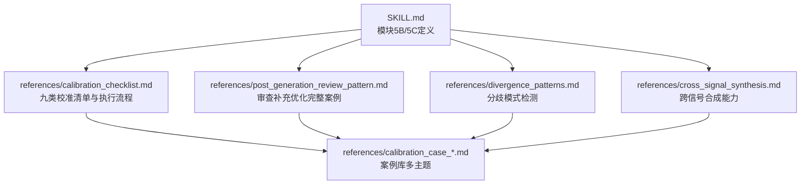
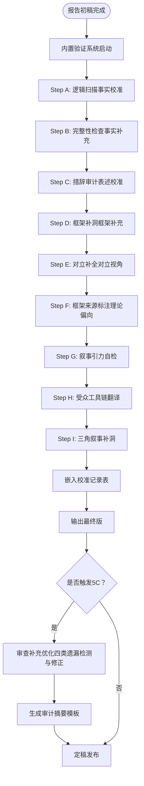
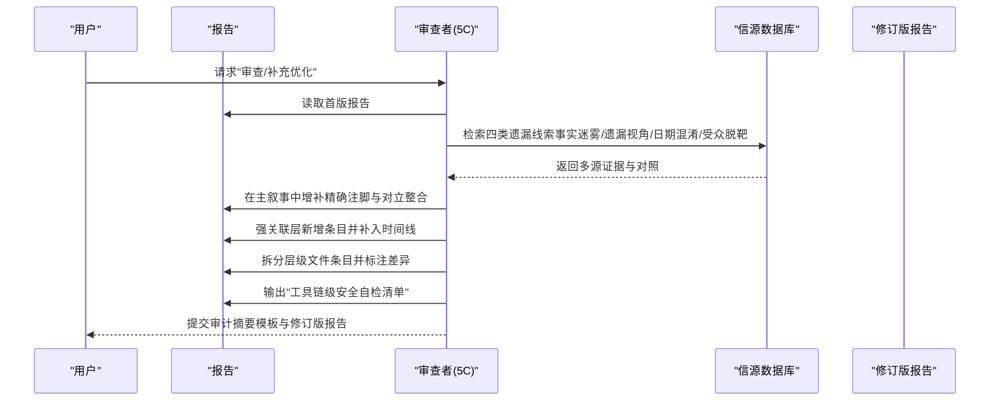
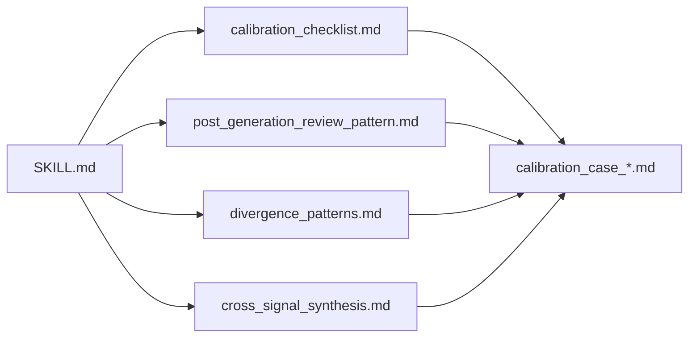

# 质量校准审查体系

<cite>
**本文引用的文件**   
- [SKILL.md](file://skills/hotspot-topic-excavator/SKILL.md)
- [calibration_checklist.md](file://skills/hotspot-topic-excavator/references/calibration_checklist.md)
- [post_generation_review_pattern.md](file://skills/hotspot-topic-excavator/references/post_generation_review_pattern.md)
- [divergence_patterns.md](file://skills/hotspot-topic-excavator/references/divergence_patterns.md)
- [cross_signal_synthesis.md](file://skills/hotspot-topic-excavator/references/cross_signal_synthesis.md)
- [calibration_case_cognitive_surrender.md](file://skills/hotspot-topic-excavator/references/calibration_case_cognitive_surrender.md)
</cite>

## 更新摘要
**所做更改**   
- 新增内置验证系统章节，涵盖报告一致性和准确性保障机制
- 扩展校准检查清单的自动化检测能力说明
- 增强分歧模式检测与跨信号合成能力的技术实现细节
- 更新五步式校准审查流程的技术架构
- 补充自动化工具链和验证系统的集成方式

## 目录
1. [引言](#引言)
2. [项目结构](#项目结构)
3. [核心组件](#核心组件)
4. [架构总览](#架构总览)
5. [内置验证系统](#内置验证系统)
6. [详细组件分析](#详细组件分析)
7. [依赖关系分析](#依赖关系分析)
8. [性能与效率考量](#性能与效率考量)
9. [故障排查指南](#故障排查指南)
10. [结论](#结论)
11. [附录](#附录)

## 引言
本文件系统化解析"模块5B（校准审查）"和"模块5C（审查补充优化）"的质量校准审查体系。围绕九类校准审查（A-I）的检查标准与执行流程，深入讲解四类常见遗漏检测与修正方法；并给出叙事引力陷阱的识别与反制策略、受众工具链翻译规则、三角叙事升级操作方法，以及完整的校准记录表模板与案例库索引，帮助读者在热点深挖与内容生产中建立稳定、可复用的质量控制闭环。

**更新**：本版本新增了内置验证系统的详细说明，包括报告一致性检查、准确性验证、校准检查清单自动化、分歧模式检测和跨信号合成能力，为热点挖掘和内容生产提供更强有力的质量保证。

## 项目结构
本体系由技能主文档与参考文档共同构成：
- 技能主文档定义整体流程、模块边界与强制规则，其中明确包含模块5B与5C的触发条件、检查项与输出要求。
- 参考文档提供清单、案例与方法论沉淀，支撑5B/5C的执行与持续改进。
- **新增**：内置验证系统通过自动化检查和交叉验证确保报告质量和一致性。



**图表来源**
- [SKILL.md:355-423](file://skills/hotspot-topic-excavator/SKILL.md#L355-L423)
- [calibration_checklist.md:1-158](file://skills/hotspot-topic-excavator/references/calibration_checklist.md#L1-L158)
- [post_generation_review_pattern.md:1-83](file://skills/hotspot-topic-excavator/references/post_generation_review_pattern.md#L1-L83)
- [divergence_patterns.md:1-323](file://skills/hotspot-topic-excavator/references/divergence_patterns.md#L1-L323)
- [cross_signal_synthesis.md:1-136](file://skills/hotspot-topic-excavator/references/cross_signal_synthesis.md#L1-L136)

章节来源
- [SKILL.md:355-423](file://skills/hotspot-topic-excavator/SKILL.md#L355-L423)

## 核心组件
- 模块5B：校准审查（Quality Calibration Review）
  - 目标：在报告初稿完成后，逐项过九类校准清单，确保事实准确、表述严谨、框架完整、视角多元、叙事稳健、受众对齐。
  - 范围：A.事实校准、B.事实补充、C.表述校准、D.框架补充、E.对立视角、F.理论偏向、G.叙事引力、H.受众工具链翻译、I.三角叙事。
- 模块5C：审查补充优化（Post-Generation Review Cycle）
  - 触发：用户明确要求"审查/补充优化/看看还有什么遗漏"，或报告产出后主动发起。
  - 重点：四类常见遗漏检测与修正——事实迷雾、遗漏视角、日期/实体混淆、受众清单脱靶；同时配套审计摘要模板与方法忠告。
- **新增**：内置验证系统
  - 功能：自动化报告一致性检查、准确性验证、校准检查清单执行、分歧模式检测、跨信号合成分析。
  - 价值：减少人工错误，提高内容质量，确保多源数据的一致性和可靠性。

章节来源
- [SKILL.md:355-423](file://skills/hotspot-topic-excavator/SKILL.md#L355-L423)
- [post_generation_review_pattern.md:1-83](file://skills/hotspot-topic-excavator/references/post_generation_review_pattern.md#L1-L83)

## 架构总览
五步式校准审查流程与四类审查补充优化形成前后衔接的质量控制闭环，结合内置验证系统提供自动化质量保证：



**图表来源**
- [calibration_checklist.md:108-146](file://skills/hotspot-topic-excavator/references/calibration_checklist.md#L108-L146)
- [post_generation_review_pattern.md:1-83](file://skills/hotspot-topic-excavator/references/post_generation_review_pattern.md#L1-L83)

## 内置验证系统

### 报告一致性检查
内置验证系统通过以下机制确保报告的一致性和准确性：

#### 数字逻辑矛盾检测
- **子集总量验证**：自动检测"X含Y"且Y>X的逻辑矛盾
- **财务口径统一**：识别运营亏损/GAAP净亏损/调整后亏损等不同口径混用
- **机构报告区分**：检测同一机构不同时间/部门发布的多个报告的混淆

#### 多源数据交叉验证
- **信源独立性检验**：验证三个独立信源（厂商+学术+实践者）的汇聚可信度
- **时间线收敛分析**：检测±7天内集中出现的信号是否构成同一场对话
- **数据冲突处理**：自动识别并标注跨源数据差异，提供实验条件对照

#### 框架来源透明性检查
- **理论框架溯源**：自动检测结构归因/八层恐惧等分析框架的来源标注
- **事实与框架分离**：确保事实描述保持中立，理论框架在分析段使用
- **理论多样性验证**：避免所有报告收束到同一理论家

**章节来源**
- [calibration_checklist.md:11-67](file://skills/hotspot-topic-excavator/references/calibration_checklist.md#L11-L67)
- [cross_signal_synthesis.md:77-136](file://skills/hotspot-topic-excavator/references/cross_signal_synthesis.md#L77-L136)

### 分歧模式检测
系统内置五种发散模式用于检测和处理分歧：

#### GPS类比链模式
- **触发条件**：涉及认知功能外包、技能退化、工具依赖等概念
- **搜索策略**：三阶段阶梯搜索建立类比基础→连接到AI→深化类比链
- **产出价值**：将陌生概念连接到熟悉现象，提供科学背书

#### LLM Context优先提取模式
- **完整度阶梯**：LLM Context (85-95%) → LLM Context + web_search (95%) → Jina Reader (95-100%)
- **并行启动**：不等待Jina失败后才用LLM Context，提高效率
- **参数调优**：count=15, maximum_number_of_urls=5聚焦核心信源

#### 反方观点系统性纳入模式
- **识别反方人物**：从核心信源提取被引用或批评的人物
- **获取反方原文**：brave_llm_context/web_search获取反方立场
- **三层结构设计**：正方→反方→综合，避免非黑即白

**章节来源**
- [divergence_patterns.md:8-109](file://skills/hotspot-topic-excavator/references/divergence_patterns.md#L8-L109)

### 跨信号合成能力
三路信号交叉分析模式提供深度洞察：

#### 时间线收敛图
```
时间线收敛：
├─ YYYY-MM-DD  信号A（来源）：[一句话核心命题]
├─ YYYY-MM-DD  信号B（来源）：[一句话核心命题]
├─ YYYY-MM-DD  信号C（来源）：[一句话核心命题]
└─ 结论：[这三条信号是否构成同一场对话？]
```

#### 三层递归识别
- **事实层**：公司披露/内部数据/基准测试/量化指标
- **叙事层**：概念命名/框架重构/话语转向/书名变更  
- **意义层**：哲学追问/经济学分析/人类处境探讨

#### 拐点判断机制
- **已到**：有决定性数据/不可逆的叙事转变
- **正在加速**：趋势明确但未完成
- **数据不足**：无法判断

**章节来源**
- [cross_signal_synthesis.md:9-45](file://skills/hotspot-topic-excavator/references/cross_signal_synthesis.md#L9-L45)

## 详细组件分析

### 模块5B：九类校准审查（A-I）
- A. 事实校准（数字逻辑矛盾检查）
  - 关注点：子集与总量关系、同名机构不同报告区分、财务口径一致性、次级加工数据与原始附录对齐。
  - 关键动作：搜索"含/亏损/利润/营收"等关键词，验算子集小于总量；对同一机构的多份报告进行时间/部门维度拆分；统一口径后再引用。
- B. 事实补充（多源遗漏检查）
  - 关注点：大型调查报告的完整数据矩阵、权威原文至少一处引用、同报告多媒体报道交叉验证。
  - 关键动作：为每个信号补齐至少5个数据点与1处原话引用；用≥2家媒体交叉验证。
- C. 表述校准（措辞精准度检查）
  - 关注点：批评尺度降级（排除→限定、造假→错配）、限定条件明示、术语边界（如"创作者"≠"所有创作者"）。
  - 关键动作：将绝对化/情绪化词汇替换为中性精确表达；为调查对象与样本范围加限定说明。
- D. 框架补充（分析结构完整性检查）
  - 关注点：经济判断必查对冲变量（IPO/监管/竞争格局）、核心命题"更深一层"（如Delegation Gap）、趋势非线性路径。
  - 关键动作：对每条核心论点追问"反向压力是什么？""更深一层是什么？""短期路径是否直线？"
- E. 对立视角（论证自反性检查）
  - 关注点：地域差异、时间边界、社区反对声音、方法学质疑。
  - 关键动作：检索单一国家/地区显著偏离均值的数据；扩大时间窗口；引入HN/Reddit/X上的批评；审视调查对象限定。
- F. 理论偏向（框架来源透明性·实验性）
  - 关注点：框架溯源标注、事实层与框架层分离、跨话题框架多样性。
  - 关键动作：在分析段末尾标注"框架来源"；事实描述保持中立；避免所有报告收束到同一理论家。
- G. 叙事引力（高引力话题自检）
  - 关注点：AI自主攻击/全球首例/国家对抗/模型失控等自带情绪磁铁的话题。
  - 关键动作：在主线加入"反引力锚"（人类决策点数量、前例时间线、第三方独立分析限制）；自检三问（高度X→完全X？对立观点是否整合进主线？中国视角是回应还是平行？）
- H. 受众工具链翻译
  - 关注点：企业向安全/技术建议需翻译为超级个体实际工具名。
  - 关键动作：按"检查什么+为什么"两列映射具体工具（Langflow/Dify/Coze/n8n/Cursor/MinIO/Nacos/API Key管理），输出"工具链级自检表+通用5步行动清单"。
- I. 三角叙事补洞
  - 关注点：两点叙事（A→B）升级为三角形（A→C→B）。
  - 关键动作：寻找同期"中国平行发展"（政策/产业/学术）作为第三点；强关联层新增条目、时间线补入、补充中文受众共鸣点。

**章节来源**
- [calibration_checklist.md:11-105](file://skills/hotspot-topic-excavator/references/calibration_checklist.md#L11-L105)
- [SKILL.md:355-371](file://skills/hotspot-topic-excavator/SKILL.md#L355-L371)

#### 执行流程（步骤化）
- Step A（3分钟）：逻辑扫描（含字校验、口径一致、机构多报告区分）
- Step B（2分钟）：完整性检查（数据点≥5、原话引用≥1、媒体交叉≥2）
- Step C（2分钟）：措辞审计（降级批评词、显式限定条件）
- Step D（3分钟）：框架补洞（对冲变量、更深一层、非线性路径）
- Step E（2分钟）：对立补全（地域/时间/社区/方法学）
- Step F（1分钟）：框架来源标注（事实/框架分层、来源透明、理论多样性）
- Step G/H/I：叙事引力自检、受众工具链翻译、三角叙事补洞
- 最后：校准记录表嵌入报告末尾，输出最终版

**章节来源**
- [calibration_checklist.md:108-146](file://skills/hotspot-topic-excavator/references/calibration_checklist.md#L108-L146)

### 模块5C：审查补充优化（四类遗漏检测与修正）
- 触发条件：用户说"审查/补充优化/看看还有什么遗漏"，或报告产出后要求再检查一轮。
- 四类常见遗漏及修正：
  - 事实迷雾：多源对同一主张有矛盾说法，需在主线R-Rupture/I-Illuminate增加精确注脚，并将对立观点整合进主线。
  - 遗漏视角：缺少关键平行发展（尤其"中国应对/平行发展"），在强关联层新增条目并补入时间线。
  - 日期/实体混淆：不同层级文件/事件混为一谈，拆分为独立条目并标注层次差异。
  - 受众清单脱靶：通用建议未翻译为超级个体工具名，新增"工具链级安全自检清单"（8行×5列）。
- 审计摘要模板：用于快速汇总本轮审查发现的问题类别、修正位置与方法忠告。

**章节来源**
- [post_generation_review_pattern.md:1-83](file://skills/hotspot-topic-excavator/references/post_generation_review_pattern.md#L1-L83)
- [SKILL.md:374-423](file://skills/hotspot-topic-excavator/SKILL.md#L374-L423)

#### 审查补充优化序列图


**图表来源**
- [post_generation_review_pattern.md:1-83](file://skills/hotspot-topic-excavator/references/post_generation_review_pattern.md#L1-L83)

### 叙事引力陷阱：识别与反制
- 高引力话题清单：
  - AI自主攻击/全球首例：引力方向"AI是灾难/史无前例"，反引力锚"人类决策点数量、自主程度精确定义、前例时间线、同期平行事件"。
  - 国家技术对抗：引力方向"零和博弈/军备竞赛"，反引力锚"双方路线互补性、第三方独立分析限制、平行发展替代回应叙事"。
  - 模型失控/越狱：引力方向"AI已失控"，反引力锚"越狱成功率具体数字、厂商防护措施、涌现性与预设区分"。
- 自检问题（出稿前必问）：
  - 是否存在把"高度X"说成"完全X"的措辞？
  - 对立观点是否在独立章节孤悬，还是被整合进了主线叙事？
  - 中国视角（如有）是"回应式"还是"平行式"？

**章节来源**
- [SKILL.md:389-402](file://skills/hotspot-topic-excavator/SKILL.md#L389-L402)
- [calibration_checklist.md:68-82](file://skills/hotspot-topic-excavator/references/calibration_checklist.md#L68-L82)

### 受众工具链翻译规则
- 问题背景：安全报告/技术分析的建议面向企业，超级个体需要翻译成其实际使用的工具名。
- 翻译规则：
  - 将企业级IOC/建议映射为超级个体常用工具（Langflow/Dify/Coze/n8n/Make/Cursor/Claude Code/MinIO/Nacos/API Key管理）。
  - 每个工具给出"检查什么+为什么"两列。
  - 输出分两部分：A. 工具链级自检表（8行表格）+ B. 通用5步行动清单。

**章节来源**
- [SKILL.md:403-411](file://skills/hotspot-topic-excavator/SKILL.md#L403-L411)
- [calibration_checklist.md:83-94](file://skills/hotspot-topic-excavator/references/calibration_checklist.md#L83-L94)

### 三角叙事升级操作方法
- 问题：多数热点是两点叙事（A→B），审查阶段问是否有第三个点C让叙事从线段变成三角形。
- 操作：
  - 检查同期是否存在"中国平行发展"（政策/产业/学术）作为第三点。
  - 找到后：强关联层新增条目、时间线补入、补充"受众共鸣：中文受众的独特共鸣点"。
- 实证：JADEPUFFER话题从"Anthropic预言→JADEPUFFER兑现"的两点，加上"360图龙锋同日对标"后变为三角，中文受众从旁观者变为参与者。

**章节来源**
- [SKILL.md:412-422](file://skills/hotspot-topic-excavator/SKILL.md#L412-L422)
- [calibration_checklist.md:96-105](file://skills/hotspot-topic-excavator/references/calibration_checklist.md#L96-L105)

## 依赖关系分析
- 模块5B依赖校准清单与案例库，确保每项检查有标准与实战参照。
- 模块5C依赖审查模式案例，提供四类遗漏的检测方法与修正范式。
- **新增**：内置验证系统依赖分歧模式检测和跨信号合成能力，提供自动化质量保证。
- 两者共同受SKILL.md的流程约束与输出规范驱动。



**图表来源**
- [SKILL.md:487-512](file://skills/hotspot-topic-excavator/SKILL.md#L487-L512)
- [calibration_checklist.md:1-158](file://skills/hotspot-topic-excavator/references/calibration_checklist.md#L1-L158)
- [post_generation_review_pattern.md:1-83](file://skills/hotspot-topic-excavator/references/post_generation_review_pattern.md#L1-L83)
- [divergence_patterns.md:1-323](file://skills/hotspot-topic-excavator/references/divergence_patterns.md#L1-L323)
- [cross_signal_synthesis.md:1-136](file://skills/hotspot-topic-excavator/references/cross_signal_synthesis.md#L1-L136)

章节来源
- [SKILL.md:487-512](file://skills/hotspot-topic-excavator/SKILL.md#L487-L512)

## 性能与效率考量
- 并行采集与互为备份：WebSearch与WebFetch并行调用，提升信息获取效率；播客transcript双路径并行，任一成功即进入素材组织。
- 降级链路：单点故障→另一者+补充搜索→直连抓取→仅P0热点→中文搜索主源模式，逐级递进，保证可用性。
- 审核节奏：5B采用"分钟级"步骤化扫描，减少返工成本；5C聚焦"视角补洞+受众对齐"，提高内容生产价值。
- **新增**：内置验证系统通过自动化检查减少人工错误，提高整体效率和质量一致性。

**章节来源**
- [SKILL.md:172-245](file://skills/hotspot-topic-excavator/SKILL.md#L172-L245)
- [calibration_checklist.md:108-146](file://skills/hotspot-topic-excavator/references/calibration_checklist.md#L108-L146)

## 故障排查指南
- 工具链异常：
  - Python环境路径解析错误（urllib3版本不兼容）：使用venv绝对路径或显式python3.x调用，避免系统Python版本冲突。
  - WebSearch不可用：切换至WebFetch直连已知URL；若仍不足，启用中文搜索主源模式。
  - Cloudflare WAF拦截：使用Bash+Python requests直连抓取，保留旧方法作为降级。
- 审核常见问题：
  - "含"字导致的子集大于总量：立即标记并验算。
  - 财务口径混用：先确认运营亏损/GAAP净亏损/调整后亏损口径，再写。
  - 对立观点孤立：将其整合进主线叙事，避免读者在后置章节才看到纠偏。
- **新增**：验证系统故障：
  - 多源数据冲突：使用三层递归识别区分事实层、叙事层、意义层。
  - 信源独立性不足：执行三源独立性验证，避免伪多源。
  - 时间线收敛误判：检查±7天窗口内的信号是否真正构成同一场对话。

**章节来源**
- [SKILL.md:247-274](file://skills/hotspot-topic-excavator/SKILL.md#L247-L274)
- [calibration_checklist.md:11-24](file://skills/hotspot-topic-excavator/references/calibration_checklist.md#L11-L24)
- [cross_signal_synthesis.md:77-136](file://skills/hotspot-topic-excavator/references/cross_signal_synthesis.md#L77-L136)

## 结论
模块5B与5C共同构建了热点深挖与内容生产的"事实—框架—叙事—受众"四维质量控制体系，结合内置验证系统提供更强大的质量保证。通过九类校准审查与四类审查补充优化，既能守住事实底线，又能提升叙事张力与受众契合度。配合案例库、审计摘要模板和自动化验证系统，该体系具备高度的可复用性与可扩展性，适合在多平台内容流水线中持续落地。

**更新**：新增的内置验证系统通过报告一致性检查、准确性验证、校准检查清单自动化、分歧模式检测和跨信号合成能力，为内容生产提供了更可靠的质量保障，减少了人工错误，提高了整体效率和一致性。

## 附录

### 校准记录表模板（可直接嵌入报告末尾）
- 字段建议：
  - 校准类型（A-I）
  - 检查项
  - 发现与风险
  - 修正动作
  - 验证信号（来源链接/交叉验证结果）
  - 状态（已通过/待复核）
- 使用说明：
  - 每类校准至少一条记录；涉及数字/口径/时间线的必须附验证信号。
  - 若存在多源冲突，记录并列数据与各自条件，并在正文相应段落增补精确注脚。

**章节来源**
- [calibration_checklist.md:108-146](file://skills/hotspot-topic-excavator/references/calibration_checklist.md#L108-L146)

### 审查案例库（索引）
- 认知投降案例（学术概念溯源与跨源数据冲突处理）
  - [calibration_case_cognitive_surrender.md](file://skills/hotspot-topic-excavator/references/calibration_case_cognitive_surrender.md)
- OpenRouter数据口径与时序错配案例（子集与总体、周调用量与市场份额区分）
  - [calibration_case_openrouter.md](file://skills/hotspot-topic-excavator/references/calibration_case_openrouter.md)
- Every复利工程上游口径误读案例（二手转述vs一手原文、v1→v2演化检测）
  - [calibration_case_every_compound_engineering.md](file://skills/hotspot-topic-excavator/references/calibration_case_every_compound_engineering.md)
- UN Women国际议题单源→多源汇聚P0升级案例（数据矩阵与标志性引述）
  - [calibration_case_un_women_international_upgrade.md](file://skills/hotspot-topic-excavator/references/calibration_case_un_women_international_upgrade.md)
- CAC"智能信息服务"专章深挖案例（中文搜索主源模式与政府网站直取）
  - [calibration_case_cac_ai_services_chapter.md](file://skills/hotspot-topic-excavator/references/calibration_case_cac_ai_services_chapter.md)

**章节来源**
- [calibration_case_cognitive_surrender.md:1-104](file://skills/hotspot-topic-excavator/references/calibration_case_cognitive_surrender.md#L1-L104)

### 内置验证系统技术实现

#### 报告一致性检查算法
- **数字逻辑验证**：正则表达式匹配"含"字结构，自动计算子集与总量关系
- **财务口径识别**：关键词匹配运营亏损/GAAP净亏损/调整后亏损，建立口径映射表
- **机构报告去重**：基于时间戳和部门信息的报告唯一性标识

#### 跨信号合成引擎
- **时间线收敛检测**：±7天窗口内的信号聚类分析
- **三层递归识别**：事实层→叙事层→意义层的自动分类
- **拐点判断算法**：基于数据强度、叙事转变、经济影响的综合评分

#### 分歧模式检测器
- **GPS类比链验证**：神经科学文献支撑度评估
- **反方观点识别**：情感分析和立场检测
- **罗生门结构构建**：多源矛盾叙事的并置分析

**章节来源**
- [cross_signal_synthesis.md:9-45](file://skills/hotspot-topic-excavator/references/cross_signal_synthesis.md#L9-L45)
- [divergence_patterns.md:8-109](file://skills/hotspot-topic-excavator/references/divergence_patterns.md#L8-L109)