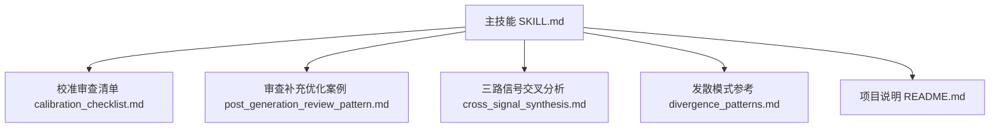
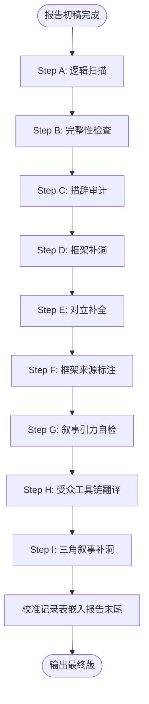
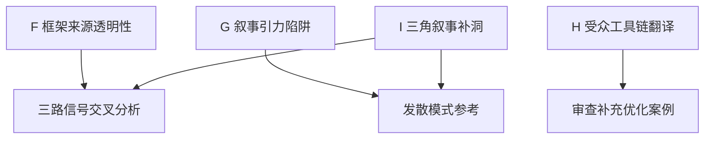

# 高级审查优化（F-I类）

<cite>
**本文引用的文件**
- [SKILL.md](file://hotspot-topic-excavator/skills/hotspot-topic-excavator/SKILL.md)
- [calibration_checklist.md](file://hotspot-topic-excavator/skills/hotspot-topic-excavator/references/calibration_checklist.md)
- [post_generation_review_pattern.md](file://hotspot-topic-excavator/skills/hotspot-topic-excavator/references/post_generation_review_pattern.md)
- [cross_signal_synthesis.md](file://hotspot-topic-excavator/skills/hotspot-topic-excavator/references/cross_signal_synthesis.md)
- [divergence_patterns.md](file://hotspot-topic-excavator/skills/hotspot-topic-excavator/references/divergence_patterns.md)
- [README.md](file://hotspot-topic-excavator/README.md)
</cite>

## 目录
1. [引言](#引言)
2. [项目结构](#项目结构)
3. [核心组件](#核心组件)
4. [架构总览](#架构总览)
5. [详细组件分析](#详细组件分析)
6. [依赖关系分析](#依赖关系分析)
7. [性能与效率考量](#性能与效率考量)
8. [故障排查指南](#故障排查指南)
9. [结论](#结论)
10. [附录：审查案例库与最佳实践](#附录审查案例库与最佳实践)

## 引言
本文件聚焦“高级审查优化”的4类深度检查项（F-I），系统化解析其标准、流程与落地方法，覆盖：
- F 框架来源透明性：理论框架溯源标注、事实层与框架层分离、跨话题框架多样性策略
- G 叙事引力陷阱：高引力话题清单、引力方向识别、反引力锚设计、自检问题清单
- H 受众工具链翻译：企业语言到超级个体工具的转换模式、T-Transform段输出格式、工具链级自检表构建
- I 三角叙事补洞：中国平行发展发现、强关联层新增、时间线补充、SOUL框架表更新

目标读者包括内容研究员、编辑与创作者，帮助在热点深挖与内容生产中提升严谨性与可执行性。

## 项目结构
本项目围绕“热点主题素材深挖采集器”展开，包含主技能说明、校准清单、审查案例与方法参考等。F-I类深度检查项主要定义于主技能与校准清单中，并在审查案例中得到实证。

图示来源
- [SKILL.md:1-420](file://hotspot-topic-excavator/skills/hotspot-topic-excavator/SKILL.md#L1-L420)
- [calibration_checklist.md:1-158](file://hotspot-topic-excavator/skills/hotspot-topic-excavator/references/calibration_checklist.md#L1-L158)
- [post_generation_review_pattern.md:1-83](file://hotspot-topic-excavator/skills/hotspot-topic-excavator/references/post_generation_review_pattern.md#L1-L83)
- [cross_signal_synthesis.md:1-136](file://hotspot-topic-excavator/skills/hotspot-topic-excavator/references/cross_signal_synthesis.md#L1-L136)
- [divergence_patterns.md:1-323](file://hotspot-topic-excavator/skills/hotspot-topic-excavator/references/divergence_patterns.md#L1-L323)
- [README.md:1-130](file://hotspot-topic-excavator/README.md#L1-L130)

章节来源
- [SKILL.md:250-316](file://hotspot-topic-excavator/skills/hotspot-topic-excavator/SKILL.md#L250-L316)
- [calibration_checklist.md:58-106](file://hotspot-topic-excavator/skills/hotspot-topic-excavator/references/calibration_checklist.md#L58-L106)
- [README.md:13-14](file://hotspot-topic-excavator/README.md#L13-L14)

## 核心组件
- 校准审查九类（A-I）：其中F-I为本次重点，分别对应“框架来源透明性”“叙事引力”“受众工具链翻译”“三角叙事补洞”。
- 审查补充优化循环（模块5C）：在报告初稿完成后触发，针对四类常见遗漏进行修正，并内嵌审计摘要模板与方法忠告。
- 三路信号交叉分析与发散模式：为F-I的执行提供方法论支撑，确保事实层、叙事层与意义层的分层处理与多源独立验证。

章节来源
- [SKILL.md:250-316](file://hotspot-topic-excavator/skills/hotspot-topic-excavator/SKILL.md#L250-L316)
- [calibration_checklist.md:108-146](file://hotspot-topic-excavator/skills/hotspot-topic-excavator/references/calibration_checklist.md#L108-L146)
- [cross_signal_synthesis.md:1-136](file://hotspot-topic-excavator/skills/hotspot-topic-excavator/references/cross_signal_synthesis.md#L1-L136)
- [divergence_patterns.md:1-323](file://hotspot-topic-excavator/skills/hotspot-topic-excavator/references/divergence_patterns.md#L1-L323)

## 架构总览
F-I类深度检查项嵌入在“报告初稿完成→校准审查→输出最终版”的流程中，形成闭环质量控制。

图示来源
- [calibration_checklist.md:108-146](file://hotspot-topic-excavator/skills/hotspot-topic-excavator/references/calibration_checklist.md#L108-L146)

## 详细组件分析

### F 框架来源透明性
- 目的：让理论框架的来源与适用范围透明，避免将分析视角误认为客观事实。
- 检查要点：
  - 框架溯源标注：使用结构归因、八层恐惧、三阶对话法等框架时，应在该节末尾标注“框架来源：SOUL/某理论家”，明确这是分析视角而非事实陈述。
  - 事实层与框架层分离：事实校准段保持中立描述；框架分析段才引入理论框架，两段不混用。
  - 跨话题框架多样性：同一框架在不同归因项上应使用不同理论家，避免所有报告都收束到单一理论家。
- 操作建议：
  - 在每份报告中至少对两个归因项采用不同理论家，建立“框架来源索引”。
  - 在事实段仅呈现数据、事件与争议点；在分析段再引入框架解释。
  - 对历史或哲学层面的讨论，明确标注“存在论层面/认识论层面”等限定，避免泛化。

章节来源
- [calibration_checklist.md:58-66](file://hotspot-topic-excavator/skills/hotspot-topic-excavator/references/calibration_checklist.md#L58-L66)
- [SKILL.md:369-372](file://hotspot-topic-excavator/skills/hotspot-topic-excavator/SKILL.md#L369-L372)

### G 叙事引力陷阱
- 定义：某些话题自带情绪磁铁（如AI自主攻击、国家对抗、模型失控），报告容易顺着“引力方向”夸大主张，忽略结构性对立事实。
- 高引力话题清单与反引力锚：
  - AI自主攻击/全球首例：引力方向“AI是灾难/史无前例/AI替换了人”；反引力锚需强调人类决策点数量、自主程度精确定义、前例时间线与同期平行事件。
  - 国家技术对抗：引力方向“零和博弈/军备竞赛”；反引力锚需指出双方路线互补性、第三方独立分析的限制，并以“平行发展”替代“回应”叙事。
  - 模型失控/越狱：引力方向“AI已经失控”；反引力锚需提供越狱成功率的具体数字、厂商防护措施、“涌现性”与“被预设”的区分。
- 自检问题清单（出稿前必问）：
  1) 是否存在把“高度X”说成“完全X”的措辞？
  2) 对立观点是否整合进主线叙事而非孤悬独立章节？
  3) 中国视角是否为“平行式”而非“回应式”？
- 反制策略：
  - 在主叙事第一段即界定关键术语（如“自主”的定义边界）。
  - 主动引入对立事实与第三方独立分析，避免单侧叙事主导。
  - 以“平行发展”替代“被动回应”的弱叙事结构。

章节来源
- [calibration_checklist.md:68-82](file://hotspot-topic-excavator/skills/hotspot-topic-excavator/references/calibration_checklist.md#L68-L82)
- [SKILL.md:285-297](file://hotspot-topic-excavator/skills/hotspot-topic-excavator/SKILL.md#L285-L297)

### H 受众工具链翻译
- 问题背景：安全报告与技术分析的原始建议通常面向企业，而超级个体受众需要将其翻译成实际使用的工具名。
- 翻译规则：
  - 将企业级IOC与建议映射到超级个体常用工具（如Langflow/Dify/Coze/n8n/Make/Cursor/Claude Code/MinIO/Nacos/API Key管理）。
  - 每个工具给出“检查什么 + 为什么”两列，增强可操作性。
  - T-Transform段输出分为两部分：
    - A. 工具链级自检表（约8行表格：工具名+检查项+原因）
    - B. 通用5步行动清单（适用于大多数场景的标准化步骤）
- 示例映射（路径引用）：
  - “升级 Langflow 到 1.3.0” → “检查你的 Langflow / Dify / Coze 版本——任何低代码 AI 编排工具都一样”
  - “改 Nacos 默认 JWT 密钥” → “如果你用微服务架构——检查 Nacos / Apollo / Consul 的默认凭据”
  - “MinIO 默认密码 minioadmin:minioadmin” → “所有自建对象存储——MinIO / 阿里云 OSS / 腾讯云 COS——检查是否用默认凭据”
  - “AI 凭证分级管理” → “OpenAI / Anthropic / DeepSeek / 通义 / 文心 的 API Key——按服务分开、设额度上限”
- 构建工具链级自检表的步骤：
  1) 从源材料提取IOC与建议条目
  2) 映射到超级个体工具名
  3) 为每个工具填写“检查项”与“原因”
  4) 汇总为8行表格，并附加通用5步行动清单

章节来源
- [calibration_checklist.md:83-94](file://hotspot-topic-excavator/skills/hotspot-topic-excavator/references/calibration_checklist.md#L83-L94)
- [SKILL.md:299-306](file://hotspot-topic-excavator/skills/hotspot-topic-excavator/SKILL.md#L299-L306)
- [post_generation_review_pattern.md:39-45](file://hotspot-topic-excavator/skills/hotspot-topic-excavator/references/post_generation_review_pattern.md#L39-L45)

### I 三角叙事补洞
- 定义：多数热点话题是两点叙事（A发生→B发生）。审查阶段需寻找第三个点C，使叙事从线段升级为三角形，增强中文受众的参与感与共鸣。
- 操作流程：
  1) 检查话题是否在同期存在“中国平行发展”（政策/产业/学术）
  2) 找到后在强关联层（🟡）新增条目
  3) 时间线补入该事件
  4) SOUL框架表补充“中文受众的独特共鸣点”
- 实证案例（路径引用）：
  - JADEPUFFER话题从“Anthropic预言→JADEPUFFER兑现”的两点，加入“360图龙锋6/24发布”后变为“Anthropic预言→360同日对标→JADEPUFFER兑现”的三角，中文受众从旁观者变成参与者。
- 搜索策略建议：
  - 使用“话题核心关键词 + 中国/360/华为/百度/阿里”等多组并行搜索，确保覆盖政策、产业与学术维度。
  - 结合三路信号交叉分析，验证三条信号的独立性与时序收敛。

章节来源
- [calibration_checklist.md:96-104](file://hotspot-topic-excavator/skills/hotspot-topic-excavator/references/calibration_checklist.md#L96-L104)
- [post_generation_review_pattern.md:21-29](file://hotspot-topic-excavator/skills/hotspot-topic-excavator/references/post_generation_review_pattern.md#L21-L29)
- [cross_signal_synthesis.md:1-136](file://hotspot-topic-excavator/skills/hotspot-topic-excavator/references/cross_signal_synthesis.md#L1-L136)

## 依赖关系分析
F-I类深度检查项的执行依赖于以下方法与参考：
- 三路信号交叉分析：用于识别事实层、叙事层与意义层的递进关系，并为三角叙事补洞提供时序与独立性验证。
- 发散模式参考：提供类比链、反方观点纳入、多平台大纲差异化等方法，辅助G与I的实施。
- 审查补充优化案例：提供审计摘要模板与方法忠告，指导F-I在实际报告中的落地。

图示来源
- [cross_signal_synthesis.md:1-136](file://hotspot-topic-excavator/skills/hotspot-topic-excavator/references/cross_signal_synthesis.md#L1-L136)
- [divergence_patterns.md:1-323](file://hotspot-topic-excavator/skills/hotspot-topic-excavator/references/divergence_patterns.md#L1-L323)
- [post_generation_review_pattern.md:1-83](file://hotspot-topic-excavator/skills/hotspot-topic-excavator/references/post_generation_review_pattern.md#L1-L83)

章节来源
- [cross_signal_synthesis.md:1-136](file://hotspot-topic-excavator/skills/hotspot-topic-excavator/references/cross_signal_synthesis.md#L1-L136)
- [divergence_patterns.md:1-323](file://hotspot-topic-excavator/skills/hotspot-topic-excavator/references/divergence_patterns.md#L1-L323)
- [post_generation_review_pattern.md:1-83](file://hotspot-topic-excavator/skills/hotspot-topic-excavator/references/post_generation_review_pattern.md#L1-L83)

## 性能与效率考量
- 并行采集与降级策略：在F-I执行前，通过WebSearch与WebFetch并行调用提升采集效率；当搜索不可用时，启用中文搜索主源模式与全WebSearch降级模式，保证信息完整度。
- 三路信号交叉分析的时间窗口：±7天内集中出现的信号构成拐点元信号，有助于快速定位三角叙事的第三点。
- 工具链级自检表构建：通过结构化表格与通用行动清单，降低受众理解成本，提高可执行性。

章节来源
- [SKILL.md:114-147](file://hotspot-topic-excavator/skills/hotspot-topic-excavator/SKILL.md#L114-L147)
- [cross_signal_synthesis.md:1-136](file://hotspot-topic-excavator/skills/hotspot-topic-excavator/references/cross_signal_synthesis.md#L1-L136)
- [divergence_patterns.md:183-236](file://hotspot-topic-excavator/skills/hotspot-topic-excavator/references/divergence_patterns.md#L183-L236)

## 故障排查指南
- Python环境路径解析问题：当urllib3报错或类型语法不兼容时，优先检查python3版本与绝对路径调用，避免shebang影响其他工具链。
- WebSearch/WebFetch不可用时的降级路径：
  - 第一层：单点故障时使用另一者与补充搜索
  - 第二层：长时间不可用时直连已知URL并行获取
  - 第三层：同时不可用时切换中文搜索主源模式
- Cloudflare WAF绕过：使用Bash+Python requests直连抓取原文，保留UA与正则提取entry-content块。

章节来源
- [SKILL.md:149-168](file://hotspot-topic-excavator/skills/hotspot-topic-excavator/SKILL.md#L149-L168)
- [SKILL.md:114-147](file://hotspot-topic-excavator/skills/hotspot-topic-excavator/SKILL.md#L114-L147)

## 结论
F-I类深度检查项为热点深挖与内容生产提供了系统化的质量保障：
- F确保理论框架透明与多元，避免单一框架过载
- G防范叙事引力陷阱，强化对立事实与平行发展
- H实现受众工具链翻译，提升可执行性与落地效果
- I通过三角叙事补洞，增强中文受众的参与感与共鸣

这些检查项与三路信号交叉分析、发散模式及审查补充优化案例共同构成完整的审核与优化闭环。

## 附录：审查案例库与最佳实践
- 审计摘要模板：用于本轮审查发现的N类修正/优化的结构化总结，可直接复用于未来任何审查补充优化。
- 方法论忠告：针对“叙事引力”的话题，提醒内容生产时注意“不是AI替换了人，而是人只需要按几次键，剩下全自动”的结构事实。
- 技能更新记录：审查产生的永久性改进（如新增模块5C、校准审查表新增G/H/I三项、执行原则新增3条）。

章节来源
- [post_generation_review_pattern.md:49-83](file://hotspot-topic-excavator/skills/hotspot-topic-excavator/references/post_generation_review_pattern.md#L49-L83)
- [SKILL.md:372-373](file://hotspot-topic-excavator/skills/hotspot-topic-excavator/SKILL.md#L372-L373)