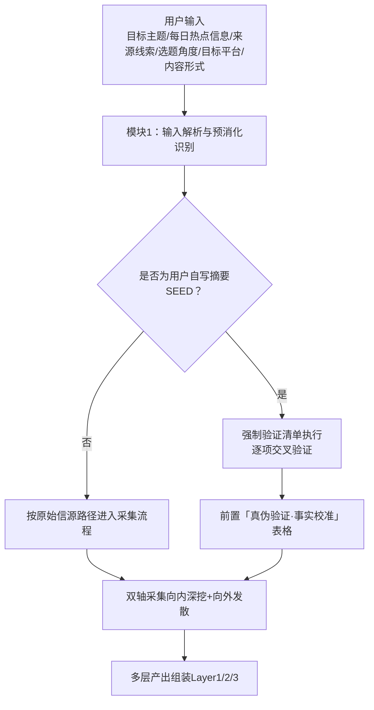
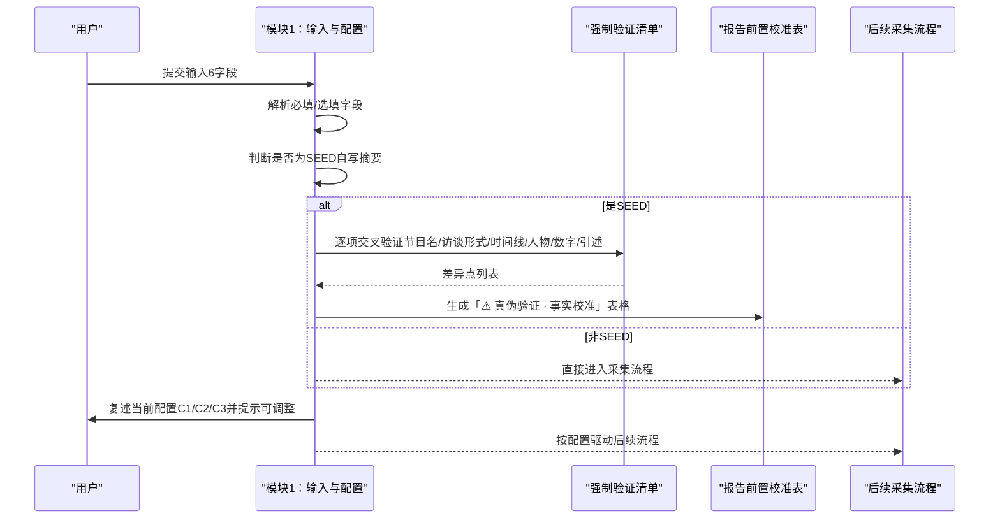
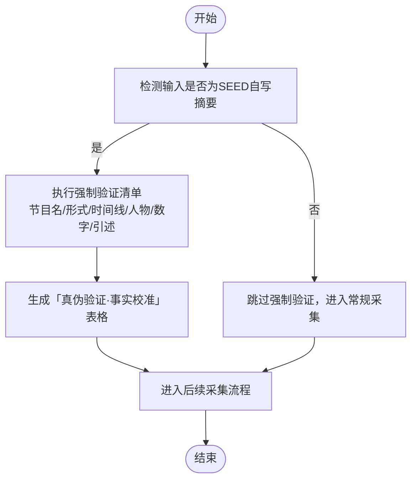
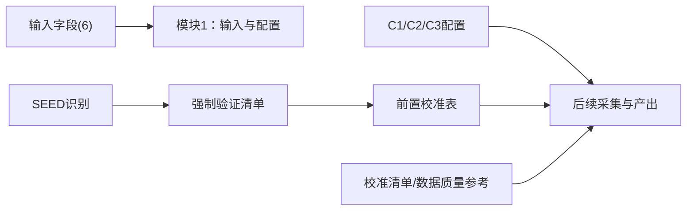

# 输入规范与启动配置

<cite>
**本文引用的文件**   
- [SKILL.md](file://hotspot-topic-excavator/skills/hotspot-topic-excavator/SKILL.md)
- [README.md](file://hotspot-topic-excavator/README.md)
- [calibration_checklist.md](file://hotspot-topic-excavator/skills/hotspot-topic-excavator/references/calibration_checklist.md)
- [data_quality.md](file://.skills/hotspot-research/references/data_quality.md)
- [collection_commands.md](file://.skills/hotspot-research/references/collection_commands.md)
- [platforms.md](file://.skills/hotspot-research/references/platforms.md)
</cite>

## 目录
1. [引言](#引言)
2. [项目结构](#项目结构)
3. [核心组件](#核心组件)
4. [架构总览](#架构总览)
5. [详细组件分析](#详细组件分析)
6. [依赖关系分析](#依赖关系分析)
7. [性能考量](#性能考量)
8. [故障诊断指南](#故障诊断指南)
9. [结论](#结论)
10. [附录](#附录)

## 引言
本文件聚焦“模块 1：输入规范与启动配置”，系统化说明热点主题素材深挖采集器（hotspot-topic-excavator）在接收用户输入时的处理规则、预消化版本校验机制，以及三项启动配置项（C1-C3）的作用与默认值。文档同时给出输入示例、最佳实践与常见错误诊断方法，帮助使用者稳定、高效地触发并执行深挖任务。

## 项目结构
- 主技能定义位于 hotspot-topic-excavator 的 SKILL.md，其中模块 1 明确定义了输入字段、预消化版本处理与启动配置。
- README.md 提供 Qoder 适配说明、工具链映射与使用方法，便于理解整体上下文。
- references 下的校准清单与数据质量参考为输入验证与输出质量控制提供依据。

图表来源
- [SKILL.md:27-69](file://hotspot-topic-excavator/skills/hotspot-topic-excavator/SKILL.md#L27-L69)

章节来源
- [SKILL.md:27-69](file://hotspot-topic-excavator/skills/hotspot-topic-excavator/SKILL.md#L27-L69)
- [README.md:82-104](file://hotspot-topic-excavator/README.md#L82-L104)

## 核心组件
- 输入字段（6个）：目标主题（必填）、每日热点信息（必填）、来源线索（选填）、选题角度（选填）、目标平台（选填）、内容形式（选填）。
- 预消化版本处理：识别用户提供的中文自写摘要作为“种子材料”（SEED），而非可信信源（SOURCE），并执行强制验证清单。
- 启动配置（C1-C3）：深挖/发散配比、再创作选题建议粒度、发散边界。

章节来源
- [SKILL.md:27-69](file://hotspot-topic-excavator/skills/hotspot-topic-excavator/SKILL.md#L27-L69)

## 架构总览
模块 1 作为入口层，负责：
- 解析并校验输入字段
- 识别 SEED vs SOURCE 模式
- 对 SEED 执行强制验证清单，生成前置校准表
- 复述并确认启动配置（C1-C3），确保后续流程受控

图表来源
- [SKILL.md:27-69](file://hotspot-topic-excavator/skills/hotspot-topic-excavator/SKILL.md#L27-L69)

## 详细组件分析

### 输入字段与验证规则（6个）
- 目标主题（必填）
  - 作用：本次深挖的唯一锚点主题
  - 验证：不可为空；若过于宽泛，建议在“选题角度”中收敛范围
- 每日热点信息（必填）
  - 形式A：指定文件路径（如日报/周报或热点清单文件）
  - 形式B：直接粘贴文本内容
  - 验证：至少提供其一；若为文件路径，需确保可读；若为粘贴文本，需包含足够上下文以便提取种子
- 来源线索（选填）
  - 作用：原始出处链接或引用标识
  - 验证：若有则应可访问或可检索；无法溯源时标注“待核实”
- 选题角度（选填）
  - 作用：已确定的切入点，用于限定深挖方向
  - 验证：应与“目标主题”一致且不冲突
- 目标平台（选填）
  - 可选：抖音/B站/公众号/小红书（可多选）
  - 默认：全平台
  - 验证：若多选，需保证各平台策略差异化（钩子/论据链/可读性/视觉化）
- 内容形式（选填）
  - 可选：短视频口播/深度长视频/图文长文/笔记
  - 验证：与目标平台匹配度越高越好

章节来源
- [SKILL.md:27-69](file://hotspot-topic-excavator/skills/hotspot-topic-excavator/SKILL.md#L27-L69)
- [README.md:91-104](file://hotspot-topic-excavator/README.md#L91-L104)

### 预消化版本处理逻辑（SEED ≠ SOURCE）
- 模式识别：当用户提供详细的中文自写摘要作为锚点时，系统将其视为“种子材料”（SEED），而非“可信信源”（SOURCE）。
- 强制验证清单（逐项交叉验证）：
  - 节目/平台名称：通过 WebSearch + 原文标题核对
  - 访谈形式：通过官方页面确认直播/录播等形态
  - 时间线：多连击事件压缩问题，使用 timeRange=OneWeek 向前回溯 3-5 天
  - 人物姓名/头衔：多源交叉比对
  - 数字/数据：以权威财经出口为准（Forbes/CNBC/Business Wire 等）
  - 引述内容：回查英文原文，金句保留英文+中译双列
- 产出要求：报告中必须前置「⚠️ 真伪验证 · 事实校准」表格，逐项列出用户版本 vs 实际差异。

图表来源
- [SKILL.md:40-58](file://hotspot-topic-excavator/skills/hotspot-topic-excavator/SKILL.md#L40-L58)

章节来源
- [SKILL.md:40-58](file://hotspot-topic-excavator/skills/hotspot-topic-excavator/SKILL.md#L40-L58)

### 启动配置项（C1-C3）与作用机制
- C1. 深挖/发散配比
  - 默认：深挖70% + 发散30%
  - 可选范围：70/30、50/50、发散为主
  - 作用机制：控制 Step 2A（向内深挖）与 Step 2B（向外发散）的资源分配比例
- C2. 再创作选题建议粒度
  - 默认：完整选题卡
  - 可选范围：可附加“额外视角/观点”
  - 作用机制：决定 Layer 3 选题卡的颗粒度与附加信息量
- C3. 发散边界
  - 默认：发散选题 ≤ 5 个，每个必须溯源
  - 可选范围：可调整上限
  - 作用机制：约束发散数量与可溯源性，避免过度发散导致信源稀释

执行原则：任务开始时必须主动复述当前配置并提示可调整，否则按默认执行。

章节来源
- [SKILL.md:59-69](file://hotspot-topic-excavator/skills/hotspot-topic-excavator/SKILL.md#L59-L69)
- [SKILL.md:362-373](file://hotspot-topic-excavator/skills/hotspot-topic-excavator/SKILL.md#L362-L373)

### 输入示例与最佳实践
- 最小可用输入
  - 目标主题：OpenAI 发布新一代推理模型
  - 每日热点信息：粘贴当日热点清单片段（含相关条目）
- 推荐输入
  - 目标主题：某公司 AI 产品发布
  - 每日热点信息：文件路径（如 reports/hotspot/YYYY-MM-DD/report_daily_YYYY-MM-DD_pm.md）
  - 来源线索：官方公告链接
  - 选题角度：从“开发者生态”切入
  - 目标平台：B站/公众号
  - 内容形式：深度长视频/图文长文
- 最佳实践
  - 尽量提供“每日热点信息”的文件路径，减少粘贴噪声
  - 若为 SEED（自写摘要），请附带关键数字与时间戳，便于交叉验证
  - 明确目标平台与内容形式，有助于差异化产出

章节来源
- [SKILL.md:27-69](file://hotspot-topic-excavator/skills/hotspot-topic-excavator/SKILL.md#L27-L69)
- [README.md:91-104](file://hotspot-topic-excavator/README.md#L91-L104)

### 常见输入错误诊断与修正
- 缺失必填字段
  - 症状：未提供“目标主题”或“每日热点信息”
  - 修正：补充任一形式的热点信息（文件或粘贴）
- SEED 未做交叉验证
  - 症状：仅凭用户摘要直接采信，缺少事实校准表
  - 修正：执行强制验证清单，前置「真伪验证·事实校准」表格
- 目标平台与内容形式不匹配
  - 症状：选择抖音但内容为深度长视频
  - 修正：调整为短视频口播或更换平台
- 发散边界过大
  - 症状：发散选题超过默认上限且无法溯源
  - 修正：按 C3 限制数量并确保每条可溯源

章节来源
- [SKILL.md:40-69](file://hotspot-topic-excavator/skills/hotspot-topic-excavator/SKILL.md#L40-L69)

## 依赖关系分析
- 输入解析依赖模块 1 的规则定义
- 预消化验证依赖 WebSearch/WebFetch 进行交叉核验
- 启动配置影响后续采集与产出粒度
- 输出质量控制依赖校准清单与数据质量标准

图表来源
- [SKILL.md:27-69](file://hotspot-topic-excavator/skills/hotspot-topic-excavator/SKILL.md#L27-L69)
- [calibration_checklist.md:1-158](file://hotspot-topic-excavator/skills/hotspot-topic-excavator/references/calibration_checklist.md#L1-L158)
- [data_quality.md:1-209](file://.skills/hotspot-research/references/data_quality.md#L1-L209)

章节来源
- [SKILL.md:27-69](file://hotspot-topic-excavator/skills/hotspot-topic-excavator/SKILL.md#L27-L69)
- [calibration_checklist.md:1-158](file://hotspot-topic-excavator/skills/hotspot-topic-excavator/references/calibration_checklist.md#L1-L158)
- [data_quality.md:1-209](file://.skills/hotspot-research/references/data_quality.md#L1-L209)

## 性能考量
- 并行采集：Step 2A 中的多组 WebSearch 和 WebFetch 应尽可能并行调用，提升效率
- 降级路径：WebSearch/WebFetch 失败时启用 Bash 直连抓取或中文搜索主源模式
- 网络诊断：快速检查 Jina Reader 与搜索引擎可用性，必要时切换替代路径

章节来源
- [SKILL.md:362-373](file://hotspot-topic-excavator/skills/hotspot-topic-excavator/SKILL.md#L362-L373)
- [collection_commands.md:216-232](file://.skills/hotspot-research/references/collection_commands.md#L216-L232)
- [platforms.md:112-121](file://.skills/hotspot-research/references/platforms.md#L112-L121)

## 故障诊断指南
- 网络与工具可用性
  - 快速诊断：检查 Google/Jina 连通性与响应类型
  - 结果解读：Jina 返回认证错误或超时 → 降级到 WebSearch 或直连抓取
- 信源阻断与反爬
  - 典型站点：Fortune/TIME/Guardian/NYT/Bloomberg 等可能阻断
  - 应对：接受搜索摘要为主要来源，避免重试阻塞
- 日期与时效
  - 相对时间转换：将“X天前”转换为绝对日期，保守取最晚可能时间
  - 已知问题：百度热搜/搜狗微信难以确定发布时间，谨慎保留

章节来源
- [data_quality.md:171-209](file://.skills/hotspot-research/references/data_quality.md#L171-L209)
- [collection_commands.md:216-232](file://.skills/hotspot-research/references/collection_commands.md#L216-L232)

## 结论
模块 1 通过严格的输入规范与启动配置，确保深挖任务在可控范围内高质量执行。对 SEED 的强制验证与前置校准表，有效保护内容可信度；C1-C3 的配置机制则平衡了深挖与发散的投入与产出粒度。遵循本文的输入示例、最佳实践与故障诊断方法，可显著提升任务成功率与稳定性。

## 附录
- 参考文件索引（采集技术、分析方法、校准案例等）详见 SKILL.md 关联引用部分
- 模板与插件说明参见 README.md 与 templates/report_template.md

章节来源
- [SKILL.md:377-419](file://hotspot-topic-excavator/skills/hotspot-topic-excavator/SKILL.md#L377-L419)
- [README.md:43-80](file://hotspot-topic-excavator/README.md#L43-L80)