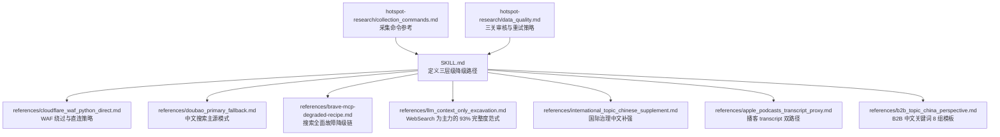
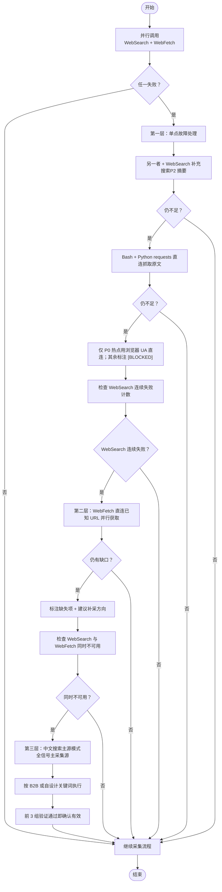
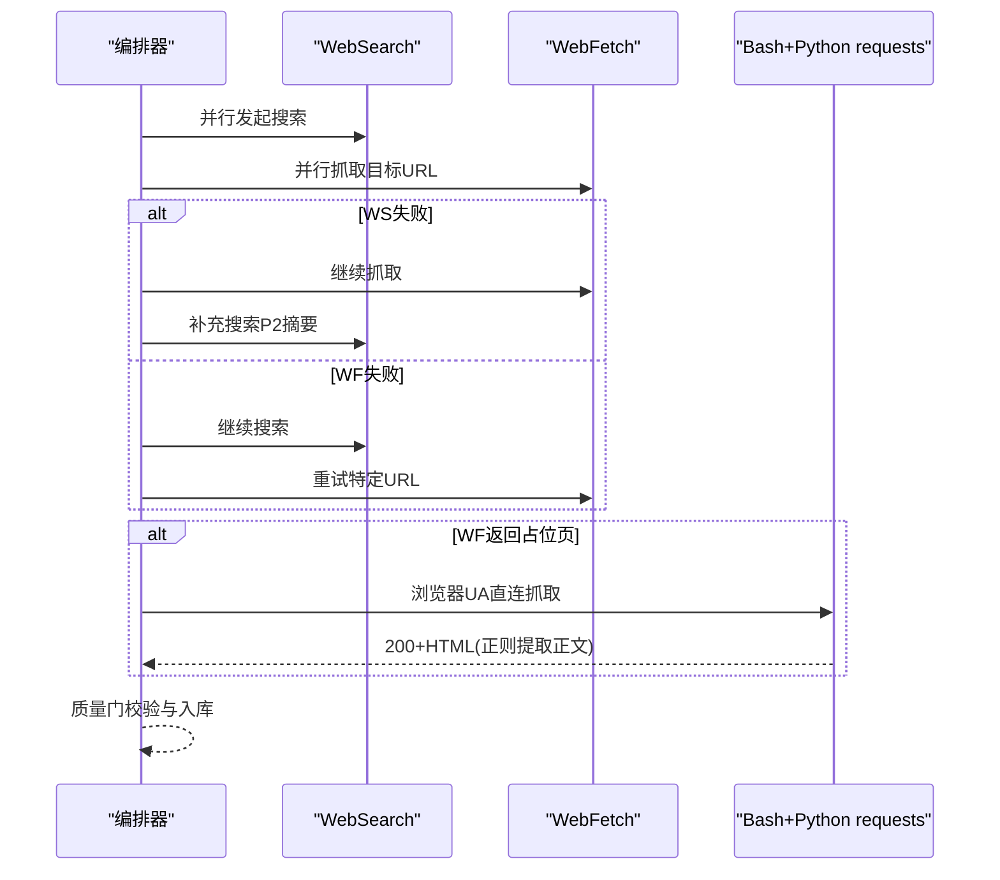
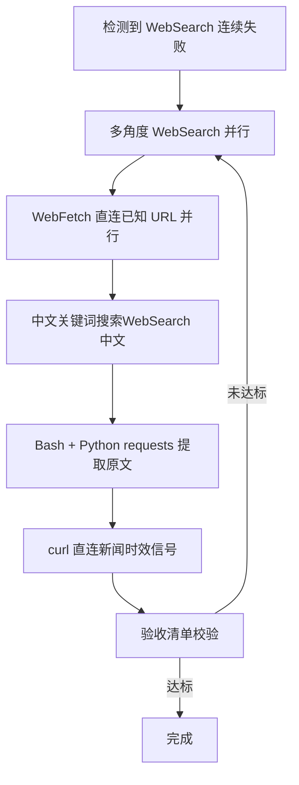
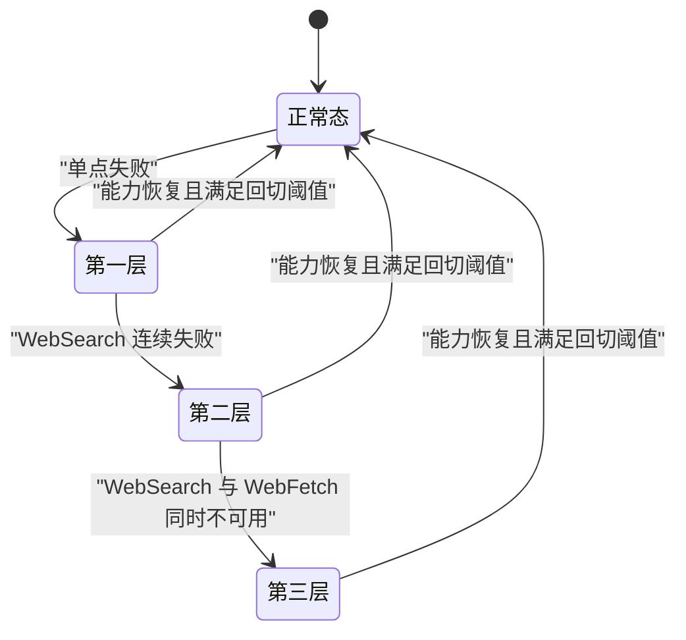
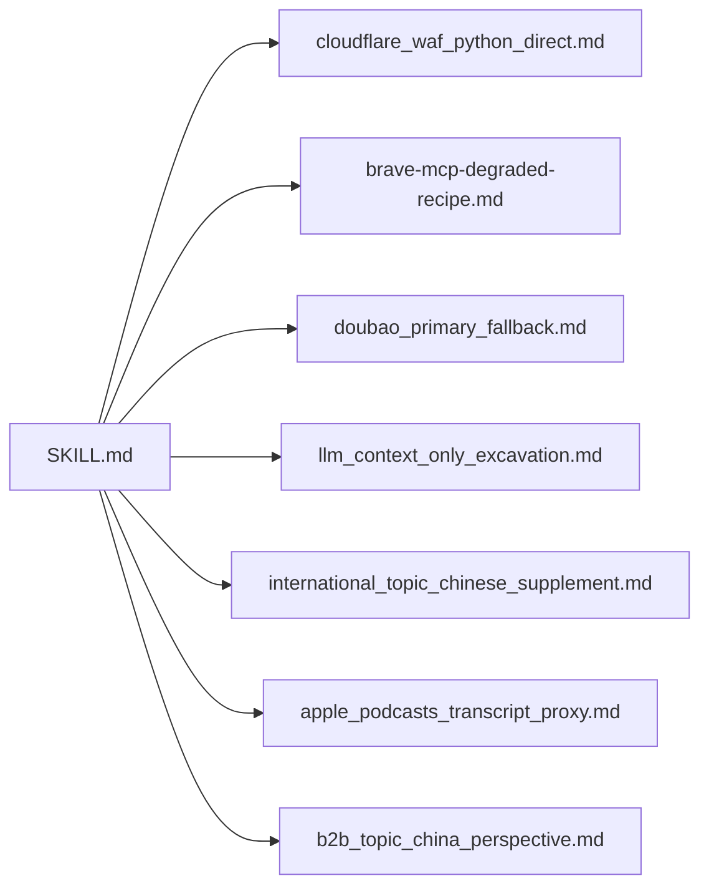

# 多层级降级路径设计

<cite>
**本文引用的文件**   
- [SKILL.md（热点主题素材深挖采集器）](file://hotspot-topic-excavator/skills/hotspot-topic-excavator/SKILL.md)
- [cloudflare_waf_python_direct.md（Cloudflare WAF 站点直连绕过）](file://hotspot-topic-excavator/skills/hotspot-topic-excavator/references/cloudflare_waf_python_direct.md)
- [doubao_primary_fallback.md（中文搜索主源模式）](file://hotspot-topic-excavator/skills/hotspot-topic-excavator/references/doubao_primary_fallback.md)
- [brave-mcp-degraded-recipe.md（搜索工具全面故障·降级 Recipe）](file://hotspot-topic-excavator/skills/hotspot-topic-excavator/references/brave-mcp-degraded-recipe.md)
- [llm_context_only_excavation.md（LLM Context-Only 挖掘：93% 完整度）](file://hotspot-topic-excavator/skills/hotspot-topic-excavator/references/llm_context_only_excavation.md)
- [international_topic_chinese_supplement.md（国际治理话题·中文信源补强）](file://hotspot-topic-excavator/skills/hotspot-topic-excavator/references/international_topic_chinese_supplement.md)
- [apple_podcasts_transcript_proxy.md（Apple Podcasts Show Notes 替代）](file://hotspot-topic-excavator/skills/hotspot-topic-excavator/references/apple_podcasts_transcript_proxy.md)
- [b2b_topic_china_perspective.md（B端/商业话题·中国视角补强）](file://hotspot-topic-excavator/skills/hotspot-topic-excavator/references/b2b_topic_china_perspective.md)
- [collection_commands.md（采集命令参考）](file://.skills/hotspot-research/references/collection_commands.md)
- [data_quality.md（数据质量与审核参考）](file://.skills/hotspot-research/references/data_quality.md)
</cite>

## 目录
1. [引言](#引言)
2. [项目结构](#项目结构)
3. [核心组件](#核心组件)
4. [架构总览](#架构总览)
5. [详细组件分析](#详细组件分析)
6. [依赖关系分析](#依赖关系分析)
7. [性能考量](#性能考量)
8. [故障排查指南](#故障排查指南)
9. [结论](#结论)
10. [附录](#附录)

## 引言
本文件聚焦 SKILL.md 中定义的三层级降级路径架构，系统化解析：
- 第一层：单点故障处理（WebSearch + WebFetch 并行失败检测与自动切换；P2 搜索结果摘要补充；Bash + Python requests 直连抓取触发条件）
- 第二层：搜索服务降级策略（WebSearch 连续失败时切换到 WebFetch 直连已知 URL 的决策树与执行规则）
- 第三层：全 WebSearch 模式（中文搜索主源模式的升级条件、执行规则与验证机制）
并配套提供完整的故障检测流程图、状态转换图与恢复策略，以及各层级降级路径的配置参数与监控指标。

## 项目结构
围绕“多层级降级路径”的核心实现集中在 hotspot-topic-excavator 的 SKILL.md 及其 references 子文档中，辅以 hotspot-research 的采集命令与数据质量规范作为支撑。

图表来源
- [SKILL.md（热点主题素材深挖采集器）](file://hotspot-topic-excavator/skills/hotspot-topic-excavator/SKILL.md)
- [cloudflare_waf_python_direct.md（Cloudflare WAF 站点直连绕过）](file://hotspot-topic-excavator/skills/hotspot-topic-excavator/references/cloudflare_waf_python_direct.md)
- [doubao_primary_fallback.md（中文搜索主源模式）](file://hotspot-topic-excavator/skills/hotspot-topic-excavator/references/doubao_primary_fallback.md)
- [brave-mcp-degraded-recipe.md（搜索工具全面故障·降级 Recipe）](file://hotspot-topic-excavator/skills/hotspot-topic-excavator/references/brave-mcp-degraded-recipe.md)
- [llm_context_only_excavation.md（LLM Context-Only 挖掘：93% 完整度）](file://hotspot-topic-excavator/skills/hotspot-topic-excavator/references/llm_context_only_excavation.md)
- [international_topic_chinese_supplement.md（国际治理话题·中文信源补强）](file://hotspot-topic-excavator/skills/hotspot-topic-excavator/references/international_topic_chinese_supplement.md)
- [apple_podcasts_transcript_proxy.md（Apple Podcasts Show Notes 替代）](file://hotspot-topic-excavator/skills/hotspot-topic-excavator/references/apple_podcasts_transcript_proxy.md)
- [b2b_topic_china_perspective.md（B端/商业话题·中国视角补强）](file://hotspot-topic-excavator/skills/hotspot-topic-excavator/references/b2b_topic_china_perspective.md)
- [collection_commands.md（采集命令参考）](file://.skills/hotspot-research/references/collection_commands.md)
- [data_quality.md（数据质量与审核参考）](file://.skills/hotspot-research/references/data_quality.md)

章节来源
- [SKILL.md（热点主题素材深挖采集器）](file://hotspot-topic-excavator/skills/hotspot-topic-excavator/SKILL.md)
- [collection_commands.md（采集命令参考）](file://.skills/hotspot-research/references/collection_commands.md)
- [data_quality.md（数据质量与审核参考）](file://.skills/hotspot-research/references/data_quality.md)

## 核心组件
- 三层级降级路径定义与触发条件
  - 第一层：单点故障（WebSearch + WebFetch 并行；任一失败时的 P2 摘要补充与 Bash + Python requests 直连）
  - 第二层：搜索服务降级（WebSearch 连续失败 → WebFetch 直连已知 URL）
  - 第三层：全 WebSearch 模式（中文搜索主源模式，当 WebSearch 与 WebFetch 同时不可用时启用）
- 关键参考实践
  - Cloudflare WAF 绕过与直连抓取
  - 搜索全面故障时的降级链（多路并行 + 中文关键词 + Bash 直取）
  - LLM Context-Only 范式（以 WebSearch 为主力，达到高完整度）
  - 国际治理与 B2B 场景下的中文搜索补强策略
  - 播客 transcript 双路径（YouTube Transcript API 与 Apple Podcasts show notes 并行）

章节来源
- [SKILL.md（热点主题素材深挖采集器）](file://hotspot-topic-excavator/skills/hotspot-topic-excavator/SKILL.md)
- [cloudflare_waf_python_direct.md（Cloudflare WAF 站点直连绕过）](file://hotspot-topic-excavator/skills/hotspot-topic-excavator/references/cloudflare_waf_python_direct.md)
- [brave-mcp-degraded-recipe.md（搜索工具全面故障·降级 Recipe）](file://hotspot-topic-excavator/skills/hotspot-topic-excavator/references/brave-mcp-degraded-recipe.md)
- [llm_context_only_excavation.md（LLM Context-Only 挖掘：93% 完整度）](file://hotspot-topic-excavator/skills/hotspot-topic-excavator/references/llm_context_only_excavation.md)
- [international_topic_chinese_supplement.md（国际治理话题·中文信源补强）](file://hotspot-topic-excavator/skills/hotspot-topic-excavator/references/international_topic_chinese_supplement.md)
- [b2b_topic_china_perspective.md（B端/商业话题·中国视角补强）](file://hotspot-topic-excavator/skills/hotspot-topic-excavator/references/b2b_topic_china_perspective.md)
- [apple_podcasts_transcript_proxy.md（Apple Podcasts Show Notes 替代）](file://hotspot-topic-excavator/skills/hotspot-topic-excavator/references/apple_podcasts_transcript_proxy.md)

## 架构总览
整体架构遵循“并行优先、快速降级、可验证恢复”的原则：
- 正常态：WebSearch + WebFetch 并行调用，互为备份
- 异常态：按严重性递进进入第一层→第二层→第三层降级路径
- 恢复态：在降级过程中持续探测原能力是否恢复，满足阈值后回切

图表来源
- [SKILL.md（热点主题素材深挖采集器）](file://hotspot-topic-excavator/skills/hotspot-topic-excavator/SKILL.md)
- [cloudflare_waf_python_direct.md（Cloudflare WAF 站点直连绕过）](file://hotspot-topic-excavator/skills/hotspot-topic-excavator/references/cloudflare_waf_python_direct.md)
- [brave-mcp-degraded-recipe.md（搜索工具全面故障·降级 Recipe）](file://hotspot-topic-excavator/skills/hotspot-topic-excavator/references/brave-mcp-degraded-recipe.md)
- [doubao_primary_fallback.md（中文搜索主源模式）](file://hotspot-topic-excavator/skills/hotspot-topic-excavator/references/doubao_primary_fallback.md)

## 详细组件分析

### 第一层：单点故障处理（WebSearch + WebFetch 并行）
- 触发条件
  - WebSearch 或 WebFetch 任一失败（网络错误、反爬拦截、返回占位页等）
- 自动切换逻辑
  - 若 WebSearch 失败：使用 WebFetch 获取目标 URL 原文；同时发起 WebSearch 补充搜索，产出 P2 级别搜索结果摘要进行兜底
  - 若 WebFetch 失败：使用 WebSearch 获取相关结果；对高价值 URL 再次尝试 WebFetch
- P2 搜索结果摘要补充
  - 将 WebSearch 返回的摘要作为 P2 材料纳入素材库，用于交叉验证与线索定位
- Bash + Python requests 直连抓取触发条件
  - 当 WebFetch 返回“Please wait...”、“verifying”等占位文本，且同一 URL 通过 Bash + Python requests + 浏览器 UA 能拿到 200 + 完整 HTML 时，直接走直连抓取
  - 正文提取需满足质量门（如 ≥ 3 个 
 标签），清洗为 Markdown 后再入库
- 失败进一步降级
  - 仍不足时，仅对 P0 热点采用浏览器 UA 直连；其余条目标注 [BLOCKED] 跳过

图表来源
- [SKILL.md（热点主题素材深挖采集器）](file://hotspot-topic-excavator/skills/hotspot-topic-excavator/SKILL.md)
- [cloudflare_waf_python_direct.md（Cloudflare WAF 站点直连绕过）](file://hotspot-topic-excavator/skills/hotspot-topic-excavator/references/cloudflare_waf_python_direct.md)

章节来源
- [SKILL.md（热点主题素材深挖采集器）](file://hotspot-topic-excavator/skills/hotspot-topic-excavator/SKILL.md)
- [cloudflare_waf_python_direct.md（Cloudflare WAF 站点直连绕过）](file://hotspot-topic-excavator/skills/hotspot-topic-excavator/references/cloudflare_waf_python_direct.md)

### 第二层：搜索服务降级策略（WebSearch 连续失败 → WebFetch 直连）
- 触发条件
  - WebSearch 连续失败（≥3 次或返回异常），且 WebFetch 可用
- 决策树与执行规则
  - 立即启动降级链：多角度 WebSearch 并行（保留主搜索能力）+ WebFetch 直连已知 URL（最高质量原文）+ 中文关键词搜索（覆盖中国视角）+ Bash + Python requests 提取原文 + curl 直连新闻（时效信号）
  - 对已发现的 URL 并行调用 WebFetch 获取原文核心段落
  - 中文关键词搜索用于本土案例与政策视角补强
- 验证与验收
  - 每个核心种子至少 2 个独立信源
  - 至少 1 个 P1 一手原文/官方报告/学术 PDF
  - 时间戳在合理窗口内，参考资料链接可打开

图表来源
- [brave-mcp-degraded-recipe.md（搜索工具全面故障·降级 Recipe）](file://hotspot-topic-excavator/skills/hotspot-topic-excavator/references/brave-mcp-degraded-recipe.md)

章节来源
- [brave-mcp-degraded-recipe.md（搜索工具全面故障·降级 Recipe）](file://hotspot-topic-excavator/skills/hotspot-topic-excavator/references/brave-mcp-degraded-recipe.md)

### 第三层：全 WebSearch 模式（中文搜索主源模式）
- 触发条件
  - WebSearch 连续 ≥5 次失败
  - 且 WebFetch 也因网络/权限问题不可用
  - 此时中文搜索从“Chinese supplement”升级为“全信号主采集源”，承载全部中英文信号
- 执行规则
  - B2B 话题：按标准化 8 组中文关键词模板执行（政策驱动、大厂路径、制造业实证、咨询业、路径对比、市场份额、基础设施、竞争估值）
  - 非 B2B 话题：按锚点种子清单自行设计 6-8 组关键词（锚点核心、关联信号、对立/争议、中国视角、发散/类比）
  - 不要等待恢复——从第 1 组中文搜索开始直接采集
- 验证机制
  - 前 3 组采集完必须验证：锚点核心信号命中数、核心数字可交叉验证、中国视角有独立信源、对立/争议有信源
  - 3 组验证通过即确认主源模式有效，继续执行剩余组

图表来源
- [doubao_primary_fallback.md（中文搜索主源模式）](file://hotspot-topic-excavator/skills/hotspot-topic-excavator/references/doubao_primary_fallback.md)
- [SKILL.md（热点主题素材深挖采集器）](file://hotspot-topic-excavator/skills/hotspot-topic-excavator/SKILL.md)

章节来源
- [doubao_primary_fallback.md（中文搜索主源模式）](file://hotspot-topic-excavator/skills/hotspot-topic-excavator/references/doubao_primary_fallback.md)
- [SKILL.md（热点主题素材深挖采集器）](file://hotspot-topic-excavator/skills/hotspot-topic-excavator/SKILL.md)

### 辅助与专项路径
- Cloudflare WAF 绕过与直连抓取
  - 现象：WebFetch 返回占位文本；Python requests + 浏览器 UA 成功
  - 根因：Cloudflare WAF 对 fetcher 特征敏感，带浏览器 UA 的请求可通过 challenge
  - 适用边界：中型新闻站、Substack 部分付费稿预览；不适用登录墙与强制 challenge
- LLM Context-Only 范式（WebSearch 为主力）
  - 在种子信号充足时，仅用 WebSearch 并行即可达到约 93% 信息完整度
  - 推荐顺序：先跑 WebSearch 全信号并行，再识别缺口决定是否补充 WebFetch
- 国际治理话题中文补强
  - 英文搜索对中文信源覆盖弱（索引层/语言层/政策层盲区）
  - 强制规则：涉及联合国/跨国治理/全球峰会/跨境监管/全球统计数据时，必须并行中文关键词搜索
- B2B 话题中国视角补强
  - 强制 8 组中文关键词模板，Layer 2 重写为“全球-美国-中国”三段式，Layer 3 至少 3 个中国视角选题
- 播客 transcript 双路径
  - YouTube Transcript API 与 Apple Podcasts show notes 并行尝试，任一成功即可进入素材组织阶段

章节来源
- [cloudflare_waf_python_direct.md（Cloudflare WAF 站点直连绕过）](file://hotspot-topic-excavator/skills/hotspot-topic-excavator/references/cloudflare_waf_python_direct.md)
- [llm_context_only_excavation.md（LLM Context-Only 挖掘：93% 完整度）](file://hotspot-topic-excavator/skills/hotspot-topic-excavator/references/llm_context_only_excavation.md)
- [international_topic_chinese_supplement.md（国际治理话题·中文信源补强）](file://hotspot-topic-excavator/skills/hotspot-topic-excavator/references/international_topic_chinese_supplement.md)
- [b2b_topic_china_perspective.md（B端/商业话题·中国视角补强）](file://hotspot-topic-excavator/skills/hotspot-topic-excavator/references/b2b_topic_china_perspective.md)
- [apple_podcasts_transcript_proxy.md（Apple Podcasts Show Notes 替代）](file://hotspot-topic-excavator/skills/hotspot-topic-excavator/references/apple_podcasts_transcript_proxy.md)

## 依赖关系分析
- 模块耦合
  - SKILL.md 作为顶层策略入口，引用多个 reference 文档形成具体执行细则
  - cloudflare_waf_python_direct.md 与 brave-mcp-degraded-recipe.md 共同构成底层直连与降级链
  - doubao_primary_fallback.md 定义第三层主源模式，与 international_topic_chinese_supplement.md、b2b_topic_china_perspective.md 互补
- 外部依赖
  - WebSearch/WebFetch/Bash（Python requests、curl）
  - 平台 API（HackerNews、Reddit、B站、微博、36氪、搜狗微信等）
- 潜在循环依赖
  - 无直接代码循环依赖；策略层面通过“回切阈值”避免无限降级

图表来源
- [SKILL.md（热点主题素材深挖采集器）](file://hotspot-topic-excavator/skills/hotspot-topic-excavator/SKILL.md)
- [cloudflare_waf_python_direct.md（Cloudflare WAF 站点直连绕过）](file://hotspot-topic-excavator/skills/hotspot-topic-excavator/references/cloudflare_waf_python_direct.md)
- [brave-mcp-degraded-recipe.md（搜索工具全面故障·降级 Recipe）](file://hotspot-topic-excavator/skills/hotspot-topic-excavator/references/brave-mcp-degraded-recipe.md)
- [doubao_primary_fallback.md（中文搜索主源模式）](file://hotspot-topic-excavator/skills/hotspot-topic-excavator/references/doubao_primary_fallback.md)
- [llm_context_only_excavation.md（LLM Context-Only 挖掘：93% 完整度）](file://hotspot-topic-excavator/skills/hotspot-topic-excavator/references/llm_context_only_excavation.md)
- [international_topic_chinese_supplement.md（国际治理话题·中文信源补强）](file://hotspot-topic-excavator/skills/hotspot-topic-excavator/references/international_topic_chinese_supplement.md)
- [apple_podcasts_transcript_proxy.md（Apple Podcasts Show Notes 替代）](file://hotspot-topic-excavator/skills/hotspot-topic-excavator/references/apple_podcasts_transcript_proxy.md)
- [b2b_topic_china_perspective.md（B端/商业话题·中国视角补强）](file://hotspot-topic-excavator/skills/hotspot-topic-excavator/references/b2b_topic_china_perspective.md)

## 性能考量
- 并行化优先
  - WebSearch 与 WebFetch 并行调用，多组搜索同时发起，提升效率
  - 第二层降级链中，WebSearch 多角度并行 + WebFetch 多 URL 并行
- 超时与重试
  - 针对 Jina Reader/WebFetch 的超时与空内容，设置有限重试与缩短超时
  - 网络诊断快速排查，区分全局网络中断与具体 URL 阻断
- 成本与延迟平衡
  - 避免不必要的重试与阻塞，尽快进入降级链路
  - 对 P0 热点优先保障资源投入

[本节为通用指导，不直接分析具体文件]

## 故障排查指南
- 常见症状与定位
  - WebFetch 返回占位文本（Cloudflare WAF）→ 转 Bash + Python requests + 浏览器 UA
  - WebSearch 连续失败 → 启动第二层降级链；若同时 WebFetch 不可用 → 进入第三层中文搜索主源模式
  - 播客 transcript 失败 → 并行尝试 Apple Podcasts show notes
- 快速诊断
  - 使用 curl 快速检测 Google/Jina 可达性
  - 记录每次失败的错误码/响应长度/关键字（如 “Please wait”、“verifying”）
- 恢复策略
  - 在降级过程中持续探测原能力是否恢复
  - 满足回切阈值（例如连续 N 次成功）后回切至正常态

章节来源
- [cloudflare_waf_python_direct.md（Cloudflare WAF 站点直连绕过）](file://hotspot-topic-excavator/skills/hotspot-topic-excavator/references/cloudflare_waf_python_direct.md)
- [brave-mcp-degraded-recipe.md（搜索工具全面故障·降级 Recipe）](file://hotspot-topic-excavator/skills/hotspot-topic-excavator/references/brave-mcp-degraded-recipe.md)
- [apple_podcasts_transcript_proxy.md（Apple Podcasts Show Notes 替代）](file://hotspot-topic-excavator/skills/hotspot-topic-excavator/references/apple_podcasts_transcript_proxy.md)
- [data_quality.md（数据质量与审核参考）](file://.skills/hotspot-research/references/data_quality.md)

## 结论
该三层级降级路径以“并行优先、快速降级、可验证恢复”为核心原则，确保在复杂网络与反爬环境下仍能稳定产出高质量素材。通过明确的触发条件、决策树与验收清单，系统可在不同故障场景下自动选择最优路径，并在能力恢复后平滑回切。

[本节为总结性内容，不直接分析具体文件]

## 附录

### 配置参数与监控指标（各层级）
- 第一层（单点故障）
  - 配置参数
    - 并行度：WebSearch 与 WebFetch 并行组数
    - 质量门：正文 ≥ 3 个 
 标签；Markdown 清洗后长度阈值
    - 超时与重试：单次请求最大超时；空内容/403/503 的重试次数
  - 监控指标
    - 成功率（WebSearch/WebFetch 分别统计）
    - 平均响应时长
    - 失败原因分布（网络错误/反爬/超时/403/503）
    - 直连抓取命中率（Cloudflare WAF 场景）
- 第二层（搜索服务降级）
  - 配置参数
    - 连续失败阈值：≥3 次失败触发
    - 并行组数：WebSearch 多角度 + WebFetch 多 URL
    - 中文关键词搜索组数：按话题类型设定
  - 监控指标
    - 降级触发次数
    - 各工具调用数与完整度
    - 验收清单通过率（信源数量、P1 占比、时间戳窗口）
- 第三层（中文搜索主源模式）
  - 配置参数
    - 连续失败阈值：≥5 次失败且 WebFetch 不可用
    - 关键词组数：B2B 8 组；非 B2B 6-8 组
    - 验证阈值：前 3 组验证通过即确认有效
  - 监控指标
    - 主源模式启用次数
    - 验证通过率（核心信号命中、数字交叉验证、中国视角、对立观点）
    - 信息完整度评估（与正常态对比）

章节来源
- [SKILL.md（热点主题素材深挖采集器）](file://hotspot-topic-excavator/skills/hotspot-topic-excavator/SKILL.md)
- [cloudflare_waf_python_direct.md（Cloudflare WAF 站点直连绕过）](file://hotspot-topic-excavator/skills/hotspot-topic-excavator/references/cloudflare_waf_python_direct.md)
- [brave-mcp-degraded-recipe.md（搜索工具全面故障·降级 Recipe）](file://hotspot-topic-excavator/skills/hotspot-topic-excavator/references/brave-mcp-degraded-recipe.md)
- [doubao_primary_fallback.md（中文搜索主源模式）](file://hotspot-topic-excavator/skills/hotspot-topic-excavator/references/doubao_primary_fallback.md)
- [data_quality.md（数据质量与审核参考）](file://.skills/hotspot-research/references/data_quality.md)