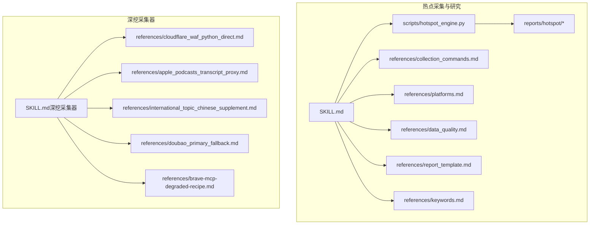
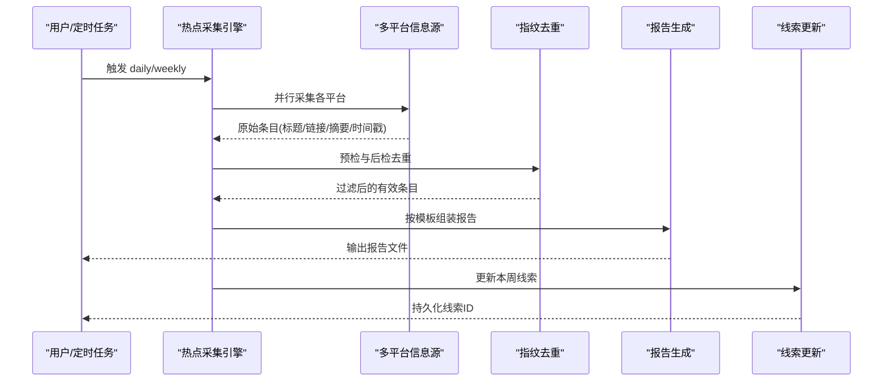
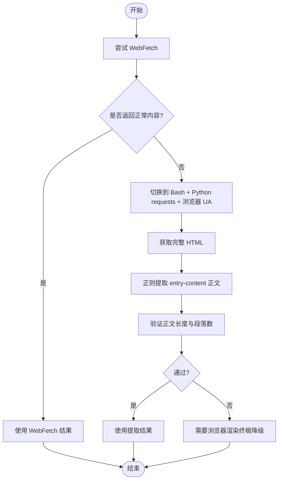
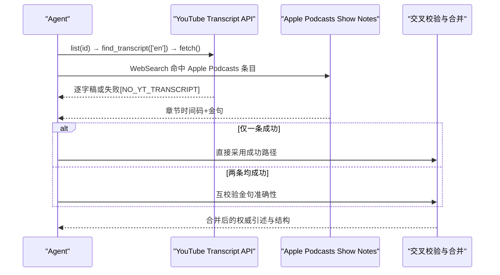
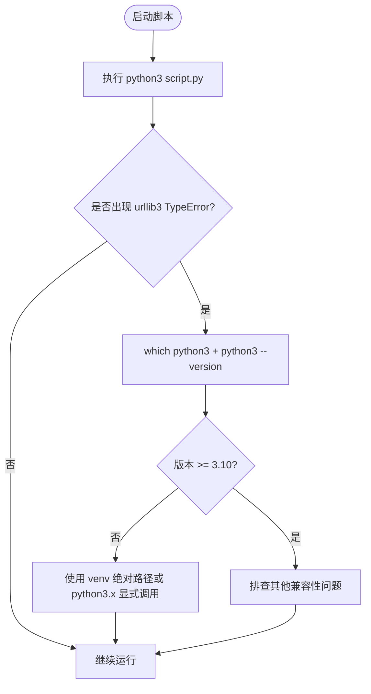
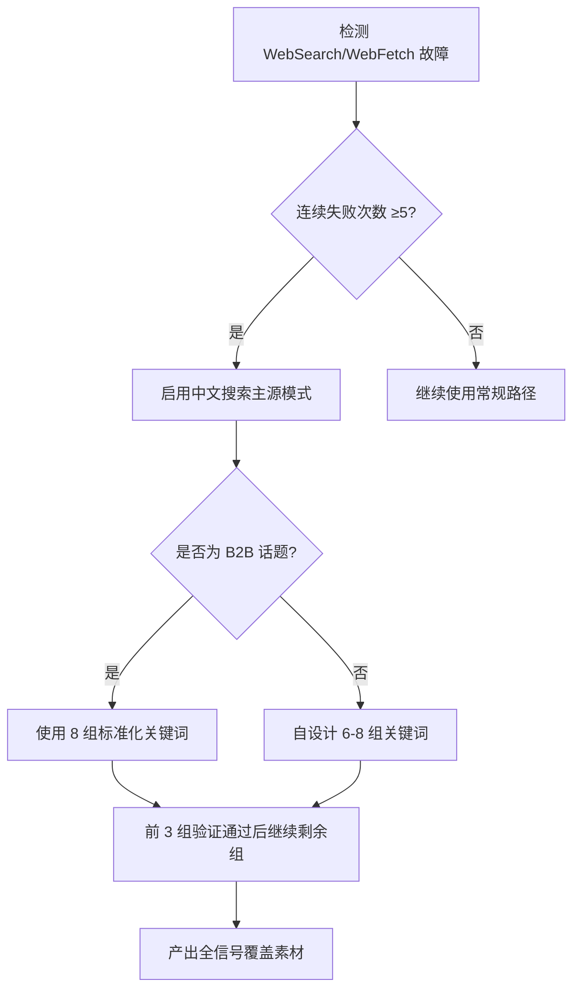
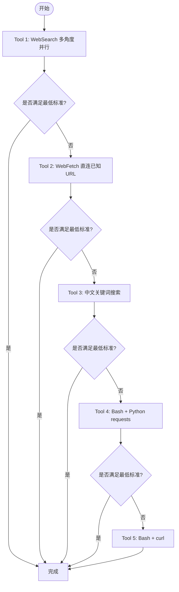
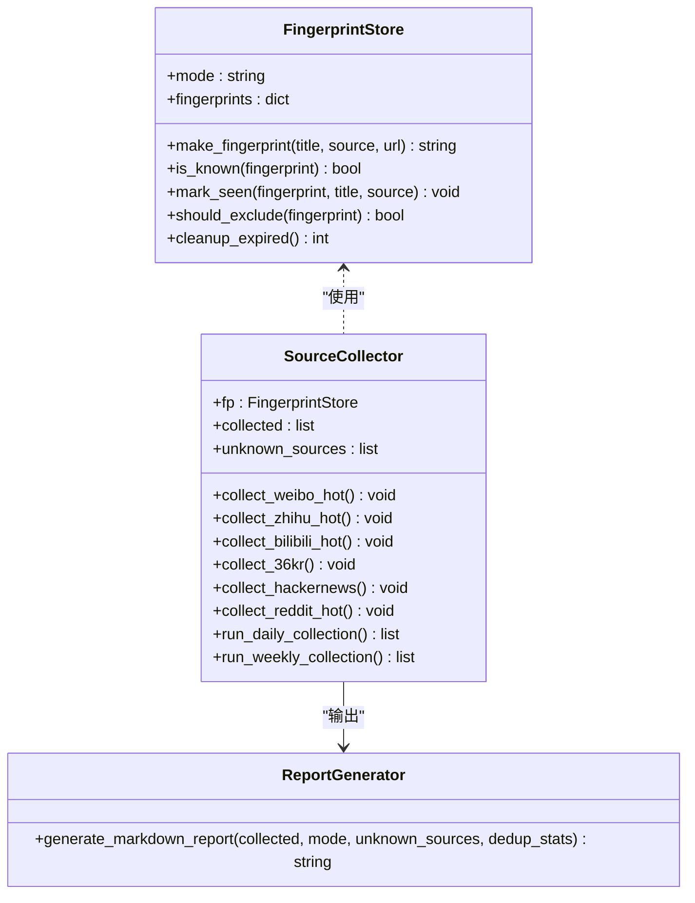
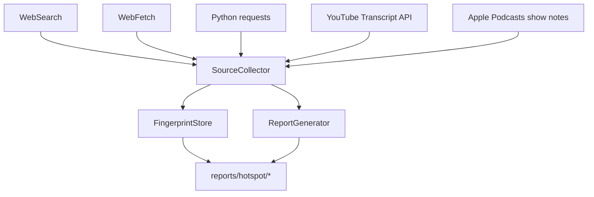

# 特殊场景处理方案

<cite>
**本文引用的文件列表**
- [SKILL.md](file://.skills/hotspot-research/SKILL.md)
- [hotspot_engine.py](file://.skills/hotspot-research/scripts/hotspot_engine.py)
- [jina_blogs_template.py](file://.skills/hotspot-research/scripts/jina_blogs_template.py)
- [collection_commands.md](file://.skills/hotspot-research/references/collection_commands.md)
- [platforms.md](file://.skills/hotspot-research/references/platforms.md)
- [data_quality.md](file://.skills/hotspot-research/references/data_quality.md)
- [report_template.md](file://.skills/hotspot-research/references/report_template.md)
- [keywords.md](file://.skills/hotspot-research/references/keywords.md)
- [SKILL.md（深挖采集器）](file://hotspot-topic-excavator/skills/hotspot-topic-excavator/SKILL.md)
- [cloudflare_waf_python_direct.md](file://hotspot-topic-excavator/skills/hotspot-topic-excavator/references/cloudflare_waf_python_direct.md)
- [apple_podcasts_transcript_proxy.md](file://hotspot-topic-excavator/skills/hotspot-topic-excavator/references/apple_podcasts_transcript_proxy.md)
- [international_topic_chinese_supplement.md](file://hotspot-topic-excavator/skills/hotspot-topic-excavator/references/international_topic_chinese_supplement.md)
- [doubao_primary_fallback.md](file://hotspot-topic-excavator/skills/hotspot-topic-excavator/references/doubao_primary_fallback.md)
- [brave-mcp-degraded-recipe.md](file://hotspot-topic-excavator/skills/hotspot-topic-excavator/references/brave-mcp-degraded-recipe.md)
</cite>

## 目录
1. [引言](#引言)
2. [项目结构](#项目结构)
3. [核心组件](#核心组件)
4. [架构总览](#架构总览)
5. [详细组件分析](#详细组件分析)
6. [依赖关系分析](#依赖关系分析)
7. [性能与稳定性考量](#性能与稳定性考量)
8. [故障排查指南](#故障排查指南)
9. [结论](#结论)
10. [附录：异常模板、错误码映射与应急预案清单](#附录异常模板错误码映射与应急预案清单)

## 引言
本文件聚焦于 SKILL.md 中定义的特殊场景处理方案，围绕以下目标展开：
- Cloudflare WAF 绕过技术：Python requests 直连抓取、浏览器 UA 模拟、正则提取 entry-content 的完整脚本与决策树。
- 播客 transcript 双路径采集策略：YouTube Transcript API 与 Apple Podcasts show notes 并行执行、失败回退与交叉校验。
- Python 环境路径解析问题诊断与修复：urllib3 版本兼容性与 venv 绝对路径调用方案。
- 中文搜索主源模式与国际治理话题中文补强规则。
- 提供异常场景处理模板、错误代码映射表与应急预案清单。

## 项目结构
仓库包含两套 Skill 体系：
- hotspot-research：热点采集与分析工作流，含引擎脚本与参考文档。
- hotspot-topic-excavator：热点主题素材深挖采集器，含多类“特殊场景”参考文档。

图表来源
- [SKILL.md:1-257](file://.skills/hotspot-research/SKILL.md#L1-L257)
- [hotspot_engine.py:1-120](file://.skills/hotspot-research/scripts/hotspot_engine.py#L1-L120)
- [SKILL.md（深挖采集器）:1-120](file://hotspot-topic-excavator/skills/hotspot-topic-excavator/SKILL.md#L1-L120)

章节来源
- [SKILL.md:1-257](file://.skills/hotspot-research/SKILL.md#L1-L257)
- [SKILL.md（深挖采集器）:1-120](file://hotspot-topic-excavator/skills/hotspot-topic-excavator/SKILL.md#L1-L120)

## 核心组件
- 热点采集引擎：负责指纹去重、多平台信息源采集、报告生成与线索更新。
- Jina Reader 批量采集脚本：绕过 macOS LibreSSL TLS 握手问题，批量拉取关键人物博客。
- 深挖采集器：以每日热点为锚点，向内深挖+向外发散，产出多层弹药库。
- 特殊场景参考文档：Cloudflare WAF 绕过、播客 transcript 双路径、国际治理中文补强、中文搜索主源模式、搜索工具全面降级 Recipe。

章节来源
- [hotspot_engine.py:1-120](file://.skills/hotspot-research/scripts/hotspot_engine.py#L1-L120)
- [jina_blogs_template.py:1-62](file://.skills/hotspot-research/scripts/jina_blogs_template.py#L1-L62)
- [SKILL.md（深挖采集器）:1-120](file://hotspot-topic-excavator/skills/hotspot-topic-excavator/SKILL.md#L1-L120)

## 架构总览
整体流程由“采集—筛选—时效检查—报告生成—线索更新”构成；深挖采集器在热点基础上进行二次深挖，并内置多种“降级路径”和“特殊场景处理”。

图表来源
- [SKILL.md:34-174](file://.skills/hotspot-research/SKILL.md#L34-L174)
- [hotspot_engine.py:52-145](file://.skills/hotspot-research/scripts/hotspot_engine.py#L52-L145)
- [report_template.md:1-60](file://.skills/hotspot-research/references/report_template.md#L1-L60)

## 详细组件分析

### Cloudflare WAF 绕过：Python requests 直连 + 正则提取
- 现象与根因：WebFetch 被 Cloudflare WAF 拦截返回占位文本；带浏览器 UA 的 Python requests 可成功获取完整 HTML。
- 成功抓取模式：
  - Step 1：使用 requests 发送请求，携带浏览器 UA、Accept、Accept-Language 等头部。
  - Step 2：正则匹配 WordPress/Gutenberg 正文块（entry-content、single-content 等），质量门要求至少 3 个 
 标签。
  - Step 3：清洗为 Markdown（标题、段落、链接、加粗斜体等）。
  - Step 4：验证（≥5KB 正文 + ≥30 个 
 → 可信度 90%+）。
- 决策树：WebFetch 正常则优先；若返回“Please wait/verifying/空 HTML”，则切换 Bash + Python requests + 浏览器 UA；仍失败则需浏览器渲染。

图表来源
- [cloudflare_waf_python_direct.md:1-139](file://hotspot-topic-excavator/skills/hotspot-topic-excavator/references/cloudflare_waf_python_direct.md#L1-L139)
- [SKILL.md（深挖采集器）:114-128](file://hotspot-topic-excavator/skills/hotspot-topic-excavator/SKILL.md#L114-L128)

章节来源
- [cloudflare_waf_python_direct.md:1-139](file://hotspot-topic-excavator/skills/hotspot-topic-excavator/references/cloudflare_waf_python_direct.md#L1-L139)
- [SKILL.md（深挖采集器）:114-128](file://hotspot-topic-excavator/skills/hotspot-topic-excavator/SKILL.md#L114-L128)

### 播客 transcript 双路径采集策略
- 路径A：YouTube Transcript API（Bash + Python youtube_transcript_api）
  - 正确调用链：list(id) → find_transcript(['en']) → fetch()
  - 成功率约 70%，但存在 API 变更与网络限制风险。
- 路径B：Apple Podcasts show notes（WebSearch 命中条目）
  - 返回章节时间码 + 金句，完整度约 90%，可作为逐字稿骨架。
- 执行规则：
  - 两条路径同时并行，任一成功即可进入素材组织阶段。
  - 路径A失败不阻塞，立即切路径B，标注 [NO_YT_TRANSCRIPT]。
  - 两者都成功时互校验金句准确性。

图表来源
- [apple_podcasts_transcript_proxy.md:1-95](file://hotspot-topic-excavator/skills/hotspot-topic-excavator/references/apple_podcasts_transcript_proxy.md#L1-L95)
- [SKILL.md（深挖采集器）:98-112](file://hotspot-topic-excavator/skills/hotspot-topic-excavator/SKILL.md#L98-L112)

章节来源
- [apple_podcasts_transcript_proxy.md:1-95](file://hotspot-topic-excavator/skills/hotspot-topic-excavator/references/apple_podcasts_transcript_proxy.md#L1-L95)
- [SKILL.md（深挖采集器）:98-112](file://hotspot-topic-excavator/skills/hotspot-topic-excavator/SKILL.md#L98-L112)

### Python 环境路径解析问题诊断与修复
- 症状：同一脚本 v1 能跑，v2 报 TypeError（urllib3._base_connection.py:10），原因是 urllib3 2.7.0 需要 PEP 604 语法（bytes | str），要求 Python 3.10+。
- 根因：python3 shebang 解析到系统 Python 3.9.x（macOS 默认），而 venv 中是 Python 3.11+。
- 修复方案：
  - 使用 venv 绝对路径或 python3.x 显式调用，避免修改 shebang。
  - 判定规则：遇到 urllib3/TypeError/unsupported operand 报错，先 which python3 + python3 --version 验证版本；失败则换绝对路径。

图表来源
- [SKILL.md（深挖采集器）:149-168](file://hotspot-topic-excavator/skills/hotspot-topic-excavator/SKILL.md#L149-L168)

章节来源
- [SKILL.md（深挖采集器）:149-168](file://hotspot-topic-excavator/skills/hotspot-topic-excavator/SKILL.md#L149-L168)

### 中文搜索主源模式与国际治理话题中文补强
- 触发条件：WebSearch 连续 ≥5 次失败且 WebFetch 不可用，中文关键词搜索升级为全信号主采集源。
- 模式A（B2B 话题）：直接使用 8 组标准化中文关键词（政策驱动、大厂路径、制造业实证、咨询业、路径对比、市场份额、基础设施、竞争估值）。
- 模式B（非 B2B 话题）：自设计 6-8 组关键词（锚点核心、关联信号、对立争议、中国视角、发散类比）。
- 验证规则：前 3 组完成后必须验证锚点核心信号命中、核心数字交叉验证、中国视角独立信源、对立争议信源。
- 国际治理话题强制中文补强：联合国/国际组织报告、跨国治理框架、全球行业事件、跨境监管动作、全球统计数据——中文关键词搜索不可省略。

图表来源
- [doubao_primary_fallback.md:1-119](file://hotspot-topic-excavator/skills/hotspot-topic-excavator/references/doubao_primary_fallback.md#L1-L119)
- [international_topic_chinese_supplement.md:1-133](file://hotspot-topic-excavator/skills/hotspot-topic-excavator/references/international_topic_chinese_supplement.md#L1-L133)
- [SKILL.md（深挖采集器）:137-147](file://hotspot-topic-excavator/skills/hotspot-topic-excavator/SKILL.md#L137-L147)

章节来源
- [doubao_primary_fallback.md:1-119](file://hotspot-topic-excavator/skills/hotspot-topic-excavator/references/doubao_primary_fallback.md#L1-L119)
- [international_topic_chinese_supplement.md:1-133](file://hotspot-topic-excavator/skills/hotspot-topic-excavator/references/international_topic_chinese_supplement.md#L1-L133)
- [SKILL.md（深挖采集器）:137-147](file://hotspot-topic-excavator/skills/hotspot-topic-excavator/SKILL.md#L137-L147)

### 搜索工具全面降级 Recipe
- 触发条件：WebSearch 连续 ≥3 次失败或返回异常，且 WebFetch 也不可用。
- 降级链顺序：
  1. WebSearch 多角度并行（保留主搜索能力）。
  2. WebFetch 直连已知 URL（最高质量原文提取）。
  3. 中文关键词搜索（中文 + 中国视角）。
  4. Bash + Python requests（提取原文核心段落）。
  5. Bash + curl（直连新闻，仅当需要时效信号时）。
- 验收清单：每个核心种子至少 2 个独立信源；至少 1 个 P1；中国版至少 1 条；反对/边界条件至少 1 条；时间戳 ±30 天内；参考资料链接实测可打开。

图表来源
- [brave-mcp-degraded-recipe.md:1-102](file://hotspot-topic-excavator/skills/hotspot-topic-excavator/references/brave-mcp-degraded-recipe.md#L1-L102)

章节来源
- [brave-mcp-degraded-recipe.md:1-102](file://hotspot-topic-excavator/skills/hotspot-topic-excavator/references/brave-mcp-degraded-recipe.md#L1-L102)

### 热点采集引擎与 Jina Reader 批量采集
- 热点采集引擎：
  - 指纹去重：混合策略（采集前预检 + 采集后完整对比），seen_count 阈值控制排除。
  - 多平台采集：微博热搜、知乎热榜、B站热门、36氪快讯、HackerNews、Reddit、搜狗微信、海外博客等。
  - 报告生成：结构化 Markdown，按平台分类，标注重复标记与平台评级。
- Jina Reader 批量采集：
  - 绕过 macOS LibreSSL TLS 握手失败问题，使用 Python requests + verify=False。
  - 批量拉取 8 人博客，输出到 jina_cache 目录。

图表来源
- [hotspot_engine.py:52-145](file://.skills/hotspot-research/scripts/hotspot_engine.py#L52-L145)
- [hotspot_engine.py:150-745](file://.skills/hotspot-research/scripts/hotspot_engine.py#L150-L745)
- [hotspot_engine.py:751-800](file://.skills/hotspot-research/scripts/hotspot_engine.py#L751-L800)

章节来源
- [hotspot_engine.py:1-120](file://.skills/hotspot-research/scripts/hotspot_engine.py#L1-L120)
- [hotspot_engine.py:150-745](file://.skills/hotspot-research/scripts/hotspot_engine.py#L150-L745)
- [jina_blogs_template.py:1-62](file://.skills/hotspot-research/scripts/jina_blogs_template.py#L1-L62)

## 依赖关系分析
- 采集层依赖：
  - WebSearch/WebFetch：主要搜索与原文获取。
  - Bash + Python requests：用于 Cloudflare WAF 绕过与降级路径。
  - YouTube Transcript API / Apple Podcasts show notes：播客 transcript 双路径。
- 存储与输出：
  - 指纹 JSON（daily/weekly）：用于去重与过期清理。
  - 报告 Markdown：按模板生成，包含热点清单、深度分析、选题建议等。
- 外部服务：
  - HackerNews Firebase API、Reddit JSON API、B站 API、百度热搜、搜狗微信、Jina Reader。

图表来源
- [hotspot_engine.py:52-145](file://.skills/hotspot-research/scripts/hotspot_engine.py#L52-L145)
- [hotspot_engine.py:150-745](file://.skills/hotspot-research/scripts/hotspot_engine.py#L150-L745)
- [SKILL.md（深挖采集器）:98-128](file://hotspot-topic-excavator/skills/hotspot-topic-excavator/SKILL.md#L98-L128)

章节来源
- [hotspot_engine.py:1-120](file://.skills/hotspot-research/scripts/hotspot_engine.py#L1-L120)
- [SKILL.md（深挖采集器）:98-128](file://hotspot-topic-excavator/skills/hotspot-topic-excavator/SKILL.md#L98-L128)

## 性能与稳定性考量
- 并发与并行：
  - 多组 WebSearch 与 WebFetch 并行调用，提升采集效率。
  - 子代理并行采集不同信息源组（如 8 人博客、HN+Reddit、国内平台、中英文搜索）。
- 去重与缓存：
  - 指纹去重减少重复采集，降低资源消耗。
  - Jina Reader 批量缓存至 jina_cache，便于复用。
- 超时与重试：
  - 对 Jina Reader 设置重试策略（空内容/403/超时分别处理）。
  - 对 Cloudflare WAF 站点快速切换 Python requests 路径，避免长时间阻塞。

章节来源
- [data_quality.md:80-98](file://.skills/hotspot-research/references/data_quality.md#L80-L98)
- [collection_commands.md:247-259](file://.skills/hotspot-research/references/collection_commands.md#L247-L259)
- [jina_blogs_template.py:1-62](file://.skills/hotspot-research/scripts/jina_blogs_template.py#L1-L62)

## 故障排查指南
- 网络诊断：
  - 快速检查 Google 与 Jina 连通性，区分网络中断与具体 URL 变化。
  - Jina 返回认证错误或超时时，降级到 WebSearch。
- 反爬与阻断：
  - Cloudflare WAF 站点使用 Python requests + 浏览器 UA 绕过。
  - 严格 Turnstile 或 5s challenge 加密页面需浏览器渲染。
- 工具链适配：
  - macOS LibreSSL TLS 握手失败时使用 Python requests 替代 curl。
  - Python 环境路径解析问题通过 venv 绝对路径解决。

章节来源
- [data_quality.md:171-187](file://.skills/hotspot-research/references/data_quality.md#L171-L187)
- [cloudflare_waf_python_direct.md:1-139](file://hotspot-topic-excavator/skills/hotspot-topic-excavator/references/cloudflare_waf_python_direct.md#L1-L139)
- [jina_blogs_template.py:1-62](file://.skills/hotspot-research/scripts/jina_blogs_template.py#L1-L62)
- [SKILL.md（深挖采集器）:149-168](file://hotspot-topic-excavator/skills/hotspot-topic-excavator/SKILL.md#L149-L168)

## 结论
本方案系统化覆盖了热点采集与深挖过程中的特殊场景处理，包括 Cloudflare WAF 绕过、播客 transcript 双路径、Python 环境路径解析、中文搜索主源模式与国际治理中文补强。通过明确的决策树、降级路径与验收清单，确保在复杂网络环境与工具链差异下仍能稳定产出高质量素材与报告。

## 附录：异常模板、错误码映射与应急预案清单

### 异常场景处理模板
- Cloudflare WAF 阻断：
  - 症状：WebFetch 返回“Please wait/verifying/空 HTML”。
  - 处理：切换 Bash + Python requests + 浏览器 UA；正则提取 entry-content；验证正文长度与段落数。
  - 升级：仍失败则需浏览器渲染。
- 播客 transcript 失败：
  - 症状：YouTube Transcript API 失败或 Apple Podcasts 无章节。
  - 处理：并行双路径；任一成功即进入素材组织；两者成功则互校验。
- Python 环境路径问题：
  - 症状：urllib3 TypeError。
  - 处理：检查 python3 版本；使用 venv 绝对路径或 python3.x 显式调用。
- 搜索工具全面故障：
  - 症状：WebSearch 连续失败且 WebFetch 不可用。
  - 处理：按降级链顺序执行，直至满足最低标准。

### 错误代码映射表
- HTTP 状态码：
  - 200：成功（WebFetch/requests/curl）。
  - 403/503：访问受限（Jina/Cloudflare），重试一次后降级。
  - 超时：网络或服务端问题，缩短 max-time 重试一次，仍失败则降级。
- 应用层错误：
  - AuthenticationRequiredError：IP 信誉阻止，等待恢复或使用 WebSearch 替代。
  - NO_YT_TRANSCRIPT：YouTube transcript 不可用，切换 Apple Podcasts show notes。
  - BLOCKED：明确登录墙或严格挑战页，标注并跳过。

### 应急预案清单
- 网络中断：
  - 使用已有数据，等待恢复后再补充采集。
- 工具链不可用：
  - 按降级链顺序执行，确保每个核心种子至少有 2 个独立信源。
- 反爬与阻断：
  - 优先 WebFetch，其次 Python requests + UA，最后浏览器渲染。
- 数据完整性不足：
  - 标注缺失项与建议补采方向，不阻塞主流程。

章节来源
- [cloudflare_waf_python_direct.md:1-139](file://hotspot-topic-excavator/skills/hotspot-topic-excavator/references/cloudflare_waf_python_direct.md#L1-L139)
- [apple_podcasts_transcript_proxy.md:1-95](file://hotspot-topic-excavator/skills/hotspot-topic-excavator/references/apple_podcasts_transcript_proxy.md#L1-L95)
- [SKILL.md（深挖采集器）:149-168](file://hotspot-topic-excavator/skills/hotspot-topic-excavator/SKILL.md#L149-L168)
- [brave-mcp-degraded-recipe.md:1-102](file://hotspot-topic-excavator/skills/hotspot-topic-excavator/references/brave-mcp-degraded-recipe.md#L1-L102)