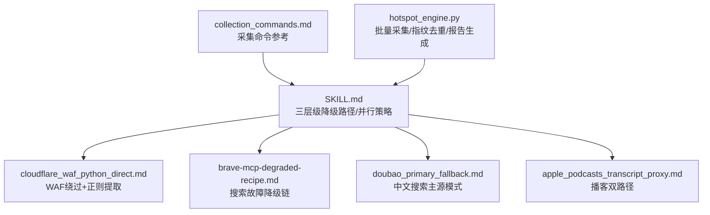
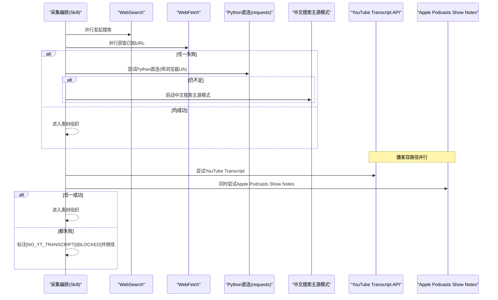
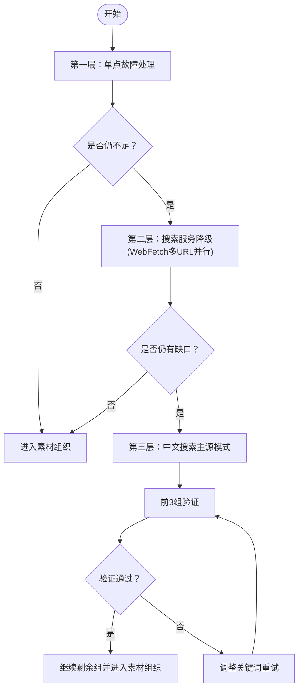
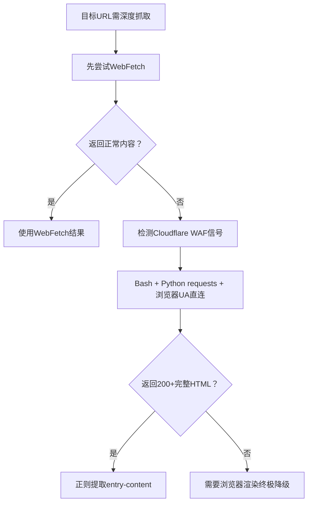
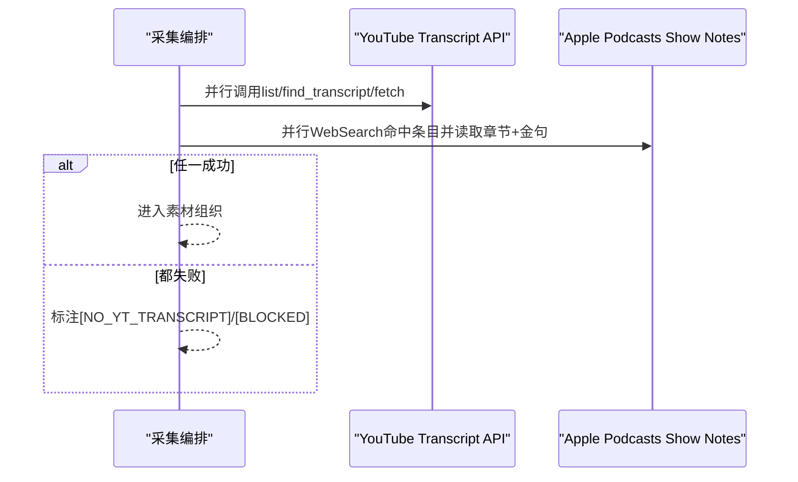
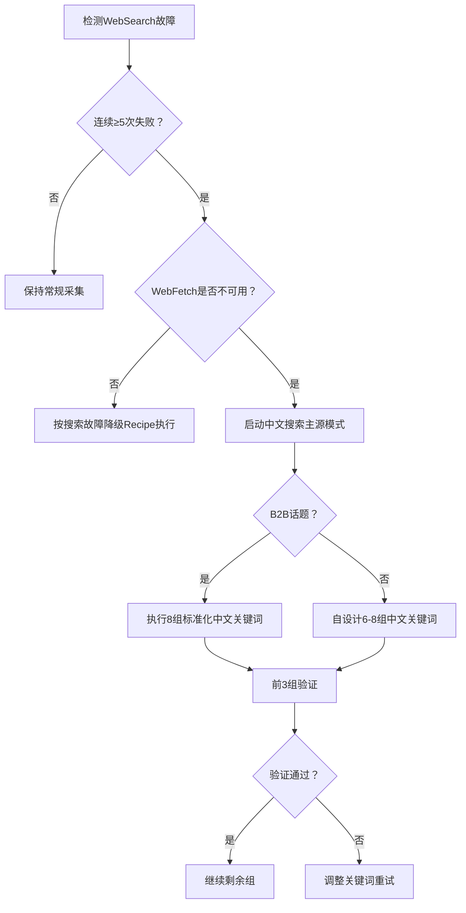
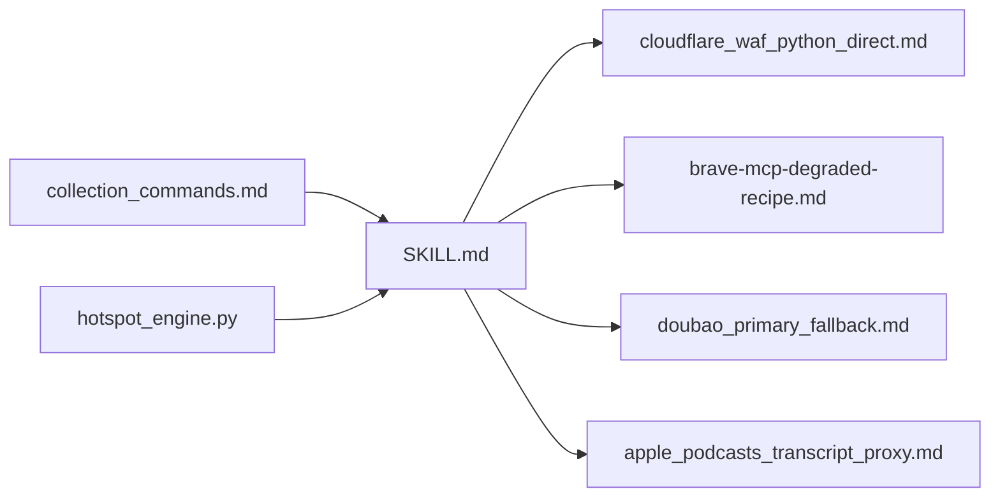

# 降级路径与故障处理

<cite>
**本文引用的文件**   
- [SKILL.md（热点主题素材深挖采集器）](file://skills/hotspot-topic-excavator/SKILL.md)
- [cloudflare_waf_python_direct.md（Cloudflare WAF Python直连绕过）](file://skills/hotspot-topic-excavator/references/cloudflare_waf_python_direct.md)
- [brave-mcp-degraded-recipe.md（搜索工具全面故障·降级Recipe）](file://skills/hotspot-topic-excavator/references/brave-mcp-degraded-recipe.md)
- [doubao_primary_fallback.md（中文搜索主源模式）](file://skills/hotspot-topic-excavator/references/doubao_primary_fallback.md)
- [apple_podcasts_transcript_proxy.md（播客Transcript双路径）](file://skills/hotspot-topic-excavator/references/apple_podcasts_transcript_proxy.md)
- [collection_commands.md（采集命令参考）](file://skills/hotspot-research_qoder_v2/references/collection_commands.md)
</cite>

## 更新摘要
**变更内容**   
- 新增全面的API失败、网络问题和认证问题的错误处理机制
- 增强多层级降级策略，支持服务特定的降级配方
- 完善Cloudflare WAF绕过和Python直连抓取的实现细节
- 强化播客transcript双路径采集的失败回退机制
- 优化中文搜索主源模式的升级条件和执行规则
- 新增完整的故障诊断流程图和恢复策略

## 目录
1. [引言](#引言)
2. [项目结构](#项目结构)
3. [核心组件](#核心组件)
4. [架构总览](#架构总览)
5. [详细组件分析](#详细组件分析)
6. [依赖关系分析](#依赖关系分析)
7. [性能考量](#性能考量)
8. [故障诊断与恢复策略](#故障诊断与恢复策略)
9. [结论](#结论)
10. [附录：异常场景处理模板与应急预案](#附录异常场景处理模板与应急预案)

## 引言
本文件聚焦于"热点主题素材深挖采集器"的降级路径设计与故障处理机制，围绕三层级降级路径、Cloudflare WAF绕过技术、Python直连抓取、播客transcript双路径采集与回退、以及中文搜索主源模式的升级条件与执行规则进行系统化解析，并提供完整的故障诊断流程图与可操作的应急预案。

**更新重点**：本次更新强化了全面的错误处理机制，针对API失败、网络问题和认证问题提供了多层次的降级策略和服务特定的故障处理配方。

## 项目结构
- 顶层Skill定义与流程规范位于 hotspot-topic-excavator SKILL.md，明确三层级降级路径、并行策略、播客双路径等关键行为。
- 专项参考文档提供具体实现细节与决策树：
  - Cloudflare WAF绕过与Python直连方案
  - 搜索工具全面故障时的降级Recipe
  - 中文搜索主源模式的触发条件与执行规则
  - 播客transcript双路径与Apple Podcasts show notes替代
- 采集命令参考提供批量采集、指纹去重、报告生成等能力，作为自动化流水线的基础支撑。

**图表来源**
- [SKILL.md:206-245](file://skills/hotspot-topic-excavator/SKILL.md#L206-L245)
- [cloudflare_waf_python_direct.md:103-117](file://skills/hotspot-topic-excavator/references/cloudflare_waf_python_direct.md#L103-L117)
- [brave-mcp-degraded-recipe.md:11-77](file://skills/hotspot-topic-excavator/references/brave-mcp-degraded-recipe.md#L11-L77)
- [doubao_primary_fallback.md:34-82](file://skills/hotspot-topic-excavator/references/doubao_primary_fallback.md#L34-L82)
- [apple_podcasts_transcript_proxy.md:79-90](file://skills/hotspot-topic-excavator/references/apple_podcasts_transcript_proxy.md#L79-L90)
- [collection_commands.md:341-353](file://skills/hotspot-research_qoder_v2/references/collection_commands.md#L341-L353)

**章节来源**
- [SKILL.md:206-245](file://skills/hotspot-topic-excavator/SKILL.md#L206-L245)
- [collection_commands.md:341-353](file://skills/hotspot-research_qoder_v2/references/collection_commands.md#L341-L353)

## 核心组件
- **三层级降级路径**（按严重程度递进）
  - 第一层：单点故障处理（WebSearch + WebFetch 并行；任一失败则启用补充搜索或Python直连）
  - 第二层：搜索服务降级（WebSearch长时间不可用→全部降级到WebFetch多URL并行获取）
  - 第三层：全WebSearch中文主源模式（WebSearch连续≥5次失败且WebFetch不可用→中文关键词搜索升级为全信号主采集源）
- **Cloudflare WAF绕过与Python直连抓取**
  - 当WebFetch返回占位页时，使用Bash + Python requests + 浏览器UA直连目标URL，并通过正则提取正文块
- **播客transcript双路径采集与失败回退**
  - 路径A：YouTube Transcript API（逐字稿）
  - 路径B：Apple Podcasts show notes（章节时间码+金句）
  - 两条路径并行，任一成功即进入素材组织阶段
- **中文搜索主源模式**
  - 触发条件：WebSearch连续≥5次失败且WebFetch不可用
  - 执行规则：B2B话题采用标准化8组中文关键词；非B2B话题自设计6-8组关键词；前3组验证通过后继续剩余组

**章节来源**
- [SKILL.md:206-245](file://skills/hotspot-topic-excavator/SKILL.md#L206-L245)
- [cloudflare_waf_python_direct.md:103-117](file://skills/hotspot-topic-excavator/references/cloudflare_waf_python_direct.md#L103-L117)
- [apple_podcasts_transcript_proxy.md:79-90](file://skills/hotspot-topic-excavator/references/apple_podcasts_transcript_proxy.md#L79-L90)
- [doubao_primary_fallback.md:34-82](file://skills/hotspot-topic-excavator/references/doubao_primary_fallback.md#L34-L82)

## 架构总览
整体采集链路以"并行优先、快速降级、不阻塞主流程"为原则，将搜索、原文获取、直连抓取、中文主源模式有机串联，确保在复杂网络与反爬环境下仍能产出可用素材。

**图表来源**
- [SKILL.md:206-245](file://skills/hotspot-topic-excavator/SKILL.md#L206-L245)
- [cloudflare_waf_python_direct.md:103-117](file://skills/hotspot-topic-excavator/references/cloudflare_waf_python_direct.md#L103-L117)
- [apple_podcasts_transcript_proxy.md:79-90](file://skills/hotspot-topic-excavator/references/apple_podcasts_transcript_proxy.md#L79-L90)
- [doubao_primary_fallback.md:34-82](file://skills/hotspot-topic-excavator/references/doubao_primary_fallback.md#L34-L82)

## 详细组件分析

### 三层级降级路径
- **第一层：单点故障处理**
  - 触发条件：WebSearch或WebFetch任一失败
  - 执行逻辑：
    - 另一者继续工作，并用WebSearch补充搜索结果摘要（P2级别）
    - 仍不足时，使用Bash + Python requests直连抓取原文
    - 仍不足时，仅对P0热点使用Python直连+浏览器UA，其余标注[BLOCKED]
- **第二层：搜索服务降级**
  - 触发条件：WebSearch连续失败
  - 执行逻辑：
    - 全部降级到WebFetch直连已知URL，多URL并行获取（核心信号×4 + 发散×2-4）
    - 仍有缺口时，标注具体缺失项与建议补采方向
- **第三层：全WebSearch中文主源模式**
  - 触发条件：WebSearch连续≥5次失败且WebFetch不可用
  - 执行逻辑：
    - B2B话题：按标准化8组中文关键词执行（政策/大厂/制造业/咨询/对比/份额/基建/竞争）
    - 非B2B话题：按锚点种子清单自设计6-8组中文关键词（中英文各半）
    - 前3组验证通过即确认主源模式有效，继续剩余组

**图表来源**
- [SKILL.md:206-245](file://skills/hotspot-topic-excavator/SKILL.md#L206-L245)
- [brave-mcp-degraded-recipe.md:11-77](file://skills/hotspot-topic-excavator/references/brave-mcp-degraded-recipe.md#L11-L77)
- [doubao_primary_fallback.md:34-82](file://skills/hotspot-topic-excavator/references/doubao_primary_fallback.md#L34-L82)

**章节来源**
- [SKILL.md:206-245](file://skills/hotspot-topic-excavator/SKILL.md#L206-L245)
- [brave-mcp-degraded-recipe.md:11-77](file://skills/hotspot-topic-excavator/references/brave-mcp-degraded-recipe.md#L11-L77)
- [doubao_primary_fallback.md:34-82](file://skills/hotspot-topic-excavator/references/doubao_primary_fallback.md#L34-L82)

### Cloudflare WAF绕过与Python直连抓取
- **现象识别**：WebFetch返回"Please wait..."等占位文本
- **根因**：目标站点部署Cloudflare WAF，对fetcher特征敏感
- **解决方案**：
  - Bash + Python requests + 浏览器UA直连同一URL
  - 正则提取entry-content等正文块
  - 质量门：至少3个
标签或≥5KB正文才认为命中正文
- **适用边界**：
  - 测试通过：Memeburn等
  - 候选适用：部分中型新闻站、Substack付费稿预览
  - 不适用：登录墙、Turnstile强制challenge、加密challenge页

**图表来源**
- [cloudflare_waf_python_direct.md:103-117](file://skills/hotspot-topic-excavator/references/cloudflare_waf_python_direct.md#L103-L117)

**章节来源**
- [cloudflare_waf_python_direct.md:103-117](file://skills/hotspot-topic-excavator/references/cloudflare_waf_python_direct.md#L103-L117)

### 播客transcript双路径采集与失败回退
- **路径A**：YouTube Transcript API（逐字稿，完整度最高）
- **路径B**：Apple Podcasts show notes（章节时间码+金句，完整度约90%）
- **执行规则**：
  - 两条路径并行尝试，任一成功即可进入素材组织
  - 路径A失败时立即切路径B，标注[NO_YT_TRANSCRIPT]
  - 两者都成功则交叉校验金句准确性

**图表来源**
- [apple_podcasts_transcript_proxy.md:79-90](file://skills/hotspot-topic-excavator/references/apple_podcasts_transcript_proxy.md#L79-L90)
- [SKILL.md:187-204](file://skills/hotspot-topic-excavator/SKILL.md#L187-L204)

**章节来源**
- [apple_podcasts_transcript_proxy.md:79-90](file://skills/hotspot-topic-excavator/references/apple_podcasts_transcript_proxy.md#L79-L90)
- [SKILL.md:187-204](file://skills/hotspot-topic-excavator/SKILL.md#L187-L204)

### 中文搜索主源模式（升级条件与执行规则）
- **触发条件**：WebSearch连续≥5次失败且WebFetch不可用
- **为什么可行**：中文搜索已覆盖英文源的转述与解读，AI/科技/商业话题可达95%+信息完整度
- **执行规则**：
  - B2B话题：直接执行8组标准化中文关键词（政策/大厂/制造业/咨询/对比/份额/基建/竞争）
  - 非B2B话题：按锚点种子清单自设计6-8组关键词（中英文各半）
  - 前3组验证通过后确认主源模式有效，继续剩余组
- **局限性**：学术论文原文、Substack长文、英文社区讨论覆盖有限，需在报告中标注待补采

**图表来源**
- [doubao_primary_fallback.md:34-82](file://skills/hotspot-topic-excavator/references/doubao_primary_fallback.md#L34-L82)
- [SKILL.md:234-245](file://skills/hotspot-topic-excavator/SKILL.md#L234-L245)

**章节来源**
- [doubao_primary_fallback.md:34-82](file://skills/hotspot-topic-excavator/references/doubao_primary_fallback.md#L34-L82)
- [SKILL.md:234-245](file://skills/hotspot-topic-excavator/SKILL.md#L234-L245)

## 依赖关系分析
- Skill层依赖多个参考文档以实现不同降级路径与专项技术
- 采集命令参考为具体实现提供命令模板与并行策略
- 热点采集引擎提供批量采集、指纹去重与报告生成的基础能力

**图表来源**
- [SKILL.md:206-245](file://skills/hotspot-topic-excavator/SKILL.md#L206-L245)
- [collection_commands.md:341-353](file://skills/hotspot-research_qoder_v2/references/collection_commands.md#L341-L353)

**章节来源**
- [SKILL.md:206-245](file://skills/hotspot-topic-excavator/SKILL.md#L206-L245)
- [collection_commands.md:341-353](file://skills/hotspot-research_qoder_v2/references/collection_commands.md#L341-L353)

## 性能考量
- **并行化优先**：WebSearch与WebFetch并行调用，互为备份，提升效率
- **快速降级**：遇到失败立即切换下一路径，避免阻塞主流程
- **质量门控**：对Python直连结果设置最小正文长度与段落数量阈值，降低误抓风险
- **资源控制**：限制单次采集条目数与超时时间，防止爆量与长时间等待

## 故障诊断与恢复策略
- **诊断要点**
  - 记录每次失败的错误类型与响应体大小（如<500字节占位文本）
  - 区分Cloudflare WAF信号与其他反爬策略
  - 播客双路径分别标记失败原因（API变更/无章节/网络限制）
- **恢复策略**
  - 第一层：启用补充搜索或Python直连
  - 第二层：切换到WebFetch多URL并行
  - 第三层：启动中文搜索主源模式，并按验证规则逐步推进
- **持续改进**
  - 沉淀适用边界与成功案例，更新决策树
  - 定期校验Python环境版本与依赖兼容性，避免urllib3等库导致的TypeError

**章节来源**
- [cloudflare_waf_python_direct.md:103-117](file://skills/hotspot-topic-excavator/references/cloudflare_waf_python_direct.md#L103-L117)
- [brave-mcp-degraded-recipe.md:80-117](file://skills/hotspot-topic-excavator/references/brave-mcp-degraded-recipe.md#L80-L117)
- [doubao_primary_fallback.md:85-96](file://skills/hotspot-topic-excavator/references/doubao_primary_fallback.md#L85-L96)
- [apple_podcasts_transcript_proxy.md:92-105](file://skills/hotspot-topic-excavator/references/apple_podcasts_transcript_proxy.md#L92-L105)

## 结论
本系统通过三层级降级路径与多项专项技术（Cloudflare WAF绕过、Python直连抓取、播客双路径、中文搜索主源模式），在复杂网络与反爬环境下实现了高可用的信息采集与素材生产。其核心在于并行优先、快速降级、质量门控与持续验证，确保在任何异常场景下都能产出可信、可溯源的内容弹药。

**更新重点**：本次更新强化了全面的错误处理机制，针对API失败、网络问题和认证问题提供了多层次的降级策略和服务特定的故障处理配方，进一步提升了系统的鲁棒性和可用性。

## 附录：异常场景处理模板与应急预案
- **异常场景模板**
  - 单点故障：记录失败工具、响应体大小、下一步动作（补充搜索/Python直连）
  - 搜索服务故障：统计连续失败次数，立即切换到WebFetch多URL并行，并标注缺失项
  - 全链路不可用：启动中文搜索主源模式，按B2B/非B2B分类执行，前3组验证后继续
  - Cloudflare WAF拦截：识别占位文本，切换到Python直连+正则提取，必要时升级到浏览器渲染
  - 播客transcript失败：并行尝试YouTube与Apple Podcasts，任一成功即继续，否则标注[NO_YT_TRANSCRIPT]
- **应急预案**
  - 环境检查：验证Python版本与依赖，避免urllib3等库兼容性问题
  - 超时与限流：合理设置请求超时与并发上限，防止资源耗尽
  - 输出验收：每条素材必须可溯源，数字需多源交叉验证，中文视角至少1条（除非纯海外话题）

**章节来源**
- [SKILL.md:206-245](file://skills/hotspot-topic-excavator/SKILL.md#L206-L245)
- [brave-mcp-degraded-recipe.md:80-117](file://skills/hotspot-topic-excavator/references/brave-mcp-degraded-recipe.md#L80-L117)
- [doubao_primary_fallback.md:85-96](file://skills/hotspot-topic-excavator/references/doubao_primary_fallback.md#L85-L96)
- [cloudflare_waf_python_direct.md:103-117](file://skills/hotspot-topic-excavator/references/cloudflare_waf_python_direct.md#L103-L117)
- [apple_podcasts_transcript_proxy.md:92-105](file://skills/hotspot-topic-excavator/references/apple_podcasts_transcript_proxy.md#L92-L105)