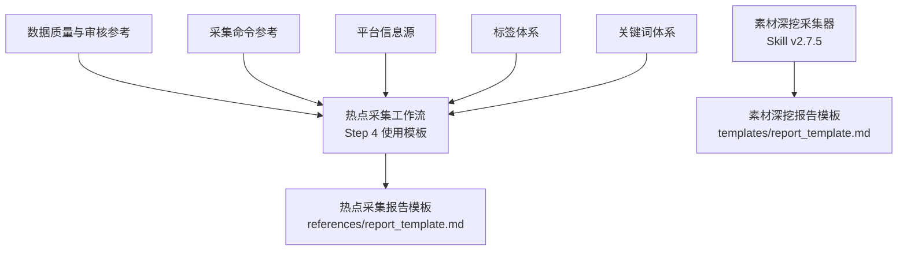
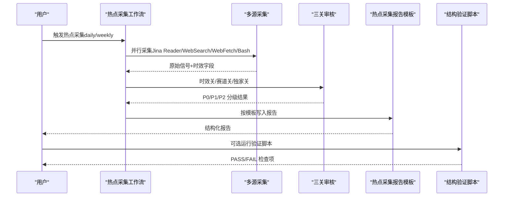
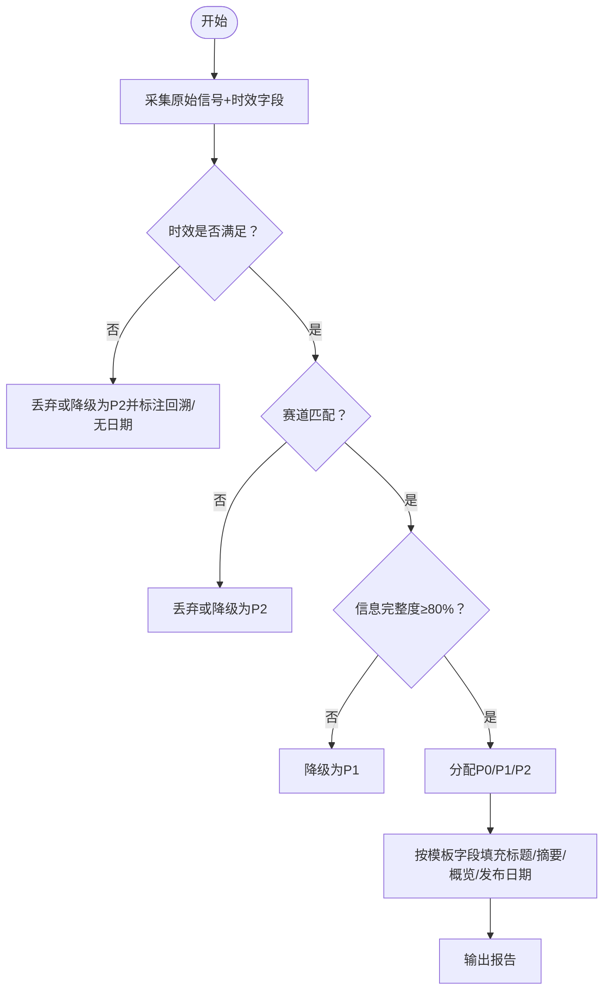
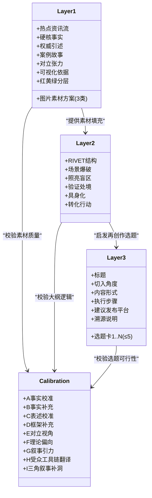
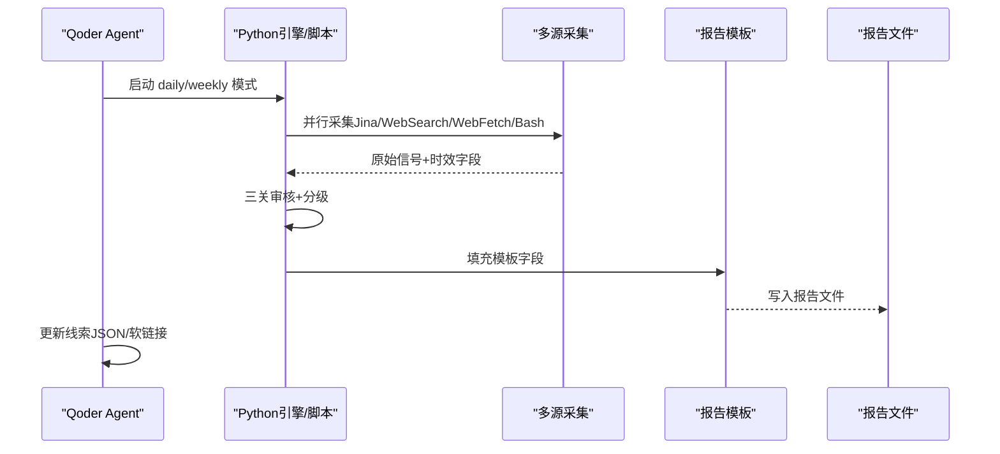
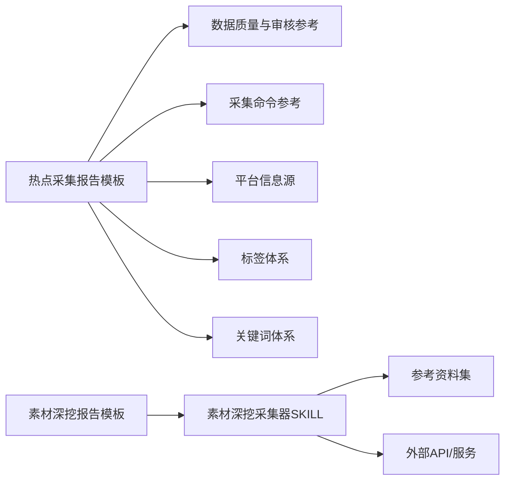

# 输出模板系统

<cite>
**本文引用的文件列表**
- [report_template.md（热点采集报告模板）](file://.skills/hotspot-research/references/report_template.md)
- [report_template.md（素材深挖报告模板）](file://hotspot-topic-excavator/skills/hotspot-topic-excavator/templates/report_template.md)
- [SKILL.md（热点采集工作流）](file://.skills/hotspot-research/SKILL.md)
- [SKILL.md（素材深挖采集器）](file://hotspot-topic-excavator/skills/hotspot-topic-excavator/SKILL.md)
- [README.md（素材深挖采集器说明）](file://hotspot-topic-excavator/README.md)
- [data_quality.md（数据质量与审核参考）](file://.skills/hotspot-research/references/data_quality.md)
- [topic_materials_compilation.md（话题元素材采集工作流）](file://.skills/hotspot-research/references/topic_materials_compilation.md)
- [verify_report_template.py（报告结构验证脚本）](file://.skills/hotspot-research/scripts/verify_report_template.py)
- [collection_commands.md（采集命令参考）](file://.skills/hotspot-research/references/collection_commands.md)
- [platforms.md（平台信息源）](file://.skills/hotspot-research/references/platforms.md)
- [tags.md（内容分类标签体系）](file://.skills/hotspot-research/references/tags.md)
- [keywords.md（关键词体系）](file://.skills/hotspot-research/references/keywords.md)
</cite>

## 目录
1. [引言](#引言)
2. [项目结构与定位](#项目结构与定位)
3. [核心组件总览](#核心组件总览)
4. [架构概览](#架构概览)
5. [详细组件分析](#详细组件分析)
6. [依赖关系分析](#依赖关系分析)
7. [性能与稳定性考量](#性能与稳定性考量)
8. [故障排查指南](#故障排查指南)
9. [结论](#结论)
10. [附录：模板定制指南](#附录模板定制指南)

## 引言
本文件系统化阐述“输出模板系统”的架构与定制方法，重点解析两类模板的输出格式设计：
- 热点采集报告模板（日报/周报）：用于标准化呈现 Top 20 热点、中国 AI 圈动态、关键人物观点、深度分析与选题建议等。
- 热点主题素材深挖报告模板（Layer 1/2/3）：以“向内深挖 + 向外发散”双轴模型产出三层弹药库，并支持多平台适配与自动化生成流程。

文档同时覆盖红黄绿分层策略、信源完整性评估标准、素材矩阵组织方式、字段定义与格式规范、样式调整方法、不同平台的内容适配规则以及自动化生成流程。

## 项目结构与定位
- 热点采集报告模板位于 references 目录下，作为 Step 4 按模板生成报告的加载模板。
- 素材深挖报告模板位于 hotspot-topic-excavator 插件内 templates 目录，服务于“热点主题素材深挖采集器”。
- 两套模板分别对应不同的生产阶段：前者是“信息采集与分析”，后者是“素材深挖与再创作准备”。

图表来源
- [SKILL.md（热点采集工作流）:134-174](file://.skills/hotspot-research/SKILL.md#L134-L174)
- [report_template.md（热点采集报告模板）:1-203](file://.skills/hotspot-research/references/report_template.md#L1-L203)
- [SKILL.md（素材深挖采集器）:1-120](file://hotspot-topic-excavator/skills/hotspot-topic-excavator/SKILL.md#L1-L120)
- [report_template.md（素材深挖报告模板）:1-132](file://hotspot-topic-excavator/skills/hotspot-topic-excavator/templates/report_template.md#L1-L132)

章节来源
- [SKILL.md（热点采集工作流）:134-174](file://.skills/hotspot-research/SKILL.md#L134-L174)
- [report_template.md（热点采集报告模板）:1-203](file://.skills/hotspot-research/references/report_template.md#L1-L203)
- [SKILL.md（素材深挖采集器）:1-120](file://hotspot-topic-excavator/skills/hotspot-topic-excavator/SKILL.md#L1-L120)
- [report_template.md（素材深挖报告模板）:1-132](file://hotspot-topic-excavator/skills/hotspot-topic-excavator/templates/report_template.md#L1-L132)

## 核心组件总览
- 热点采集报告模板
  - 包含：Top 20 热点清单、中国 AI 圈动态、关键人物观点追踪、深度分析、选题建议、执行路径报告、本周线索、素材深挖提示等固定章节。
  - 强制规范：标题中英双语、摘要四要素、概览四字段、发布日期标注、时效降级规则等。
- 素材深挖报告模板
  - Layer 1 素材包：6 类内容素材 + 3 类图片素材方案，含红黄绿分层。
  - Layer 2 文章/视频大纲：RIVET 结构填充。
  - Layer 3 再创作选题建议：≤5 个完整选题卡。
  - 校准审查记录表：A-I 九类校准项。

章节来源
- [report_template.md（热点采集报告模板）:17-203](file://.skills/hotspot-research/references/report_template.md#L17-L203)
- [report_template.md（素材深挖报告模板）:1-132](file://hotspot-topic-excavator/skills/hotspot-topic-excavator/templates/report_template.md#L1-L132)
- [SKILL.md（素材深挖采集器）:207-237](file://hotspot-topic-excavator/skills/hotspot-topic-excavator/SKILL.md#L207-L237)

## 架构概览
整体流程从多源采集到筛选审核，再到模板化输出与可选的结构验证。

图表来源
- [SKILL.md（热点采集工作流）:52-174](file://.skills/hotspot-research/SKILL.md#L52-L174)
- [collection_commands.md（采集命令参考）:1-120](file://.skills/hotspot-research/references/collection_commands.md#L1-L120)
- [data_quality.md（数据质量与审核参考）:8-78](file://.skills/hotspot-research/references/data_quality.md#L8-L78)
- [verify_report_template.py（报告结构验证脚本）:1-153](file://.skills/hotspot-research/scripts/verify_report_template.py#L1-L153)

## 详细组件分析

### 热点采集报告模板（Top 20 优先排序）
- 章节与字段
  - 本期热点清单：优先级、标题（原文·必带中文翻译）、发布日期、中文摘要（主体/动作/关键数字/行业影响）、平台、概览（冲突/异常、数据锚点、受众关联、叙事钩子）、与赛道的关联度、建议内容方向。
  - 今日中国AI圈动态：P0/P1-P2 分类表格与统计。
  - 关键人物观点追踪：核心观点、引文/来源、对创作者的价值、建议内容角度、来源。
  - 深度分析（Top 10）：热点来源、为什么值得深挖、受众关联、叙事建议、内容价值、信息完整度。
  - 选题建议（Top 5）：切入角度、内容形式、目标受众、预期共鸣点、执行步骤、建议发布平台。
  - 执行路径报告：采集统计、受限源及替代建议、上期选题反馈。
  - 本周线索：线索 ID 持久化（W-{周}-序号），强/中信号标记。
  - 素材深挖提示（日报专属）：候选话题、种子信号、优先级。
- 强制规范
  - 标题必须英文原文+中文翻译；摘要四要素；概览四字段；每条热点标注发布日期；超过 48h 降级为 P2 并标注回溯；超过 72h 丢弃；无法确定日期标注无日期并降级。
- 红黄绿分层策略应用
  - 在“今日中国AI圈动态”中使用 🔴 P0 / 🟡 P1-P2 / ⚪ P2 标记，便于快速识别直接选题与间接相关条目。
- 信源完整性评估标准
  - 依据数据质量参考：完整（100%）、高（80%）、中（60%）、低（30%）。P0 要求 ≥80%，否则降级。
- 素材矩阵的组织方式
  - 通过“概览四字段”将冲突/异常、数据锚点、受众关联、叙事钩子结构化，形成可复用的素材矩阵，支撑后续深度分析与选题建议。

图表来源
- [data_quality.md（数据质量与审核参考）:8-78](file://.skills/hotspot-research/references/data_quality.md#L8-L78)
- [report_template.md（热点采集报告模板）:17-53](file://.skills/hotspot-research/references/report_template.md#L17-L53)

章节来源
- [report_template.md（热点采集报告模板）:17-203](file://.skills/hotspot-research/references/report_template.md#L17-L203)
- [data_quality.md（数据质量与审核参考）:8-78](file://.skills/hotspot-research/references/data_quality.md#L8-L78)

### 素材深挖报告模板（Layer 1/2/3）
- Layer 1 素材包
  - 6 类内容素材：热点资讯流、硬核事实、权威引述、案例故事、对立张力、可视化依据。
  - 3 类图片素材方案：文章内可用配图、可下载图源、AI 绘图 prompt 概要。
  - 红黄绿分层：🔴 核心层（直接关于原话题）、🟡 强关联层（紧密相关的延伸）、🟢 可延展层（能激发新选题的发散素材）。
- Layer 2 文章/视频大纲 + 素材填充
  - RIVET 结构：场景爆破（Rupture）、照亮盲区（Illuminate）、验证处境（Validate）、具身化（Embody）、转化行动（Transform）。
- Layer 3 再创作选题建议（≤5 个）
  - 每个选题卡包含：标题、切入角度、内容形式、执行步骤、建议发布平台、溯源说明。
- 校准审查记录表
  - A-I 九类校准：事实校准、事实补充、表述校准、框架补充、对立视角、理论偏向、叙事引力、受众工具链翻译、三角叙事补洞。

图表来源
- [report_template.md（素材深挖报告模板）:23-132](file://hotspot-topic-excavator/skills/hotspot-topic-excavator/templates/report_template.md#L23-L132)
- [SKILL.md（素材深挖采集器）:207-237](file://hotspot-topic-excavator/skills/hotspot-topic-excavator/SKILL.md#L207-L237)

章节来源
- [report_template.md（素材深挖报告模板）:1-132](file://hotspot-topic-excavator/skills/hotspot-topic-excavator/templates/report_template.md#L1-L132)
- [SKILL.md（素材深挖采集器）:207-237](file://hotspot-topic-excavator/skills/hotspot-topic-excavator/SKILL.md#L207-L237)

### 信源完整性评估标准与红黄绿分层策略
- 信源完整性评估
  - 完整（100%）：全文获取（Jina Reader/WebFetch），干净 Markdown。
  - 高（80%）：WebSearch + WebFetch 交叉验证，两源关键事实一致。
  - 中（60%）：单一搜索摘要。
  - 低（30%）：仅标题+短摘要。
  - P0 要求 ≥80%，否则降级。
- 红黄绿分层策略
  - 🔴 核心层：直接关于原话题，适合深度分析主素材。
  - 🟡 强关联层：紧密相关的延伸，论证支撑。
  - 🟢 可延展层：能激发新选题的发散素材，用于 Layer 3 选题建议。

章节来源
- [data_quality.md（数据质量与审核参考）:67-78](file://.skills/hotspot-research/references/data_quality.md#L67-L78)
- [SKILL.md（素材深挖采集器）:189-204](file://hotspot-topic-excavator/skills/hotspot-topic-excavator/SKILL.md#L189-L204)

### 素材矩阵的组织方式
- 概览四字段矩阵：冲突/异常、数据锚点、受众关联、叙事钩子，每字段 ≤40 字，确保信息密度与可读性。
- 摘要四要素矩阵：主体、动作、关键数字、行业影响，每条 60-120 字（P0 上限 150 字，P1 ≤120 字，P2 ≤80 字）。
- 素材深挖六类矩阵：热点资讯流、硬核事实、权威引述、案例故事、对立张力、可视化依据，配合图片素材三类方案。

章节来源
- [report_template.md（热点采集报告模板）:19-53](file://.skills/hotspot-research/references/report_template.md#L19-L53)
- [report_template.md（素材深挖报告模板）:23-68](file://hotspot-topic-excavator/skills/hotspot-topic-excavator/templates/report_template.md#L23-L68)

### 不同平台的内容适配规则
- 抖音：强钩子 + 金句 + 反常识结论；60-120秒口播，前3秒抓人。
- B站：完整论据链 + 数据 + 案例；深度长视频，逻辑闭环。
- 公众号：深度论证 + 案例故事 + 引用；图文长文，可读性强。
- 小红书：用户痛点 + 视觉化清单 + 干货点；笔记体，封面/标题强视觉。

章节来源
- [SKILL.md（素材深挖采集器）:240-248](file://hotspot-topic-excavator/skills/hotspot-topic-excavator/SKILL.md#L240-L248)

### 自动化生成流程
- 热点采集工作流
  - Step 0 预检与初始化：确定模式（daily/weekly）、AM/PM 版本保留、AI HOT 预检、指纹去重。
  - Step 1 多源信息采集：Jina Reader、WebSearch、WebFetch、Bash curl、Agent 并行。
  - Step 2 筛选与深度挖掘：三关审核（时效关、赛道关、独家关），P0/P1/P2 分级。
  - Step 3 时效检查：逐条宣誓发布日期，禁止模糊时间词。
  - Step 4 按模板生成报告：写入 report_daily_YYYY-MM-DD.md 或 weekly 版本。
  - Step 5 线索更新：_week_clues.json 持久化 W-ID。
  - Step 6 素材深挖提示（日报专属）。
  - Step 7 上期选题反馈。
- 素材深挖采集器
  - 输入：目标主题、每日热点信息、来源线索、选题角度、目标平台、内容形式。
  - 双轴采集：向内深挖（Depth Axis）+ 向外发散（Breadth Axis）。
  - 多层产出组装：Layer 1/2/3，校准审查 A-I。
  - 连续性生产流水线：素材挖掘报告 → 多平台内容产出。

图表来源
- [SKILL.md（热点采集工作流）:34-174](file://.skills/hotspot-research/SKILL.md#L34-L174)
- [collection_commands.md（采集命令参考）:1-120](file://.skills/hotspot-research/references/collection_commands.md#L1-L120)
- [report_template.md（热点采集报告模板）:1-203](file://.skills/hotspot-research/references/report_template.md#L1-L203)

章节来源
- [SKILL.md（热点采集工作流）:34-174](file://.skills/hotspot-research/SKILL.md#L34-L174)
- [SKILL.md（素材深挖采集器）:72-120](file://hotspot-topic-excavator/skills/hotspot-topic-excavator/SKILL.md#L72-L120)

## 依赖关系分析
- 模板依赖
  - 热点采集报告模板依赖：数据质量与审核参考、采集命令参考、平台信息源、标签体系、关键词体系。
  - 素材深挖报告模板依赖：素材深挖采集器 SKILL、参考资料（如国际治理中文补强、媒体文化镜像、Cloudflare WAF 绕过等）。
- 外部依赖
  - Jina Reader、WebSearch、WebFetch、Bash curl、YouTube Transcript API、Apple Podcasts show notes。
  - 各平台 API（HN、Reddit、B站、微博、36氪、搜狗微信等）。

图表来源
- [report_template.md（热点采集报告模板）:1-203](file://.skills/hotspot-research/references/report_template.md#L1-L203)
- [report_template.md（素材深挖报告模板）:1-132](file://hotspot-topic-excavator/skills/hotspot-topic-excavator/templates/report_template.md#L1-L132)
- [SKILL.md（素材深挖采集器）:377-415](file://hotspot-topic-excavator/skills/hotspot-topic-excavator/SKILL.md#L377-L415)

章节来源
- [platforms.md（平台信息源）:1-121](file://.skills/hotspot-research/references/platforms.md#L1-L121)
- [tags.md（内容分类标签体系）:1-19](file://.skills/hotspot-research/references/tags.md#L1-L19)
- [keywords.md（关键词体系）:1-22](file://.skills/hotspot-research/references/keywords.md#L1-L22)

## 性能与稳定性考量
- 并行采集策略：多组 WebSearch 和 WebFetch 并行调用，提升效率。
- 降级路径：Jina Reader 失败时回退到 WebFetch/WebSearch；WebSearch 不可用时启用中文搜索主源模式。
- 网络诊断：快速诊断 Google/Jina 连通性，区分网络中断与服务端阻断。
- 指纹去重：普通源 seen_count≥3 排除，高质量源（Reddit/HN）≥4 排除。
- 报告结构验证：可选运行 verify_report_template.py 进行 22 项结构检查。

章节来源
- [collection_commands.md（采集命令参考）:247-259](file://.skills/hotspot-research/references/collection_commands.md#L247-L259)
- [data_quality.md（数据质量与审核参考）:152-188](file://.skills/hotspot-research/references/data_quality.md#L152-L188)
- [verify_report_template.py（报告结构验证脚本）:1-153](file://.skills/hotspot-research/scripts/verify_report_template.py#L1-L153)

## 故障排查指南
- 常见失败模式
  - Jina Reader 返回空/403/超时：重试一次，仍失败则降级到 WebSearch/WebFetch。
  - Cloudflare WAF 占位页：使用 Bash + Python requests 直连抓取原文。
  - WebSearch 长时间不可用：切换中文搜索主源模式，并行多组关键词采集。
  - 百度热搜/搜狗微信：成功率低且时效不确定，默认丢弃或降级处理。
- 诊断步骤
  - 快速诊断连通性：curl 检查 Google/Jina。
  - 检查 JSON 输出字段：hotspot_engine.py 输出的 items 字段是否包含 title/source/url/snippet/platform/platform_rating/tags/is_repeat/repeat_count/fingerprint。
  - 运行结构验证脚本：确认必需章节、P0/P1 数量、每周线索 W-ID 唯一性等。

章节来源
- [data_quality.md（数据质量与审核参考）:80-150](file://.skills/hotspot-research/references/data_quality.md#L80-L150)
- [collection_commands.md（采集命令参考）:64-74](file://.skills/hotspot-research/references/collection_commands.md#L64-L74)
- [verify_report_template.py（报告结构验证脚本）:63-120](file://.skills/hotspot-research/scripts/verify_report_template.py#L63-L120)

## 结论
输出模板系统通过标准化的报告模板与严格的审核流程，确保热点采集与素材深挖的高质量产出。红黄绿分层策略与信源完整性评估标准提升了内容的可信度与可用性；多层产出（Layer 1/2/3）与平台适配规则使内容可直接进入生产流水线。结合自动化生成流程与结构验证脚本，系统在效率与稳定性方面具备良好表现。

## 附录：模板定制指南
- 字段定义与格式规范
  - 热点采集报告模板
    - 标题：英文原文 + 中文翻译（括号内）。
    - 摘要：主体/动作/关键数字/行业影响四要素，字数限制依优先级。
    - 概览：冲突/异常、数据锚点、受众关联、叙事钩子四字段，每字段 ≤40 字。
    - 发布日期：M/D HH:MM 或 M/D；超 48h 降级并标注回溯；无法确定标注无日期。
  - 素材深挖报告模板
    - Layer 1：6 类素材 + 3 类图片素材方案，红黄绿分层标注。
    - Layer 2：RIVET 结构逐项填充。
    - Layer 3：选题卡完整字段（标题/切入角度/内容形式/执行步骤/建议发布平台/溯源说明）。
    - 校准审查记录表：A-I 九类校准项逐项填写。
- 样式调整方法
  - 保持 Markdown 表格与层级标题结构不变，避免破坏验证脚本的正则匹配。
  - 如需扩展字段，建议在现有表格后追加列或在备注区说明，不改变必填字段顺序。
  - 颜色标记（🔴🟡🟢）用于分层，可在 Layer 1 与“今日中国AI圈动态”中统一使用。
- 不同平台的内容适配规则
  - 抖音：强钩子 + 金句 + 反常识结论；短视频口播脚本需秒级时间码与画面描述。
  - B站：完整论据链 + 数据 + 案例；深度长视频需弹幕互动点与视觉方案。
  - 公众号：深度论证 + 案例故事 + 引用；图文长文需章节骨架与引子/尾声钩子文案。
  - 小红书：用户痛点 + 视觉化清单 + 干货点；笔记体需封面/标题强视觉。
- 自动化生成流程
  - 热点采集：Step 0-7 全流程，Step 4 按模板生成报告，Step 5 更新线索 JSON，Step 6 素材深挖提示，Step 7 上期选题反馈。
  - 素材深挖：输入配置（深挖/发散配比、选题卡粒度、发散边界），双轴采集，多层产出组装，校准审查 A-I，连续性生产流水线。

章节来源
- [report_template.md（热点采集报告模板）:17-203](file://.skills/hotspot-research/references/report_template.md#L17-L203)
- [report_template.md（素材深挖报告模板）:1-132](file://hotspot-topic-excavator/skills/hotspot-topic-excavator/templates/report_template.md#L1-L132)
- [SKILL.md（热点采集工作流）:34-174](file://.skills/hotspot-research/SKILL.md#L34-L174)
- [SKILL.md（素材深挖采集器）:27-120](file://hotspot-topic-excavator/skills/hotspot-topic-excavator/SKILL.md#L27-L120)