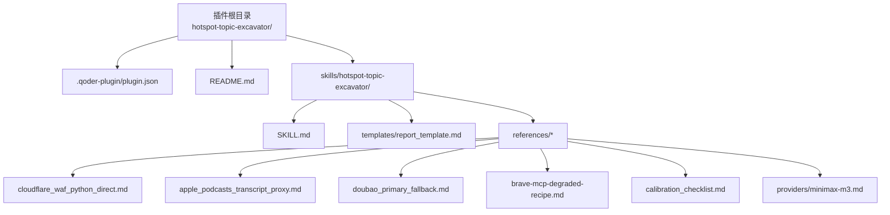
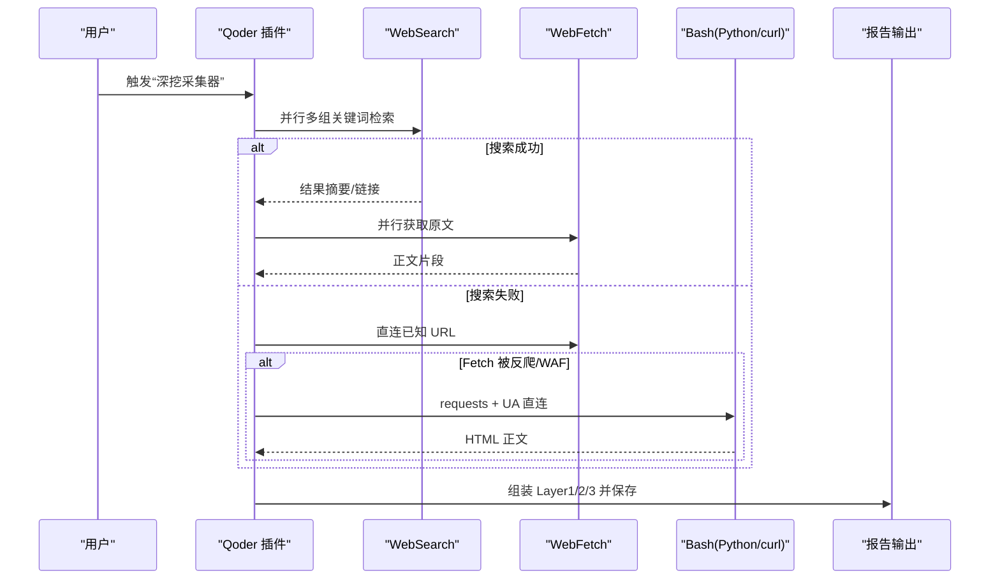
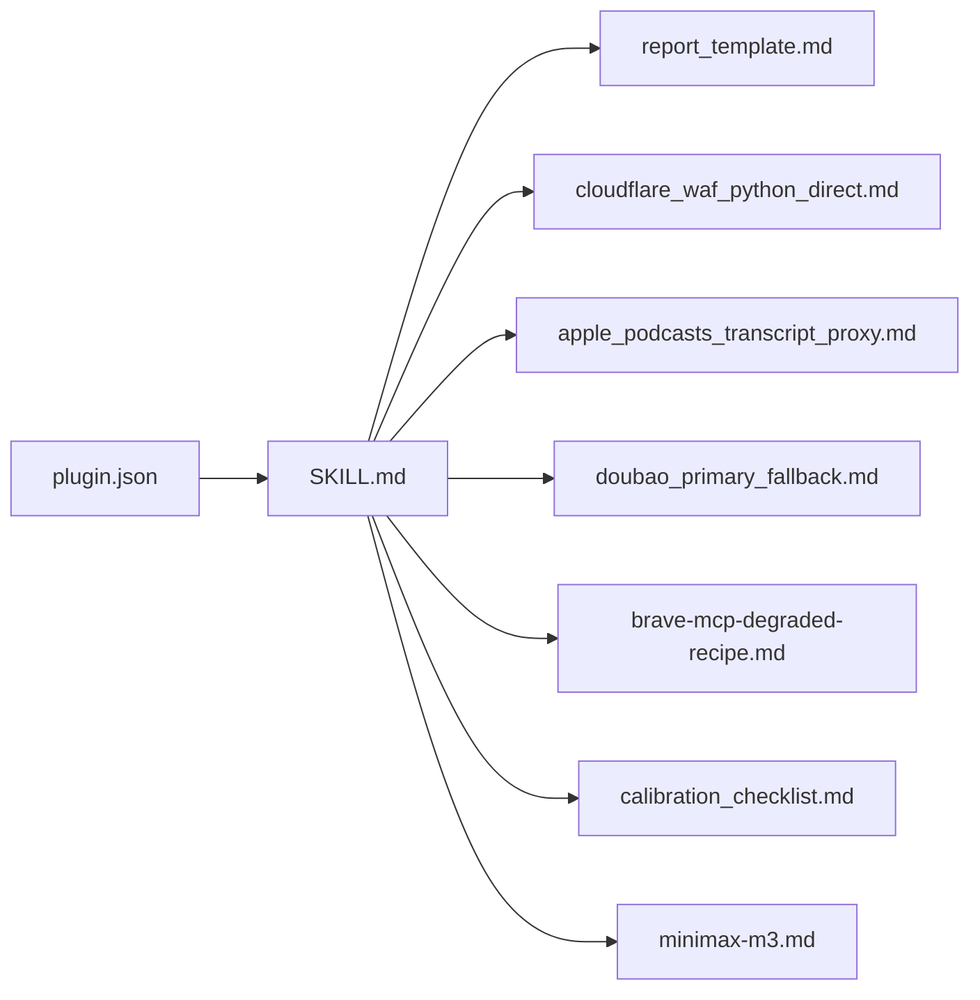

# 集成与部署

<cite>
**本文引用的文件**   
- [plugin.json](file://hotspot-topic-excavator/.qoder-plugin/plugin.json)
- [README.md](file://hotspot-topic-excavator/README.md)
- [SKILL.md](file://hotspot-topic-excavator/skills/hotspot-topic-excavator/SKILL.md)
- [report_template.md](file://hotspot-topic-excavator/skills/hotspot-topic-excavator/templates/report_template.md)
- [cloudflare_waf_python_direct.md](file://hotspot-topic-excavator/skills/hotspot-topic-excavator/references/cloudflare_waf_python_direct.md)
- [apple_podcasts_transcript_proxy.md](file://hotspot-topic-excavator/skills/hotspot-topic-excavator/references/apple_podcasts_transcript_proxy.md)
- [doubao_primary_fallback.md](file://hotspot-topic-excavator/skills/hotspot-topic-excavator/references/doubao_primary_fallback.md)
- [brave-mcp-degraded-recipe.md](file://hotspot-topic-excavator/skills/hotspot-topic-excavator/references/brave-mcp-degraded-recipe.md)
- [calibration_checklist.md](file://hotspot-topic-excavator/skills/hotspot-topic-excavator/references/calibration_checklist.md)
- [minimax-m3.md](file://hotspot-topic-excavator/skills/hotspot-topic-excavator/references/providers/minimax-m3.md)
</cite>

## 目录
1. [简介](#简介)
2. [项目结构](#项目结构)
3. [核心组件](#核心组件)
4. [架构总览](#架构总览)
5. [详细组件分析](#详细组件分析)
6. [依赖关系分析](#依赖关系分析)
7. [性能考虑](#性能考虑)
8. [故障排查指南](#故障排查指南)
9. [结论](#结论)
10. [附录](#附录)

## 简介
本指南面向在 Qoder 平台集成与部署“热点主题素材深挖采集器”插件的用户，覆盖以下关键内容：
- 插件配置与元数据（plugin.json）
- 工具链映射规则（Hermes → Qoder）
- 环境变量与模型 Provider 配置
- Python 环境搭建、依赖包管理与网络代理注意事项
- 降级路径与故障处理（Cloudflare WAF 绕过、播客转录替代、搜索服务降级等）
- 性能优化建议与监控要点

## 项目结构
该插件采用 Qoder 原生 plugin 格式，核心入口为 .qoder-plugin/plugin.json，技能定义位于 skills/hotspot-topic-excavator/SKILL.md，模板与参考文档分别位于 templates 与 references。

图表来源
- [plugin.json:1-18](file://hotspot-topic-excavator/.qoder-plugin/plugin.json#L1-L18)
- [README.md:43-80](file://hotspot-topic-excavator/README.md#L43-L80)

章节来源
- [plugin.json:1-18](file://hotspot-topic-excavator/.qoder-plugin/plugin.json#L1-L18)
- [README.md:1-130](file://hotspot-topic-excavator/README.md#L1-L130)

## 核心组件
- 插件元数据与入口：plugin.json 定义了插件名称、版本、描述、分类、标签以及 skills 目录位置。
- 主技能定义：SKILL.md 描述了双轴采集流程、工具链适配、降级策略、校准审查与产出规范。
- 报告模板：report_template.md 规定了三层产出的结构与字段。
- 参考文档：references 下包含 Cloudflare WAF 绕过、播客转录替代、搜索降级、中文补强、校准清单等实操指南。

章节来源
- [plugin.json:1-18](file://hotspot-topic-excavator/.qoder-plugin/plugin.json#L1-L18)
- [SKILL.md:1-120](file://hotspot-topic-excavator/skills/hotspot-topic-excavator/SKILL.md#L1-L120)
- [report_template.md:1-132](file://hotspot-topic-excavator/skills/hotspot-topic-excavator/templates/report_template.md#L1-L132)

## 架构总览
Qoder 插件通过 WebSearch/WebFetch/Bash 三类工具完成信息采集与降级处理；当外部服务不可用时，按既定降级链路切换至直连抓取或中文搜索主源模式。

图表来源
- [SKILL.md:82-147](file://hotspot-topic-excavator/skills/hotspot-topic-excavator/SKILL.md#L82-L147)
- [brave-mcp-degraded-recipe.md:1-102](file://hotspot-topic-excavator/skills/hotspot-topic-excavator/references/brave-mcp-degraded-recipe.md#L1-L102)
- [cloudflare_waf_python_direct.md:1-139](file://hotspot-topic-excavator/skills/hotspot-topic-excavator/references/cloudflare_waf_python_direct.md#L1-L139)

## 详细组件分析

### 插件配置与元数据（plugin.json）
- 关键字段说明
  - name/displayName/version：插件标识与版本
  - description/descriptionZh：中英文描述
  - author/homepage/repository：作者与仓库信息
  - logo：图标资源路径
  - keywords/category/tags：分类与标签
  - skills：指向 skills 目录，作为技能入口

- 配置建议
  - 保持 version 与 SKILL.md 一致，便于追踪
  - 将 logo 放入 assets 目录并在 plugin.json 中引用相对路径
  - 根据使用场景调整 category/tags，提升可发现性

章节来源
- [plugin.json:1-18](file://hotspot-topic-excavator/.qoder-plugin/plugin.json#L1-L18)

### 工具链映射规则（Hermes → Qoder）
- 主要映射
  - Brave/Tavily/豆包等搜索能力统一映射到 WebSearch
  - Jina Reader/web_extract 等原文获取映射到 WebFetch
  - Python requests/BeautifulSoup/youtube_transcript_api 等脚本执行映射到 Bash

- 适用场景
  - 新闻/博客长文优先 WebFetch
  - 多源交叉验证优先 WebSearch
  - 反爬/Cloudflare WAF 站点使用 Bash + Python requests + 浏览器 UA

章节来源
- [README.md:17-32](file://hotspot-topic-excavator/README.md#L17-L32)
- [SKILL.md:82-147](file://hotspot-topic-excavator/skills/hotspot-topic-excavator/SKILL.md#L82-L147)

### 环境变量与模型 Provider 配置
- 通用原则
  - 敏感凭据通过环境变量注入，避免硬编码
  - 自定义 Provider 的 base_url/api_key/models 等字段集中管理

- MiniMax M3 示例
  - API 端点与模式：OpenAI 兼容 chat_completions
  - 配置文件：custom_providers 中声明 models 与 context_length
  - 环境变量：MINIMAX_API_KEY 写入 .env
  - 已知问题：reasoning 标签输出需解析；config.yaml 写入保护需通过终端编辑

章节来源
- [minimax-m3.md:1-51](file://hotspot-topic-excavator/skills/hotspot-topic-excavator/references/providers/minimax-m3.md#L1-L51)

### Python 环境搭建与依赖管理
- 版本要求
  - 系统安装 Python 3.10+（urllib3 2.7.0 需要 PEP 604 语法）
  - 若系统默认 python3 为 3.9.x，建议使用 venv 中的 python3.x 绝对路径显式调用

- 依赖包
  - requests、beautifulsoup4（用于 Bash 降级路径）
  - youtube_transcript_api（可选，用于 YouTube Transcript 路径）

- 常见问题
  - TypeError: unsupported operand type(s) for |: 'type' and 'type' → 检查 python3 版本与 shebang 解析
  - 解决方式：使用 venv 绝对路径或 python3.11 显式调用，不修改 shebang

章节来源
- [SKILL.md:149-168](file://hotspot-topic-excavator/skills/hotspot-topic-excavator/SKILL.md#L149-L168)
- [README.md:106-110](file://hotspot-topic-excavator/README.md#L106-L110)

### 网络代理配置
- 现状说明
  - 当前仓库未提供统一的代理配置入口
  - 使用 Bash 执行 Python 请求时，requests 默认遵循系统代理环境变量（如 http_proxy/https_proxy），可在运行环境中设置

- 实践建议
  - 在容器或 CI 环境中显式设置代理变量
  - 对需要绕过证书校验的场景，谨慎使用 verify=False，仅在受控环境下启用

章节来源
- [cloudflare_waf_python_direct.md:28-44](file://hotspot-topic-excavator/skills/hotspot-topic-excavator/references/cloudflare_waf_python_direct.md#L28-L44)

### 降级路径与故障处理

#### Cloudflare WAF 绕过（Python 直连）
- 现象
  - WebFetch 返回占位文本（如 “Please wait...”）
  - Python requests + 浏览器 UA 可获取完整 HTML

- 处理步骤
  - 直连请求（带浏览器 UA）
  - 正则提取正文（entry-content/single-content 等）
  - 清洗为 Markdown，质量门：≥3 个 
 标签且 ≥5KB

- 决策树
  - WebFetch 正常 → 首选
  - 返回占位/空 HTML → Bash + Python requests + UA
  - 仍 403/challenge → 终极降级（浏览器渲染）

章节来源
- [cloudflare_waf_python_direct.md:1-139](file://hotspot-topic-excavator/skills/hotspot-topic-excavator/references/cloudflare_waf_python_direct.md#L1-L139)

#### 播客转录替代（Apple Podcasts show notes）
- 背景
  - YouTube Transcript API 可能因版本变更/网络限制失败
  - Apple Podcasts show notes 提供时间码+金句，完整度约 90%

- 工作流
  - 两条路径并行：YouTube Transcript API 与 Apple Podcasts show notes
  - 任一成功即可进入素材组织阶段；两者都成功则互校验

章节来源
- [apple_podcasts_transcript_proxy.md:1-95](file://hotspot-topic-excavator/skills/hotspot-topic-excavator/references/apple_podcasts_transcript_proxy.md#L1-L95)
- [SKILL.md:98-112](file://hotspot-topic-excavator/skills/hotspot-topic-excavator/SKILL.md#L98-L112)

#### 搜索服务降级（全面故障）
- 触发条件
  - WebSearch 连续失败 ≥3 次或返回异常，且 WebFetch 也不可用

- 降级链
  - 多角度并行 WebSearch
  - WebFetch 直连已知 URL
  - 中文关键词搜索（WebSearch）
  - Bash + Python requests 提取原文
  - Bash + curl 直连新闻（时效信号）

- 验收清单
  - 每个核心种子至少 2 个独立信源
  - 至少 1 个 P1 一手原文
  - 中国版至少 1 条（除非纯海外话题）
  - 反对/边界条件至少 1 条
  - 时间戳 ±30 天内
  - 参考资料链接实测可打开

章节来源
- [brave-mcp-degraded-recipe.md:1-102](file://hotspot-topic-excavator/skills/hotspot-topic-excavator/references/brave-mcp-degraded-recipe.md#L1-L102)

#### 中文搜索主源模式（WebSearch + WebFetch 同时不可用）
- 触发条件
  - WebSearch 连续 ≥5 次失败且 WebFetch 不可用

- 执行模式
  - B2B 话题：直接执行 8 组标准化中文关键词
  - 非 B2B 话题：自设计 6-8 组关键词（锚点核心/关联信号/对立争议/中国视角/发散类比）

- 验证规则
  - 前 3 组完成后验证：锚点核心命中、数字交叉验证、中国视角独立信源、对立/争议有信源
  - 3 组验证通过即确认主源模式有效

章节来源
- [doubao_primary_fallback.md:1-119](file://hotspot-topic-excavator/skills/hotspot-topic-excavator/references/doubao_primary_fallback.md#L1-L119)

#### 国际治理话题·中文信源补强
- 触发条件
  - 联合国/国际组织报告、跨国治理框架、全球行业事件、跨境监管动作、全球统计数据

- 执行建议
  - 强制增加 1-2 组中文关键词搜索
  - 中文独有视角应提升为 P1/P2，而非 P3
  - 标注发布时间戳，避免同日共振假象

章节来源
- [international_topic_chinese_supplement.md:1-133](file://hotspot-topic-excavator/skills/hotspot-topic-excavator/references/international_topic_chinese_supplement.md#L1-L133)

### 校准审查与质量控制
- 九类校准清单（A-I）
  - 事实校准/补充、表述校准、框架补充、对立视角、理论偏向、叙事引力、受众工具链翻译、三角叙事补洞
- 执行时机
  - 报告初稿完成后逐项过清单，记录修正动作并嵌入报告末尾

章节来源
- [calibration_checklist.md:1-158](file://hotspot-topic-excavator/skills/hotspot-topic-excavator/references/calibration_checklist.md#L1-L158)
- [SKILL.md:251-316](file://hotspot-topic-excavator/skills/hotspot-topic-excavator/SKILL.md#L251-L316)

### 报告模板与产出路径
- 模板结构
  - Layer 1：素材包（6 类内容 + 3 类图片素材）
  - Layer 2：文章/视频大纲（RIVET 结构）
  - Layer 3：再创作选题建议（≤5 个）
  - 校准审查记录表与参考资料清单

- 产出路径
  - reports/hotspot/{YYYY-MM-DD}/{topic_slug}/

章节来源
- [report_template.md:1-132](file://hotspot-topic-excavator/skills/hotspot-topic-excavator/templates/report_template.md#L1-L132)
- [SKILL.md:362-373](file://hotspot-topic-excavator/skills/hotspot-topic-excavator/SKILL.md#L362-L373)

## 依赖关系分析
- 内部依赖
  - plugin.json 指向 skills 目录
  - SKILL.md 引用 templates 与 references 下的具体文档
- 外部依赖
  - WebSearch/WebFetch 作为主要采集工具
  - Bash 执行 Python 脚本与 curl 命令进行降级抓取
  - 可选 youtube_transcript_api 用于播客转录

图表来源
- [plugin.json:1-18](file://hotspot-topic-excavator/.qoder-plugin/plugin.json#L1-L18)
- [SKILL.md:377-415](file://hotspot-topic-excavator/skills/hotspot-topic-excavator/SKILL.md#L377-L415)

章节来源
- [plugin.json:1-18](file://hotspot-topic-excavator/.qoder-plugin/plugin.json#L1-L18)
- [SKILL.md:377-415](file://hotspot-topic-excavator/skills/hotspot-topic-excavator/SKILL.md#L377-L415)

## 性能考虑
- 并行化
  - Step 2A 中多组 WebSearch 与 WebFetch 尽可能并行调用，提升采集效率
- 降级快速切换
  - 不要等待自动恢复，连续失败后直接执行降级链路
- 质量门
  - 正文抓取需满足长度与段落数量门槛，避免低质量内容污染
- 缓存与复用
  - 对重复 URL 的抓取结果可缓存，减少重复请求

章节来源
- [SKILL.md:373](file://hotspot-topic-excavator/skills/hotspot-topic-excavator/SKILL.md#L373)
- [brave-mcp-degraded-recipe.md:70-78](file://hotspot-topic-excavator/skills/hotspot-topic-excavator/references/brave-mcp-degraded-recipe.md#L70-L78)
- [cloudflare_waf_python_direct.md:75-78](file://hotspot-topic-excavator/skills/hotspot-topic-excavator/references/cloudflare_waf_python_direct.md#L75-L78)

## 故障排查指南
- Python 环境问题
  - 症状：TypeError 与 urllib3 报错
  - 诊断：which python3 + python3 --version
  - 修复：使用 venv 绝对路径或 python3.x 显式调用

- Cloudflare WAF 阻断
  - 症状：WebFetch 返回占位文本
  - 处理：Bash + Python requests + 浏览器 UA 直连，正则提取正文

- 播客转录失败
  - 症状：youtube_transcript_api 版本变化或网络限制
  - 处理：并行尝试 Apple Podcasts show notes，任一成功即可继续

- 搜索服务全面故障
  - 症状：WebSearch 多次失败且 WebFetch 不可用
  - 处理：执行降级链，必要时切换到中文搜索主源模式

- 校准遗漏
  - 症状：报告出现逻辑矛盾、口径不一致、缺失对立视角
  - 处理：按九类校准清单逐项检查并记录修正动作

章节来源
- [SKILL.md:149-168](file://hotspot-topic-excavator/skills/hotspot-topic-excavator/SKILL.md#L149-L168)
- [cloudflare_waf_python_direct.md:10-44](file://hotspot-topic-excavator/skills/hotspot-topic-excavator/references/cloudflare_waf_python_direct.md#L10-L44)
- [apple_podcasts_transcript_proxy.md:85-95](file://hotspot-topic-excavator/skills/hotspot-topic-excavator/references/apple_podcasts_transcript_proxy.md#L85-L95)
- [brave-mcp-degraded-recipe.md:82-102](file://hotspot-topic-excavator/skills/hotspot-topic-excavator/references/brave-mcp-degraded-recipe.md#L82-L102)
- [calibration_checklist.md:108-146](file://hotspot-topic-excavator/skills/hotspot-topic-excavator/references/calibration_checklist.md#L108-L146)

## 结论
本插件以 Qoder 原生 plugin 形式提供热点主题深挖采集能力，通过 WebSearch/WebFetch/Bash 的工具链组合与完善的降级策略，确保在网络与服务不稳定时的持续产出。配合九类校准审查与标准报告模板，可实现高质量、可溯源的多层内容产出。建议在部署时关注 Python 版本与依赖、代理环境变量与 Provider 配置，并按降级路径与性能优化建议进行调优。

## 附录
- 触发方式与输入规范详见 README 与 SKILL.md
- 报告模板字段与层级结构详见 report_template.md
- 各参考文档提供了更细粒度的操作指南与实战案例