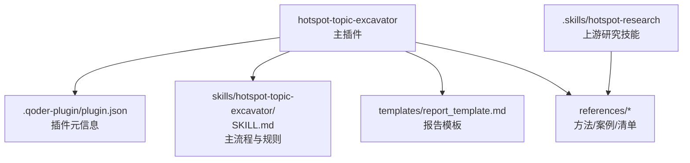
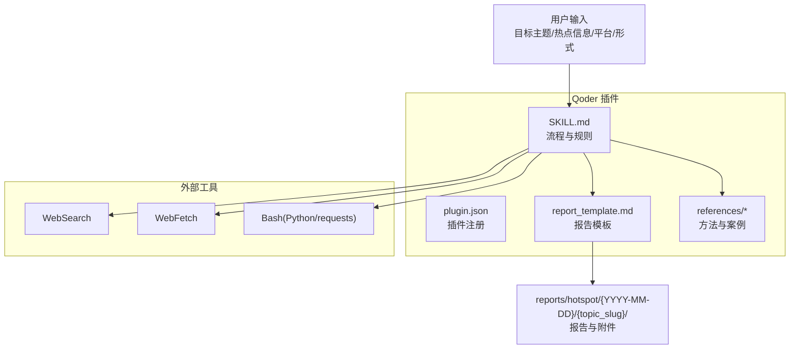
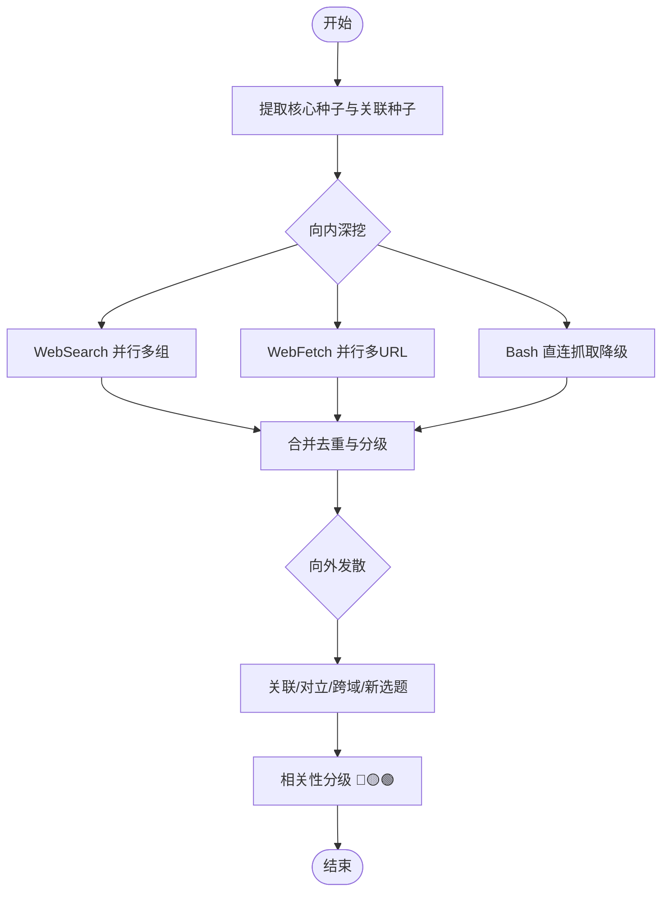
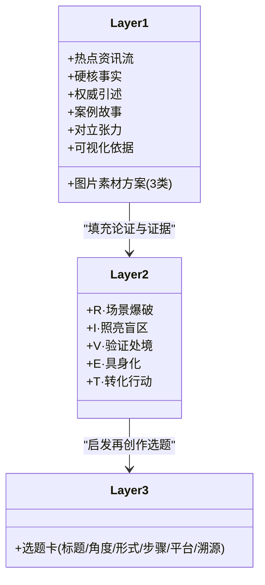
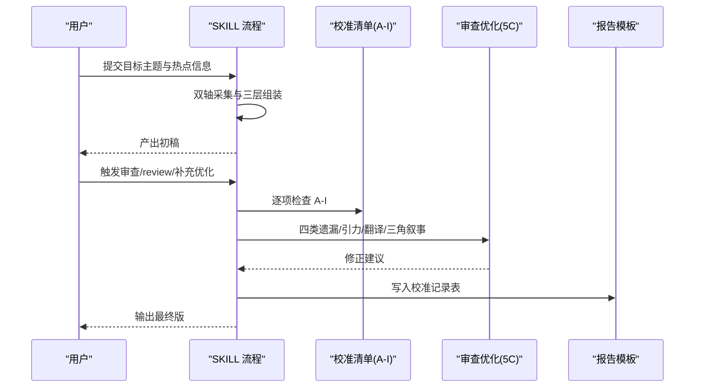
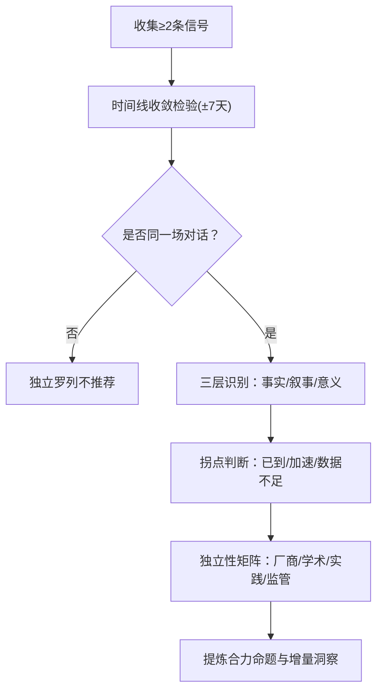
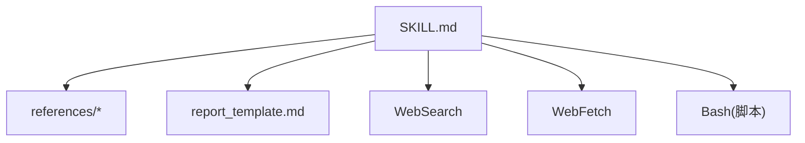

# 项目概述

<cite>
**本文引用的文件**   
- [README.md](file://hotspot-topic-excavator/README.md)
- [plugin.json](file://hotspot-topic-excavator/.qoder-plugin/plugin.json)
- [SKILL.md](file://hotspot-topic-excavator/skills/hotspot-topic-excavator/SKILL.md)
- [report_template.md](file://hotspot-topic-excavator/skills/hotspot-topic-excavator/templates/report_template.md)
- [calibration_checklist.md](file://hotspot-topic-excavator/skills/hotspot-topic-excavator/references/calibration_checklist.md)
- [divergence_patterns.md](file://hotspot-topic-excavator/skills/hotspot-topic-excavator/references/divergence_patterns.md)
- [cross_signal_synthesis.md](file://hotspot-topic-excavator/skills/hotspot-topic-excavator/references/cross_signal_synthesis.md)
</cite>

## 目录
1. [引言](#引言)
2. [项目结构](#项目结构)
3. [核心组件](#核心组件)
4. [架构总览](#架构总览)
5. [详细组件分析](#详细组件分析)
6. [依赖关系分析](#依赖关系分析)
7. [性能与可用性考量](#性能与可用性考量)
8. [故障排查指南](#故障排查指南)
9. [结论](#结论)
10. [附录](#附录)

## 引言
本项目为「热点主题素材深挖采集器」，是 Qoder 原生插件形态的内容素材采集与分析能力。它以每日热点话题为锚点（非边界），采用「向内深挖 + 向外发散」双轴模型，先对已有热点信息进行种子提取与关联探查，再联网抓取真实信源，最终产出三层弹药库：Layer 1 内容素材包（6 类内容 + 3 类图片素材）、Layer 2 文章/视频大纲与素材填充、Layer 3 再创作选题建议（≤5 个完整选题卡）。同时内置 9 类校准审查（A-I）与审查补充优化循环，确保事实准确、框架完整、叙事稳健、受众可执行。

核心价值
- 以热点为跳板而非天花板，持续产出可直接用于多平台内容生产的“弹药”
- 通过双轴模型兼顾深度与广度，避免单一视角或浅层罗列
- 以多层产出体系对接从素材到选题的完整生产链路
- 以 9 类校准与审查机制保障质量与可信度
- 在 Qoder 生态中以 Skill 形式被调用，无缝集成搜索、原文获取与脚本工具链

适用对象
- 初学者：理解“热点→素材→大纲→选题”的生产路径与质量标准
- 有经验的开发者：掌握双轴采集流程、降级策略、并行化与模板化输出

## 项目结构
本仓库包含两个相关模块：
- hotspot-topic-excavator：Qoder 原生插件形态的主工程，内含 SKILL 定义、参考方法、报告模板等
- .skills/hotspot-research：上游研究技能集合（与本插件存在方法论与方法库复用关系）

图表来源
- [plugin.json:1-18](file://hotspot-topic-excavator/.qoder-plugin/plugin.json#L1-L18)
- [SKILL.md:1-29](file://hotspot-topic-excavator/skills/hotspot-topic-excavator/SKILL.md#L1-L29)
- [report_template.md:1-132](file://hotspot-topic-excavator/skills/hotspot-topic-excavator/templates/report_template.md#L1-L132)

章节来源
- [README.md:43-80](file://hotspot-topic-excavator/README.md#L43-L80)
- [plugin.json:1-18](file://hotspot-topic-excavator/.qoder-plugin/plugin.json#L1-L18)

## 核心组件
- 输入与启动配置：目标主题、每日热点信息、来源线索、选题角度、目标平台、内容形式；支持用户预消化版本校验与强制复述配置
- 双轴采集流程：内部种子提取 → 向内深挖（WebSearch/WebFetch/Bash 降级）→ 向外发散（关联/对立/跨域/新选题）→ 相关性分级（红黄绿）
- 内容素材与图片素材：6 类内容 + 3 类图片方案，按层级标注与溯源
- 多层产出组装：Layer 1 素材包 / Layer 2 RIVET 大纲填充 / Layer 3 选题卡
- 平台适配：抖音/B站/公众号/小红书差异化要点
- 校准审查与优化：9 类校准（A-I）+ 审查补充优化循环（5C）
- 连续性生产流水线：从报告到多平台产出的默认流水线

章节来源
- [SKILL.md:27-70](file://hotspot-topic-excavator/skills/hotspot-topic-excavator/SKILL.md#L27-L70)
- [SKILL.md:72-205](file://hotspot-topic-excavator/skills/hotspot-topic-excavator/SKILL.md#L72-L205)
- [SKILL.md:207-248](file://hotspot-topic-excavator/skills/hotspot-topic-excavator/SKILL.md#L207-L248)
- [SKILL.md:251-317](file://hotspot-topic-excavator/skills/hotspot-topic-excavator/SKILL.md#L251-L317)
- [SKILL.md:319-374](file://hotspot-topic-excavator/skills/hotspot-topic-excavator/SKILL.md#L319-L374)
- [report_template.md:1-132](file://hotspot-topic-excavator/skills/hotspot-topic-excavator/templates/report_template.md#L1-L132)

## 架构总览
整体由“Skill 驱动的流程引擎 + 参考方法库 + 报告模板”构成，运行于 Qoder 插件环境，通过 WebSearch/WebFetch/Bash 三类工具完成采集与处理，最终生成标准化报告并进入后续生产流水线。

图表来源
- [plugin.json:1-18](file://hotspot-topic-excavator/.qoder-plugin/plugin.json#L1-L18)
- [SKILL.md:82-147](file://hotspot-topic-excavator/skills/hotspot-topic-excavator/SKILL.md#L82-L147)
- [report_template.md:1-132](file://hotspot-topic-excavator/skills/hotspot-topic-excavator/templates/report_template.md#L1-L132)

## 详细组件分析

### 双轴采集模型（向内深挖 + 向外发散）
- 内部探查：从每日热点中提取核心种子与关联种子，作为联网锚点
- 向内深挖：以 WebSearch/WebFetch 为主力，必要时使用 Bash 直连抓取；播客 transcript 提供 YouTube Transcript API 与 Apple Podcasts show notes 双路径并行
- 向外发散：关联话题、上下游概念、跨领域类比、同主题不同切入、衍生新选题
- 相关性分级：核心层（🔴）、强关联层（🟡）、可延展层（🟢）
- 信源优先级：P1 一手来源 > P2 权威媒体 > P3 社区讨论；每条素材必须可溯源

图表来源
- [SKILL.md:72-147](file://hotspot-topic-excavator/skills/hotspot-topic-excavator/SKILL.md#L72-L147)
- [SKILL.md:177-205](file://hotspot-topic-excavator/skills/hotspot-topic-excavator/SKILL.md#L177-L205)

章节来源
- [SKILL.md:72-147](file://hotspot-topic-excavator/skills/hotspot-topic-excavator/SKILL.md#L72-L147)
- [SKILL.md:177-205](file://hotspot-topic-excavator/skills/hotspot-topic-excavator/SKILL.md#L177-L205)

### 三层产出体系（Layer 1-3）
- Layer 1：素材包（6 类内容 + 3 类图片素材），按红黄绿分层，附溯源
- Layer 2：RIVET 结构的文章/视频大纲 + 素材填充
- Layer 3：再创作选题建议（≤5 个完整选题卡），含标题/角度/形式/步骤/平台/溯源

图表来源
- [SKILL.md:207-237](file://hotspot-topic-excavator/skills/hotspot-topic-excavator/SKILL.md#L207-L237)
- [report_template.md:23-105](file://hotspot-topic-excavator/skills/hotspot-topic-excavator/templates/report_template.md#L23-L105)

章节来源
- [SKILL.md:207-237](file://hotspot-topic-excavator/skills/hotspot-topic-excavator/SKILL.md#L207-L237)
- [report_template.md:23-105](file://hotspot-topic-excavator/skills/hotspot-topic-excavator/templates/report_template.md#L23-L105)

### 9 类校准审查（A-I）与审查补充优化（5C）
- 9 类校准：事实校准/事实补充/表述校准/框架补充/对立视角/理论偏向/叙事引力/受众工具链翻译/三角叙事补洞
- 审查补充优化：触发条件、四类常见遗漏、叙事引力陷阱、受众工具链翻译、三角叙事升级
- 执行流程：初稿完成后逐项过清单，记录修正动作并嵌入报告末尾

图表来源
- [SKILL.md:251-317](file://hotspot-topic-excavator/skills/hotspot-topic-excavator/SKILL.md#L251-L317)
- [calibration_checklist.md:1-158](file://hotspot-topic-excavator/skills/hotspot-topic-excavator/references/calibration_checklist.md#L1-L158)
- [report_template.md:107-120](file://hotspot-topic-excavator/skills/hotspot-topic-excavator/templates/report_template.md#L107-L120)

章节来源
- [SKILL.md:251-317](file://hotspot-topic-excavator/skills/hotspot-topic-excavator/SKILL.md#L251-L317)
- [calibration_checklist.md:1-158](file://hotspot-topic-excavator/skills/hotspot-topic-excavator/references/calibration_checklist.md#L1-L158)

### 三路信号交叉分析与发散模式
- 三路信号交叉：时间线收敛识别、三层递归（事实/叙事/意义）、拐点判断、独立性矩阵
- 发散模式：GPS 类比链、LLM Context 优先、反方观点纳入、多平台大纲差异、多信号并行、全 WebSearch 降级、罗生门叙事结构等

图表来源
- [cross_signal_synthesis.md:1-136](file://hotspot-topic-excavator/skills/hotspot-topic-excavator/references/cross_signal_synthesis.md#L1-L136)
- [divergence_patterns.md:1-323](file://hotspot-topic-excavator/skills/hotspot-topic-excavator/references/divergence_patterns.md#L1-L323)

章节来源
- [cross_signal_synthesis.md:1-136](file://hotspot-topic-excavator/skills/hotspot-topic-excavator/references/cross_signal_synthesis.md#L1-L136)
- [divergence_patterns.md:1-323](file://hotspot-topic-excavator/skills/hotspot-topic-excavator/references/divergence_patterns.md#L1-L323)

### 与 Qoder 平台的集成方式
- 插件注册：通过 plugin.json 声明名称、版本、描述、分类、标签与 skills 入口
- Skill 调用：支持自然语言触发与引用 skill 名称；参数提示与必填字段明确
- 工具映射：将原 Hermes 工具链映射为 Qoder 的 WebSearch/WebFetch/Bash，保留全部核心功能
- 路径约定：报告产出至 reports/hotspot/{YYYY-MM-DD}/{topic_slug}/，模板位于 templates/report_template.md

图表来源
- [plugin.json:1-18](file://hotspot-topic-excavator/.qoder-plugin/plugin.json#L1-L18)
- [SKILL.md:1-13](file://hotspot-topic-excavator/skills/hotspot-topic-excavator/SKILL.md#L1-L13)
- [report_template.md:1-132](file://hotspot-topic-excavator/skills/hotspot-topic-excavator/templates/report_template.md#L1-L132)

章节来源
- [README.md:15-42](file://hotspot-topic-excavator/README.md#L15-L42)
- [plugin.json:1-18](file://hotspot-topic-excavator/.qoder-plugin/plugin.json#L1-L18)
- [SKILL.md:1-13](file://hotspot-topic-excavator/skills/hotspot-topic-excavator/SKILL.md#L1-L13)

## 依赖关系分析
- 内部依赖
  - SKILL.md 依赖 references/* 中的方法、案例与清单
  - report_template.md 作为统一输出格式，贯穿三层产出与校准记录
- 外部依赖
  - WebSearch：多源搜索、时效信号、中文关键词主源模式
  - WebFetch：原文获取、替代 Jina Reader、多 URL 并行
  - Bash：Python requests/BeautifulSoup 直连抓取、YouTube Transcript API 替代路径
- 耦合与内聚
  - 流程与规则集中在 SKILL.md，方法分散在 references/*，形成高内聚低耦合
  - 报告模板固定结构，便于自动化与下游消费

图表来源
- [SKILL.md:377-415](file://hotspot-topic-excavator/skills/hotspot-topic-excavator/SKILL.md#L377-L415)
- [report_template.md:1-132](file://hotspot-topic-excavator/skills/hotspot-topic-excavator/templates/report_template.md#L1-L132)

章节来源
- [SKILL.md:377-415](file://hotspot-topic-excavator/skills/hotspot-topic-excavator/SKILL.md#L377-L415)

## 性能与可用性考量
- 并行化策略
  - WebSearch 与 WebFetch 并行调用，互为备份
  - 多组搜索同时发起，提升采集效率
  - 播客 transcript 双路径并行（YouTube Transcript API + Apple Podcasts show notes）
- 降级路径
  - 单点故障：另一者 + 补充搜索
  - 仍不足：Bash 直连抓取
  - 仍不足：仅 P0 热点直连，其余标注 [BLOCKED]
  - 第二层：WebSearch 长时间不可用 → 切换 WebFetch 多 URL 并行
  - 第三层：WebSearch + WebFetch 同时不可用 → 中文搜索主源模式
- 环境要求
  - Python 3.10+ 及 requests、beautifulsoup4
  - 可选 youtube_transcript_api
  - 无需额外 API key 或 MCP 配置

章节来源
- [SKILL.md:82-147](file://hotspot-topic-excavator/skills/hotspot-topic-excavator/SKILL.md#L82-L147)
- [README.md:106-110](file://hotspot-topic-excavator/README.md#L106-L110)

## 故障排查指南
- 搜索与抓取失败
  - 症状：WebSearch 返回订阅无效或服务器不可达；WebFetch 因 IP 信誉被阻止
  - 处理：启用全 WebSearch 降级模式，分两轮覆盖核心与发散信号
- Cloudflare WAF 拦截
  - 症状：WebFetch 返回占位页
  - 处理：使用 Bash + Python requests + 浏览器 UA 直连绕过
- Python 环境解析问题
  - 症状：urllib3 报错类型不支持
  - 处理：显式调用 venv 中 python3.x 绝对路径，避免系统 Python 3.9 解析
- 播客 transcript 不可用
  - 处理：切换到 Apple Podcasts show notes 路径，标注 [NO_YT_TRANSCRIPT]

章节来源
- [divergence_patterns.md:183-235](file://hotspot-topic-excavator/skills/hotspot-topic-excavator/references/divergence_patterns.md#L183-L235)
- [SKILL.md:125-147](file://hotspot-topic-excavator/skills/hotspot-topic-excavator/SKILL.md#L125-L147)
- [SKILL.md:149-168](file://hotspot-topic-excavator/skills/hotspot-topic-excavator/SKILL.md#L149-L168)

## 结论
「热点主题素材深挖采集器」以双轴模型为核心，结合三层产出与九类校准，构建了从热点到可执行选题的完整闭环。其 Qoder 插件形态与工具链映射确保了易用性与可扩展性，而完善的降级策略与并行化设计保障了在高噪声网络环境下的稳定性。对于初学者，它提供了清晰的生产路径与模板；对于资深开发者，它给出了可复用的方法库与可插拔的工具映射。

## 附录
- 使用方法与触发方式
  - 直接触发：自然语言指令或引用 skill 名称
  - 手动触发：案例型/人物型话题、可执行价值高于信号强度、历史线索持续出现但单次信号不强
- 连续性生产流水线
  - 报告（report.md）→ 自动进入多平台内容产出（content-production-multi-platform.md）

章节来源
- [SKILL.md:347-374](file://hotspot-topic-excavator/skills/hotspot-topic-excavator/SKILL.md#L347-L374)
- [SKILL.md:319-344](file://hotspot-topic-excavator/skills/hotspot-topic-excavator/SKILL.md#L319-L344)